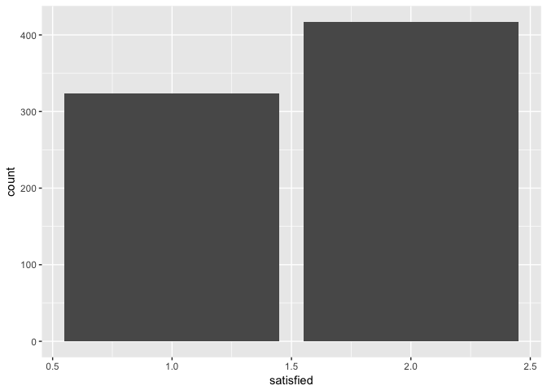
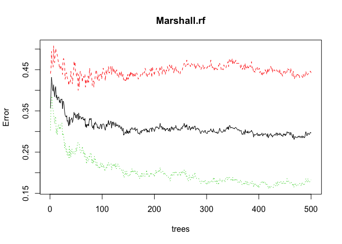
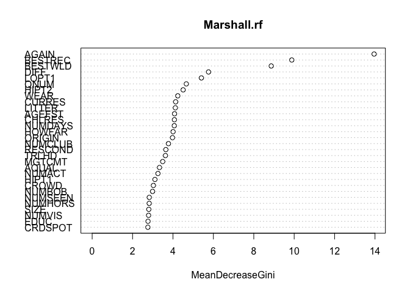
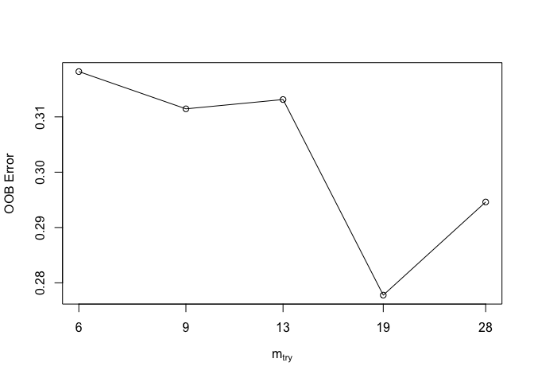

Bob\_Marshall Excercise
================

Bob Marshall Machine Learning Excercise
---------------------------------------

For this project I wanted to explore machine learning in R with a real dataset. I am also a huge fan of all things ecology, I enjoy hiking and generally being in the outdoors. From the USDA.gov website, there is a page dedicated to Forest Service Research and a group of researchers collected survey data from visitors to the the Bob Marshall Wilderness Complex in 1982.

Data Selecting and Formatting
=============================

Let's start by taking a look at our dataset.

``` r
Marshall %>% head()
```

    ## # A tibble: 6 x 181
    ##    QNUM  CLUS SELEC TRLHD SEASON PRTYREP ORIGIN WEIGHT TRAVEL NUMHORS
    ##   <int> <int> <int> <int>  <int>   <int>  <int>  <int>  <int>   <int>
    ## 1     1     1     1    15      1       1    599    100      1      NA
    ## 2     5     2     1     4      1       1    601    100      3      99
    ## 3     6     2     1     4      1       1    596    100      1      NA
    ## 4     7     2     1     4      1       1    598    100      5       8
    ## 5     8     2     1     4      1       1    598    100      4       4
    ## 6     9     2     1     4      1       1    598    100      1      NA
    ## # ... with 171 more variables: HORSFED <int>, HRSHNDL <int>, FISH <int>,
    ## #   HUNT <int>, HIKE <int>, NATUR <int>, MTNCLM <int>, RAFT <int>,
    ## #   SWIM <int>, PHOTO <int>, OTHACT <int>, NUMACT <int>, GRIZOBS <int>,
    ## #   BEAROBS <int>, SUMBEAR <int>, ELKOBS <int>, DEEROBS <int>,
    ## #   GOATOBS <int>, MOOSOBS <int>, SHPOBS <int>, OTHROBS <int>,
    ## #   NUMWOBS <int>, SHOT1 <int>, SHOT2 <int>, SHOT3 <int>, STAY <int>,
    ## #   FIRE <int>, OUTFTR <int>, MAPS <int>, TYPMAP <int>, SOLE <int>,
    ## #   VISIT <int>, AGEFST <int>, PARENT <int>, NEWAREA <int>, EXPBOB <int>,
    ## #   NUMBOB <int>, AQUAL <int>, DIFF <int>, LOCCHO <int>, WHOCHO <int>,
    ## #   TIMCHO <int>, TRLINF1 <int>, TRLINF2 <int>, TRLINF3 <int>,
    ## #   RESTRL1 <int>, RESTRL2 <int>, RESTRL <int>, OTHRTRL <int>,
    ## #   RESREJ1 <int>, RESREJ2 <int>, FSINFO <int>, FSCONT <int>,
    ## #   QUALINF <int>, NUMVIS <int>, NUMDAYS <int>, SCENRY <int>,
    ## #   FSHIMP <int>, HUNTIMP <int>, RELAX <int>, EXERCZ <int>, ESCAPE <int>,
    ## #   DEVSKL <int>, SOLTUD <int>, CHALNG <int>, AVDMEC <int>, OTHRES <int>,
    ## #   SATIS <int>, HIPT1 <int>, HIPT2 <int>, HIPT3 <int>, LOPT1 <int>,
    ## #   LOPT2 <int>, LOPT3 <int>, SOLSTD <int>, CAMPSOL <int>, ESTCAMP <int>,
    ## #   REJCOND <int>, RESCOND <int>, REJLOC <int>, RESLOC <int>,
    ## #   CMPSRCH <int>, PROBCMP <int>, TYPCMP <int>, CROWD <int>,
    ## #   NUMSEEN <int>, LRGSEEN <int>, HRSSEEN <int>, NUMCMP <int>,
    ## #   VISWLD <int>, WCHWLD <int>, HOWFAR <int>, OFFTRL <int>, LOOP <int>,
    ## #   CRDPROB <int>, CRDSPOT <int>, WEAR <int>, LITTER <int>, WRONG <int>,
    ## #   HITRHL <int>, ...

``` r
Marshall %>% length()
```

    ## [1] 181

``` r
Marshall %>% count()
```

    ## # A tibble: 1 x 1
    ##       n
    ##   <int>
    ## 1   746

``` r
sum(is.na(Marshall))
```

    ## [1] 17867

From the above code, we can see we have 181 variables, 746 obserations, and it looks like most of our variables are encoded as 0s and 1s.

I know my output variable will be a satisfaction score that is rated 1 = best, 5 is worst and 9 means missing. For this project, I am just going to categorize the variable into two categories,TRUE, FALSE and call it "satisfied", all 1s will be TRUE and anything else will be FALSE and 9s will be excluded from analysis.

``` r
Marshall <- Marshall%>%
  mutate(satisfied = as.factor(ifelse(SATIS == 1, TRUE, FALSE)))%>%
  filter(SATIS != 9)
Marshall$SATIS <- NULL
```

Now for the missing data

``` r
convertnines <- function(x){
  x <- ifelse(x == 99 | x == 9 | x == 999, NA, x)
}

Marshall <- as.data.frame(map(Marshall, convertnines))
```

``` r
Marshall_temp <- mice(Marshall, m = 5, defaultmethod = c("pmm", "polyreg"), seed = 500)
```

    ## 
    ##  iter imp variable
    ##   1   1  QNUM  CLUS  TRLHD  SEASON  PRTYREP  ORIGIN  TRAVEL  NUMHORS  HORSFED  HRSHNDL  FISH  HUNT  HIKE  NATUR  MTNCLM  RAFT  SWIM  PHOTO  OTHACT  NUMACT  GRIZOBS  BEAROBS  SUMBEAR  ELKOBS  DEEROBS  GOATOBS  MOOSOBS  SHPOBS  OTHROBS  NUMWOBS  SHOT1  SHOT2  SHOT3  STAY  FIRE  OUTFTR  MAPS  TYPMAP  SOLE  VISIT  AGEFST  PARENT  NEWAREA  EXPBOB  NUMBOB  AQUAL  DIFF  LOCCHO  WHOCHO  TIMCHO  TRLINF1  TRLINF2  TRLINF3  RESTRL1  RESTRL2  RESTRL  OTHRTRL  RESREJ1  RESREJ2  FSINFO  FSCONT  QUALINF  NUMVIS  NUMDAYS  SCENRY  FSHIMP  HUNTIMP  RELAX  EXERCZ  ESCAPE  DEVSKL  SOLTUD  CHALNG  AVDMEC  OTHRES  HIPT1  HIPT2  LOPT1  LOPT2  LOPT3  SOLSTD  CAMPSOL  ESTCAMP  REJCOND  RESCOND  REJLOC  RESLOC  CMPSRCH  PROBCMP  TYPCMP  CROWD  NUMSEEN  LRGSEEN  HRSSEEN  NUMCMP  VISWLD  HOWFAR  OFFTRL  LOOP  CRDPROB  CRDSPOT  WEAR  LITTER  WRONG  HITRHL  LOTRAIL  TRLLESS  TREES  SMLBRG  BIGBRG  PRIVY  FRPLC  FRRING  NATFIRE  CORRAL  NOHORSE  NOFIRE  TABLE  RATION  NOGRAZ  REQREG  NATFSH  SZLIMT  FT200  RMVRNG  EXSIGN  BURY  PWRSAW  GUIDBK  ACCMAP  ASSIGN  DNWOOD  FSHEAT  PAKOUT  WLDRNG  METRNG  COMENT  WLDIMP  BESTWLD  BESTREC  AGAIN  SIZE  LITBOY  LITGIRL  BOYS  GIRLS  FELLAS  GALS  MEN  WOMEN  TYPGRP  CLUB  TYPCLUB  NUMCLUB  CURRES  CHLRES  EDUC  STUDNT  OCCUP  FINCMT  MGTCMT  CMPCOD  CMPLIT  HMANUR  BAREGND  CMPREM  FWOODSC  TREEDGD  GRAZSCR  CMPOTHR  CMPLOCN  PORLOCN  WATLOCN  OCCLOCN  TRLLOCN  OTHLOCN
    ##   1   2  QNUM  CLUS  TRLHD  SEASON  PRTYREP  ORIGIN  TRAVEL  NUMHORS  HORSFED  HRSHNDL  FISH  HUNT  HIKE  NATUR  MTNCLM  RAFT  SWIM  PHOTO  OTHACT  NUMACT  GRIZOBS  BEAROBS  SUMBEAR  ELKOBS  DEEROBS  GOATOBS  MOOSOBS  SHPOBS  OTHROBS  NUMWOBS  SHOT1  SHOT2  SHOT3  STAY  FIRE  OUTFTR  MAPS  TYPMAP  SOLE  VISIT  AGEFST  PARENT  NEWAREA  EXPBOB  NUMBOB  AQUAL  DIFF  LOCCHO  WHOCHO  TIMCHO  TRLINF1  TRLINF2  TRLINF3  RESTRL1  RESTRL2  RESTRL  OTHRTRL  RESREJ1  RESREJ2  FSINFO  FSCONT  QUALINF  NUMVIS  NUMDAYS  SCENRY  FSHIMP  HUNTIMP  RELAX  EXERCZ  ESCAPE  DEVSKL  SOLTUD  CHALNG  AVDMEC  OTHRES  HIPT1  HIPT2  LOPT1  LOPT2  LOPT3  SOLSTD  CAMPSOL  ESTCAMP  REJCOND  RESCOND  REJLOC  RESLOC  CMPSRCH  PROBCMP  TYPCMP  CROWD  NUMSEEN  LRGSEEN  HRSSEEN  NUMCMP  VISWLD  HOWFAR  OFFTRL  LOOP  CRDPROB  CRDSPOT  WEAR  LITTER  WRONG  HITRHL  LOTRAIL  TRLLESS  TREES  SMLBRG  BIGBRG  PRIVY  FRPLC  FRRING  NATFIRE  CORRAL  NOHORSE  NOFIRE  TABLE  RATION  NOGRAZ  REQREG  NATFSH  SZLIMT  FT200  RMVRNG  EXSIGN  BURY  PWRSAW  GUIDBK  ACCMAP  ASSIGN  DNWOOD  FSHEAT  PAKOUT  WLDRNG  METRNG  COMENT  WLDIMP  BESTWLD  BESTREC  AGAIN  SIZE  LITBOY  LITGIRL  BOYS  GIRLS  FELLAS  GALS  MEN  WOMEN  TYPGRP  CLUB  TYPCLUB  NUMCLUB  CURRES  CHLRES  EDUC  STUDNT  OCCUP  FINCMT  MGTCMT  CMPCOD  CMPLIT  HMANUR  BAREGND  CMPREM  FWOODSC  TREEDGD  GRAZSCR  CMPOTHR  CMPLOCN  PORLOCN  WATLOCN  OCCLOCN  TRLLOCN  OTHLOCN
    ##   1   3  QNUM  CLUS  TRLHD  SEASON  PRTYREP  ORIGIN  TRAVEL  NUMHORS  HORSFED  HRSHNDL  FISH  HUNT  HIKE  NATUR  MTNCLM  RAFT  SWIM  PHOTO  OTHACT  NUMACT  GRIZOBS  BEAROBS  SUMBEAR  ELKOBS  DEEROBS  GOATOBS  MOOSOBS  SHPOBS  OTHROBS  NUMWOBS  SHOT1  SHOT2  SHOT3  STAY  FIRE  OUTFTR  MAPS  TYPMAP  SOLE  VISIT  AGEFST  PARENT  NEWAREA  EXPBOB  NUMBOB  AQUAL  DIFF  LOCCHO  WHOCHO  TIMCHO  TRLINF1  TRLINF2  TRLINF3  RESTRL1  RESTRL2  RESTRL  OTHRTRL  RESREJ1  RESREJ2  FSINFO  FSCONT  QUALINF  NUMVIS  NUMDAYS  SCENRY  FSHIMP  HUNTIMP  RELAX  EXERCZ  ESCAPE  DEVSKL  SOLTUD  CHALNG  AVDMEC  OTHRES  HIPT1  HIPT2  LOPT1  LOPT2  LOPT3  SOLSTD  CAMPSOL  ESTCAMP  REJCOND  RESCOND  REJLOC  RESLOC  CMPSRCH  PROBCMP  TYPCMP  CROWD  NUMSEEN  LRGSEEN  HRSSEEN  NUMCMP  VISWLD  HOWFAR  OFFTRL  LOOP  CRDPROB  CRDSPOT  WEAR  LITTER  WRONG  HITRHL  LOTRAIL  TRLLESS  TREES  SMLBRG  BIGBRG  PRIVY  FRPLC  FRRING  NATFIRE  CORRAL  NOHORSE  NOFIRE  TABLE  RATION  NOGRAZ  REQREG  NATFSH  SZLIMT  FT200  RMVRNG  EXSIGN  BURY  PWRSAW  GUIDBK  ACCMAP  ASSIGN  DNWOOD  FSHEAT  PAKOUT  WLDRNG  METRNG  COMENT  WLDIMP  BESTWLD  BESTREC  AGAIN  SIZE  LITBOY  LITGIRL  BOYS  GIRLS  FELLAS  GALS  MEN  WOMEN  TYPGRP  CLUB  TYPCLUB  NUMCLUB  CURRES  CHLRES  EDUC  STUDNT  OCCUP  FINCMT  MGTCMT  CMPCOD  CMPLIT  HMANUR  BAREGND  CMPREM  FWOODSC  TREEDGD  GRAZSCR  CMPOTHR  CMPLOCN  PORLOCN  WATLOCN  OCCLOCN  TRLLOCN  OTHLOCN
    ##   1   4  QNUM  CLUS  TRLHD  SEASON  PRTYREP  ORIGIN  TRAVEL  NUMHORS  HORSFED  HRSHNDL  FISH  HUNT  HIKE  NATUR  MTNCLM  RAFT  SWIM  PHOTO  OTHACT  NUMACT  GRIZOBS  BEAROBS  SUMBEAR  ELKOBS  DEEROBS  GOATOBS  MOOSOBS  SHPOBS  OTHROBS  NUMWOBS  SHOT1  SHOT2  SHOT3  STAY  FIRE  OUTFTR  MAPS  TYPMAP  SOLE  VISIT  AGEFST  PARENT  NEWAREA  EXPBOB  NUMBOB  AQUAL  DIFF  LOCCHO  WHOCHO  TIMCHO  TRLINF1  TRLINF2  TRLINF3  RESTRL1  RESTRL2  RESTRL  OTHRTRL  RESREJ1  RESREJ2  FSINFO  FSCONT  QUALINF  NUMVIS  NUMDAYS  SCENRY  FSHIMP  HUNTIMP  RELAX  EXERCZ  ESCAPE  DEVSKL  SOLTUD  CHALNG  AVDMEC  OTHRES  HIPT1  HIPT2  LOPT1  LOPT2  LOPT3  SOLSTD  CAMPSOL  ESTCAMP  REJCOND  RESCOND  REJLOC  RESLOC  CMPSRCH  PROBCMP  TYPCMP  CROWD  NUMSEEN  LRGSEEN  HRSSEEN  NUMCMP  VISWLD  HOWFAR  OFFTRL  LOOP  CRDPROB  CRDSPOT  WEAR  LITTER  WRONG  HITRHL  LOTRAIL  TRLLESS  TREES  SMLBRG  BIGBRG  PRIVY  FRPLC  FRRING  NATFIRE  CORRAL  NOHORSE  NOFIRE  TABLE  RATION  NOGRAZ  REQREG  NATFSH  SZLIMT  FT200  RMVRNG  EXSIGN  BURY  PWRSAW  GUIDBK  ACCMAP  ASSIGN  DNWOOD  FSHEAT  PAKOUT  WLDRNG  METRNG  COMENT  WLDIMP  BESTWLD  BESTREC  AGAIN  SIZE  LITBOY  LITGIRL  BOYS  GIRLS  FELLAS  GALS  MEN  WOMEN  TYPGRP  CLUB  TYPCLUB  NUMCLUB  CURRES  CHLRES  EDUC  STUDNT  OCCUP  FINCMT  MGTCMT  CMPCOD  CMPLIT  HMANUR  BAREGND  CMPREM  FWOODSC  TREEDGD  GRAZSCR  CMPOTHR  CMPLOCN  PORLOCN  WATLOCN  OCCLOCN  TRLLOCN  OTHLOCN
    ##   1   5  QNUM  CLUS  TRLHD  SEASON  PRTYREP  ORIGIN  TRAVEL  NUMHORS  HORSFED  HRSHNDL  FISH  HUNT  HIKE  NATUR  MTNCLM  RAFT  SWIM  PHOTO  OTHACT  NUMACT  GRIZOBS  BEAROBS  SUMBEAR  ELKOBS  DEEROBS  GOATOBS  MOOSOBS  SHPOBS  OTHROBS  NUMWOBS  SHOT1  SHOT2  SHOT3  STAY  FIRE  OUTFTR  MAPS  TYPMAP  SOLE  VISIT  AGEFST  PARENT  NEWAREA  EXPBOB  NUMBOB  AQUAL  DIFF  LOCCHO  WHOCHO  TIMCHO  TRLINF1  TRLINF2  TRLINF3  RESTRL1  RESTRL2  RESTRL  OTHRTRL  RESREJ1  RESREJ2  FSINFO  FSCONT  QUALINF  NUMVIS  NUMDAYS  SCENRY  FSHIMP  HUNTIMP  RELAX  EXERCZ  ESCAPE  DEVSKL  SOLTUD  CHALNG  AVDMEC  OTHRES  HIPT1  HIPT2  LOPT1  LOPT2  LOPT3  SOLSTD  CAMPSOL  ESTCAMP  REJCOND  RESCOND  REJLOC  RESLOC  CMPSRCH  PROBCMP  TYPCMP  CROWD  NUMSEEN  LRGSEEN  HRSSEEN  NUMCMP  VISWLD  HOWFAR  OFFTRL  LOOP  CRDPROB  CRDSPOT  WEAR  LITTER  WRONG  HITRHL  LOTRAIL  TRLLESS  TREES  SMLBRG  BIGBRG  PRIVY  FRPLC  FRRING  NATFIRE  CORRAL  NOHORSE  NOFIRE  TABLE  RATION  NOGRAZ  REQREG  NATFSH  SZLIMT  FT200  RMVRNG  EXSIGN  BURY  PWRSAW  GUIDBK  ACCMAP  ASSIGN  DNWOOD  FSHEAT  PAKOUT  WLDRNG  METRNG  COMENT  WLDIMP  BESTWLD  BESTREC  AGAIN  SIZE  LITBOY  LITGIRL  BOYS  GIRLS  FELLAS  GALS  MEN  WOMEN  TYPGRP  CLUB  TYPCLUB  NUMCLUB  CURRES  CHLRES  EDUC  STUDNT  OCCUP  FINCMT  MGTCMT  CMPCOD  CMPLIT  HMANUR  BAREGND  CMPREM  FWOODSC  TREEDGD  GRAZSCR  CMPOTHR  CMPLOCN  PORLOCN  WATLOCN  OCCLOCN  TRLLOCN  OTHLOCN
    ##   2   1  QNUM  CLUS  TRLHD  SEASON  PRTYREP  ORIGIN  TRAVEL  NUMHORS  HORSFED  HRSHNDL  FISH  HUNT  HIKE  NATUR  MTNCLM  RAFT  SWIM  PHOTO  OTHACT  NUMACT  GRIZOBS  BEAROBS  SUMBEAR  ELKOBS  DEEROBS  GOATOBS  MOOSOBS  SHPOBS  OTHROBS  NUMWOBS  SHOT1  SHOT2  SHOT3  STAY  FIRE  OUTFTR  MAPS  TYPMAP  SOLE  VISIT  AGEFST  PARENT  NEWAREA  EXPBOB  NUMBOB  AQUAL  DIFF  LOCCHO  WHOCHO  TIMCHO  TRLINF1  TRLINF2  TRLINF3  RESTRL1  RESTRL2  RESTRL  OTHRTRL  RESREJ1  RESREJ2  FSINFO  FSCONT  QUALINF  NUMVIS  NUMDAYS  SCENRY  FSHIMP  HUNTIMP  RELAX  EXERCZ  ESCAPE  DEVSKL  SOLTUD  CHALNG  AVDMEC  OTHRES  HIPT1  HIPT2  LOPT1  LOPT2  LOPT3  SOLSTD  CAMPSOL  ESTCAMP  REJCOND  RESCOND  REJLOC  RESLOC  CMPSRCH  PROBCMP  TYPCMP  CROWD  NUMSEEN  LRGSEEN  HRSSEEN  NUMCMP  VISWLD  HOWFAR  OFFTRL  LOOP  CRDPROB  CRDSPOT  WEAR  LITTER  WRONG  HITRHL  LOTRAIL  TRLLESS  TREES  SMLBRG  BIGBRG  PRIVY  FRPLC  FRRING  NATFIRE  CORRAL  NOHORSE  NOFIRE  TABLE  RATION  NOGRAZ  REQREG  NATFSH  SZLIMT  FT200  RMVRNG  EXSIGN  BURY  PWRSAW  GUIDBK  ACCMAP  ASSIGN  DNWOOD  FSHEAT  PAKOUT  WLDRNG  METRNG  COMENT  WLDIMP  BESTWLD  BESTREC  AGAIN  SIZE  LITBOY  LITGIRL  BOYS  GIRLS  FELLAS  GALS  MEN  WOMEN  TYPGRP  CLUB  TYPCLUB  NUMCLUB  CURRES  CHLRES  EDUC  STUDNT  OCCUP  FINCMT  MGTCMT  CMPCOD  CMPLIT  HMANUR  BAREGND  CMPREM  FWOODSC  TREEDGD  GRAZSCR  CMPOTHR  CMPLOCN  PORLOCN  WATLOCN  OCCLOCN  TRLLOCN  OTHLOCN
    ##   2   2  QNUM  CLUS  TRLHD  SEASON  PRTYREP  ORIGIN  TRAVEL  NUMHORS  HORSFED  HRSHNDL  FISH  HUNT  HIKE  NATUR  MTNCLM  RAFT  SWIM  PHOTO  OTHACT  NUMACT  GRIZOBS  BEAROBS  SUMBEAR  ELKOBS  DEEROBS  GOATOBS  MOOSOBS  SHPOBS  OTHROBS  NUMWOBS  SHOT1  SHOT2  SHOT3  STAY  FIRE  OUTFTR  MAPS  TYPMAP  SOLE  VISIT  AGEFST  PARENT  NEWAREA  EXPBOB  NUMBOB  AQUAL  DIFF  LOCCHO  WHOCHO  TIMCHO  TRLINF1  TRLINF2  TRLINF3  RESTRL1  RESTRL2  RESTRL  OTHRTRL  RESREJ1  RESREJ2  FSINFO  FSCONT  QUALINF  NUMVIS  NUMDAYS  SCENRY  FSHIMP  HUNTIMP  RELAX  EXERCZ  ESCAPE  DEVSKL  SOLTUD  CHALNG  AVDMEC  OTHRES  HIPT1  HIPT2  LOPT1  LOPT2  LOPT3  SOLSTD  CAMPSOL  ESTCAMP  REJCOND  RESCOND  REJLOC  RESLOC  CMPSRCH  PROBCMP  TYPCMP  CROWD  NUMSEEN  LRGSEEN  HRSSEEN  NUMCMP  VISWLD  HOWFAR  OFFTRL  LOOP  CRDPROB  CRDSPOT  WEAR  LITTER  WRONG  HITRHL  LOTRAIL  TRLLESS  TREES  SMLBRG  BIGBRG  PRIVY  FRPLC  FRRING  NATFIRE  CORRAL  NOHORSE  NOFIRE  TABLE  RATION  NOGRAZ  REQREG  NATFSH  SZLIMT  FT200  RMVRNG  EXSIGN  BURY  PWRSAW  GUIDBK  ACCMAP  ASSIGN  DNWOOD  FSHEAT  PAKOUT  WLDRNG  METRNG  COMENT  WLDIMP  BESTWLD  BESTREC  AGAIN  SIZE  LITBOY  LITGIRL  BOYS  GIRLS  FELLAS  GALS  MEN  WOMEN  TYPGRP  CLUB  TYPCLUB  NUMCLUB  CURRES  CHLRES  EDUC  STUDNT  OCCUP  FINCMT  MGTCMT  CMPCOD  CMPLIT  HMANUR  BAREGND  CMPREM  FWOODSC  TREEDGD  GRAZSCR  CMPOTHR  CMPLOCN  PORLOCN  WATLOCN  OCCLOCN  TRLLOCN  OTHLOCN
    ##   2   3  QNUM  CLUS  TRLHD  SEASON  PRTYREP  ORIGIN  TRAVEL  NUMHORS  HORSFED  HRSHNDL  FISH  HUNT  HIKE  NATUR  MTNCLM  RAFT  SWIM  PHOTO  OTHACT  NUMACT  GRIZOBS  BEAROBS  SUMBEAR  ELKOBS  DEEROBS  GOATOBS  MOOSOBS  SHPOBS  OTHROBS  NUMWOBS  SHOT1  SHOT2  SHOT3  STAY  FIRE  OUTFTR  MAPS  TYPMAP  SOLE  VISIT  AGEFST  PARENT  NEWAREA  EXPBOB  NUMBOB  AQUAL  DIFF  LOCCHO  WHOCHO  TIMCHO  TRLINF1  TRLINF2  TRLINF3  RESTRL1  RESTRL2  RESTRL  OTHRTRL  RESREJ1  RESREJ2  FSINFO  FSCONT  QUALINF  NUMVIS  NUMDAYS  SCENRY  FSHIMP  HUNTIMP  RELAX  EXERCZ  ESCAPE  DEVSKL  SOLTUD  CHALNG  AVDMEC  OTHRES  HIPT1  HIPT2  LOPT1  LOPT2  LOPT3  SOLSTD  CAMPSOL  ESTCAMP  REJCOND  RESCOND  REJLOC  RESLOC  CMPSRCH  PROBCMP  TYPCMP  CROWD  NUMSEEN  LRGSEEN  HRSSEEN  NUMCMP  VISWLD  HOWFAR  OFFTRL  LOOP  CRDPROB  CRDSPOT  WEAR  LITTER  WRONG  HITRHL  LOTRAIL  TRLLESS  TREES  SMLBRG  BIGBRG  PRIVY  FRPLC  FRRING  NATFIRE  CORRAL  NOHORSE  NOFIRE  TABLE  RATION  NOGRAZ  REQREG  NATFSH  SZLIMT  FT200  RMVRNG  EXSIGN  BURY  PWRSAW  GUIDBK  ACCMAP  ASSIGN  DNWOOD  FSHEAT  PAKOUT  WLDRNG  METRNG  COMENT  WLDIMP  BESTWLD  BESTREC  AGAIN  SIZE  LITBOY  LITGIRL  BOYS  GIRLS  FELLAS  GALS  MEN  WOMEN  TYPGRP  CLUB  TYPCLUB  NUMCLUB  CURRES  CHLRES  EDUC  STUDNT  OCCUP  FINCMT  MGTCMT  CMPCOD  CMPLIT  HMANUR  BAREGND  CMPREM  FWOODSC  TREEDGD  GRAZSCR  CMPOTHR  CMPLOCN  PORLOCN  WATLOCN  OCCLOCN  TRLLOCN  OTHLOCN
    ##   2   4  QNUM  CLUS  TRLHD  SEASON  PRTYREP  ORIGIN  TRAVEL  NUMHORS  HORSFED  HRSHNDL  FISH  HUNT  HIKE  NATUR  MTNCLM  RAFT  SWIM  PHOTO  OTHACT  NUMACT  GRIZOBS  BEAROBS  SUMBEAR  ELKOBS  DEEROBS  GOATOBS  MOOSOBS  SHPOBS  OTHROBS  NUMWOBS  SHOT1  SHOT2  SHOT3  STAY  FIRE  OUTFTR  MAPS  TYPMAP  SOLE  VISIT  AGEFST  PARENT  NEWAREA  EXPBOB  NUMBOB  AQUAL  DIFF  LOCCHO  WHOCHO  TIMCHO  TRLINF1  TRLINF2  TRLINF3  RESTRL1  RESTRL2  RESTRL  OTHRTRL  RESREJ1  RESREJ2  FSINFO  FSCONT  QUALINF  NUMVIS  NUMDAYS  SCENRY  FSHIMP  HUNTIMP  RELAX  EXERCZ  ESCAPE  DEVSKL  SOLTUD  CHALNG  AVDMEC  OTHRES  HIPT1  HIPT2  LOPT1  LOPT2  LOPT3  SOLSTD  CAMPSOL  ESTCAMP  REJCOND  RESCOND  REJLOC  RESLOC  CMPSRCH  PROBCMP  TYPCMP  CROWD  NUMSEEN  LRGSEEN  HRSSEEN  NUMCMP  VISWLD  HOWFAR  OFFTRL  LOOP  CRDPROB  CRDSPOT  WEAR  LITTER  WRONG  HITRHL  LOTRAIL  TRLLESS  TREES  SMLBRG  BIGBRG  PRIVY  FRPLC  FRRING  NATFIRE  CORRAL  NOHORSE  NOFIRE  TABLE  RATION  NOGRAZ  REQREG  NATFSH  SZLIMT  FT200  RMVRNG  EXSIGN  BURY  PWRSAW  GUIDBK  ACCMAP  ASSIGN  DNWOOD  FSHEAT  PAKOUT  WLDRNG  METRNG  COMENT  WLDIMP  BESTWLD  BESTREC  AGAIN  SIZE  LITBOY  LITGIRL  BOYS  GIRLS  FELLAS  GALS  MEN  WOMEN  TYPGRP  CLUB  TYPCLUB  NUMCLUB  CURRES  CHLRES  EDUC  STUDNT  OCCUP  FINCMT  MGTCMT  CMPCOD  CMPLIT  HMANUR  BAREGND  CMPREM  FWOODSC  TREEDGD  GRAZSCR  CMPOTHR  CMPLOCN  PORLOCN  WATLOCN  OCCLOCN  TRLLOCN  OTHLOCN
    ##   2   5  QNUM  CLUS  TRLHD  SEASON  PRTYREP  ORIGIN  TRAVEL  NUMHORS  HORSFED  HRSHNDL  FISH  HUNT  HIKE  NATUR  MTNCLM  RAFT  SWIM  PHOTO  OTHACT  NUMACT  GRIZOBS  BEAROBS  SUMBEAR  ELKOBS  DEEROBS  GOATOBS  MOOSOBS  SHPOBS  OTHROBS  NUMWOBS  SHOT1  SHOT2  SHOT3  STAY  FIRE  OUTFTR  MAPS  TYPMAP  SOLE  VISIT  AGEFST  PARENT  NEWAREA  EXPBOB  NUMBOB  AQUAL  DIFF  LOCCHO  WHOCHO  TIMCHO  TRLINF1  TRLINF2  TRLINF3  RESTRL1  RESTRL2  RESTRL  OTHRTRL  RESREJ1  RESREJ2  FSINFO  FSCONT  QUALINF  NUMVIS  NUMDAYS  SCENRY  FSHIMP  HUNTIMP  RELAX  EXERCZ  ESCAPE  DEVSKL  SOLTUD  CHALNG  AVDMEC  OTHRES  HIPT1  HIPT2  LOPT1  LOPT2  LOPT3  SOLSTD  CAMPSOL  ESTCAMP  REJCOND  RESCOND  REJLOC  RESLOC  CMPSRCH  PROBCMP  TYPCMP  CROWD  NUMSEEN  LRGSEEN  HRSSEEN  NUMCMP  VISWLD  HOWFAR  OFFTRL  LOOP  CRDPROB  CRDSPOT  WEAR  LITTER  WRONG  HITRHL  LOTRAIL  TRLLESS  TREES  SMLBRG  BIGBRG  PRIVY  FRPLC  FRRING  NATFIRE  CORRAL  NOHORSE  NOFIRE  TABLE  RATION  NOGRAZ  REQREG  NATFSH  SZLIMT  FT200  RMVRNG  EXSIGN  BURY  PWRSAW  GUIDBK  ACCMAP  ASSIGN  DNWOOD  FSHEAT  PAKOUT  WLDRNG  METRNG  COMENT  WLDIMP  BESTWLD  BESTREC  AGAIN  SIZE  LITBOY  LITGIRL  BOYS  GIRLS  FELLAS  GALS  MEN  WOMEN  TYPGRP  CLUB  TYPCLUB  NUMCLUB  CURRES  CHLRES  EDUC  STUDNT  OCCUP  FINCMT  MGTCMT  CMPCOD  CMPLIT  HMANUR  BAREGND  CMPREM  FWOODSC  TREEDGD  GRAZSCR  CMPOTHR  CMPLOCN  PORLOCN  WATLOCN  OCCLOCN  TRLLOCN  OTHLOCN
    ##   3   1  QNUM  CLUS  TRLHD  SEASON  PRTYREP  ORIGIN  TRAVEL  NUMHORS  HORSFED  HRSHNDL  FISH  HUNT  HIKE  NATUR  MTNCLM  RAFT  SWIM  PHOTO  OTHACT  NUMACT  GRIZOBS  BEAROBS  SUMBEAR  ELKOBS  DEEROBS  GOATOBS  MOOSOBS  SHPOBS  OTHROBS  NUMWOBS  SHOT1  SHOT2  SHOT3  STAY  FIRE  OUTFTR  MAPS  TYPMAP  SOLE  VISIT  AGEFST  PARENT  NEWAREA  EXPBOB  NUMBOB  AQUAL  DIFF  LOCCHO  WHOCHO  TIMCHO  TRLINF1  TRLINF2  TRLINF3  RESTRL1  RESTRL2  RESTRL  OTHRTRL  RESREJ1  RESREJ2  FSINFO  FSCONT  QUALINF  NUMVIS  NUMDAYS  SCENRY  FSHIMP  HUNTIMP  RELAX  EXERCZ  ESCAPE  DEVSKL  SOLTUD  CHALNG  AVDMEC  OTHRES  HIPT1  HIPT2  LOPT1  LOPT2  LOPT3  SOLSTD  CAMPSOL  ESTCAMP  REJCOND  RESCOND  REJLOC  RESLOC  CMPSRCH  PROBCMP  TYPCMP  CROWD  NUMSEEN  LRGSEEN  HRSSEEN  NUMCMP  VISWLD  HOWFAR  OFFTRL  LOOP  CRDPROB  CRDSPOT  WEAR  LITTER  WRONG  HITRHL  LOTRAIL  TRLLESS  TREES  SMLBRG  BIGBRG  PRIVY  FRPLC  FRRING  NATFIRE  CORRAL  NOHORSE  NOFIRE  TABLE  RATION  NOGRAZ  REQREG  NATFSH  SZLIMT  FT200  RMVRNG  EXSIGN  BURY  PWRSAW  GUIDBK  ACCMAP  ASSIGN  DNWOOD  FSHEAT  PAKOUT  WLDRNG  METRNG  COMENT  WLDIMP  BESTWLD  BESTREC  AGAIN  SIZE  LITBOY  LITGIRL  BOYS  GIRLS  FELLAS  GALS  MEN  WOMEN  TYPGRP  CLUB  TYPCLUB  NUMCLUB  CURRES  CHLRES  EDUC  STUDNT  OCCUP  FINCMT  MGTCMT  CMPCOD  CMPLIT  HMANUR  BAREGND  CMPREM  FWOODSC  TREEDGD  GRAZSCR  CMPOTHR  CMPLOCN  PORLOCN  WATLOCN  OCCLOCN  TRLLOCN  OTHLOCN
    ##   3   2  QNUM  CLUS  TRLHD  SEASON  PRTYREP  ORIGIN  TRAVEL  NUMHORS  HORSFED  HRSHNDL  FISH  HUNT  HIKE  NATUR  MTNCLM  RAFT  SWIM  PHOTO  OTHACT  NUMACT  GRIZOBS  BEAROBS  SUMBEAR  ELKOBS  DEEROBS  GOATOBS  MOOSOBS  SHPOBS  OTHROBS  NUMWOBS  SHOT1  SHOT2  SHOT3  STAY  FIRE  OUTFTR  MAPS  TYPMAP  SOLE  VISIT  AGEFST  PARENT  NEWAREA  EXPBOB  NUMBOB  AQUAL  DIFF  LOCCHO  WHOCHO  TIMCHO  TRLINF1  TRLINF2  TRLINF3  RESTRL1  RESTRL2  RESTRL  OTHRTRL  RESREJ1  RESREJ2  FSINFO  FSCONT  QUALINF  NUMVIS  NUMDAYS  SCENRY  FSHIMP  HUNTIMP  RELAX  EXERCZ  ESCAPE  DEVSKL  SOLTUD  CHALNG  AVDMEC  OTHRES  HIPT1  HIPT2  LOPT1  LOPT2  LOPT3  SOLSTD  CAMPSOL  ESTCAMP  REJCOND  RESCOND  REJLOC  RESLOC  CMPSRCH  PROBCMP  TYPCMP  CROWD  NUMSEEN  LRGSEEN  HRSSEEN  NUMCMP  VISWLD  HOWFAR  OFFTRL  LOOP  CRDPROB  CRDSPOT  WEAR  LITTER  WRONG  HITRHL  LOTRAIL  TRLLESS  TREES  SMLBRG  BIGBRG  PRIVY  FRPLC  FRRING  NATFIRE  CORRAL  NOHORSE  NOFIRE  TABLE  RATION  NOGRAZ  REQREG  NATFSH  SZLIMT  FT200  RMVRNG  EXSIGN  BURY  PWRSAW  GUIDBK  ACCMAP  ASSIGN  DNWOOD  FSHEAT  PAKOUT  WLDRNG  METRNG  COMENT  WLDIMP  BESTWLD  BESTREC  AGAIN  SIZE  LITBOY  LITGIRL  BOYS  GIRLS  FELLAS  GALS  MEN  WOMEN  TYPGRP  CLUB  TYPCLUB  NUMCLUB  CURRES  CHLRES  EDUC  STUDNT  OCCUP  FINCMT  MGTCMT  CMPCOD  CMPLIT  HMANUR  BAREGND  CMPREM  FWOODSC  TREEDGD  GRAZSCR  CMPOTHR  CMPLOCN  PORLOCN  WATLOCN  OCCLOCN  TRLLOCN  OTHLOCN
    ##   3   3  QNUM  CLUS  TRLHD  SEASON  PRTYREP  ORIGIN  TRAVEL  NUMHORS  HORSFED  HRSHNDL  FISH  HUNT  HIKE  NATUR  MTNCLM  RAFT  SWIM  PHOTO  OTHACT  NUMACT  GRIZOBS  BEAROBS  SUMBEAR  ELKOBS  DEEROBS  GOATOBS  MOOSOBS  SHPOBS  OTHROBS  NUMWOBS  SHOT1  SHOT2  SHOT3  STAY  FIRE  OUTFTR  MAPS  TYPMAP  SOLE  VISIT  AGEFST  PARENT  NEWAREA  EXPBOB  NUMBOB  AQUAL  DIFF  LOCCHO  WHOCHO  TIMCHO  TRLINF1  TRLINF2  TRLINF3  RESTRL1  RESTRL2  RESTRL  OTHRTRL  RESREJ1  RESREJ2  FSINFO  FSCONT  QUALINF  NUMVIS  NUMDAYS  SCENRY  FSHIMP  HUNTIMP  RELAX  EXERCZ  ESCAPE  DEVSKL  SOLTUD  CHALNG  AVDMEC  OTHRES  HIPT1  HIPT2  LOPT1  LOPT2  LOPT3  SOLSTD  CAMPSOL  ESTCAMP  REJCOND  RESCOND  REJLOC  RESLOC  CMPSRCH  PROBCMP  TYPCMP  CROWD  NUMSEEN  LRGSEEN  HRSSEEN  NUMCMP  VISWLD  HOWFAR  OFFTRL  LOOP  CRDPROB  CRDSPOT  WEAR  LITTER  WRONG  HITRHL  LOTRAIL  TRLLESS  TREES  SMLBRG  BIGBRG  PRIVY  FRPLC  FRRING  NATFIRE  CORRAL  NOHORSE  NOFIRE  TABLE  RATION  NOGRAZ  REQREG  NATFSH  SZLIMT  FT200  RMVRNG  EXSIGN  BURY  PWRSAW  GUIDBK  ACCMAP  ASSIGN  DNWOOD  FSHEAT  PAKOUT  WLDRNG  METRNG  COMENT  WLDIMP  BESTWLD  BESTREC  AGAIN  SIZE  LITBOY  LITGIRL  BOYS  GIRLS  FELLAS  GALS  MEN  WOMEN  TYPGRP  CLUB  TYPCLUB  NUMCLUB  CURRES  CHLRES  EDUC  STUDNT  OCCUP  FINCMT  MGTCMT  CMPCOD  CMPLIT  HMANUR  BAREGND  CMPREM  FWOODSC  TREEDGD  GRAZSCR  CMPOTHR  CMPLOCN  PORLOCN  WATLOCN  OCCLOCN  TRLLOCN  OTHLOCN
    ##   3   4  QNUM  CLUS  TRLHD  SEASON  PRTYREP  ORIGIN  TRAVEL  NUMHORS  HORSFED  HRSHNDL  FISH  HUNT  HIKE  NATUR  MTNCLM  RAFT  SWIM  PHOTO  OTHACT  NUMACT  GRIZOBS  BEAROBS  SUMBEAR  ELKOBS  DEEROBS  GOATOBS  MOOSOBS  SHPOBS  OTHROBS  NUMWOBS  SHOT1  SHOT2  SHOT3  STAY  FIRE  OUTFTR  MAPS  TYPMAP  SOLE  VISIT  AGEFST  PARENT  NEWAREA  EXPBOB  NUMBOB  AQUAL  DIFF  LOCCHO  WHOCHO  TIMCHO  TRLINF1  TRLINF2  TRLINF3  RESTRL1  RESTRL2  RESTRL  OTHRTRL  RESREJ1  RESREJ2  FSINFO  FSCONT  QUALINF  NUMVIS  NUMDAYS  SCENRY  FSHIMP  HUNTIMP  RELAX  EXERCZ  ESCAPE  DEVSKL  SOLTUD  CHALNG  AVDMEC  OTHRES  HIPT1  HIPT2  LOPT1  LOPT2  LOPT3  SOLSTD  CAMPSOL  ESTCAMP  REJCOND  RESCOND  REJLOC  RESLOC  CMPSRCH  PROBCMP  TYPCMP  CROWD  NUMSEEN  LRGSEEN  HRSSEEN  NUMCMP  VISWLD  HOWFAR  OFFTRL  LOOP  CRDPROB  CRDSPOT  WEAR  LITTER  WRONG  HITRHL  LOTRAIL  TRLLESS  TREES  SMLBRG  BIGBRG  PRIVY  FRPLC  FRRING  NATFIRE  CORRAL  NOHORSE  NOFIRE  TABLE  RATION  NOGRAZ  REQREG  NATFSH  SZLIMT  FT200  RMVRNG  EXSIGN  BURY  PWRSAW  GUIDBK  ACCMAP  ASSIGN  DNWOOD  FSHEAT  PAKOUT  WLDRNG  METRNG  COMENT  WLDIMP  BESTWLD  BESTREC  AGAIN  SIZE  LITBOY  LITGIRL  BOYS  GIRLS  FELLAS  GALS  MEN  WOMEN  TYPGRP  CLUB  TYPCLUB  NUMCLUB  CURRES  CHLRES  EDUC  STUDNT  OCCUP  FINCMT  MGTCMT  CMPCOD  CMPLIT  HMANUR  BAREGND  CMPREM  FWOODSC  TREEDGD  GRAZSCR  CMPOTHR  CMPLOCN  PORLOCN  WATLOCN  OCCLOCN  TRLLOCN  OTHLOCN
    ##   3   5  QNUM  CLUS  TRLHD  SEASON  PRTYREP  ORIGIN  TRAVEL  NUMHORS  HORSFED  HRSHNDL  FISH  HUNT  HIKE  NATUR  MTNCLM  RAFT  SWIM  PHOTO  OTHACT  NUMACT  GRIZOBS  BEAROBS  SUMBEAR  ELKOBS  DEEROBS  GOATOBS  MOOSOBS  SHPOBS  OTHROBS  NUMWOBS  SHOT1  SHOT2  SHOT3  STAY  FIRE  OUTFTR  MAPS  TYPMAP  SOLE  VISIT  AGEFST  PARENT  NEWAREA  EXPBOB  NUMBOB  AQUAL  DIFF  LOCCHO  WHOCHO  TIMCHO  TRLINF1  TRLINF2  TRLINF3  RESTRL1  RESTRL2  RESTRL  OTHRTRL  RESREJ1  RESREJ2  FSINFO  FSCONT  QUALINF  NUMVIS  NUMDAYS  SCENRY  FSHIMP  HUNTIMP  RELAX  EXERCZ  ESCAPE  DEVSKL  SOLTUD  CHALNG  AVDMEC  OTHRES  HIPT1  HIPT2  LOPT1  LOPT2  LOPT3  SOLSTD  CAMPSOL  ESTCAMP  REJCOND  RESCOND  REJLOC  RESLOC  CMPSRCH  PROBCMP  TYPCMP  CROWD  NUMSEEN  LRGSEEN  HRSSEEN  NUMCMP  VISWLD  HOWFAR  OFFTRL  LOOP  CRDPROB  CRDSPOT  WEAR  LITTER  WRONG  HITRHL  LOTRAIL  TRLLESS  TREES  SMLBRG  BIGBRG  PRIVY  FRPLC  FRRING  NATFIRE  CORRAL  NOHORSE  NOFIRE  TABLE  RATION  NOGRAZ  REQREG  NATFSH  SZLIMT  FT200  RMVRNG  EXSIGN  BURY  PWRSAW  GUIDBK  ACCMAP  ASSIGN  DNWOOD  FSHEAT  PAKOUT  WLDRNG  METRNG  COMENT  WLDIMP  BESTWLD  BESTREC  AGAIN  SIZE  LITBOY  LITGIRL  BOYS  GIRLS  FELLAS  GALS  MEN  WOMEN  TYPGRP  CLUB  TYPCLUB  NUMCLUB  CURRES  CHLRES  EDUC  STUDNT  OCCUP  FINCMT  MGTCMT  CMPCOD  CMPLIT  HMANUR  BAREGND  CMPREM  FWOODSC  TREEDGD  GRAZSCR  CMPOTHR  CMPLOCN  PORLOCN  WATLOCN  OCCLOCN  TRLLOCN  OTHLOCN
    ##   4   1  QNUM  CLUS  TRLHD  SEASON  PRTYREP  ORIGIN  TRAVEL  NUMHORS  HORSFED  HRSHNDL  FISH  HUNT  HIKE  NATUR  MTNCLM  RAFT  SWIM  PHOTO  OTHACT  NUMACT  GRIZOBS  BEAROBS  SUMBEAR  ELKOBS  DEEROBS  GOATOBS  MOOSOBS  SHPOBS  OTHROBS  NUMWOBS  SHOT1  SHOT2  SHOT3  STAY  FIRE  OUTFTR  MAPS  TYPMAP  SOLE  VISIT  AGEFST  PARENT  NEWAREA  EXPBOB  NUMBOB  AQUAL  DIFF  LOCCHO  WHOCHO  TIMCHO  TRLINF1  TRLINF2  TRLINF3  RESTRL1  RESTRL2  RESTRL  OTHRTRL  RESREJ1  RESREJ2  FSINFO  FSCONT  QUALINF  NUMVIS  NUMDAYS  SCENRY  FSHIMP  HUNTIMP  RELAX  EXERCZ  ESCAPE  DEVSKL  SOLTUD  CHALNG  AVDMEC  OTHRES  HIPT1  HIPT2  LOPT1  LOPT2  LOPT3  SOLSTD  CAMPSOL  ESTCAMP  REJCOND  RESCOND  REJLOC  RESLOC  CMPSRCH  PROBCMP  TYPCMP  CROWD  NUMSEEN  LRGSEEN  HRSSEEN  NUMCMP  VISWLD  HOWFAR  OFFTRL  LOOP  CRDPROB  CRDSPOT  WEAR  LITTER  WRONG  HITRHL  LOTRAIL  TRLLESS  TREES  SMLBRG  BIGBRG  PRIVY  FRPLC  FRRING  NATFIRE  CORRAL  NOHORSE  NOFIRE  TABLE  RATION  NOGRAZ  REQREG  NATFSH  SZLIMT  FT200  RMVRNG  EXSIGN  BURY  PWRSAW  GUIDBK  ACCMAP  ASSIGN  DNWOOD  FSHEAT  PAKOUT  WLDRNG  METRNG  COMENT  WLDIMP  BESTWLD  BESTREC  AGAIN  SIZE  LITBOY  LITGIRL  BOYS  GIRLS  FELLAS  GALS  MEN  WOMEN  TYPGRP  CLUB  TYPCLUB  NUMCLUB  CURRES  CHLRES  EDUC  STUDNT  OCCUP  FINCMT  MGTCMT  CMPCOD  CMPLIT  HMANUR  BAREGND  CMPREM  FWOODSC  TREEDGD  GRAZSCR  CMPOTHR  CMPLOCN  PORLOCN  WATLOCN  OCCLOCN  TRLLOCN  OTHLOCN
    ##   4   2  QNUM  CLUS  TRLHD  SEASON  PRTYREP  ORIGIN  TRAVEL  NUMHORS  HORSFED  HRSHNDL  FISH  HUNT  HIKE  NATUR  MTNCLM  RAFT  SWIM  PHOTO  OTHACT  NUMACT  GRIZOBS  BEAROBS  SUMBEAR  ELKOBS  DEEROBS  GOATOBS  MOOSOBS  SHPOBS  OTHROBS  NUMWOBS  SHOT1  SHOT2  SHOT3  STAY  FIRE  OUTFTR  MAPS  TYPMAP  SOLE  VISIT  AGEFST  PARENT  NEWAREA  EXPBOB  NUMBOB  AQUAL  DIFF  LOCCHO  WHOCHO  TIMCHO  TRLINF1  TRLINF2  TRLINF3  RESTRL1  RESTRL2  RESTRL  OTHRTRL  RESREJ1  RESREJ2  FSINFO  FSCONT  QUALINF  NUMVIS  NUMDAYS  SCENRY  FSHIMP  HUNTIMP  RELAX  EXERCZ  ESCAPE  DEVSKL  SOLTUD  CHALNG  AVDMEC  OTHRES  HIPT1  HIPT2  LOPT1  LOPT2  LOPT3  SOLSTD  CAMPSOL  ESTCAMP  REJCOND  RESCOND  REJLOC  RESLOC  CMPSRCH  PROBCMP  TYPCMP  CROWD  NUMSEEN  LRGSEEN  HRSSEEN  NUMCMP  VISWLD  HOWFAR  OFFTRL  LOOP  CRDPROB  CRDSPOT  WEAR  LITTER  WRONG  HITRHL  LOTRAIL  TRLLESS  TREES  SMLBRG  BIGBRG  PRIVY  FRPLC  FRRING  NATFIRE  CORRAL  NOHORSE  NOFIRE  TABLE  RATION  NOGRAZ  REQREG  NATFSH  SZLIMT  FT200  RMVRNG  EXSIGN  BURY  PWRSAW  GUIDBK  ACCMAP  ASSIGN  DNWOOD  FSHEAT  PAKOUT  WLDRNG  METRNG  COMENT  WLDIMP  BESTWLD  BESTREC  AGAIN  SIZE  LITBOY  LITGIRL  BOYS  GIRLS  FELLAS  GALS  MEN  WOMEN  TYPGRP  CLUB  TYPCLUB  NUMCLUB  CURRES  CHLRES  EDUC  STUDNT  OCCUP  FINCMT  MGTCMT  CMPCOD  CMPLIT  HMANUR  BAREGND  CMPREM  FWOODSC  TREEDGD  GRAZSCR  CMPOTHR  CMPLOCN  PORLOCN  WATLOCN  OCCLOCN  TRLLOCN  OTHLOCN
    ##   4   3  QNUM  CLUS  TRLHD  SEASON  PRTYREP  ORIGIN  TRAVEL  NUMHORS  HORSFED  HRSHNDL  FISH  HUNT  HIKE  NATUR  MTNCLM  RAFT  SWIM  PHOTO  OTHACT  NUMACT  GRIZOBS  BEAROBS  SUMBEAR  ELKOBS  DEEROBS  GOATOBS  MOOSOBS  SHPOBS  OTHROBS  NUMWOBS  SHOT1  SHOT2  SHOT3  STAY  FIRE  OUTFTR  MAPS  TYPMAP  SOLE  VISIT  AGEFST  PARENT  NEWAREA  EXPBOB  NUMBOB  AQUAL  DIFF  LOCCHO  WHOCHO  TIMCHO  TRLINF1  TRLINF2  TRLINF3  RESTRL1  RESTRL2  RESTRL  OTHRTRL  RESREJ1  RESREJ2  FSINFO  FSCONT  QUALINF  NUMVIS  NUMDAYS  SCENRY  FSHIMP  HUNTIMP  RELAX  EXERCZ  ESCAPE  DEVSKL  SOLTUD  CHALNG  AVDMEC  OTHRES  HIPT1  HIPT2  LOPT1  LOPT2  LOPT3  SOLSTD  CAMPSOL  ESTCAMP  REJCOND  RESCOND  REJLOC  RESLOC  CMPSRCH  PROBCMP  TYPCMP  CROWD  NUMSEEN  LRGSEEN  HRSSEEN  NUMCMP  VISWLD  HOWFAR  OFFTRL  LOOP  CRDPROB  CRDSPOT  WEAR  LITTER  WRONG  HITRHL  LOTRAIL  TRLLESS  TREES  SMLBRG  BIGBRG  PRIVY  FRPLC  FRRING  NATFIRE  CORRAL  NOHORSE  NOFIRE  TABLE  RATION  NOGRAZ  REQREG  NATFSH  SZLIMT  FT200  RMVRNG  EXSIGN  BURY  PWRSAW  GUIDBK  ACCMAP  ASSIGN  DNWOOD  FSHEAT  PAKOUT  WLDRNG  METRNG  COMENT  WLDIMP  BESTWLD  BESTREC  AGAIN  SIZE  LITBOY  LITGIRL  BOYS  GIRLS  FELLAS  GALS  MEN  WOMEN  TYPGRP  CLUB  TYPCLUB  NUMCLUB  CURRES  CHLRES  EDUC  STUDNT  OCCUP  FINCMT  MGTCMT  CMPCOD  CMPLIT  HMANUR  BAREGND  CMPREM  FWOODSC  TREEDGD  GRAZSCR  CMPOTHR  CMPLOCN  PORLOCN  WATLOCN  OCCLOCN  TRLLOCN  OTHLOCN
    ##   4   4  QNUM  CLUS  TRLHD  SEASON  PRTYREP  ORIGIN  TRAVEL  NUMHORS  HORSFED  HRSHNDL  FISH  HUNT  HIKE  NATUR  MTNCLM  RAFT  SWIM  PHOTO  OTHACT  NUMACT  GRIZOBS  BEAROBS  SUMBEAR  ELKOBS  DEEROBS  GOATOBS  MOOSOBS  SHPOBS  OTHROBS  NUMWOBS  SHOT1  SHOT2  SHOT3  STAY  FIRE  OUTFTR  MAPS  TYPMAP  SOLE  VISIT  AGEFST  PARENT  NEWAREA  EXPBOB  NUMBOB  AQUAL  DIFF  LOCCHO  WHOCHO  TIMCHO  TRLINF1  TRLINF2  TRLINF3  RESTRL1  RESTRL2  RESTRL  OTHRTRL  RESREJ1  RESREJ2  FSINFO  FSCONT  QUALINF  NUMVIS  NUMDAYS  SCENRY  FSHIMP  HUNTIMP  RELAX  EXERCZ  ESCAPE  DEVSKL  SOLTUD  CHALNG  AVDMEC  OTHRES  HIPT1  HIPT2  LOPT1  LOPT2  LOPT3  SOLSTD  CAMPSOL  ESTCAMP  REJCOND  RESCOND  REJLOC  RESLOC  CMPSRCH  PROBCMP  TYPCMP  CROWD  NUMSEEN  LRGSEEN  HRSSEEN  NUMCMP  VISWLD  HOWFAR  OFFTRL  LOOP  CRDPROB  CRDSPOT  WEAR  LITTER  WRONG  HITRHL  LOTRAIL  TRLLESS  TREES  SMLBRG  BIGBRG  PRIVY  FRPLC  FRRING  NATFIRE  CORRAL  NOHORSE  NOFIRE  TABLE  RATION  NOGRAZ  REQREG  NATFSH  SZLIMT  FT200  RMVRNG  EXSIGN  BURY  PWRSAW  GUIDBK  ACCMAP  ASSIGN  DNWOOD  FSHEAT  PAKOUT  WLDRNG  METRNG  COMENT  WLDIMP  BESTWLD  BESTREC  AGAIN  SIZE  LITBOY  LITGIRL  BOYS  GIRLS  FELLAS  GALS  MEN  WOMEN  TYPGRP  CLUB  TYPCLUB  NUMCLUB  CURRES  CHLRES  EDUC  STUDNT  OCCUP  FINCMT  MGTCMT  CMPCOD  CMPLIT  HMANUR  BAREGND  CMPREM  FWOODSC  TREEDGD  GRAZSCR  CMPOTHR  CMPLOCN  PORLOCN  WATLOCN  OCCLOCN  TRLLOCN  OTHLOCN
    ##   4   5  QNUM  CLUS  TRLHD  SEASON  PRTYREP  ORIGIN  TRAVEL  NUMHORS  HORSFED  HRSHNDL  FISH  HUNT  HIKE  NATUR  MTNCLM  RAFT  SWIM  PHOTO  OTHACT  NUMACT  GRIZOBS  BEAROBS  SUMBEAR  ELKOBS  DEEROBS  GOATOBS  MOOSOBS  SHPOBS  OTHROBS  NUMWOBS  SHOT1  SHOT2  SHOT3  STAY  FIRE  OUTFTR  MAPS  TYPMAP  SOLE  VISIT  AGEFST  PARENT  NEWAREA  EXPBOB  NUMBOB  AQUAL  DIFF  LOCCHO  WHOCHO  TIMCHO  TRLINF1  TRLINF2  TRLINF3  RESTRL1  RESTRL2  RESTRL  OTHRTRL  RESREJ1  RESREJ2  FSINFO  FSCONT  QUALINF  NUMVIS  NUMDAYS  SCENRY  FSHIMP  HUNTIMP  RELAX  EXERCZ  ESCAPE  DEVSKL  SOLTUD  CHALNG  AVDMEC  OTHRES  HIPT1  HIPT2  LOPT1  LOPT2  LOPT3  SOLSTD  CAMPSOL  ESTCAMP  REJCOND  RESCOND  REJLOC  RESLOC  CMPSRCH  PROBCMP  TYPCMP  CROWD  NUMSEEN  LRGSEEN  HRSSEEN  NUMCMP  VISWLD  HOWFAR  OFFTRL  LOOP  CRDPROB  CRDSPOT  WEAR  LITTER  WRONG  HITRHL  LOTRAIL  TRLLESS  TREES  SMLBRG  BIGBRG  PRIVY  FRPLC  FRRING  NATFIRE  CORRAL  NOHORSE  NOFIRE  TABLE  RATION  NOGRAZ  REQREG  NATFSH  SZLIMT  FT200  RMVRNG  EXSIGN  BURY  PWRSAW  GUIDBK  ACCMAP  ASSIGN  DNWOOD  FSHEAT  PAKOUT  WLDRNG  METRNG  COMENT  WLDIMP  BESTWLD  BESTREC  AGAIN  SIZE  LITBOY  LITGIRL  BOYS  GIRLS  FELLAS  GALS  MEN  WOMEN  TYPGRP  CLUB  TYPCLUB  NUMCLUB  CURRES  CHLRES  EDUC  STUDNT  OCCUP  FINCMT  MGTCMT  CMPCOD  CMPLIT  HMANUR  BAREGND  CMPREM  FWOODSC  TREEDGD  GRAZSCR  CMPOTHR  CMPLOCN  PORLOCN  WATLOCN  OCCLOCN  TRLLOCN  OTHLOCN
    ##   5   1  QNUM  CLUS  TRLHD  SEASON  PRTYREP  ORIGIN  TRAVEL  NUMHORS  HORSFED  HRSHNDL  FISH  HUNT  HIKE  NATUR  MTNCLM  RAFT  SWIM  PHOTO  OTHACT  NUMACT  GRIZOBS  BEAROBS  SUMBEAR  ELKOBS  DEEROBS  GOATOBS  MOOSOBS  SHPOBS  OTHROBS  NUMWOBS  SHOT1  SHOT2  SHOT3  STAY  FIRE  OUTFTR  MAPS  TYPMAP  SOLE  VISIT  AGEFST  PARENT  NEWAREA  EXPBOB  NUMBOB  AQUAL  DIFF  LOCCHO  WHOCHO  TIMCHO  TRLINF1  TRLINF2  TRLINF3  RESTRL1  RESTRL2  RESTRL  OTHRTRL  RESREJ1  RESREJ2  FSINFO  FSCONT  QUALINF  NUMVIS  NUMDAYS  SCENRY  FSHIMP  HUNTIMP  RELAX  EXERCZ  ESCAPE  DEVSKL  SOLTUD  CHALNG  AVDMEC  OTHRES  HIPT1  HIPT2  LOPT1  LOPT2  LOPT3  SOLSTD  CAMPSOL  ESTCAMP  REJCOND  RESCOND  REJLOC  RESLOC  CMPSRCH  PROBCMP  TYPCMP  CROWD  NUMSEEN  LRGSEEN  HRSSEEN  NUMCMP  VISWLD  HOWFAR  OFFTRL  LOOP  CRDPROB  CRDSPOT  WEAR  LITTER  WRONG  HITRHL  LOTRAIL  TRLLESS  TREES  SMLBRG  BIGBRG  PRIVY  FRPLC  FRRING  NATFIRE  CORRAL  NOHORSE  NOFIRE  TABLE  RATION  NOGRAZ  REQREG  NATFSH  SZLIMT  FT200  RMVRNG  EXSIGN  BURY  PWRSAW  GUIDBK  ACCMAP  ASSIGN  DNWOOD  FSHEAT  PAKOUT  WLDRNG  METRNG  COMENT  WLDIMP  BESTWLD  BESTREC  AGAIN  SIZE  LITBOY  LITGIRL  BOYS  GIRLS  FELLAS  GALS  MEN  WOMEN  TYPGRP  CLUB  TYPCLUB  NUMCLUB  CURRES  CHLRES  EDUC  STUDNT  OCCUP  FINCMT  MGTCMT  CMPCOD  CMPLIT  HMANUR  BAREGND  CMPREM  FWOODSC  TREEDGD  GRAZSCR  CMPOTHR  CMPLOCN  PORLOCN  WATLOCN  OCCLOCN  TRLLOCN  OTHLOCN
    ##   5   2  QNUM  CLUS  TRLHD  SEASON  PRTYREP  ORIGIN  TRAVEL  NUMHORS  HORSFED  HRSHNDL  FISH  HUNT  HIKE  NATUR  MTNCLM  RAFT  SWIM  PHOTO  OTHACT  NUMACT  GRIZOBS  BEAROBS  SUMBEAR  ELKOBS  DEEROBS  GOATOBS  MOOSOBS  SHPOBS  OTHROBS  NUMWOBS  SHOT1  SHOT2  SHOT3  STAY  FIRE  OUTFTR  MAPS  TYPMAP  SOLE  VISIT  AGEFST  PARENT  NEWAREA  EXPBOB  NUMBOB  AQUAL  DIFF  LOCCHO  WHOCHO  TIMCHO  TRLINF1  TRLINF2  TRLINF3  RESTRL1  RESTRL2  RESTRL  OTHRTRL  RESREJ1  RESREJ2  FSINFO  FSCONT  QUALINF  NUMVIS  NUMDAYS  SCENRY  FSHIMP  HUNTIMP  RELAX  EXERCZ  ESCAPE  DEVSKL  SOLTUD  CHALNG  AVDMEC  OTHRES  HIPT1  HIPT2  LOPT1  LOPT2  LOPT3  SOLSTD  CAMPSOL  ESTCAMP  REJCOND  RESCOND  REJLOC  RESLOC  CMPSRCH  PROBCMP  TYPCMP  CROWD  NUMSEEN  LRGSEEN  HRSSEEN  NUMCMP  VISWLD  HOWFAR  OFFTRL  LOOP  CRDPROB  CRDSPOT  WEAR  LITTER  WRONG  HITRHL  LOTRAIL  TRLLESS  TREES  SMLBRG  BIGBRG  PRIVY  FRPLC  FRRING  NATFIRE  CORRAL  NOHORSE  NOFIRE  TABLE  RATION  NOGRAZ  REQREG  NATFSH  SZLIMT  FT200  RMVRNG  EXSIGN  BURY  PWRSAW  GUIDBK  ACCMAP  ASSIGN  DNWOOD  FSHEAT  PAKOUT  WLDRNG  METRNG  COMENT  WLDIMP  BESTWLD  BESTREC  AGAIN  SIZE  LITBOY  LITGIRL  BOYS  GIRLS  FELLAS  GALS  MEN  WOMEN  TYPGRP  CLUB  TYPCLUB  NUMCLUB  CURRES  CHLRES  EDUC  STUDNT  OCCUP  FINCMT  MGTCMT  CMPCOD  CMPLIT  HMANUR  BAREGND  CMPREM  FWOODSC  TREEDGD  GRAZSCR  CMPOTHR  CMPLOCN  PORLOCN  WATLOCN  OCCLOCN  TRLLOCN  OTHLOCN
    ##   5   3  QNUM  CLUS  TRLHD  SEASON  PRTYREP  ORIGIN  TRAVEL  NUMHORS  HORSFED  HRSHNDL  FISH  HUNT  HIKE  NATUR  MTNCLM  RAFT  SWIM  PHOTO  OTHACT  NUMACT  GRIZOBS  BEAROBS  SUMBEAR  ELKOBS  DEEROBS  GOATOBS  MOOSOBS  SHPOBS  OTHROBS  NUMWOBS  SHOT1  SHOT2  SHOT3  STAY  FIRE  OUTFTR  MAPS  TYPMAP  SOLE  VISIT  AGEFST  PARENT  NEWAREA  EXPBOB  NUMBOB  AQUAL  DIFF  LOCCHO  WHOCHO  TIMCHO  TRLINF1  TRLINF2  TRLINF3  RESTRL1  RESTRL2  RESTRL  OTHRTRL  RESREJ1  RESREJ2  FSINFO  FSCONT  QUALINF  NUMVIS  NUMDAYS  SCENRY  FSHIMP  HUNTIMP  RELAX  EXERCZ  ESCAPE  DEVSKL  SOLTUD  CHALNG  AVDMEC  OTHRES  HIPT1  HIPT2  LOPT1  LOPT2  LOPT3  SOLSTD  CAMPSOL  ESTCAMP  REJCOND  RESCOND  REJLOC  RESLOC  CMPSRCH  PROBCMP  TYPCMP  CROWD  NUMSEEN  LRGSEEN  HRSSEEN  NUMCMP  VISWLD  HOWFAR  OFFTRL  LOOP  CRDPROB  CRDSPOT  WEAR  LITTER  WRONG  HITRHL  LOTRAIL  TRLLESS  TREES  SMLBRG  BIGBRG  PRIVY  FRPLC  FRRING  NATFIRE  CORRAL  NOHORSE  NOFIRE  TABLE  RATION  NOGRAZ  REQREG  NATFSH  SZLIMT  FT200  RMVRNG  EXSIGN  BURY  PWRSAW  GUIDBK  ACCMAP  ASSIGN  DNWOOD  FSHEAT  PAKOUT  WLDRNG  METRNG  COMENT  WLDIMP  BESTWLD  BESTREC  AGAIN  SIZE  LITBOY  LITGIRL  BOYS  GIRLS  FELLAS  GALS  MEN  WOMEN  TYPGRP  CLUB  TYPCLUB  NUMCLUB  CURRES  CHLRES  EDUC  STUDNT  OCCUP  FINCMT  MGTCMT  CMPCOD  CMPLIT  HMANUR  BAREGND  CMPREM  FWOODSC  TREEDGD  GRAZSCR  CMPOTHR  CMPLOCN  PORLOCN  WATLOCN  OCCLOCN  TRLLOCN  OTHLOCN
    ##   5   4  QNUM  CLUS  TRLHD  SEASON  PRTYREP  ORIGIN  TRAVEL  NUMHORS  HORSFED  HRSHNDL  FISH  HUNT  HIKE  NATUR  MTNCLM  RAFT  SWIM  PHOTO  OTHACT  NUMACT  GRIZOBS  BEAROBS  SUMBEAR  ELKOBS  DEEROBS  GOATOBS  MOOSOBS  SHPOBS  OTHROBS  NUMWOBS  SHOT1  SHOT2  SHOT3  STAY  FIRE  OUTFTR  MAPS  TYPMAP  SOLE  VISIT  AGEFST  PARENT  NEWAREA  EXPBOB  NUMBOB  AQUAL  DIFF  LOCCHO  WHOCHO  TIMCHO  TRLINF1  TRLINF2  TRLINF3  RESTRL1  RESTRL2  RESTRL  OTHRTRL  RESREJ1  RESREJ2  FSINFO  FSCONT  QUALINF  NUMVIS  NUMDAYS  SCENRY  FSHIMP  HUNTIMP  RELAX  EXERCZ  ESCAPE  DEVSKL  SOLTUD  CHALNG  AVDMEC  OTHRES  HIPT1  HIPT2  LOPT1  LOPT2  LOPT3  SOLSTD  CAMPSOL  ESTCAMP  REJCOND  RESCOND  REJLOC  RESLOC  CMPSRCH  PROBCMP  TYPCMP  CROWD  NUMSEEN  LRGSEEN  HRSSEEN  NUMCMP  VISWLD  HOWFAR  OFFTRL  LOOP  CRDPROB  CRDSPOT  WEAR  LITTER  WRONG  HITRHL  LOTRAIL  TRLLESS  TREES  SMLBRG  BIGBRG  PRIVY  FRPLC  FRRING  NATFIRE  CORRAL  NOHORSE  NOFIRE  TABLE  RATION  NOGRAZ  REQREG  NATFSH  SZLIMT  FT200  RMVRNG  EXSIGN  BURY  PWRSAW  GUIDBK  ACCMAP  ASSIGN  DNWOOD  FSHEAT  PAKOUT  WLDRNG  METRNG  COMENT  WLDIMP  BESTWLD  BESTREC  AGAIN  SIZE  LITBOY  LITGIRL  BOYS  GIRLS  FELLAS  GALS  MEN  WOMEN  TYPGRP  CLUB  TYPCLUB  NUMCLUB  CURRES  CHLRES  EDUC  STUDNT  OCCUP  FINCMT  MGTCMT  CMPCOD  CMPLIT  HMANUR  BAREGND  CMPREM  FWOODSC  TREEDGD  GRAZSCR  CMPOTHR  CMPLOCN  PORLOCN  WATLOCN  OCCLOCN  TRLLOCN  OTHLOCN
    ##   5   5  QNUM  CLUS  TRLHD  SEASON  PRTYREP  ORIGIN  TRAVEL  NUMHORS  HORSFED  HRSHNDL  FISH  HUNT  HIKE  NATUR  MTNCLM  RAFT  SWIM  PHOTO  OTHACT  NUMACT  GRIZOBS  BEAROBS  SUMBEAR  ELKOBS  DEEROBS  GOATOBS  MOOSOBS  SHPOBS  OTHROBS  NUMWOBS  SHOT1  SHOT2  SHOT3  STAY  FIRE  OUTFTR  MAPS  TYPMAP  SOLE  VISIT  AGEFST  PARENT  NEWAREA  EXPBOB  NUMBOB  AQUAL  DIFF  LOCCHO  WHOCHO  TIMCHO  TRLINF1  TRLINF2  TRLINF3  RESTRL1  RESTRL2  RESTRL  OTHRTRL  RESREJ1  RESREJ2  FSINFO  FSCONT  QUALINF  NUMVIS  NUMDAYS  SCENRY  FSHIMP  HUNTIMP  RELAX  EXERCZ  ESCAPE  DEVSKL  SOLTUD  CHALNG  AVDMEC  OTHRES  HIPT1  HIPT2  LOPT1  LOPT2  LOPT3  SOLSTD  CAMPSOL  ESTCAMP  REJCOND  RESCOND  REJLOC  RESLOC  CMPSRCH  PROBCMP  TYPCMP  CROWD  NUMSEEN  LRGSEEN  HRSSEEN  NUMCMP  VISWLD  HOWFAR  OFFTRL  LOOP  CRDPROB  CRDSPOT  WEAR  LITTER  WRONG  HITRHL  LOTRAIL  TRLLESS  TREES  SMLBRG  BIGBRG  PRIVY  FRPLC  FRRING  NATFIRE  CORRAL  NOHORSE  NOFIRE  TABLE  RATION  NOGRAZ  REQREG  NATFSH  SZLIMT  FT200  RMVRNG  EXSIGN  BURY  PWRSAW  GUIDBK  ACCMAP  ASSIGN  DNWOOD  FSHEAT  PAKOUT  WLDRNG  METRNG  COMENT  WLDIMP  BESTWLD  BESTREC  AGAIN  SIZE  LITBOY  LITGIRL  BOYS  GIRLS  FELLAS  GALS  MEN  WOMEN  TYPGRP  CLUB  TYPCLUB  NUMCLUB  CURRES  CHLRES  EDUC  STUDNT  OCCUP  FINCMT  MGTCMT  CMPCOD  CMPLIT  HMANUR  BAREGND  CMPREM  FWOODSC  TREEDGD  GRAZSCR  CMPOTHR  CMPLOCN  PORLOCN  WATLOCN  OCCLOCN  TRLLOCN  OTHLOCN

``` r
Marshall_complete <- complete(Marshall_temp)

sum(is.na(Marshall_complete))
```

    ## [1] 0

Because several of our categorical variables are integers we need to convert them to factors

``` r
masscoercion <- function(x){
  if (nlevels(as.factor(x))>1 & nlevels(as.factor(x))<8) {
    x <- as.factor(x)
 } else {
   x
   }
}

Marshall_complete<- as.data.frame(map(Marshall_complete, masscoercion))
```

``` r
ggplot(data = Marshall, aes(satisfied))+geom_histogram(stat = "count")
```

    ## Warning: Ignoring unknown parameters: binwidth, bins, pad

 \#\#Run the Model Now that is done we can run the model

``` r
library(caret)
```

    ## 
    ## Attaching package: 'caret'

    ## The following object is masked from 'package:purrr':
    ## 
    ##     lift

``` r
library(randomForest)
```

    ## randomForest 4.6-12

    ## Type rfNews() to see new features/changes/bug fixes.

    ## 
    ## Attaching package: 'randomForest'

    ## The following object is masked from 'package:dplyr':
    ## 
    ##     combine

    ## The following object is masked from 'package:ggplot2':
    ## 
    ##     margin

``` r
set.seed(3000)
trainindex <- createDataPartition(Marshall_complete$satisfied, p = 0.8,
                                  list = FALSE,
                                  times = 1)

Marshall_train <- Marshall_complete[trainindex,]
Marshall_test <- Marshall_complete[-trainindex,]

Marshall.rf <- randomForest(satisfied~., data = Marshall_train, importance = TRUE)

plot(Marshall.rf)
```



``` r
Marshall.rf
```

    ## 
    ## Call:
    ##  randomForest(formula = satisfied ~ ., data = Marshall_train,      importance = TRUE) 
    ##                Type of random forest: classification
    ##                      Number of trees: 500
    ## No. of variables tried at each split: 13
    ## 
    ##         OOB estimate of  error rate: 29.63%
    ## Confusion matrix:
    ##     1   2 class.error
    ## 1 145 115   0.4423077
    ## 2  61 273   0.1826347

``` r
varImpPlot(Marshall.rf, type = 2)
```



``` r
head(model.matrix(satisfied~.,data = Marshall_train))
```

    ##   (Intercept) QNUM CLUS SELEC1 SELEC2 TRLHD SEASON2 PRTYREP2 ORIGIN
    ## 1           1    1    1      1      0    15       0        0    599
    ## 2           1    5    2      1      0     4       0        0    601
    ## 4           1    7    2      1      0     4       0        0    598
    ## 5           1    8    2      1      0     4       0        0    598
    ## 6           1  496    2      1      0     4       0        0    598
    ## 7           1   12    4      0      1    38       0        0    597
    ##   WEIGHT11 WEIGHT14 WEIGHT20 WEIGHT100 TRAVEL2 TRAVEL3 TRAVEL4 TRAVEL5
    ## 1        0        0        0         1       0       0       0       0
    ## 2        0        0        0         1       0       1       0       0
    ## 4        0        0        0         1       0       0       0       1
    ## 5        0        0        0         1       0       0       1       0
    ## 6        0        0        0         1       0       0       0       0
    ## 7        0        0        0         1       0       0       1       0
    ##   TRAVEL6 NUMHORS HORSFED2 HORSFED3 HORSFED4 HORSFED5 HRSHNDL FISH2 HUNT2
    ## 1       0       0        0        0        0        1       7     0     0
    ## 2       0       5        0        0        0        1       5     0     0
    ## 4       0       8        0        0        1        0       2     1     0
    ## 5       0       4        0        0        0        0       6     1     0
    ## 6       0       2        0        0        0        1       1     0     0
    ## 7       0       2        0        0        1        0       1     1     0
    ##   HIKE2 NATUR2 MTNCLM2 RAFT2 SWIM2 PHOTO2 OTHACT2 NUMACT1 NUMACT2 NUMACT3
    ## 1     1      1       1     0     0      0       0       0       0       1
    ## 2     1      1       0     0     0      1       0       0       0       1
    ## 4     1      0       0     0     0      1       0       0       0       1
    ## 5     0      0       0     0     0      0       0       1       0       0
    ## 6     1      0       0     0     0      0       0       1       0       0
    ## 7     0      0       0     0     0      0       1       0       1       0
    ##   NUMACT4 NUMACT5 NUMACT6 GRIZOBS2 BEAROBS2 SUMBEAR2 ELKOBS2 DEEROBS2
    ## 1       0       0       0        0        0        0       1        1
    ## 2       0       0       0        0        0        0       0        1
    ## 4       0       0       0        0        0        0       0        1
    ## 5       0       0       0        0        0        0       0        1
    ## 6       0       0       0        0        0        0       0        0
    ## 7       0       0       0        0        0        0       0        1
    ##   GOATOBS2 MOOSOBS2 SHPOBS2 OTHROBS2 NUMWOBS1 NUMWOBS2 NUMWOBS3 NUMWOBS4
    ## 1        0        0       0        0        0        1        0        0
    ## 2        0        0       0        0        1        0        0        0
    ## 4        0        0       0        0        1        0        0        0
    ## 5        1        0       0        0        0        1        0        0
    ## 6        0        0       0        0        0        0        0        0
    ## 7        0        0       0        0        1        0        0        0
    ##   NUMWOBS5 SHOT12 SHOT13 SHOT14 SHOT15 SHOT18 SHOT21 SHOT25 SHOT26 SHOT28
    ## 1        0      0      0      0      0      0      1      0      0      0
    ## 2        0      0      0      0      0      0      1      0      0      0
    ## 4        0      0      0      0      0      0      1      0      0      0
    ## 5        0      0      0      0      0      0      1      0      0      0
    ## 6        0      0      0      0      0      0      1      0      0      0
    ## 7        0      0      0      0      0      0      1      0      0      0
    ##   SHOT31 SHOT38 STAY FIRE2 FIRE3 FIRE4 FIRE5 FIRE6 OUTFTR2 OUTFTR3 OUTFTR4
    ## 1      1      0    3     1     0     0     0     0       0       0       0
    ## 2      1      0    3     0     1     0     0     0       0       0       0
    ## 4      1      0    3     0     0     0     0     0       0       0       0
    ## 5      1      0    0     0     0     0     1     0       0       0       0
    ## 6      1      0    4     0     1     0     0     0       0       0       0
    ## 7      1      0    2     0     0     0     0     0       0       0       0
    ##   MAPS2 TYPMAP SOLE2 VISIT2 AGEFST PARENT2 PARENT3 NEWAREA2 NEWAREA3
    ## 1     1      3     0      1      5       1       0        0        1
    ## 2     1      2     1      1     24       0       1        0        1
    ## 4     1      2     0      1     35       0       0        0        0
    ## 5     1      1     0      1     29       0       0        0        1
    ## 6     1      1     0      1     15       0       1        0        0
    ## 7     0      8     0      1      2       1       0        1        0
    ##   EXPBOB2 NUMBOB AQUAL2 AQUAL3 DIFF2 DIFF3 DIFF4 DIFF5 DIFF6 DIFF7 LOCCHO2
    ## 1       1      4      1      0     0     0     0     0     0     0       0
    ## 2       0     10      0      0     0     0     0     0     0     0       1
    ## 4       0     70      1      0     0     0     0     0     0     1       1
    ## 5       1     25      1      0     0     0     0     0     0     0       0
    ## 6       1      3      0      1     0     1     0     0     0     0       0
    ## 7       0      4      0      0     0     0     0     0     0     0       1
    ##   WHOCHO1 WHOCHO2 WHOCHO3 TIMCHO2 TIMCHO3 TIMCHO4 TIMCHO5 TRLINF1 TRLINF2
    ## 1       0       0       1       0       0       1       0       1       0
    ## 2       0       0       1       0       1       0       0       3       4
    ## 4       1       0       0       0       0       0       1       3       4
    ## 5       0       0       1       0       0       1       0       1       3
    ## 6       0       1       0       0       1       0       0       1       3
    ## 7       0       1       0       0       0       0       1       1       5
    ##   TRLINF33 TRLINF34 TRLINF35 TRLINF36 TRLINF37 TRLINF312 RESTRL1 RESTRL2
    ## 1        0        0        0        0        0         0       2       7
    ## 2        0        0        0        1        0         0       1       5
    ## 4        0        0        0        0        1         0       1       5
    ## 5        0        0        0        0        0         0       1       4
    ## 6        0        0        0        0        0         0       7       0
    ## 7        0        0        0        0        0         1       5       3
    ##   RESTRL4 RESTRL5 RESTRL6 RESTRL7 OTHRTRL2 RESREJ1 RESREJ2 FSINFO1 FSINFO2
    ## 1       0       0       0       0        1       1       0       1       0
    ## 2       0       0       1       0        1      11      11       1       0
    ## 4       0       0       1       0        1       3       0       0       1
    ## 5       0       0       1       0        0       1      15       1       0
    ## 6       0       0       0       0        0      15      15       1       0
    ## 7       0       0       0       0        0      15      15       1       0
    ##   FSCONT2 FSCONT3 FSCONT4 FSCONT5 FSCONT6 FSCONT7 QUALINF2 QUALINF3
    ## 1       0       0       0       0       0       1        0        0
    ## 2       0       0       0       0       0       1        0        0
    ## 4       1       0       0       0       0       0        0        0
    ## 5       0       0       0       0       0       1        1        0
    ## 6       0       0       0       0       0       0        0        1
    ## 7       0       1       0       0       0       0        0        0
    ##   QUALINF4 NUMVIS NUMDAYS SCENRY2 SCENRY3 SCENRY4 FSHIMP2 FSHIMP3 HUNTIMP2
    ## 1        1      8      30       0       0       0       1       0        0
    ## 2        1      2      11       0       0       0       1       0        0
    ## 4        0      3      12       0       0       0       0       0        0
    ## 5        0      4      15       0       0       0       0       1        0
    ## 6        0      4      25       0       0       0       1       0        0
    ## 7        1     10       2       0       0       0       1       0        0
    ##   HUNTIMP3 RELAX2 RELAX3 EXERCZ2 EXERCZ3 ESCAPE2 ESCAPE3 DEVSKL2 DEVSKL3
    ## 1        1      0      1       1       0       0       0       0       0
    ## 2        1      0      0       0       0       0       0       0       0
    ## 4        1      0      0       1       0       0       0       1       0
    ## 5        0      0      0       0       1       0       0       0       1
    ## 6        1      0      0       1       0       0       0       1       0
    ## 7        1      0      0       0       0       0       0       0       0
    ##   SOLTUD2 SOLTUD3 CHALNG2 CHALNG3 AVDMEC2 AVDMEC3 OTHRES2 OTHRES3 HIPT1
    ## 1       0       0       0       0       0       0       0       1     5
    ## 2       0       0       0       0       0       0       0       0     1
    ## 4       0       0       1       0       1       0       1       0     4
    ## 5       1       0       0       0       0       0       0       0    27
    ## 6       0       0       0       1       0       0       0       0    57
    ## 7       0       0       0       0       0       1       0       0     0
    ##   HIPT2 HIPT3 LOPT1 LOPT2 LOPT3 SOLSTD CAMPSOL1 CAMPSOL2 CAMPSOL3 CAMPSOL4
    ## 1     6     0    69     0     0      0        1        0        0        0
    ## 2     0     0    21     0     0      0        1        0        0        0
    ## 4    21    10    65     0     0      0        1        0        0        0
    ## 5     0     0    22     0     0      0        0        1        0        0
    ## 6     0     0    22     4    31      0        1        0        0        0
    ## 7     0     0     0     0     0      0        0        0        0        0
    ##   CAMPSOL5 ESTCAMP2 ESTCAMP3 ESTCAMP4 ESTCAMP5 ESTCAMP6 REJCOND2 REJCOND3
    ## 1        0        0        1        0        0        0        1        0
    ## 2        0        1        0        0        0        0        0        0
    ## 4        0        0        1        0        0        0        1        0
    ## 5        0        0        1        0        0        0        0        0
    ## 6        0        1        0        0        0        0        1        0
    ## 7        1        0        0        1        0        0        0        0
    ##   RESCOND2 RESCOND3 RESCOND4 RESCOND5 RESCOND7 RESCOND8 REJLOC2 REJLOC8
    ## 1        0        1        0        0        0        0       0       0
    ## 2        0        1        0        0        0        0       0       0
    ## 4        0        0        0        0        0        1       1       0
    ## 5        0        0        0        0        0        1       0       0
    ## 6        0        0        0        0        0        1       0       0
    ## 7        0        0        0        0        0        0       0       0
    ##   RESLOC2 RESLOC3 RESLOC4 RESLOC5 CMPSRCH2 PROBCMP1 PROBCMP2 PROBCMP3
    ## 1       0       0       1       0        0        1        0        0
    ## 2       0       0       0       0        0        1        0        0
    ## 4       0       0       0       1        1        1        0        0
    ## 5       0       0       1       0        0        0        1        0
    ## 6       1       0       0       0        1        1        0        0
    ## 7       1       0       0       0        0        1        0        0
    ##   TYPCMP1 TYPCMP2 TYPCMP3 CROWD2 CROWD3 CROWD4 CROWD5 CROWD6 CROWD7
    ## 1       0       1       0      0      1      0      0      0      0
    ## 2       0       1       0      0      1      0      0      0      0
    ## 4       0       0       1      0      1      0      0      0      0
    ## 5       0       1       0      0      1      0      0      0      0
    ## 6       0       1       0      0      0      1      0      0      0
    ## 7       0       1       0      0      0      1      0      0      0
    ##   NUMSEEN LRGSEEN HRSSEEN NUMCMP VISWLD2 VISWLD7 WCHWLD2 WCHWLD3 WCHWLD4
    ## 1       2       0       0      2       1       0       0       0       0
    ## 2       0       0       0      2       0       0       1       0       0
    ## 4       0       0       0      0       1       0       1       0       0
    ## 5       2       0       1      0       1       0       1       0       0
    ## 6       6       4       4      2       1       0       1       0       0
    ## 7       1       0       0      2       1       0       0       0       0
    ##   WCHWLD5 HOWFAR OFFTRL LOOP1 LOOP2 CRDPROB2 CRDSPOT WEAR2 WEAR3 WEAR4
    ## 1       0     30      0     1     0        0      67     0     1     0
    ## 2       0     13      0     0     1        0      69     0     0     0
    ## 4       0     25      0     1     0        0      25     0     1     0
    ## 5       0     20      0     1     0        0      16     0     1     0
    ## 6       0     33      0     1     0        1      24     0     0     1
    ## 7       0     22      6     1     0        0      67     0     1     0
    ##   WEAR5 WEAR6 WEAR8 LITTER2 LITTER3 LITTER4 LITTER5 LITTER6 WRONG HITRHL2
    ## 1     0     0     0       0       0       0       0       0    10       0
    ## 2     0     0     0       1       0       0       0       0     0       0
    ## 4     0     0     0       0       1       0       0       0     0       0
    ## 5     0     0     0       1       0       0       0       0    25       0
    ## 6     0     0     0       1       0       0       0       0     0       0
    ## 7     0     0     0       0       1       0       0       0     0       0
    ##   HITRHL3 HITRHL4 LOTRAIL2 LOTRAIL3 LOTRAIL4 TRLLESS2 TRLLESS3 TRLLESS4
    ## 1       0       1        0        1        0        0        1        0
    ## 2       1       0        0        1        0        0        1        0
    ## 4       0       1        0        1        0        0        1        0
    ## 5       0       1        0        1        0        0        0        0
    ## 6       0       1        1        0        0        0        1        0
    ## 7       0       1        1        0        0        0        1        0
    ##   TREES2 TREES3 TREES4 SMLBRG2 SMLBRG3 SMLBRG4 BIGBRG2 BIGBRG3 BIGBRG4
    ## 1      1      0      0       0       0       0       0       1       0
    ## 2      0      0      0       0       1       0       0       1       0
    ## 4      0      0      0       1       0       0       0       0       0
    ## 5      0      0      0       1       0       0       0       1       0
    ## 6      1      0      0       0       0       1       0       1       0
    ## 7      1      0      0       1       0       0       0       1       0
    ##   PRIVY2 PRIVY3 PRIVY4 FRPLC2 FRPLC3 FRPLC4 FRRING2 FRRING3 FRRING4
    ## 1      0      0      1      0      0      0       1       0       0
    ## 2      1      0      0      1      0      0       1       0       0
    ## 4      0      0      0      0      0      0       0       0       1
    ## 5      0      0      0      0      0      0       0       0       0
    ## 6      0      0      0      0      0      0       0       0       0
    ## 7      0      0      1      0      0      1       0       0       1
    ##   NATFIRE2 NATFIRE3 NATFIRE4 CORRAL2 CORRAL3 CORRAL4 NOHORSE2 NOHORSE3
    ## 1        0        1        0       0       0       0        0        1
    ## 2        0        1        0       1       0       0        0        1
    ## 4        0        1        0       0       0       0        0        1
    ## 5        0        1        0       0       0       1        0        0
    ## 6        0        1        0       1       0       0        0        1
    ## 7        1        0        0       0       0       1        0        0
    ##   NOHORSE4 NOFIRE2 NOFIRE3 NOFIRE4 TABLE2 TABLE3 TABLE4 RATION2 RATION3
    ## 1        0       0       0       1      0      0      0       0       0
    ## 2        0       0       1       0      0      0      0       0       1
    ## 4        0       0       0       1      0      0      0       0       1
    ## 5        0       0       0       0      0      0      0       0       1
    ## 6        0       0       0       0      0      0      0       0       0
    ## 7        1       0       1       0      0      0      0       0       1
    ##   RATION4 NOGRAZ2 NOGRAZ3 NOGRAZ4 REQREG2 REQREG3 REQREG4 NATFSH2 NATFSH3
    ## 1       1       0       1       0       0       0       0       1       0
    ## 2       0       0       0       1       0       1       0       1       0
    ## 4       0       0       0       0       0       0       0       0       0
    ## 5       0       0       0       1       1       0       0       1       0
    ## 6       1       0       1       0       1       0       0       0       1
    ## 7       0       1       0       0       0       1       0       1       0
    ##   NATFSH4 SZLIMT2 SZLIMT3 SZLIMT4 FT2002 FT2003 FT2004 RMVRNG2 RMVRNG3
    ## 1       0       1       0       0      0      0      1       0       1
    ## 2       0       0       1       0      0      1      0       0       1
    ## 4       0       0       1       0      0      0      0       0       1
    ## 5       0       0       0       0      0      0      1       0       1
    ## 6       0       0       1       0      0      0      0       0       1
    ## 7       0       0       1       0      1      0      0       0       1
    ##   RMVRNG4 EXSIGN2 EXSIGN3 EXSIGN4 BURY2 BURY3 BURY4 PWRSAW2 PWRSAW3
    ## 1       0       0       0       0     0     0     0       0       0
    ## 2       0       0       1       0     0     0     0       0       1
    ## 4       0       0       0       1     0     0     0       0       1
    ## 5       0       0       1       0     0     0     0       0       1
    ## 6       0       0       0       0     0     0     0       0       0
    ## 7       0       0       0       0     0     0     0       0       0
    ##   PWRSAW4 GUIDBK2 GUIDBK3 GUIDBK4 ACCMAP2 ACCMAP3 ACCMAP4 ASSIGN2 ASSIGN3
    ## 1       1       0       0       0       1       0       0       0       0
    ## 2       0       0       1       0       0       1       0       0       0
    ## 4       0       0       1       0       0       1       0       0       0
    ## 5       0       0       0       1       0       1       0       0       0
    ## 6       0       0       0       0       0       1       0       0       0
    ## 7       0       0       0       0       0       0       0       0       0
    ##   ASSIGN4 DNWOOD2 DNWOOD3 DNWOOD4 FSHEAT2 FSHEAT3 FSHEAT4 PAKOUT2 PAKOUT3
    ## 1       1       0       1       0       0       1       0       0       1
    ## 2       0       0       1       0       1       0       0       0       1
    ## 4       0       0       0       0       0       1       0       0       1
    ## 5       0       0       1       0       0       0       0       0       1
    ## 6       0       0       1       0       0       1       0       0       1
    ## 7       0       0       1       0       1       0       0       0       1
    ##   PAKOUT4 WLDRNG2 WLDRNG3 WLDRNG4 METRNG2 COMENT WLDIMP2 WLDIMP3 WLDIMP4
    ## 1       0       1       0       0       0     46       0       0       0
    ## 2       0       0       0       1       0      0       0       0       0
    ## 4       0       0       1       0       0      5       0       0       0
    ## 5       0       0       1       0       0      0       0       0       0
    ## 6       0       0       1       0       0      0       0       0       0
    ## 7       0       0       1       0       0      3       0       0       0
    ##   WLDIMP5 BESTWLD2 BESTWLD3 BESTWLD4 BESTWLD5 BESTWLD6 BESTWLD7 BESTREC2
    ## 1       0        0        0        0        0        0        0        0
    ## 2       0        0        0        1        0        0        0        0
    ## 4       0        0        0        1        0        0        0        0
    ## 5       0        0        0        1        0        0        0        0
    ## 6       0        1        0        0        0        0        0        1
    ## 7       0        0        0        1        0        0        0        0
    ##   BESTREC3 BESTREC4 BESTREC5 BESTREC6 BESTREC7 AGAIN2 AGAIN3 AGAIN4 AGAIN5
    ## 1        0        0        0        0        0      0      0      0      0
    ## 2        0        1        0        0        0      0      0      0      0
    ## 4        0        1        0        0        0      0      0      0      1
    ## 5        1        0        0        0        0      0      0      0      0
    ## 6        0        0        0        0        0      0      0      0      1
    ## 7        1        0        0        0        0      0      0      0      1
    ##   AGAIN6 AGAIN7 SIZE LITBOY LITGIRL BOYS GIRLS FELLAS GALS MEN WOMEN1
    ## 1      0      1    1      0       0    0     0      1    0   0      0
    ## 2      1      0    4      0       0    2     0      0    0   1      1
    ## 4      0      0    4      0       0    0     0      2    2   0      0
    ## 5      0      1    4      0       0    0     0      2    2   0      0
    ## 6      0      0    2      0       0    0     0      1    1   0      0
    ## 7      0      0    4      0       0    0     0      3    0   1      0
    ##   WOMEN2 WOMEN3 WOMEN4 WOMEN5 TYPGRP1 TYPGRP2 TYPGRP3 TYPGRP4 TYPGRP5
    ## 1      0      0      0      0       0       0       0       0       1
    ## 2      0      0      0      0       0       1       0       0       0
    ## 4      0      0      0      0       0       1       0       0       0
    ## 5      0      0      0      0       1       0       0       0       0
    ## 6      0      0      0      0       1       0       0       0       0
    ## 7      0      0      0      0       0       1       0       0       0
    ##   CLUB2 TYPCLUB NUMCLUB2 NUMCLUB3 NUMCLUB4 NUMCLUB5 NUMCLUB6 CURRES2
    ## 1     1       1        0        1        0        0        0       1
    ## 2     1       2        0        0        0        0        0       0
    ## 4     0       1        1        0        0        0        0       0
    ## 5     0       1        1        0        0        0        0       0
    ## 6     1       1        0        0        1        0        0       0
    ## 7     0       8        1        0        0        0        0       0
    ##   CURRES3 CURRES4 CURRES5 CURRES6 CURRES7 CHLRES2 CHLRES3 CHLRES4 CHLRES5
    ## 1       0       0       0       0       0       0       1       0       0
    ## 2       0       1       0       0       0       0       0       0       1
    ## 4       0       0       0       0       0       1       0       0       0
    ## 5       0       1       0       0       0       0       0       0       0
    ## 6       0       0       1       0       0       0       0       0       0
    ## 7       0       1       0       0       0       0       0       0       1
    ##   CHLRES6 CHLRES7 EDUC STUDNT2 OCCUP FINCMT2 FINCMT3 MGTCMT CMPCOD2
    ## 1       0       0   14       0    30       1       0    148       1
    ## 2       0       0   16       0    10       0       0    157       0
    ## 4       0       0   17       0    20       1       0      4       1
    ## 5       0       0   12       0    51       0       1     10       0
    ## 6       1       0   17       0    10       1       0      5       1
    ## 7       0       0   16       0    10       0       0      5       0
    ##   CMPLIT2 HMANUR2 BAREGND2 CMPREM2 FWOODSC2 TREEDGD2 GRAZSCR2 CMPOTHR2
    ## 1       0       0        1       0        0        0        0        0
    ## 2       0       0        0       0        0        0        0        0
    ## 4       0       0        1       0        0        0        1        0
    ## 5       0       0        0       0        0        0        0        0
    ## 6       0       1        1       1        0        0        0        0
    ## 7       0       0        0       0        0        0        0        0
    ##   CMPLOCN2 PORLOCN2 WATLOCN2 OCCLOCN2 TRLLOCN2 OTHLOCN2
    ## 1        0        0        0        0        0        0
    ## 2        0        0        0        0        0        0
    ## 4        1        0        0        0        0        1
    ## 5        0        1        0        0        0        0
    ## 6        0        0        0        0        0        0
    ## 7        0        0        0        0        0        0

``` r
test_prediction<-predict(Marshall.rf, Marshall_test[1:180])

confusionMatrix(data = test_prediction, reference = Marshall_test$satisfied)
```

    ## Confusion Matrix and Statistics
    ## 
    ##           Reference
    ## Prediction  1  2
    ##          1 32  8
    ##          2 32 75
    ##                                           
    ##                Accuracy : 0.7279          
    ##                  95% CI : (0.6484, 0.7979)
    ##     No Information Rate : 0.5646          
    ##     P-Value [Acc > NIR] : 3.185e-05       
    ##                                           
    ##                   Kappa : 0.4217          
    ##  Mcnemar's Test P-Value : 0.0002762       
    ##                                           
    ##             Sensitivity : 0.5000          
    ##             Specificity : 0.9036          
    ##          Pos Pred Value : 0.8000          
    ##          Neg Pred Value : 0.7009          
    ##              Prevalence : 0.4354          
    ##          Detection Rate : 0.2177          
    ##    Detection Prevalence : 0.2721          
    ##       Balanced Accuracy : 0.7018          
    ##                                           
    ##        'Positive' Class : 1               
    ## 

Now we can tune the algorithm first I will try tools supplied by the randomforest package and then I will use the tools in the CARET package

``` r
set.seed(3000)

bestmtry <- tuneRF(Marshall_train[,-181], Marshall_train$satisfied, stepFactor=1.5, improve=1e-5, ntree=500, doBest = TRUE)
```

    ## mtry = 13  OOB error = 31.31% 
    ## Searching left ...
    ## mtry = 9     OOB error = 31.14% 
    ## 0.005376344 1e-05 
    ## mtry = 6     OOB error = 31.82% 
    ## -0.02162162 1e-05 
    ## Searching right ...
    ## mtry = 19    OOB error = 27.78% 
    ## 0.1081081 1e-05 
    ## mtry = 28    OOB error = 29.46% 
    ## -0.06060606 1e-05



``` r
bestmtry
```

    ## 
    ## Call:
    ##  randomForest(x = x, y = y, mtry = res[which.min(res[, 2]), 1]) 
    ##                Type of random forest: classification
    ##                      Number of trees: 500
    ## No. of variables tried at each split: 19
    ## 
    ##         OOB estimate of  error rate: 29.46%
    ## Confusion matrix:
    ##     1   2 class.error
    ## 1 155 105   0.4038462
    ## 2  70 264   0.2095808

``` r
Marshall.rf_best <- randomForest(satisfied~., data = Marshall_train, importance = TRUE,   
                                 mtry = 19)

test_prediction_final <- predict(Marshall.rf_best, Marshall_test[1:180])

confusionMatrix(data = test_prediction_final, reference = Marshall_test$satisfied)
```

    ## Confusion Matrix and Statistics
    ## 
    ##           Reference
    ## Prediction  1  2
    ##          1 35  9
    ##          2 29 74
    ##                                           
    ##                Accuracy : 0.7415          
    ##                  95% CI : (0.6629, 0.8101)
    ##     No Information Rate : 0.5646          
    ##     P-Value [Acc > NIR] : 6.716e-06       
    ##                                           
    ##                   Kappa : 0.4547          
    ##  Mcnemar's Test P-Value : 0.002055        
    ##                                           
    ##             Sensitivity : 0.5469          
    ##             Specificity : 0.8916          
    ##          Pos Pred Value : 0.7955          
    ##          Neg Pred Value : 0.7184          
    ##              Prevalence : 0.4354          
    ##          Detection Rate : 0.2381          
    ##    Detection Prevalence : 0.2993          
    ##       Balanced Accuracy : 0.7192          
    ##                                           
    ##        'Positive' Class : 1               
    ## 

From above I was able to get an accuracy of 74% after tuning the model. My next step will be to try another model.
