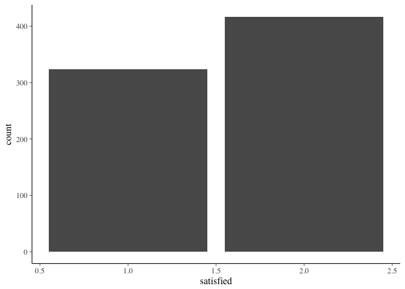

Bob\_Marshall Excercise
================

Bob Marshall Machine Learning Excercise
---------------------------------------

For this project I wanted to explore machine learning in R with a real dataset. I am also a huge fan of all things ecology, I enjoy hiking and generally being in the outdoors. From the USDA.gov website, there is a page dedicated to Forest Service Research and a group of researchers collected survey data from visitors to the the Bob Marshall Wilderness Complex in 1982.

Data Selecting and Formatting
=============================

Let's start by taking a look at our dataset.

``` r
Marshall %>% head()
```

    ## # A tibble: 6 x 181
    ##    QNUM  CLUS SELEC TRLHD SEASON PRTYREP ORIGIN WEIGHT TRAVEL NUMHORS
    ##   <int> <int> <int> <int>  <int>   <int>  <int>  <int>  <int>   <int>
    ## 1     1     1     1    15      1       1    599    100      1      NA
    ## 2     5     2     1     4      1       1    601    100      3      99
    ## 3     6     2     1     4      1       1    596    100      1      NA
    ## 4     7     2     1     4      1       1    598    100      5       8
    ## 5     8     2     1     4      1       1    598    100      4       4
    ## 6     9     2     1     4      1       1    598    100      1      NA
    ## # ... with 171 more variables: HORSFED <int>, HRSHNDL <int>, FISH <int>,
    ## #   HUNT <int>, HIKE <int>, NATUR <int>, MTNCLM <int>, RAFT <int>,
    ## #   SWIM <int>, PHOTO <int>, OTHACT <int>, NUMACT <int>, GRIZOBS <int>,
    ## #   BEAROBS <int>, SUMBEAR <int>, ELKOBS <int>, DEEROBS <int>,
    ## #   GOATOBS <int>, MOOSOBS <int>, SHPOBS <int>, OTHROBS <int>,
    ## #   NUMWOBS <int>, SHOT1 <int>, SHOT2 <int>, SHOT3 <int>, STAY <int>,
    ## #   FIRE <int>, OUTFTR <int>, MAPS <int>, TYPMAP <int>, SOLE <int>,
    ## #   VISIT <int>, AGEFST <int>, PARENT <int>, NEWAREA <int>, EXPBOB <int>,
    ## #   NUMBOB <int>, AQUAL <int>, DIFF <int>, LOCCHO <int>, WHOCHO <int>,
    ## #   TIMCHO <int>, TRLINF1 <int>, TRLINF2 <int>, TRLINF3 <int>,
    ## #   RESTRL1 <int>, RESTRL2 <int>, RESTRL <int>, OTHRTRL <int>,
    ## #   RESREJ1 <int>, RESREJ2 <int>, FSINFO <int>, FSCONT <int>,
    ## #   QUALINF <int>, NUMVIS <int>, NUMDAYS <int>, SCENRY <int>,
    ## #   FSHIMP <int>, HUNTIMP <int>, RELAX <int>, EXERCZ <int>, ESCAPE <int>,
    ## #   DEVSKL <int>, SOLTUD <int>, CHALNG <int>, AVDMEC <int>, OTHRES <int>,
    ## #   SATIS <int>, HIPT1 <int>, HIPT2 <int>, HIPT3 <int>, LOPT1 <int>,
    ## #   LOPT2 <int>, LOPT3 <int>, SOLSTD <int>, CAMPSOL <int>, ESTCAMP <int>,
    ## #   REJCOND <int>, RESCOND <int>, REJLOC <int>, RESLOC <int>,
    ## #   CMPSRCH <int>, PROBCMP <int>, TYPCMP <int>, CROWD <int>,
    ## #   NUMSEEN <int>, LRGSEEN <int>, HRSSEEN <int>, NUMCMP <int>,
    ## #   VISWLD <int>, WCHWLD <int>, HOWFAR <int>, OFFTRL <int>, LOOP <int>,
    ## #   CRDPROB <int>, CRDSPOT <int>, WEAR <int>, LITTER <int>, WRONG <int>,
    ## #   HITRHL <int>, ...

``` r
Marshall %>% length()
```

    ## [1] 181

``` r
Marshall %>% count()
```

    ## # A tibble: 1 x 1
    ##       n
    ##   <int>
    ## 1   746

``` r
sum(is.na(Marshall))
```

    ## [1] 17867

From the above code, we can see we have 181 variables, 746 obserations, and it looks like most of our variables are encoded as 0s and 1s.

I want my output variable will be a satisfaction score that is rated 1 = best, 5 is worst and 9 means missing. For this project, I am just going to categorize the variable into two categories,TRUE, FALSE and call it "satisfied", all 1s will be TRUE and anything else will be FALSE and 9s will be excluded from analysis.

``` r
Marshall <- Marshall%>%
  mutate(satisfied = as.factor(ifelse(SATIS == 1, TRUE, FALSE)))%>%
  filter(SATIS != 9)
Marshall$SATIS <- NULL
```

Now for the missing data

``` r
convertnines <- function(x){
  x <- ifelse(x == 99 | x == 9 | x == 999, NA, x)
}

Marshall <- as.data.frame(map(Marshall, convertnines))
```

``` r
Marshall_temp <- mice(Marshall, m = 5, defaultmethod = c("pmm", "polyreg"), seed = 500)
```

    ## 
    ##  iter imp variable
    ##   1   1  QNUM  CLUS  TRLHD  SEASON  PRTYREP  ORIGIN  TRAVEL  NUMHORS  HORSFED  HRSHNDL  FISH  HUNT  HIKE  NATUR  MTNCLM  RAFT  SWIM  PHOTO  OTHACT  NUMACT  GRIZOBS  BEAROBS  SUMBEAR  ELKOBS  DEEROBS  GOATOBS  MOOSOBS  SHPOBS  OTHROBS  NUMWOBS  SHOT1  SHOT2  SHOT3  STAY  FIRE  OUTFTR  MAPS  TYPMAP  SOLE  VISIT  AGEFST  PARENT  NEWAREA  EXPBOB  NUMBOB  AQUAL  DIFF  LOCCHO  WHOCHO  TIMCHO  TRLINF1  TRLINF2  TRLINF3  RESTRL1  RESTRL2  RESTRL  OTHRTRL  RESREJ1  RESREJ2  FSINFO  FSCONT  QUALINF  NUMVIS  NUMDAYS  SCENRY  FSHIMP  HUNTIMP  RELAX  EXERCZ  ESCAPE  DEVSKL  SOLTUD  CHALNG  AVDMEC  OTHRES  HIPT1  HIPT2  LOPT1  LOPT2  LOPT3  SOLSTD  CAMPSOL  ESTCAMP  REJCOND  RESCOND  REJLOC  RESLOC  CMPSRCH  PROBCMP  TYPCMP  CROWD  NUMSEEN  LRGSEEN  HRSSEEN  NUMCMP  VISWLD  HOWFAR  OFFTRL  LOOP  CRDPROB  CRDSPOT  WEAR  LITTER  WRONG  HITRHL  LOTRAIL  TRLLESS  TREES  SMLBRG  BIGBRG  PRIVY  FRPLC  FRRING  NATFIRE  CORRAL  NOHORSE  NOFIRE  TABLE  RATION  NOGRAZ  REQREG  NATFSH  SZLIMT  FT200  RMVRNG  EXSIGN  BURY  PWRSAW  GUIDBK  ACCMAP  ASSIGN  DNWOOD  FSHEAT  PAKOUT  WLDRNG  METRNG  COMENT  WLDIMP  BESTWLD  BESTREC  AGAIN  SIZE  LITBOY  LITGIRL  BOYS  GIRLS  FELLAS  GALS  MEN  WOMEN  TYPGRP  CLUB  TYPCLUB  NUMCLUB  CURRES  CHLRES  EDUC  STUDNT  OCCUP  FINCMT  MGTCMT  CMPCOD  CMPLIT  HMANUR  BAREGND  CMPREM  FWOODSC  TREEDGD  GRAZSCR  CMPOTHR  CMPLOCN  PORLOCN  WATLOCN  OCCLOCN  TRLLOCN  OTHLOCN
    ##   1   2  QNUM  CLUS  TRLHD  SEASON  PRTYREP  ORIGIN  TRAVEL  NUMHORS  HORSFED  HRSHNDL  FISH  HUNT  HIKE  NATUR  MTNCLM  RAFT  SWIM  PHOTO  OTHACT  NUMACT  GRIZOBS  BEAROBS  SUMBEAR  ELKOBS  DEEROBS  GOATOBS  MOOSOBS  SHPOBS  OTHROBS  NUMWOBS  SHOT1  SHOT2  SHOT3  STAY  FIRE  OUTFTR  MAPS  TYPMAP  SOLE  VISIT  AGEFST  PARENT  NEWAREA  EXPBOB  NUMBOB  AQUAL  DIFF  LOCCHO  WHOCHO  TIMCHO  TRLINF1  TRLINF2  TRLINF3  RESTRL1  RESTRL2  RESTRL  OTHRTRL  RESREJ1  RESREJ2  FSINFO  FSCONT  QUALINF  NUMVIS  NUMDAYS  SCENRY  FSHIMP  HUNTIMP  RELAX  EXERCZ  ESCAPE  DEVSKL  SOLTUD  CHALNG  AVDMEC  OTHRES  HIPT1  HIPT2  LOPT1  LOPT2  LOPT3  SOLSTD  CAMPSOL  ESTCAMP  REJCOND  RESCOND  REJLOC  RESLOC  CMPSRCH  PROBCMP  TYPCMP  CROWD  NUMSEEN  LRGSEEN  HRSSEEN  NUMCMP  VISWLD  HOWFAR  OFFTRL  LOOP  CRDPROB  CRDSPOT  WEAR  LITTER  WRONG  HITRHL  LOTRAIL  TRLLESS  TREES  SMLBRG  BIGBRG  PRIVY  FRPLC  FRRING  NATFIRE  CORRAL  NOHORSE  NOFIRE  TABLE  RATION  NOGRAZ  REQREG  NATFSH  SZLIMT  FT200  RMVRNG  EXSIGN  BURY  PWRSAW  GUIDBK  ACCMAP  ASSIGN  DNWOOD  FSHEAT  PAKOUT  WLDRNG  METRNG  COMENT  WLDIMP  BESTWLD  BESTREC  AGAIN  SIZE  LITBOY  LITGIRL  BOYS  GIRLS  FELLAS  GALS  MEN  WOMEN  TYPGRP  CLUB  TYPCLUB  NUMCLUB  CURRES  CHLRES  EDUC  STUDNT  OCCUP  FINCMT  MGTCMT  CMPCOD  CMPLIT  HMANUR  BAREGND  CMPREM  FWOODSC  TREEDGD  GRAZSCR  CMPOTHR  CMPLOCN  PORLOCN  WATLOCN  OCCLOCN  TRLLOCN  OTHLOCN
    ##   1   3  QNUM  CLUS  TRLHD  SEASON  PRTYREP  ORIGIN  TRAVEL  NUMHORS  HORSFED  HRSHNDL  FISH  HUNT  HIKE  NATUR  MTNCLM  RAFT  SWIM  PHOTO  OTHACT  NUMACT  GRIZOBS  BEAROBS  SUMBEAR  ELKOBS  DEEROBS  GOATOBS  MOOSOBS  SHPOBS  OTHROBS  NUMWOBS  SHOT1  SHOT2  SHOT3  STAY  FIRE  OUTFTR  MAPS  TYPMAP  SOLE  VISIT  AGEFST  PARENT  NEWAREA  EXPBOB  NUMBOB  AQUAL  DIFF  LOCCHO  WHOCHO  TIMCHO  TRLINF1  TRLINF2  TRLINF3  RESTRL1  RESTRL2  RESTRL  OTHRTRL  RESREJ1  RESREJ2  FSINFO  FSCONT  QUALINF  NUMVIS  NUMDAYS  SCENRY  FSHIMP  HUNTIMP  RELAX  EXERCZ  ESCAPE  DEVSKL  SOLTUD  CHALNG  AVDMEC  OTHRES  HIPT1  HIPT2  LOPT1  LOPT2  LOPT3  SOLSTD  CAMPSOL  ESTCAMP  REJCOND  RESCOND  REJLOC  RESLOC  CMPSRCH  PROBCMP  TYPCMP  CROWD  NUMSEEN  LRGSEEN  HRSSEEN  NUMCMP  VISWLD  HOWFAR  OFFTRL  LOOP  CRDPROB  CRDSPOT  WEAR  LITTER  WRONG  HITRHL  LOTRAIL  TRLLESS  TREES  SMLBRG  BIGBRG  PRIVY  FRPLC  FRRING  NATFIRE  CORRAL  NOHORSE  NOFIRE  TABLE  RATION  NOGRAZ  REQREG  NATFSH  SZLIMT  FT200  RMVRNG  EXSIGN  BURY  PWRSAW  GUIDBK  ACCMAP  ASSIGN  DNWOOD  FSHEAT  PAKOUT  WLDRNG  METRNG  COMENT  WLDIMP  BESTWLD  BESTREC  AGAIN  SIZE  LITBOY  LITGIRL  BOYS  GIRLS  FELLAS  GALS  MEN  WOMEN  TYPGRP  CLUB  TYPCLUB  NUMCLUB  CURRES  CHLRES  EDUC  STUDNT  OCCUP  FINCMT  MGTCMT  CMPCOD  CMPLIT  HMANUR  BAREGND  CMPREM  FWOODSC  TREEDGD  GRAZSCR  CMPOTHR  CMPLOCN  PORLOCN  WATLOCN  OCCLOCN  TRLLOCN  OTHLOCN
    ##   1   4  QNUM  CLUS  TRLHD  SEASON  PRTYREP  ORIGIN  TRAVEL  NUMHORS  HORSFED  HRSHNDL  FISH  HUNT  HIKE  NATUR  MTNCLM  RAFT  SWIM  PHOTO  OTHACT  NUMACT  GRIZOBS  BEAROBS  SUMBEAR  ELKOBS  DEEROBS  GOATOBS  MOOSOBS  SHPOBS  OTHROBS  NUMWOBS  SHOT1  SHOT2  SHOT3  STAY  FIRE  OUTFTR  MAPS  TYPMAP  SOLE  VISIT  AGEFST  PARENT  NEWAREA  EXPBOB  NUMBOB  AQUAL  DIFF  LOCCHO  WHOCHO  TIMCHO  TRLINF1  TRLINF2  TRLINF3  RESTRL1  RESTRL2  RESTRL  OTHRTRL  RESREJ1  RESREJ2  FSINFO  FSCONT  QUALINF  NUMVIS  NUMDAYS  SCENRY  FSHIMP  HUNTIMP  RELAX  EXERCZ  ESCAPE  DEVSKL  SOLTUD  CHALNG  AVDMEC  OTHRES  HIPT1  HIPT2  LOPT1  LOPT2  LOPT3  SOLSTD  CAMPSOL  ESTCAMP  REJCOND  RESCOND  REJLOC  RESLOC  CMPSRCH  PROBCMP  TYPCMP  CROWD  NUMSEEN  LRGSEEN  HRSSEEN  NUMCMP  VISWLD  HOWFAR  OFFTRL  LOOP  CRDPROB  CRDSPOT  WEAR  LITTER  WRONG  HITRHL  LOTRAIL  TRLLESS  TREES  SMLBRG  BIGBRG  PRIVY  FRPLC  FRRING  NATFIRE  CORRAL  NOHORSE  NOFIRE  TABLE  RATION  NOGRAZ  REQREG  NATFSH  SZLIMT  FT200  RMVRNG  EXSIGN  BURY  PWRSAW  GUIDBK  ACCMAP  ASSIGN  DNWOOD  FSHEAT  PAKOUT  WLDRNG  METRNG  COMENT  WLDIMP  BESTWLD  BESTREC  AGAIN  SIZE  LITBOY  LITGIRL  BOYS  GIRLS  FELLAS  GALS  MEN  WOMEN  TYPGRP  CLUB  TYPCLUB  NUMCLUB  CURRES  CHLRES  EDUC  STUDNT  OCCUP  FINCMT  MGTCMT  CMPCOD  CMPLIT  HMANUR  BAREGND  CMPREM  FWOODSC  TREEDGD  GRAZSCR  CMPOTHR  CMPLOCN  PORLOCN  WATLOCN  OCCLOCN  TRLLOCN  OTHLOCN
    ##   1   5  QNUM  CLUS  TRLHD  SEASON  PRTYREP  ORIGIN  TRAVEL  NUMHORS  HORSFED  HRSHNDL  FISH  HUNT  HIKE  NATUR  MTNCLM  RAFT  SWIM  PHOTO  OTHACT  NUMACT  GRIZOBS  BEAROBS  SUMBEAR  ELKOBS  DEEROBS  GOATOBS  MOOSOBS  SHPOBS  OTHROBS  NUMWOBS  SHOT1  SHOT2  SHOT3  STAY  FIRE  OUTFTR  MAPS  TYPMAP  SOLE  VISIT  AGEFST  PARENT  NEWAREA  EXPBOB  NUMBOB  AQUAL  DIFF  LOCCHO  WHOCHO  TIMCHO  TRLINF1  TRLINF2  TRLINF3  RESTRL1  RESTRL2  RESTRL  OTHRTRL  RESREJ1  RESREJ2  FSINFO  FSCONT  QUALINF  NUMVIS  NUMDAYS  SCENRY  FSHIMP  HUNTIMP  RELAX  EXERCZ  ESCAPE  DEVSKL  SOLTUD  CHALNG  AVDMEC  OTHRES  HIPT1  HIPT2  LOPT1  LOPT2  LOPT3  SOLSTD  CAMPSOL  ESTCAMP  REJCOND  RESCOND  REJLOC  RESLOC  CMPSRCH  PROBCMP  TYPCMP  CROWD  NUMSEEN  LRGSEEN  HRSSEEN  NUMCMP  VISWLD  HOWFAR  OFFTRL  LOOP  CRDPROB  CRDSPOT  WEAR  LITTER  WRONG  HITRHL  LOTRAIL  TRLLESS  TREES  SMLBRG  BIGBRG  PRIVY  FRPLC  FRRING  NATFIRE  CORRAL  NOHORSE  NOFIRE  TABLE  RATION  NOGRAZ  REQREG  NATFSH  SZLIMT  FT200  RMVRNG  EXSIGN  BURY  PWRSAW  GUIDBK  ACCMAP  ASSIGN  DNWOOD  FSHEAT  PAKOUT  WLDRNG  METRNG  COMENT  WLDIMP  BESTWLD  BESTREC  AGAIN  SIZE  LITBOY  LITGIRL  BOYS  GIRLS  FELLAS  GALS  MEN  WOMEN  TYPGRP  CLUB  TYPCLUB  NUMCLUB  CURRES  CHLRES  EDUC  STUDNT  OCCUP  FINCMT  MGTCMT  CMPCOD  CMPLIT  HMANUR  BAREGND  CMPREM  FWOODSC  TREEDGD  GRAZSCR  CMPOTHR  CMPLOCN  PORLOCN  WATLOCN  OCCLOCN  TRLLOCN  OTHLOCN
    ##   2   1  QNUM  CLUS  TRLHD  SEASON  PRTYREP  ORIGIN  TRAVEL  NUMHORS  HORSFED  HRSHNDL  FISH  HUNT  HIKE  NATUR  MTNCLM  RAFT  SWIM  PHOTO  OTHACT  NUMACT  GRIZOBS  BEAROBS  SUMBEAR  ELKOBS  DEEROBS  GOATOBS  MOOSOBS  SHPOBS  OTHROBS  NUMWOBS  SHOT1  SHOT2  SHOT3  STAY  FIRE  OUTFTR  MAPS  TYPMAP  SOLE  VISIT  AGEFST  PARENT  NEWAREA  EXPBOB  NUMBOB  AQUAL  DIFF  LOCCHO  WHOCHO  TIMCHO  TRLINF1  TRLINF2  TRLINF3  RESTRL1  RESTRL2  RESTRL  OTHRTRL  RESREJ1  RESREJ2  FSINFO  FSCONT  QUALINF  NUMVIS  NUMDAYS  SCENRY  FSHIMP  HUNTIMP  RELAX  EXERCZ  ESCAPE  DEVSKL  SOLTUD  CHALNG  AVDMEC  OTHRES  HIPT1  HIPT2  LOPT1  LOPT2  LOPT3  SOLSTD  CAMPSOL  ESTCAMP  REJCOND  RESCOND  REJLOC  RESLOC  CMPSRCH  PROBCMP  TYPCMP  CROWD  NUMSEEN  LRGSEEN  HRSSEEN  NUMCMP  VISWLD  HOWFAR  OFFTRL  LOOP  CRDPROB  CRDSPOT  WEAR  LITTER  WRONG  HITRHL  LOTRAIL  TRLLESS  TREES  SMLBRG  BIGBRG  PRIVY  FRPLC  FRRING  NATFIRE  CORRAL  NOHORSE  NOFIRE  TABLE  RATION  NOGRAZ  REQREG  NATFSH  SZLIMT  FT200  RMVRNG  EXSIGN  BURY  PWRSAW  GUIDBK  ACCMAP  ASSIGN  DNWOOD  FSHEAT  PAKOUT  WLDRNG  METRNG  COMENT  WLDIMP  BESTWLD  BESTREC  AGAIN  SIZE  LITBOY  LITGIRL  BOYS  GIRLS  FELLAS  GALS  MEN  WOMEN  TYPGRP  CLUB  TYPCLUB  NUMCLUB  CURRES  CHLRES  EDUC  STUDNT  OCCUP  FINCMT  MGTCMT  CMPCOD  CMPLIT  HMANUR  BAREGND  CMPREM  FWOODSC  TREEDGD  GRAZSCR  CMPOTHR  CMPLOCN  PORLOCN  WATLOCN  OCCLOCN  TRLLOCN  OTHLOCN
    ##   2   2  QNUM  CLUS  TRLHD  SEASON  PRTYREP  ORIGIN  TRAVEL  NUMHORS  HORSFED  HRSHNDL  FISH  HUNT  HIKE  NATUR  MTNCLM  RAFT  SWIM  PHOTO  OTHACT  NUMACT  GRIZOBS  BEAROBS  SUMBEAR  ELKOBS  DEEROBS  GOATOBS  MOOSOBS  SHPOBS  OTHROBS  NUMWOBS  SHOT1  SHOT2  SHOT3  STAY  FIRE  OUTFTR  MAPS  TYPMAP  SOLE  VISIT  AGEFST  PARENT  NEWAREA  EXPBOB  NUMBOB  AQUAL  DIFF  LOCCHO  WHOCHO  TIMCHO  TRLINF1  TRLINF2  TRLINF3  RESTRL1  RESTRL2  RESTRL  OTHRTRL  RESREJ1  RESREJ2  FSINFO  FSCONT  QUALINF  NUMVIS  NUMDAYS  SCENRY  FSHIMP  HUNTIMP  RELAX  EXERCZ  ESCAPE  DEVSKL  SOLTUD  CHALNG  AVDMEC  OTHRES  HIPT1  HIPT2  LOPT1  LOPT2  LOPT3  SOLSTD  CAMPSOL  ESTCAMP  REJCOND  RESCOND  REJLOC  RESLOC  CMPSRCH  PROBCMP  TYPCMP  CROWD  NUMSEEN  LRGSEEN  HRSSEEN  NUMCMP  VISWLD  HOWFAR  OFFTRL  LOOP  CRDPROB  CRDSPOT  WEAR  LITTER  WRONG  HITRHL  LOTRAIL  TRLLESS  TREES  SMLBRG  BIGBRG  PRIVY  FRPLC  FRRING  NATFIRE  CORRAL  NOHORSE  NOFIRE  TABLE  RATION  NOGRAZ  REQREG  NATFSH  SZLIMT  FT200  RMVRNG  EXSIGN  BURY  PWRSAW  GUIDBK  ACCMAP  ASSIGN  DNWOOD  FSHEAT  PAKOUT  WLDRNG  METRNG  COMENT  WLDIMP  BESTWLD  BESTREC  AGAIN  SIZE  LITBOY  LITGIRL  BOYS  GIRLS  FELLAS  GALS  MEN  WOMEN  TYPGRP  CLUB  TYPCLUB  NUMCLUB  CURRES  CHLRES  EDUC  STUDNT  OCCUP  FINCMT  MGTCMT  CMPCOD  CMPLIT  HMANUR  BAREGND  CMPREM  FWOODSC  TREEDGD  GRAZSCR  CMPOTHR  CMPLOCN  PORLOCN  WATLOCN  OCCLOCN  TRLLOCN  OTHLOCN
    ##   2   3  QNUM  CLUS  TRLHD  SEASON  PRTYREP  ORIGIN  TRAVEL  NUMHORS  HORSFED  HRSHNDL  FISH  HUNT  HIKE  NATUR  MTNCLM  RAFT  SWIM  PHOTO  OTHACT  NUMACT  GRIZOBS  BEAROBS  SUMBEAR  ELKOBS  DEEROBS  GOATOBS  MOOSOBS  SHPOBS  OTHROBS  NUMWOBS  SHOT1  SHOT2  SHOT3  STAY  FIRE  OUTFTR  MAPS  TYPMAP  SOLE  VISIT  AGEFST  PARENT  NEWAREA  EXPBOB  NUMBOB  AQUAL  DIFF  LOCCHO  WHOCHO  TIMCHO  TRLINF1  TRLINF2  TRLINF3  RESTRL1  RESTRL2  RESTRL  OTHRTRL  RESREJ1  RESREJ2  FSINFO  FSCONT  QUALINF  NUMVIS  NUMDAYS  SCENRY  FSHIMP  HUNTIMP  RELAX  EXERCZ  ESCAPE  DEVSKL  SOLTUD  CHALNG  AVDMEC  OTHRES  HIPT1  HIPT2  LOPT1  LOPT2  LOPT3  SOLSTD  CAMPSOL  ESTCAMP  REJCOND  RESCOND  REJLOC  RESLOC  CMPSRCH  PROBCMP  TYPCMP  CROWD  NUMSEEN  LRGSEEN  HRSSEEN  NUMCMP  VISWLD  HOWFAR  OFFTRL  LOOP  CRDPROB  CRDSPOT  WEAR  LITTER  WRONG  HITRHL  LOTRAIL  TRLLESS  TREES  SMLBRG  BIGBRG  PRIVY  FRPLC  FRRING  NATFIRE  CORRAL  NOHORSE  NOFIRE  TABLE  RATION  NOGRAZ  REQREG  NATFSH  SZLIMT  FT200  RMVRNG  EXSIGN  BURY  PWRSAW  GUIDBK  ACCMAP  ASSIGN  DNWOOD  FSHEAT  PAKOUT  WLDRNG  METRNG  COMENT  WLDIMP  BESTWLD  BESTREC  AGAIN  SIZE  LITBOY  LITGIRL  BOYS  GIRLS  FELLAS  GALS  MEN  WOMEN  TYPGRP  CLUB  TYPCLUB  NUMCLUB  CURRES  CHLRES  EDUC  STUDNT  OCCUP  FINCMT  MGTCMT  CMPCOD  CMPLIT  HMANUR  BAREGND  CMPREM  FWOODSC  TREEDGD  GRAZSCR  CMPOTHR  CMPLOCN  PORLOCN  WATLOCN  OCCLOCN  TRLLOCN  OTHLOCN
    ##   2   4  QNUM  CLUS  TRLHD  SEASON  PRTYREP  ORIGIN  TRAVEL  NUMHORS  HORSFED  HRSHNDL  FISH  HUNT  HIKE  NATUR  MTNCLM  RAFT  SWIM  PHOTO  OTHACT  NUMACT  GRIZOBS  BEAROBS  SUMBEAR  ELKOBS  DEEROBS  GOATOBS  MOOSOBS  SHPOBS  OTHROBS  NUMWOBS  SHOT1  SHOT2  SHOT3  STAY  FIRE  OUTFTR  MAPS  TYPMAP  SOLE  VISIT  AGEFST  PARENT  NEWAREA  EXPBOB  NUMBOB  AQUAL  DIFF  LOCCHO  WHOCHO  TIMCHO  TRLINF1  TRLINF2  TRLINF3  RESTRL1  RESTRL2  RESTRL  OTHRTRL  RESREJ1  RESREJ2  FSINFO  FSCONT  QUALINF  NUMVIS  NUMDAYS  SCENRY  FSHIMP  HUNTIMP  RELAX  EXERCZ  ESCAPE  DEVSKL  SOLTUD  CHALNG  AVDMEC  OTHRES  HIPT1  HIPT2  LOPT1  LOPT2  LOPT3  SOLSTD  CAMPSOL  ESTCAMP  REJCOND  RESCOND  REJLOC  RESLOC  CMPSRCH  PROBCMP  TYPCMP  CROWD  NUMSEEN  LRGSEEN  HRSSEEN  NUMCMP  VISWLD  HOWFAR  OFFTRL  LOOP  CRDPROB  CRDSPOT  WEAR  LITTER  WRONG  HITRHL  LOTRAIL  TRLLESS  TREES  SMLBRG  BIGBRG  PRIVY  FRPLC  FRRING  NATFIRE  CORRAL  NOHORSE  NOFIRE  TABLE  RATION  NOGRAZ  REQREG  NATFSH  SZLIMT  FT200  RMVRNG  EXSIGN  BURY  PWRSAW  GUIDBK  ACCMAP  ASSIGN  DNWOOD  FSHEAT  PAKOUT  WLDRNG  METRNG  COMENT  WLDIMP  BESTWLD  BESTREC  AGAIN  SIZE  LITBOY  LITGIRL  BOYS  GIRLS  FELLAS  GALS  MEN  WOMEN  TYPGRP  CLUB  TYPCLUB  NUMCLUB  CURRES  CHLRES  EDUC  STUDNT  OCCUP  FINCMT  MGTCMT  CMPCOD  CMPLIT  HMANUR  BAREGND  CMPREM  FWOODSC  TREEDGD  GRAZSCR  CMPOTHR  CMPLOCN  PORLOCN  WATLOCN  OCCLOCN  TRLLOCN  OTHLOCN
    ##   2   5  QNUM  CLUS  TRLHD  SEASON  PRTYREP  ORIGIN  TRAVEL  NUMHORS  HORSFED  HRSHNDL  FISH  HUNT  HIKE  NATUR  MTNCLM  RAFT  SWIM  PHOTO  OTHACT  NUMACT  GRIZOBS  BEAROBS  SUMBEAR  ELKOBS  DEEROBS  GOATOBS  MOOSOBS  SHPOBS  OTHROBS  NUMWOBS  SHOT1  SHOT2  SHOT3  STAY  FIRE  OUTFTR  MAPS  TYPMAP  SOLE  VISIT  AGEFST  PARENT  NEWAREA  EXPBOB  NUMBOB  AQUAL  DIFF  LOCCHO  WHOCHO  TIMCHO  TRLINF1  TRLINF2  TRLINF3  RESTRL1  RESTRL2  RESTRL  OTHRTRL  RESREJ1  RESREJ2  FSINFO  FSCONT  QUALINF  NUMVIS  NUMDAYS  SCENRY  FSHIMP  HUNTIMP  RELAX  EXERCZ  ESCAPE  DEVSKL  SOLTUD  CHALNG  AVDMEC  OTHRES  HIPT1  HIPT2  LOPT1  LOPT2  LOPT3  SOLSTD  CAMPSOL  ESTCAMP  REJCOND  RESCOND  REJLOC  RESLOC  CMPSRCH  PROBCMP  TYPCMP  CROWD  NUMSEEN  LRGSEEN  HRSSEEN  NUMCMP  VISWLD  HOWFAR  OFFTRL  LOOP  CRDPROB  CRDSPOT  WEAR  LITTER  WRONG  HITRHL  LOTRAIL  TRLLESS  TREES  SMLBRG  BIGBRG  PRIVY  FRPLC  FRRING  NATFIRE  CORRAL  NOHORSE  NOFIRE  TABLE  RATION  NOGRAZ  REQREG  NATFSH  SZLIMT  FT200  RMVRNG  EXSIGN  BURY  PWRSAW  GUIDBK  ACCMAP  ASSIGN  DNWOOD  FSHEAT  PAKOUT  WLDRNG  METRNG  COMENT  WLDIMP  BESTWLD  BESTREC  AGAIN  SIZE  LITBOY  LITGIRL  BOYS  GIRLS  FELLAS  GALS  MEN  WOMEN  TYPGRP  CLUB  TYPCLUB  NUMCLUB  CURRES  CHLRES  EDUC  STUDNT  OCCUP  FINCMT  MGTCMT  CMPCOD  CMPLIT  HMANUR  BAREGND  CMPREM  FWOODSC  TREEDGD  GRAZSCR  CMPOTHR  CMPLOCN  PORLOCN  WATLOCN  OCCLOCN  TRLLOCN  OTHLOCN
    ##   3   1  QNUM  CLUS  TRLHD  SEASON  PRTYREP  ORIGIN  TRAVEL  NUMHORS  HORSFED  HRSHNDL  FISH  HUNT  HIKE  NATUR  MTNCLM  RAFT  SWIM  PHOTO  OTHACT  NUMACT  GRIZOBS  BEAROBS  SUMBEAR  ELKOBS  DEEROBS  GOATOBS  MOOSOBS  SHPOBS  OTHROBS  NUMWOBS  SHOT1  SHOT2  SHOT3  STAY  FIRE  OUTFTR  MAPS  TYPMAP  SOLE  VISIT  AGEFST  PARENT  NEWAREA  EXPBOB  NUMBOB  AQUAL  DIFF  LOCCHO  WHOCHO  TIMCHO  TRLINF1  TRLINF2  TRLINF3  RESTRL1  RESTRL2  RESTRL  OTHRTRL  RESREJ1  RESREJ2  FSINFO  FSCONT  QUALINF  NUMVIS  NUMDAYS  SCENRY  FSHIMP  HUNTIMP  RELAX  EXERCZ  ESCAPE  DEVSKL  SOLTUD  CHALNG  AVDMEC  OTHRES  HIPT1  HIPT2  LOPT1  LOPT2  LOPT3  SOLSTD  CAMPSOL  ESTCAMP  REJCOND  RESCOND  REJLOC  RESLOC  CMPSRCH  PROBCMP  TYPCMP  CROWD  NUMSEEN  LRGSEEN  HRSSEEN  NUMCMP  VISWLD  HOWFAR  OFFTRL  LOOP  CRDPROB  CRDSPOT  WEAR  LITTER  WRONG  HITRHL  LOTRAIL  TRLLESS  TREES  SMLBRG  BIGBRG  PRIVY  FRPLC  FRRING  NATFIRE  CORRAL  NOHORSE  NOFIRE  TABLE  RATION  NOGRAZ  REQREG  NATFSH  SZLIMT  FT200  RMVRNG  EXSIGN  BURY  PWRSAW  GUIDBK  ACCMAP  ASSIGN  DNWOOD  FSHEAT  PAKOUT  WLDRNG  METRNG  COMENT  WLDIMP  BESTWLD  BESTREC  AGAIN  SIZE  LITBOY  LITGIRL  BOYS  GIRLS  FELLAS  GALS  MEN  WOMEN  TYPGRP  CLUB  TYPCLUB  NUMCLUB  CURRES  CHLRES  EDUC  STUDNT  OCCUP  FINCMT  MGTCMT  CMPCOD  CMPLIT  HMANUR  BAREGND  CMPREM  FWOODSC  TREEDGD  GRAZSCR  CMPOTHR  CMPLOCN  PORLOCN  WATLOCN  OCCLOCN  TRLLOCN  OTHLOCN
    ##   3   2  QNUM  CLUS  TRLHD  SEASON  PRTYREP  ORIGIN  TRAVEL  NUMHORS  HORSFED  HRSHNDL  FISH  HUNT  HIKE  NATUR  MTNCLM  RAFT  SWIM  PHOTO  OTHACT  NUMACT  GRIZOBS  BEAROBS  SUMBEAR  ELKOBS  DEEROBS  GOATOBS  MOOSOBS  SHPOBS  OTHROBS  NUMWOBS  SHOT1  SHOT2  SHOT3  STAY  FIRE  OUTFTR  MAPS  TYPMAP  SOLE  VISIT  AGEFST  PARENT  NEWAREA  EXPBOB  NUMBOB  AQUAL  DIFF  LOCCHO  WHOCHO  TIMCHO  TRLINF1  TRLINF2  TRLINF3  RESTRL1  RESTRL2  RESTRL  OTHRTRL  RESREJ1  RESREJ2  FSINFO  FSCONT  QUALINF  NUMVIS  NUMDAYS  SCENRY  FSHIMP  HUNTIMP  RELAX  EXERCZ  ESCAPE  DEVSKL  SOLTUD  CHALNG  AVDMEC  OTHRES  HIPT1  HIPT2  LOPT1  LOPT2  LOPT3  SOLSTD  CAMPSOL  ESTCAMP  REJCOND  RESCOND  REJLOC  RESLOC  CMPSRCH  PROBCMP  TYPCMP  CROWD  NUMSEEN  LRGSEEN  HRSSEEN  NUMCMP  VISWLD  HOWFAR  OFFTRL  LOOP  CRDPROB  CRDSPOT  WEAR  LITTER  WRONG  HITRHL  LOTRAIL  TRLLESS  TREES  SMLBRG  BIGBRG  PRIVY  FRPLC  FRRING  NATFIRE  CORRAL  NOHORSE  NOFIRE  TABLE  RATION  NOGRAZ  REQREG  NATFSH  SZLIMT  FT200  RMVRNG  EXSIGN  BURY  PWRSAW  GUIDBK  ACCMAP  ASSIGN  DNWOOD  FSHEAT  PAKOUT  WLDRNG  METRNG  COMENT  WLDIMP  BESTWLD  BESTREC  AGAIN  SIZE  LITBOY  LITGIRL  BOYS  GIRLS  FELLAS  GALS  MEN  WOMEN  TYPGRP  CLUB  TYPCLUB  NUMCLUB  CURRES  CHLRES  EDUC  STUDNT  OCCUP  FINCMT  MGTCMT  CMPCOD  CMPLIT  HMANUR  BAREGND  CMPREM  FWOODSC  TREEDGD  GRAZSCR  CMPOTHR  CMPLOCN  PORLOCN  WATLOCN  OCCLOCN  TRLLOCN  OTHLOCN
    ##   3   3  QNUM  CLUS  TRLHD  SEASON  PRTYREP  ORIGIN  TRAVEL  NUMHORS  HORSFED  HRSHNDL  FISH  HUNT  HIKE  NATUR  MTNCLM  RAFT  SWIM  PHOTO  OTHACT  NUMACT  GRIZOBS  BEAROBS  SUMBEAR  ELKOBS  DEEROBS  GOATOBS  MOOSOBS  SHPOBS  OTHROBS  NUMWOBS  SHOT1  SHOT2  SHOT3  STAY  FIRE  OUTFTR  MAPS  TYPMAP  SOLE  VISIT  AGEFST  PARENT  NEWAREA  EXPBOB  NUMBOB  AQUAL  DIFF  LOCCHO  WHOCHO  TIMCHO  TRLINF1  TRLINF2  TRLINF3  RESTRL1  RESTRL2  RESTRL  OTHRTRL  RESREJ1  RESREJ2  FSINFO  FSCONT  QUALINF  NUMVIS  NUMDAYS  SCENRY  FSHIMP  HUNTIMP  RELAX  EXERCZ  ESCAPE  DEVSKL  SOLTUD  CHALNG  AVDMEC  OTHRES  HIPT1  HIPT2  LOPT1  LOPT2  LOPT3  SOLSTD  CAMPSOL  ESTCAMP  REJCOND  RESCOND  REJLOC  RESLOC  CMPSRCH  PROBCMP  TYPCMP  CROWD  NUMSEEN  LRGSEEN  HRSSEEN  NUMCMP  VISWLD  HOWFAR  OFFTRL  LOOP  CRDPROB  CRDSPOT  WEAR  LITTER  WRONG  HITRHL  LOTRAIL  TRLLESS  TREES  SMLBRG  BIGBRG  PRIVY  FRPLC  FRRING  NATFIRE  CORRAL  NOHORSE  NOFIRE  TABLE  RATION  NOGRAZ  REQREG  NATFSH  SZLIMT  FT200  RMVRNG  EXSIGN  BURY  PWRSAW  GUIDBK  ACCMAP  ASSIGN  DNWOOD  FSHEAT  PAKOUT  WLDRNG  METRNG  COMENT  WLDIMP  BESTWLD  BESTREC  AGAIN  SIZE  LITBOY  LITGIRL  BOYS  GIRLS  FELLAS  GALS  MEN  WOMEN  TYPGRP  CLUB  TYPCLUB  NUMCLUB  CURRES  CHLRES  EDUC  STUDNT  OCCUP  FINCMT  MGTCMT  CMPCOD  CMPLIT  HMANUR  BAREGND  CMPREM  FWOODSC  TREEDGD  GRAZSCR  CMPOTHR  CMPLOCN  PORLOCN  WATLOCN  OCCLOCN  TRLLOCN  OTHLOCN
    ##   3   4  QNUM  CLUS  TRLHD  SEASON  PRTYREP  ORIGIN  TRAVEL  NUMHORS  HORSFED  HRSHNDL  FISH  HUNT  HIKE  NATUR  MTNCLM  RAFT  SWIM  PHOTO  OTHACT  NUMACT  GRIZOBS  BEAROBS  SUMBEAR  ELKOBS  DEEROBS  GOATOBS  MOOSOBS  SHPOBS  OTHROBS  NUMWOBS  SHOT1  SHOT2  SHOT3  STAY  FIRE  OUTFTR  MAPS  TYPMAP  SOLE  VISIT  AGEFST  PARENT  NEWAREA  EXPBOB  NUMBOB  AQUAL  DIFF  LOCCHO  WHOCHO  TIMCHO  TRLINF1  TRLINF2  TRLINF3  RESTRL1  RESTRL2  RESTRL  OTHRTRL  RESREJ1  RESREJ2  FSINFO  FSCONT  QUALINF  NUMVIS  NUMDAYS  SCENRY  FSHIMP  HUNTIMP  RELAX  EXERCZ  ESCAPE  DEVSKL  SOLTUD  CHALNG  AVDMEC  OTHRES  HIPT1  HIPT2  LOPT1  LOPT2  LOPT3  SOLSTD  CAMPSOL  ESTCAMP  REJCOND  RESCOND  REJLOC  RESLOC  CMPSRCH  PROBCMP  TYPCMP  CROWD  NUMSEEN  LRGSEEN  HRSSEEN  NUMCMP  VISWLD  HOWFAR  OFFTRL  LOOP  CRDPROB  CRDSPOT  WEAR  LITTER  WRONG  HITRHL  LOTRAIL  TRLLESS  TREES  SMLBRG  BIGBRG  PRIVY  FRPLC  FRRING  NATFIRE  CORRAL  NOHORSE  NOFIRE  TABLE  RATION  NOGRAZ  REQREG  NATFSH  SZLIMT  FT200  RMVRNG  EXSIGN  BURY  PWRSAW  GUIDBK  ACCMAP  ASSIGN  DNWOOD  FSHEAT  PAKOUT  WLDRNG  METRNG  COMENT  WLDIMP  BESTWLD  BESTREC  AGAIN  SIZE  LITBOY  LITGIRL  BOYS  GIRLS  FELLAS  GALS  MEN  WOMEN  TYPGRP  CLUB  TYPCLUB  NUMCLUB  CURRES  CHLRES  EDUC  STUDNT  OCCUP  FINCMT  MGTCMT  CMPCOD  CMPLIT  HMANUR  BAREGND  CMPREM  FWOODSC  TREEDGD  GRAZSCR  CMPOTHR  CMPLOCN  PORLOCN  WATLOCN  OCCLOCN  TRLLOCN  OTHLOCN
    ##   3   5  QNUM  CLUS  TRLHD  SEASON  PRTYREP  ORIGIN  TRAVEL  NUMHORS  HORSFED  HRSHNDL  FISH  HUNT  HIKE  NATUR  MTNCLM  RAFT  SWIM  PHOTO  OTHACT  NUMACT  GRIZOBS  BEAROBS  SUMBEAR  ELKOBS  DEEROBS  GOATOBS  MOOSOBS  SHPOBS  OTHROBS  NUMWOBS  SHOT1  SHOT2  SHOT3  STAY  FIRE  OUTFTR  MAPS  TYPMAP  SOLE  VISIT  AGEFST  PARENT  NEWAREA  EXPBOB  NUMBOB  AQUAL  DIFF  LOCCHO  WHOCHO  TIMCHO  TRLINF1  TRLINF2  TRLINF3  RESTRL1  RESTRL2  RESTRL  OTHRTRL  RESREJ1  RESREJ2  FSINFO  FSCONT  QUALINF  NUMVIS  NUMDAYS  SCENRY  FSHIMP  HUNTIMP  RELAX  EXERCZ  ESCAPE  DEVSKL  SOLTUD  CHALNG  AVDMEC  OTHRES  HIPT1  HIPT2  LOPT1  LOPT2  LOPT3  SOLSTD  CAMPSOL  ESTCAMP  REJCOND  RESCOND  REJLOC  RESLOC  CMPSRCH  PROBCMP  TYPCMP  CROWD  NUMSEEN  LRGSEEN  HRSSEEN  NUMCMP  VISWLD  HOWFAR  OFFTRL  LOOP  CRDPROB  CRDSPOT  WEAR  LITTER  WRONG  HITRHL  LOTRAIL  TRLLESS  TREES  SMLBRG  BIGBRG  PRIVY  FRPLC  FRRING  NATFIRE  CORRAL  NOHORSE  NOFIRE  TABLE  RATION  NOGRAZ  REQREG  NATFSH  SZLIMT  FT200  RMVRNG  EXSIGN  BURY  PWRSAW  GUIDBK  ACCMAP  ASSIGN  DNWOOD  FSHEAT  PAKOUT  WLDRNG  METRNG  COMENT  WLDIMP  BESTWLD  BESTREC  AGAIN  SIZE  LITBOY  LITGIRL  BOYS  GIRLS  FELLAS  GALS  MEN  WOMEN  TYPGRP  CLUB  TYPCLUB  NUMCLUB  CURRES  CHLRES  EDUC  STUDNT  OCCUP  FINCMT  MGTCMT  CMPCOD  CMPLIT  HMANUR  BAREGND  CMPREM  FWOODSC  TREEDGD  GRAZSCR  CMPOTHR  CMPLOCN  PORLOCN  WATLOCN  OCCLOCN  TRLLOCN  OTHLOCN
    ##   4   1  QNUM  CLUS  TRLHD  SEASON  PRTYREP  ORIGIN  TRAVEL  NUMHORS  HORSFED  HRSHNDL  FISH  HUNT  HIKE  NATUR  MTNCLM  RAFT  SWIM  PHOTO  OTHACT  NUMACT  GRIZOBS  BEAROBS  SUMBEAR  ELKOBS  DEEROBS  GOATOBS  MOOSOBS  SHPOBS  OTHROBS  NUMWOBS  SHOT1  SHOT2  SHOT3  STAY  FIRE  OUTFTR  MAPS  TYPMAP  SOLE  VISIT  AGEFST  PARENT  NEWAREA  EXPBOB  NUMBOB  AQUAL  DIFF  LOCCHO  WHOCHO  TIMCHO  TRLINF1  TRLINF2  TRLINF3  RESTRL1  RESTRL2  RESTRL  OTHRTRL  RESREJ1  RESREJ2  FSINFO  FSCONT  QUALINF  NUMVIS  NUMDAYS  SCENRY  FSHIMP  HUNTIMP  RELAX  EXERCZ  ESCAPE  DEVSKL  SOLTUD  CHALNG  AVDMEC  OTHRES  HIPT1  HIPT2  LOPT1  LOPT2  LOPT3  SOLSTD  CAMPSOL  ESTCAMP  REJCOND  RESCOND  REJLOC  RESLOC  CMPSRCH  PROBCMP  TYPCMP  CROWD  NUMSEEN  LRGSEEN  HRSSEEN  NUMCMP  VISWLD  HOWFAR  OFFTRL  LOOP  CRDPROB  CRDSPOT  WEAR  LITTER  WRONG  HITRHL  LOTRAIL  TRLLESS  TREES  SMLBRG  BIGBRG  PRIVY  FRPLC  FRRING  NATFIRE  CORRAL  NOHORSE  NOFIRE  TABLE  RATION  NOGRAZ  REQREG  NATFSH  SZLIMT  FT200  RMVRNG  EXSIGN  BURY  PWRSAW  GUIDBK  ACCMAP  ASSIGN  DNWOOD  FSHEAT  PAKOUT  WLDRNG  METRNG  COMENT  WLDIMP  BESTWLD  BESTREC  AGAIN  SIZE  LITBOY  LITGIRL  BOYS  GIRLS  FELLAS  GALS  MEN  WOMEN  TYPGRP  CLUB  TYPCLUB  NUMCLUB  CURRES  CHLRES  EDUC  STUDNT  OCCUP  FINCMT  MGTCMT  CMPCOD  CMPLIT  HMANUR  BAREGND  CMPREM  FWOODSC  TREEDGD  GRAZSCR  CMPOTHR  CMPLOCN  PORLOCN  WATLOCN  OCCLOCN  TRLLOCN  OTHLOCN
    ##   4   2  QNUM  CLUS  TRLHD  SEASON  PRTYREP  ORIGIN  TRAVEL  NUMHORS  HORSFED  HRSHNDL  FISH  HUNT  HIKE  NATUR  MTNCLM  RAFT  SWIM  PHOTO  OTHACT  NUMACT  GRIZOBS  BEAROBS  SUMBEAR  ELKOBS  DEEROBS  GOATOBS  MOOSOBS  SHPOBS  OTHROBS  NUMWOBS  SHOT1  SHOT2  SHOT3  STAY  FIRE  OUTFTR  MAPS  TYPMAP  SOLE  VISIT  AGEFST  PARENT  NEWAREA  EXPBOB  NUMBOB  AQUAL  DIFF  LOCCHO  WHOCHO  TIMCHO  TRLINF1  TRLINF2  TRLINF3  RESTRL1  RESTRL2  RESTRL  OTHRTRL  RESREJ1  RESREJ2  FSINFO  FSCONT  QUALINF  NUMVIS  NUMDAYS  SCENRY  FSHIMP  HUNTIMP  RELAX  EXERCZ  ESCAPE  DEVSKL  SOLTUD  CHALNG  AVDMEC  OTHRES  HIPT1  HIPT2  LOPT1  LOPT2  LOPT3  SOLSTD  CAMPSOL  ESTCAMP  REJCOND  RESCOND  REJLOC  RESLOC  CMPSRCH  PROBCMP  TYPCMP  CROWD  NUMSEEN  LRGSEEN  HRSSEEN  NUMCMP  VISWLD  HOWFAR  OFFTRL  LOOP  CRDPROB  CRDSPOT  WEAR  LITTER  WRONG  HITRHL  LOTRAIL  TRLLESS  TREES  SMLBRG  BIGBRG  PRIVY  FRPLC  FRRING  NATFIRE  CORRAL  NOHORSE  NOFIRE  TABLE  RATION  NOGRAZ  REQREG  NATFSH  SZLIMT  FT200  RMVRNG  EXSIGN  BURY  PWRSAW  GUIDBK  ACCMAP  ASSIGN  DNWOOD  FSHEAT  PAKOUT  WLDRNG  METRNG  COMENT  WLDIMP  BESTWLD  BESTREC  AGAIN  SIZE  LITBOY  LITGIRL  BOYS  GIRLS  FELLAS  GALS  MEN  WOMEN  TYPGRP  CLUB  TYPCLUB  NUMCLUB  CURRES  CHLRES  EDUC  STUDNT  OCCUP  FINCMT  MGTCMT  CMPCOD  CMPLIT  HMANUR  BAREGND  CMPREM  FWOODSC  TREEDGD  GRAZSCR  CMPOTHR  CMPLOCN  PORLOCN  WATLOCN  OCCLOCN  TRLLOCN  OTHLOCN
    ##   4   3  QNUM  CLUS  TRLHD  SEASON  PRTYREP  ORIGIN  TRAVEL  NUMHORS  HORSFED  HRSHNDL  FISH  HUNT  HIKE  NATUR  MTNCLM  RAFT  SWIM  PHOTO  OTHACT  NUMACT  GRIZOBS  BEAROBS  SUMBEAR  ELKOBS  DEEROBS  GOATOBS  MOOSOBS  SHPOBS  OTHROBS  NUMWOBS  SHOT1  SHOT2  SHOT3  STAY  FIRE  OUTFTR  MAPS  TYPMAP  SOLE  VISIT  AGEFST  PARENT  NEWAREA  EXPBOB  NUMBOB  AQUAL  DIFF  LOCCHO  WHOCHO  TIMCHO  TRLINF1  TRLINF2  TRLINF3  RESTRL1  RESTRL2  RESTRL  OTHRTRL  RESREJ1  RESREJ2  FSINFO  FSCONT  QUALINF  NUMVIS  NUMDAYS  SCENRY  FSHIMP  HUNTIMP  RELAX  EXERCZ  ESCAPE  DEVSKL  SOLTUD  CHALNG  AVDMEC  OTHRES  HIPT1  HIPT2  LOPT1  LOPT2  LOPT3  SOLSTD  CAMPSOL  ESTCAMP  REJCOND  RESCOND  REJLOC  RESLOC  CMPSRCH  PROBCMP  TYPCMP  CROWD  NUMSEEN  LRGSEEN  HRSSEEN  NUMCMP  VISWLD  HOWFAR  OFFTRL  LOOP  CRDPROB  CRDSPOT  WEAR  LITTER  WRONG  HITRHL  LOTRAIL  TRLLESS  TREES  SMLBRG  BIGBRG  PRIVY  FRPLC  FRRING  NATFIRE  CORRAL  NOHORSE  NOFIRE  TABLE  RATION  NOGRAZ  REQREG  NATFSH  SZLIMT  FT200  RMVRNG  EXSIGN  BURY  PWRSAW  GUIDBK  ACCMAP  ASSIGN  DNWOOD  FSHEAT  PAKOUT  WLDRNG  METRNG  COMENT  WLDIMP  BESTWLD  BESTREC  AGAIN  SIZE  LITBOY  LITGIRL  BOYS  GIRLS  FELLAS  GALS  MEN  WOMEN  TYPGRP  CLUB  TYPCLUB  NUMCLUB  CURRES  CHLRES  EDUC  STUDNT  OCCUP  FINCMT  MGTCMT  CMPCOD  CMPLIT  HMANUR  BAREGND  CMPREM  FWOODSC  TREEDGD  GRAZSCR  CMPOTHR  CMPLOCN  PORLOCN  WATLOCN  OCCLOCN  TRLLOCN  OTHLOCN
    ##   4   4  QNUM  CLUS  TRLHD  SEASON  PRTYREP  ORIGIN  TRAVEL  NUMHORS  HORSFED  HRSHNDL  FISH  HUNT  HIKE  NATUR  MTNCLM  RAFT  SWIM  PHOTO  OTHACT  NUMACT  GRIZOBS  BEAROBS  SUMBEAR  ELKOBS  DEEROBS  GOATOBS  MOOSOBS  SHPOBS  OTHROBS  NUMWOBS  SHOT1  SHOT2  SHOT3  STAY  FIRE  OUTFTR  MAPS  TYPMAP  SOLE  VISIT  AGEFST  PARENT  NEWAREA  EXPBOB  NUMBOB  AQUAL  DIFF  LOCCHO  WHOCHO  TIMCHO  TRLINF1  TRLINF2  TRLINF3  RESTRL1  RESTRL2  RESTRL  OTHRTRL  RESREJ1  RESREJ2  FSINFO  FSCONT  QUALINF  NUMVIS  NUMDAYS  SCENRY  FSHIMP  HUNTIMP  RELAX  EXERCZ  ESCAPE  DEVSKL  SOLTUD  CHALNG  AVDMEC  OTHRES  HIPT1  HIPT2  LOPT1  LOPT2  LOPT3  SOLSTD  CAMPSOL  ESTCAMP  REJCOND  RESCOND  REJLOC  RESLOC  CMPSRCH  PROBCMP  TYPCMP  CROWD  NUMSEEN  LRGSEEN  HRSSEEN  NUMCMP  VISWLD  HOWFAR  OFFTRL  LOOP  CRDPROB  CRDSPOT  WEAR  LITTER  WRONG  HITRHL  LOTRAIL  TRLLESS  TREES  SMLBRG  BIGBRG  PRIVY  FRPLC  FRRING  NATFIRE  CORRAL  NOHORSE  NOFIRE  TABLE  RATION  NOGRAZ  REQREG  NATFSH  SZLIMT  FT200  RMVRNG  EXSIGN  BURY  PWRSAW  GUIDBK  ACCMAP  ASSIGN  DNWOOD  FSHEAT  PAKOUT  WLDRNG  METRNG  COMENT  WLDIMP  BESTWLD  BESTREC  AGAIN  SIZE  LITBOY  LITGIRL  BOYS  GIRLS  FELLAS  GALS  MEN  WOMEN  TYPGRP  CLUB  TYPCLUB  NUMCLUB  CURRES  CHLRES  EDUC  STUDNT  OCCUP  FINCMT  MGTCMT  CMPCOD  CMPLIT  HMANUR  BAREGND  CMPREM  FWOODSC  TREEDGD  GRAZSCR  CMPOTHR  CMPLOCN  PORLOCN  WATLOCN  OCCLOCN  TRLLOCN  OTHLOCN
    ##   4   5  QNUM  CLUS  TRLHD  SEASON  PRTYREP  ORIGIN  TRAVEL  NUMHORS  HORSFED  HRSHNDL  FISH  HUNT  HIKE  NATUR  MTNCLM  RAFT  SWIM  PHOTO  OTHACT  NUMACT  GRIZOBS  BEAROBS  SUMBEAR  ELKOBS  DEEROBS  GOATOBS  MOOSOBS  SHPOBS  OTHROBS  NUMWOBS  SHOT1  SHOT2  SHOT3  STAY  FIRE  OUTFTR  MAPS  TYPMAP  SOLE  VISIT  AGEFST  PARENT  NEWAREA  EXPBOB  NUMBOB  AQUAL  DIFF  LOCCHO  WHOCHO  TIMCHO  TRLINF1  TRLINF2  TRLINF3  RESTRL1  RESTRL2  RESTRL  OTHRTRL  RESREJ1  RESREJ2  FSINFO  FSCONT  QUALINF  NUMVIS  NUMDAYS  SCENRY  FSHIMP  HUNTIMP  RELAX  EXERCZ  ESCAPE  DEVSKL  SOLTUD  CHALNG  AVDMEC  OTHRES  HIPT1  HIPT2  LOPT1  LOPT2  LOPT3  SOLSTD  CAMPSOL  ESTCAMP  REJCOND  RESCOND  REJLOC  RESLOC  CMPSRCH  PROBCMP  TYPCMP  CROWD  NUMSEEN  LRGSEEN  HRSSEEN  NUMCMP  VISWLD  HOWFAR  OFFTRL  LOOP  CRDPROB  CRDSPOT  WEAR  LITTER  WRONG  HITRHL  LOTRAIL  TRLLESS  TREES  SMLBRG  BIGBRG  PRIVY  FRPLC  FRRING  NATFIRE  CORRAL  NOHORSE  NOFIRE  TABLE  RATION  NOGRAZ  REQREG  NATFSH  SZLIMT  FT200  RMVRNG  EXSIGN  BURY  PWRSAW  GUIDBK  ACCMAP  ASSIGN  DNWOOD  FSHEAT  PAKOUT  WLDRNG  METRNG  COMENT  WLDIMP  BESTWLD  BESTREC  AGAIN  SIZE  LITBOY  LITGIRL  BOYS  GIRLS  FELLAS  GALS  MEN  WOMEN  TYPGRP  CLUB  TYPCLUB  NUMCLUB  CURRES  CHLRES  EDUC  STUDNT  OCCUP  FINCMT  MGTCMT  CMPCOD  CMPLIT  HMANUR  BAREGND  CMPREM  FWOODSC  TREEDGD  GRAZSCR  CMPOTHR  CMPLOCN  PORLOCN  WATLOCN  OCCLOCN  TRLLOCN  OTHLOCN
    ##   5   1  QNUM  CLUS  TRLHD  SEASON  PRTYREP  ORIGIN  TRAVEL  NUMHORS  HORSFED  HRSHNDL  FISH  HUNT  HIKE  NATUR  MTNCLM  RAFT  SWIM  PHOTO  OTHACT  NUMACT  GRIZOBS  BEAROBS  SUMBEAR  ELKOBS  DEEROBS  GOATOBS  MOOSOBS  SHPOBS  OTHROBS  NUMWOBS  SHOT1  SHOT2  SHOT3  STAY  FIRE  OUTFTR  MAPS  TYPMAP  SOLE  VISIT  AGEFST  PARENT  NEWAREA  EXPBOB  NUMBOB  AQUAL  DIFF  LOCCHO  WHOCHO  TIMCHO  TRLINF1  TRLINF2  TRLINF3  RESTRL1  RESTRL2  RESTRL  OTHRTRL  RESREJ1  RESREJ2  FSINFO  FSCONT  QUALINF  NUMVIS  NUMDAYS  SCENRY  FSHIMP  HUNTIMP  RELAX  EXERCZ  ESCAPE  DEVSKL  SOLTUD  CHALNG  AVDMEC  OTHRES  HIPT1  HIPT2  LOPT1  LOPT2  LOPT3  SOLSTD  CAMPSOL  ESTCAMP  REJCOND  RESCOND  REJLOC  RESLOC  CMPSRCH  PROBCMP  TYPCMP  CROWD  NUMSEEN  LRGSEEN  HRSSEEN  NUMCMP  VISWLD  HOWFAR  OFFTRL  LOOP  CRDPROB  CRDSPOT  WEAR  LITTER  WRONG  HITRHL  LOTRAIL  TRLLESS  TREES  SMLBRG  BIGBRG  PRIVY  FRPLC  FRRING  NATFIRE  CORRAL  NOHORSE  NOFIRE  TABLE  RATION  NOGRAZ  REQREG  NATFSH  SZLIMT  FT200  RMVRNG  EXSIGN  BURY  PWRSAW  GUIDBK  ACCMAP  ASSIGN  DNWOOD  FSHEAT  PAKOUT  WLDRNG  METRNG  COMENT  WLDIMP  BESTWLD  BESTREC  AGAIN  SIZE  LITBOY  LITGIRL  BOYS  GIRLS  FELLAS  GALS  MEN  WOMEN  TYPGRP  CLUB  TYPCLUB  NUMCLUB  CURRES  CHLRES  EDUC  STUDNT  OCCUP  FINCMT  MGTCMT  CMPCOD  CMPLIT  HMANUR  BAREGND  CMPREM  FWOODSC  TREEDGD  GRAZSCR  CMPOTHR  CMPLOCN  PORLOCN  WATLOCN  OCCLOCN  TRLLOCN  OTHLOCN
    ##   5   2  QNUM  CLUS  TRLHD  SEASON  PRTYREP  ORIGIN  TRAVEL  NUMHORS  HORSFED  HRSHNDL  FISH  HUNT  HIKE  NATUR  MTNCLM  RAFT  SWIM  PHOTO  OTHACT  NUMACT  GRIZOBS  BEAROBS  SUMBEAR  ELKOBS  DEEROBS  GOATOBS  MOOSOBS  SHPOBS  OTHROBS  NUMWOBS  SHOT1  SHOT2  SHOT3  STAY  FIRE  OUTFTR  MAPS  TYPMAP  SOLE  VISIT  AGEFST  PARENT  NEWAREA  EXPBOB  NUMBOB  AQUAL  DIFF  LOCCHO  WHOCHO  TIMCHO  TRLINF1  TRLINF2  TRLINF3  RESTRL1  RESTRL2  RESTRL  OTHRTRL  RESREJ1  RESREJ2  FSINFO  FSCONT  QUALINF  NUMVIS  NUMDAYS  SCENRY  FSHIMP  HUNTIMP  RELAX  EXERCZ  ESCAPE  DEVSKL  SOLTUD  CHALNG  AVDMEC  OTHRES  HIPT1  HIPT2  LOPT1  LOPT2  LOPT3  SOLSTD  CAMPSOL  ESTCAMP  REJCOND  RESCOND  REJLOC  RESLOC  CMPSRCH  PROBCMP  TYPCMP  CROWD  NUMSEEN  LRGSEEN  HRSSEEN  NUMCMP  VISWLD  HOWFAR  OFFTRL  LOOP  CRDPROB  CRDSPOT  WEAR  LITTER  WRONG  HITRHL  LOTRAIL  TRLLESS  TREES  SMLBRG  BIGBRG  PRIVY  FRPLC  FRRING  NATFIRE  CORRAL  NOHORSE  NOFIRE  TABLE  RATION  NOGRAZ  REQREG  NATFSH  SZLIMT  FT200  RMVRNG  EXSIGN  BURY  PWRSAW  GUIDBK  ACCMAP  ASSIGN  DNWOOD  FSHEAT  PAKOUT  WLDRNG  METRNG  COMENT  WLDIMP  BESTWLD  BESTREC  AGAIN  SIZE  LITBOY  LITGIRL  BOYS  GIRLS  FELLAS  GALS  MEN  WOMEN  TYPGRP  CLUB  TYPCLUB  NUMCLUB  CURRES  CHLRES  EDUC  STUDNT  OCCUP  FINCMT  MGTCMT  CMPCOD  CMPLIT  HMANUR  BAREGND  CMPREM  FWOODSC  TREEDGD  GRAZSCR  CMPOTHR  CMPLOCN  PORLOCN  WATLOCN  OCCLOCN  TRLLOCN  OTHLOCN
    ##   5   3  QNUM  CLUS  TRLHD  SEASON  PRTYREP  ORIGIN  TRAVEL  NUMHORS  HORSFED  HRSHNDL  FISH  HUNT  HIKE  NATUR  MTNCLM  RAFT  SWIM  PHOTO  OTHACT  NUMACT  GRIZOBS  BEAROBS  SUMBEAR  ELKOBS  DEEROBS  GOATOBS  MOOSOBS  SHPOBS  OTHROBS  NUMWOBS  SHOT1  SHOT2  SHOT3  STAY  FIRE  OUTFTR  MAPS  TYPMAP  SOLE  VISIT  AGEFST  PARENT  NEWAREA  EXPBOB  NUMBOB  AQUAL  DIFF  LOCCHO  WHOCHO  TIMCHO  TRLINF1  TRLINF2  TRLINF3  RESTRL1  RESTRL2  RESTRL  OTHRTRL  RESREJ1  RESREJ2  FSINFO  FSCONT  QUALINF  NUMVIS  NUMDAYS  SCENRY  FSHIMP  HUNTIMP  RELAX  EXERCZ  ESCAPE  DEVSKL  SOLTUD  CHALNG  AVDMEC  OTHRES  HIPT1  HIPT2  LOPT1  LOPT2  LOPT3  SOLSTD  CAMPSOL  ESTCAMP  REJCOND  RESCOND  REJLOC  RESLOC  CMPSRCH  PROBCMP  TYPCMP  CROWD  NUMSEEN  LRGSEEN  HRSSEEN  NUMCMP  VISWLD  HOWFAR  OFFTRL  LOOP  CRDPROB  CRDSPOT  WEAR  LITTER  WRONG  HITRHL  LOTRAIL  TRLLESS  TREES  SMLBRG  BIGBRG  PRIVY  FRPLC  FRRING  NATFIRE  CORRAL  NOHORSE  NOFIRE  TABLE  RATION  NOGRAZ  REQREG  NATFSH  SZLIMT  FT200  RMVRNG  EXSIGN  BURY  PWRSAW  GUIDBK  ACCMAP  ASSIGN  DNWOOD  FSHEAT  PAKOUT  WLDRNG  METRNG  COMENT  WLDIMP  BESTWLD  BESTREC  AGAIN  SIZE  LITBOY  LITGIRL  BOYS  GIRLS  FELLAS  GALS  MEN  WOMEN  TYPGRP  CLUB  TYPCLUB  NUMCLUB  CURRES  CHLRES  EDUC  STUDNT  OCCUP  FINCMT  MGTCMT  CMPCOD  CMPLIT  HMANUR  BAREGND  CMPREM  FWOODSC  TREEDGD  GRAZSCR  CMPOTHR  CMPLOCN  PORLOCN  WATLOCN  OCCLOCN  TRLLOCN  OTHLOCN
    ##   5   4  QNUM  CLUS  TRLHD  SEASON  PRTYREP  ORIGIN  TRAVEL  NUMHORS  HORSFED  HRSHNDL  FISH  HUNT  HIKE  NATUR  MTNCLM  RAFT  SWIM  PHOTO  OTHACT  NUMACT  GRIZOBS  BEAROBS  SUMBEAR  ELKOBS  DEEROBS  GOATOBS  MOOSOBS  SHPOBS  OTHROBS  NUMWOBS  SHOT1  SHOT2  SHOT3  STAY  FIRE  OUTFTR  MAPS  TYPMAP  SOLE  VISIT  AGEFST  PARENT  NEWAREA  EXPBOB  NUMBOB  AQUAL  DIFF  LOCCHO  WHOCHO  TIMCHO  TRLINF1  TRLINF2  TRLINF3  RESTRL1  RESTRL2  RESTRL  OTHRTRL  RESREJ1  RESREJ2  FSINFO  FSCONT  QUALINF  NUMVIS  NUMDAYS  SCENRY  FSHIMP  HUNTIMP  RELAX  EXERCZ  ESCAPE  DEVSKL  SOLTUD  CHALNG  AVDMEC  OTHRES  HIPT1  HIPT2  LOPT1  LOPT2  LOPT3  SOLSTD  CAMPSOL  ESTCAMP  REJCOND  RESCOND  REJLOC  RESLOC  CMPSRCH  PROBCMP  TYPCMP  CROWD  NUMSEEN  LRGSEEN  HRSSEEN  NUMCMP  VISWLD  HOWFAR  OFFTRL  LOOP  CRDPROB  CRDSPOT  WEAR  LITTER  WRONG  HITRHL  LOTRAIL  TRLLESS  TREES  SMLBRG  BIGBRG  PRIVY  FRPLC  FRRING  NATFIRE  CORRAL  NOHORSE  NOFIRE  TABLE  RATION  NOGRAZ  REQREG  NATFSH  SZLIMT  FT200  RMVRNG  EXSIGN  BURY  PWRSAW  GUIDBK  ACCMAP  ASSIGN  DNWOOD  FSHEAT  PAKOUT  WLDRNG  METRNG  COMENT  WLDIMP  BESTWLD  BESTREC  AGAIN  SIZE  LITBOY  LITGIRL  BOYS  GIRLS  FELLAS  GALS  MEN  WOMEN  TYPGRP  CLUB  TYPCLUB  NUMCLUB  CURRES  CHLRES  EDUC  STUDNT  OCCUP  FINCMT  MGTCMT  CMPCOD  CMPLIT  HMANUR  BAREGND  CMPREM  FWOODSC  TREEDGD  GRAZSCR  CMPOTHR  CMPLOCN  PORLOCN  WATLOCN  OCCLOCN  TRLLOCN  OTHLOCN
    ##   5   5  QNUM  CLUS  TRLHD  SEASON  PRTYREP  ORIGIN  TRAVEL  NUMHORS  HORSFED  HRSHNDL  FISH  HUNT  HIKE  NATUR  MTNCLM  RAFT  SWIM  PHOTO  OTHACT  NUMACT  GRIZOBS  BEAROBS  SUMBEAR  ELKOBS  DEEROBS  GOATOBS  MOOSOBS  SHPOBS  OTHROBS  NUMWOBS  SHOT1  SHOT2  SHOT3  STAY  FIRE  OUTFTR  MAPS  TYPMAP  SOLE  VISIT  AGEFST  PARENT  NEWAREA  EXPBOB  NUMBOB  AQUAL  DIFF  LOCCHO  WHOCHO  TIMCHO  TRLINF1  TRLINF2  TRLINF3  RESTRL1  RESTRL2  RESTRL  OTHRTRL  RESREJ1  RESREJ2  FSINFO  FSCONT  QUALINF  NUMVIS  NUMDAYS  SCENRY  FSHIMP  HUNTIMP  RELAX  EXERCZ  ESCAPE  DEVSKL  SOLTUD  CHALNG  AVDMEC  OTHRES  HIPT1  HIPT2  LOPT1  LOPT2  LOPT3  SOLSTD  CAMPSOL  ESTCAMP  REJCOND  RESCOND  REJLOC  RESLOC  CMPSRCH  PROBCMP  TYPCMP  CROWD  NUMSEEN  LRGSEEN  HRSSEEN  NUMCMP  VISWLD  HOWFAR  OFFTRL  LOOP  CRDPROB  CRDSPOT  WEAR  LITTER  WRONG  HITRHL  LOTRAIL  TRLLESS  TREES  SMLBRG  BIGBRG  PRIVY  FRPLC  FRRING  NATFIRE  CORRAL  NOHORSE  NOFIRE  TABLE  RATION  NOGRAZ  REQREG  NATFSH  SZLIMT  FT200  RMVRNG  EXSIGN  BURY  PWRSAW  GUIDBK  ACCMAP  ASSIGN  DNWOOD  FSHEAT  PAKOUT  WLDRNG  METRNG  COMENT  WLDIMP  BESTWLD  BESTREC  AGAIN  SIZE  LITBOY  LITGIRL  BOYS  GIRLS  FELLAS  GALS  MEN  WOMEN  TYPGRP  CLUB  TYPCLUB  NUMCLUB  CURRES  CHLRES  EDUC  STUDNT  OCCUP  FINCMT  MGTCMT  CMPCOD  CMPLIT  HMANUR  BAREGND  CMPREM  FWOODSC  TREEDGD  GRAZSCR  CMPOTHR  CMPLOCN  PORLOCN  WATLOCN  OCCLOCN  TRLLOCN  OTHLOCN

``` r
summary(Marshall_temp)
```

    ## Multiply imputed data set
    ## Call:
    ## mice(data = Marshall, m = 5, seed = 500, defaultmethod = c("pmm", 
    ##     "polyreg"))
    ## Number of multiple imputations:  5
    ## Missing cells per column:
    ##      QNUM      CLUS     SELEC     TRLHD    SEASON   PRTYREP    ORIGIN 
    ##         2        25         0        31        15        38         5 
    ##    WEIGHT    TRAVEL   NUMHORS   HORSFED   HRSHNDL      FISH      HUNT 
    ##         0         1       502       485       494         3         3 
    ##      HIKE     NATUR    MTNCLM      RAFT      SWIM     PHOTO    OTHACT 
    ##         3         3         3         3         3         3         3 
    ##    NUMACT   GRIZOBS   BEAROBS   SUMBEAR    ELKOBS   DEEROBS   GOATOBS 
    ##         4         3         3         3         3         3         3 
    ##   MOOSOBS    SHPOBS   OTHROBS   NUMWOBS     SHOT1     SHOT2     SHOT3 
    ##         3         3         3         4         4         4         4 
    ##      STAY      FIRE    OUTFTR      MAPS    TYPMAP      SOLE     VISIT 
    ##        29        15         8        10       358        18         5 
    ##    AGEFST    PARENT   NEWAREA    EXPBOB    NUMBOB     AQUAL      DIFF 
    ##       204       162       154       143       416       390       645 
    ##    LOCCHO    WHOCHO    TIMCHO   TRLINF1   TRLINF2   TRLINF3   RESTRL1 
    ##        10       479       222       229       230       229       223 
    ##   RESTRL2    RESTRL   OTHRTRL   RESREJ1   RESREJ2    FSINFO    FSCONT 
    ##       223       223       226       593       594         4       584 
    ##   QUALINF    NUMVIS   NUMDAYS    SCENRY    FSHIMP   HUNTIMP     RELAX 
    ##       578        21        54        18        56       104        25 
    ##    EXERCZ    ESCAPE    DEVSKL    SOLTUD    CHALNG    AVDMEC    OTHRES 
    ##        59        36        72        58        66        45       563 
    ##     HIPT1     HIPT2     HIPT3     LOPT1     LOPT2     LOPT3    SOLSTD 
    ##         3         8         0        39         7         2        48 
    ##   CAMPSOL   ESTCAMP   REJCOND   RESCOND    REJLOC    RESLOC   CMPSRCH 
    ##       226       251       253       618       254       558       252 
    ##   PROBCMP    TYPCMP     CROWD   NUMSEEN   LRGSEEN   HRSSEEN    NUMCMP 
    ##       250       249        20        29        42        29       133 
    ##    VISWLD    WCHWLD    HOWFAR    OFFTRL      LOOP   CRDPROB   CRDSPOT 
    ##       106         0       166       147       134         9       625 
    ##      WEAR    LITTER     WRONG    HITRHL   LOTRAIL   TRLLESS     TREES 
    ##        12        32        23        11        27        20        23 
    ##    SMLBRG    BIGBRG     PRIVY     FRPLC    FRRING   NATFIRE    CORRAL 
    ##        13        12        14        15        14        57        16 
    ##   NOHORSE    NOFIRE     TABLE    RATION    NOGRAZ    REQREG    NATFSH 
    ##        13        16        16        17        15        10        27 
    ##    SZLIMT     FT200    RMVRNG    EXSIGN      BURY    PWRSAW    GUIDBK 
    ##        16        14        12        15        10        17        14 
    ##    ACCMAP    ASSIGN    DNWOOD    FSHEAT    PAKOUT    WLDRNG    METRNG 
    ##        16        16        13        14         8        11        14 
    ##    COMENT    WLDIMP   BESTWLD   BESTREC     AGAIN      SIZE    LITBOY 
    ##        10         3        40        27        12        22        11 
    ##   LITGIRL      BOYS     GIRLS    FELLAS      GALS       MEN     WOMEN 
    ##        11        11        13        12        11        12        11 
    ##    TYPGRP      CLUB   TYPCLUB   NUMCLUB    CURRES    CHLRES      EDUC 
    ##        56         9       554       555        22        36        24 
    ##    STUDNT     OCCUP    FINCMT    MGTCMT    CMPCOD    CMPLIT    HMANUR 
    ##        25        29       638       586       260       258       258 
    ##   BAREGND    CMPREM   FWOODSC   TREEDGD   GRAZSCR   CMPOTHR   CMPLOCN 
    ##       258       258       258       258       258       258       259 
    ##   PORLOCN   WATLOCN   OCCLOCN   TRLLOCN   OTHLOCN satisfied 
    ##       259       259       259       259       260         0 
    ## Imputation methods:
    ##      QNUM      CLUS     SELEC     TRLHD    SEASON   PRTYREP    ORIGIN 
    ##     "pmm"     "pmm"        ""     "pmm"     "pmm"     "pmm"     "pmm" 
    ##    WEIGHT    TRAVEL   NUMHORS   HORSFED   HRSHNDL      FISH      HUNT 
    ##        ""     "pmm"     "pmm"     "pmm"     "pmm"     "pmm"     "pmm" 
    ##      HIKE     NATUR    MTNCLM      RAFT      SWIM     PHOTO    OTHACT 
    ##     "pmm"     "pmm"     "pmm"     "pmm"     "pmm"     "pmm"     "pmm" 
    ##    NUMACT   GRIZOBS   BEAROBS   SUMBEAR    ELKOBS   DEEROBS   GOATOBS 
    ##     "pmm"     "pmm"     "pmm"     "pmm"     "pmm"     "pmm"     "pmm" 
    ##   MOOSOBS    SHPOBS   OTHROBS   NUMWOBS     SHOT1     SHOT2     SHOT3 
    ##     "pmm"     "pmm"     "pmm"     "pmm"     "pmm"     "pmm"     "pmm" 
    ##      STAY      FIRE    OUTFTR      MAPS    TYPMAP      SOLE     VISIT 
    ##     "pmm"     "pmm"     "pmm"     "pmm"     "pmm"     "pmm"     "pmm" 
    ##    AGEFST    PARENT   NEWAREA    EXPBOB    NUMBOB     AQUAL      DIFF 
    ##     "pmm"     "pmm"     "pmm"     "pmm"     "pmm"     "pmm"     "pmm" 
    ##    LOCCHO    WHOCHO    TIMCHO   TRLINF1   TRLINF2   TRLINF3   RESTRL1 
    ##     "pmm"     "pmm"     "pmm"     "pmm"     "pmm"     "pmm"     "pmm" 
    ##   RESTRL2    RESTRL   OTHRTRL   RESREJ1   RESREJ2    FSINFO    FSCONT 
    ##     "pmm"     "pmm"     "pmm"     "pmm"     "pmm"     "pmm"     "pmm" 
    ##   QUALINF    NUMVIS   NUMDAYS    SCENRY    FSHIMP   HUNTIMP     RELAX 
    ##     "pmm"     "pmm"     "pmm"     "pmm"     "pmm"     "pmm"     "pmm" 
    ##    EXERCZ    ESCAPE    DEVSKL    SOLTUD    CHALNG    AVDMEC    OTHRES 
    ##     "pmm"     "pmm"     "pmm"     "pmm"     "pmm"     "pmm"     "pmm" 
    ##     HIPT1     HIPT2     HIPT3     LOPT1     LOPT2     LOPT3    SOLSTD 
    ##     "pmm"     "pmm"        ""     "pmm"     "pmm"     "pmm"     "pmm" 
    ##   CAMPSOL   ESTCAMP   REJCOND   RESCOND    REJLOC    RESLOC   CMPSRCH 
    ##     "pmm"     "pmm"     "pmm"     "pmm"     "pmm"     "pmm"     "pmm" 
    ##   PROBCMP    TYPCMP     CROWD   NUMSEEN   LRGSEEN   HRSSEEN    NUMCMP 
    ##     "pmm"     "pmm"     "pmm"     "pmm"     "pmm"     "pmm"     "pmm" 
    ##    VISWLD    WCHWLD    HOWFAR    OFFTRL      LOOP   CRDPROB   CRDSPOT 
    ##     "pmm"        ""     "pmm"     "pmm"     "pmm"     "pmm"     "pmm" 
    ##      WEAR    LITTER     WRONG    HITRHL   LOTRAIL   TRLLESS     TREES 
    ##     "pmm"     "pmm"     "pmm"     "pmm"     "pmm"     "pmm"     "pmm" 
    ##    SMLBRG    BIGBRG     PRIVY     FRPLC    FRRING   NATFIRE    CORRAL 
    ##     "pmm"     "pmm"     "pmm"     "pmm"     "pmm"     "pmm"     "pmm" 
    ##   NOHORSE    NOFIRE     TABLE    RATION    NOGRAZ    REQREG    NATFSH 
    ##     "pmm"     "pmm"     "pmm"     "pmm"     "pmm"     "pmm"     "pmm" 
    ##    SZLIMT     FT200    RMVRNG    EXSIGN      BURY    PWRSAW    GUIDBK 
    ##     "pmm"     "pmm"     "pmm"     "pmm"     "pmm"     "pmm"     "pmm" 
    ##    ACCMAP    ASSIGN    DNWOOD    FSHEAT    PAKOUT    WLDRNG    METRNG 
    ##     "pmm"     "pmm"     "pmm"     "pmm"     "pmm"     "pmm"     "pmm" 
    ##    COMENT    WLDIMP   BESTWLD   BESTREC     AGAIN      SIZE    LITBOY 
    ##     "pmm"     "pmm"     "pmm"     "pmm"     "pmm"     "pmm"     "pmm" 
    ##   LITGIRL      BOYS     GIRLS    FELLAS      GALS       MEN     WOMEN 
    ##     "pmm"     "pmm"     "pmm"     "pmm"     "pmm"     "pmm"     "pmm" 
    ##    TYPGRP      CLUB   TYPCLUB   NUMCLUB    CURRES    CHLRES      EDUC 
    ##     "pmm"     "pmm"     "pmm"     "pmm"     "pmm"     "pmm"     "pmm" 
    ##    STUDNT     OCCUP    FINCMT    MGTCMT    CMPCOD    CMPLIT    HMANUR 
    ##     "pmm"     "pmm"     "pmm"     "pmm"     "pmm"     "pmm"     "pmm" 
    ##   BAREGND    CMPREM   FWOODSC   TREEDGD   GRAZSCR   CMPOTHR   CMPLOCN 
    ##     "pmm"     "pmm"     "pmm"     "pmm"     "pmm"     "pmm"     "pmm" 
    ##   PORLOCN   WATLOCN   OCCLOCN   TRLLOCN   OTHLOCN satisfied 
    ##     "pmm"     "pmm"     "pmm"     "pmm"     "pmm"        "" 
    ## VisitSequence:
    ##    QNUM    CLUS   TRLHD  SEASON PRTYREP  ORIGIN  TRAVEL NUMHORS HORSFED 
    ##       1       2       4       5       6       7       9      10      11 
    ## HRSHNDL    FISH    HUNT    HIKE   NATUR  MTNCLM    RAFT    SWIM   PHOTO 
    ##      12      13      14      15      16      17      18      19      20 
    ##  OTHACT  NUMACT GRIZOBS BEAROBS SUMBEAR  ELKOBS DEEROBS GOATOBS MOOSOBS 
    ##      21      22      23      24      25      26      27      28      29 
    ##  SHPOBS OTHROBS NUMWOBS   SHOT1   SHOT2   SHOT3    STAY    FIRE  OUTFTR 
    ##      30      31      32      33      34      35      36      37      38 
    ##    MAPS  TYPMAP    SOLE   VISIT  AGEFST  PARENT NEWAREA  EXPBOB  NUMBOB 
    ##      39      40      41      42      43      44      45      46      47 
    ##   AQUAL    DIFF  LOCCHO  WHOCHO  TIMCHO TRLINF1 TRLINF2 TRLINF3 RESTRL1 
    ##      48      49      50      51      52      53      54      55      56 
    ## RESTRL2  RESTRL OTHRTRL RESREJ1 RESREJ2  FSINFO  FSCONT QUALINF  NUMVIS 
    ##      57      58      59      60      61      62      63      64      65 
    ## NUMDAYS  SCENRY  FSHIMP HUNTIMP   RELAX  EXERCZ  ESCAPE  DEVSKL  SOLTUD 
    ##      66      67      68      69      70      71      72      73      74 
    ##  CHALNG  AVDMEC  OTHRES   HIPT1   HIPT2   LOPT1   LOPT2   LOPT3  SOLSTD 
    ##      75      76      77      78      79      81      82      83      84 
    ## CAMPSOL ESTCAMP REJCOND RESCOND  REJLOC  RESLOC CMPSRCH PROBCMP  TYPCMP 
    ##      85      86      87      88      89      90      91      92      93 
    ##   CROWD NUMSEEN LRGSEEN HRSSEEN  NUMCMP  VISWLD  HOWFAR  OFFTRL    LOOP 
    ##      94      95      96      97      98      99     101     102     103 
    ## CRDPROB CRDSPOT    WEAR  LITTER   WRONG  HITRHL LOTRAIL TRLLESS   TREES 
    ##     104     105     106     107     108     109     110     111     112 
    ##  SMLBRG  BIGBRG   PRIVY   FRPLC  FRRING NATFIRE  CORRAL NOHORSE  NOFIRE 
    ##     113     114     115     116     117     118     119     120     121 
    ##   TABLE  RATION  NOGRAZ  REQREG  NATFSH  SZLIMT   FT200  RMVRNG  EXSIGN 
    ##     122     123     124     125     126     127     128     129     130 
    ##    BURY  PWRSAW  GUIDBK  ACCMAP  ASSIGN  DNWOOD  FSHEAT  PAKOUT  WLDRNG 
    ##     131     132     133     134     135     136     137     138     139 
    ##  METRNG  COMENT  WLDIMP BESTWLD BESTREC   AGAIN    SIZE  LITBOY LITGIRL 
    ##     140     141     142     143     144     145     146     147     148 
    ##    BOYS   GIRLS  FELLAS    GALS     MEN   WOMEN  TYPGRP    CLUB TYPCLUB 
    ##     149     150     151     152     153     154     155     156     157 
    ## NUMCLUB  CURRES  CHLRES    EDUC  STUDNT   OCCUP  FINCMT  MGTCMT  CMPCOD 
    ##     158     159     160     161     162     163     164     165     166 
    ##  CMPLIT  HMANUR BAREGND  CMPREM FWOODSC TREEDGD GRAZSCR CMPOTHR CMPLOCN 
    ##     167     168     169     170     171     172     173     174     175 
    ## PORLOCN WATLOCN OCCLOCN TRLLOCN OTHLOCN 
    ##     176     177     178     179     180 
    ## PredictorMatrix:
    ##           QNUM CLUS SELEC TRLHD SEASON PRTYREP ORIGIN WEIGHT TRAVEL
    ## QNUM         0    1     1     1      1       1      1      1      1
    ## CLUS         1    0     1     1      1       1      1      1      1
    ## SELEC        0    0     0     0      0       0      0      0      0
    ## TRLHD        1    1     1     0      1       1      1      1      1
    ## SEASON       1    1     1     1      0       1      1      1      1
    ## PRTYREP      1    1     1     1      1       0      1      1      1
    ## ORIGIN       1    1     1     1      1       1      0      1      1
    ## WEIGHT       0    0     0     0      0       0      0      0      0
    ## TRAVEL       1    1     1     1      1       1      1      1      0
    ## NUMHORS      1    1     1     1      1       1      1      1      1
    ## HORSFED      1    1     1     1      1       1      1      1      1
    ## HRSHNDL      1    1     1     1      1       1      1      1      1
    ## FISH         1    1     1     1      1       1      1      1      1
    ## HUNT         1    1     1     1      1       1      1      1      1
    ## HIKE         1    1     1     1      1       1      1      1      1
    ## NATUR        1    1     1     1      1       1      1      1      1
    ## MTNCLM       1    1     1     1      1       1      1      1      1
    ## RAFT         1    1     1     1      1       1      1      1      1
    ## SWIM         1    1     1     1      1       1      1      1      1
    ## PHOTO        1    1     1     1      1       1      1      1      1
    ## OTHACT       1    1     1     1      1       1      1      1      1
    ## NUMACT       1    1     1     1      1       1      1      1      1
    ## GRIZOBS      1    1     1     1      1       1      1      1      1
    ## BEAROBS      1    1     1     1      1       1      1      1      1
    ## SUMBEAR      1    1     1     1      1       1      1      1      1
    ## ELKOBS       1    1     1     1      1       1      1      1      1
    ## DEEROBS      1    1     1     1      1       1      1      1      1
    ## GOATOBS      1    1     1     1      1       1      1      1      1
    ## MOOSOBS      1    1     1     1      1       1      1      1      1
    ## SHPOBS       1    1     1     1      1       1      1      1      1
    ## OTHROBS      1    1     1     1      1       1      1      1      1
    ## NUMWOBS      1    1     1     1      1       1      1      1      1
    ## SHOT1        1    1     1     1      1       1      1      1      1
    ## SHOT2        1    1     1     1      1       1      1      1      1
    ## SHOT3        1    1     1     1      1       1      1      1      1
    ## STAY         1    1     1     1      1       1      1      1      1
    ## FIRE         1    1     1     1      1       1      1      1      1
    ## OUTFTR       1    1     1     1      1       1      1      1      1
    ## MAPS         1    1     1     1      1       1      1      1      1
    ## TYPMAP       1    1     1     1      1       1      1      1      1
    ## SOLE         1    1     1     1      1       1      1      1      1
    ## VISIT        1    1     1     1      1       1      1      1      1
    ## AGEFST       1    1     1     1      1       1      1      1      1
    ## PARENT       1    1     1     1      1       1      1      1      1
    ## NEWAREA      1    1     1     1      1       1      1      1      1
    ## EXPBOB       1    1     1     1      1       1      1      1      1
    ## NUMBOB       1    1     1     1      1       1      1      1      1
    ## AQUAL        1    1     1     1      1       1      1      1      1
    ## DIFF         1    1     1     1      1       1      1      1      1
    ## LOCCHO       1    1     1     1      1       1      1      1      1
    ## WHOCHO       1    1     1     1      1       1      1      1      1
    ## TIMCHO       1    1     1     1      1       1      1      1      1
    ## TRLINF1      1    1     1     1      1       1      1      1      1
    ## TRLINF2      1    1     1     1      1       1      1      1      1
    ## TRLINF3      1    1     1     1      1       1      1      1      1
    ## RESTRL1      1    1     1     1      1       1      1      1      1
    ## RESTRL2      1    1     1     1      1       1      1      1      1
    ## RESTRL       1    1     1     1      1       1      1      1      1
    ## OTHRTRL      1    1     1     1      1       1      1      1      1
    ## RESREJ1      1    1     1     1      1       1      1      1      1
    ## RESREJ2      1    1     1     1      1       1      1      1      1
    ## FSINFO       1    1     1     1      1       1      1      1      1
    ## FSCONT       1    1     1     1      1       1      1      1      1
    ## QUALINF      1    1     1     1      1       1      1      1      1
    ## NUMVIS       1    1     1     1      1       1      1      1      1
    ## NUMDAYS      1    1     1     1      1       1      1      1      1
    ## SCENRY       1    1     1     1      1       1      1      1      1
    ## FSHIMP       1    1     1     1      1       1      1      1      1
    ## HUNTIMP      1    1     1     1      1       1      1      1      1
    ## RELAX        1    1     1     1      1       1      1      1      1
    ## EXERCZ       1    1     1     1      1       1      1      1      1
    ## ESCAPE       1    1     1     1      1       1      1      1      1
    ## DEVSKL       1    1     1     1      1       1      1      1      1
    ## SOLTUD       1    1     1     1      1       1      1      1      1
    ## CHALNG       1    1     1     1      1       1      1      1      1
    ## AVDMEC       1    1     1     1      1       1      1      1      1
    ## OTHRES       1    1     1     1      1       1      1      1      1
    ## HIPT1        1    1     1     1      1       1      1      1      1
    ## HIPT2        1    1     1     1      1       1      1      1      1
    ## HIPT3        0    0     0     0      0       0      0      0      0
    ## LOPT1        1    1     1     1      1       1      1      1      1
    ## LOPT2        1    1     1     1      1       1      1      1      1
    ## LOPT3        1    1     1     1      1       1      1      1      1
    ## SOLSTD       1    1     1     1      1       1      1      1      1
    ## CAMPSOL      1    1     1     1      1       1      1      1      1
    ## ESTCAMP      1    1     1     1      1       1      1      1      1
    ## REJCOND      1    1     1     1      1       1      1      1      1
    ## RESCOND      1    1     1     1      1       1      1      1      1
    ## REJLOC       1    1     1     1      1       1      1      1      1
    ## RESLOC       1    1     1     1      1       1      1      1      1
    ## CMPSRCH      1    1     1     1      1       1      1      1      1
    ## PROBCMP      1    1     1     1      1       1      1      1      1
    ## TYPCMP       1    1     1     1      1       1      1      1      1
    ## CROWD        1    1     1     1      1       1      1      1      1
    ## NUMSEEN      1    1     1     1      1       1      1      1      1
    ## LRGSEEN      1    1     1     1      1       1      1      1      1
    ## HRSSEEN      1    1     1     1      1       1      1      1      1
    ## NUMCMP       1    1     1     1      1       1      1      1      1
    ## VISWLD       1    1     1     1      1       1      1      1      1
    ## WCHWLD       0    0     0     0      0       0      0      0      0
    ## HOWFAR       1    1     1     1      1       1      1      1      1
    ## OFFTRL       1    1     1     1      1       1      1      1      1
    ## LOOP         1    1     1     1      1       1      1      1      1
    ## CRDPROB      1    1     1     1      1       1      1      1      1
    ## CRDSPOT      1    1     1     1      1       1      1      1      1
    ## WEAR         1    1     1     1      1       1      1      1      1
    ## LITTER       1    1     1     1      1       1      1      1      1
    ## WRONG        1    1     1     1      1       1      1      1      1
    ## HITRHL       1    1     1     1      1       1      1      1      1
    ## LOTRAIL      1    1     1     1      1       1      1      1      1
    ## TRLLESS      1    1     1     1      1       1      1      1      1
    ## TREES        1    1     1     1      1       1      1      1      1
    ## SMLBRG       1    1     1     1      1       1      1      1      1
    ## BIGBRG       1    1     1     1      1       1      1      1      1
    ## PRIVY        1    1     1     1      1       1      1      1      1
    ## FRPLC        1    1     1     1      1       1      1      1      1
    ## FRRING       1    1     1     1      1       1      1      1      1
    ## NATFIRE      1    1     1     1      1       1      1      1      1
    ## CORRAL       1    1     1     1      1       1      1      1      1
    ## NOHORSE      1    1     1     1      1       1      1      1      1
    ## NOFIRE       1    1     1     1      1       1      1      1      1
    ## TABLE        1    1     1     1      1       1      1      1      1
    ## RATION       1    1     1     1      1       1      1      1      1
    ## NOGRAZ       1    1     1     1      1       1      1      1      1
    ## REQREG       1    1     1     1      1       1      1      1      1
    ## NATFSH       1    1     1     1      1       1      1      1      1
    ## SZLIMT       1    1     1     1      1       1      1      1      1
    ## FT200        1    1     1     1      1       1      1      1      1
    ## RMVRNG       1    1     1     1      1       1      1      1      1
    ## EXSIGN       1    1     1     1      1       1      1      1      1
    ## BURY         1    1     1     1      1       1      1      1      1
    ## PWRSAW       1    1     1     1      1       1      1      1      1
    ## GUIDBK       1    1     1     1      1       1      1      1      1
    ## ACCMAP       1    1     1     1      1       1      1      1      1
    ## ASSIGN       1    1     1     1      1       1      1      1      1
    ## DNWOOD       1    1     1     1      1       1      1      1      1
    ## FSHEAT       1    1     1     1      1       1      1      1      1
    ## PAKOUT       1    1     1     1      1       1      1      1      1
    ## WLDRNG       1    1     1     1      1       1      1      1      1
    ## METRNG       1    1     1     1      1       1      1      1      1
    ## COMENT       1    1     1     1      1       1      1      1      1
    ## WLDIMP       1    1     1     1      1       1      1      1      1
    ## BESTWLD      1    1     1     1      1       1      1      1      1
    ## BESTREC      1    1     1     1      1       1      1      1      1
    ## AGAIN        1    1     1     1      1       1      1      1      1
    ## SIZE         1    1     1     1      1       1      1      1      1
    ## LITBOY       1    1     1     1      1       1      1      1      1
    ## LITGIRL      1    1     1     1      1       1      1      1      1
    ## BOYS         1    1     1     1      1       1      1      1      1
    ## GIRLS        1    1     1     1      1       1      1      1      1
    ## FELLAS       1    1     1     1      1       1      1      1      1
    ## GALS         1    1     1     1      1       1      1      1      1
    ## MEN          1    1     1     1      1       1      1      1      1
    ## WOMEN        1    1     1     1      1       1      1      1      1
    ## TYPGRP       1    1     1     1      1       1      1      1      1
    ## CLUB         1    1     1     1      1       1      1      1      1
    ## TYPCLUB      1    1     1     1      1       1      1      1      1
    ## NUMCLUB      1    1     1     1      1       1      1      1      1
    ## CURRES       1    1     1     1      1       1      1      1      1
    ## CHLRES       1    1     1     1      1       1      1      1      1
    ## EDUC         1    1     1     1      1       1      1      1      1
    ## STUDNT       1    1     1     1      1       1      1      1      1
    ## OCCUP        1    1     1     1      1       1      1      1      1
    ## FINCMT       1    1     1     1      1       1      1      1      1
    ## MGTCMT       1    1     1     1      1       1      1      1      1
    ## CMPCOD       1    1     1     1      1       1      1      1      1
    ## CMPLIT       1    1     1     1      1       1      1      1      1
    ## HMANUR       1    1     1     1      1       1      1      1      1
    ## BAREGND      1    1     1     1      1       1      1      1      1
    ## CMPREM       1    1     1     1      1       1      1      1      1
    ## FWOODSC      1    1     1     1      1       1      1      1      1
    ## TREEDGD      1    1     1     1      1       1      1      1      1
    ## GRAZSCR      1    1     1     1      1       1      1      1      1
    ## CMPOTHR      1    1     1     1      1       1      1      1      1
    ## CMPLOCN      1    1     1     1      1       1      1      1      1
    ## PORLOCN      1    1     1     1      1       1      1      1      1
    ## WATLOCN      1    1     1     1      1       1      1      1      1
    ## OCCLOCN      1    1     1     1      1       1      1      1      1
    ## TRLLOCN      1    1     1     1      1       1      1      1      1
    ## OTHLOCN      1    1     1     1      1       1      1      1      1
    ## satisfied    0    0     0     0      0       0      0      0      0
    ##           NUMHORS HORSFED HRSHNDL FISH HUNT HIKE NATUR MTNCLM RAFT SWIM
    ## QNUM            1       1       1    1    1    1     1      1    1    1
    ## CLUS            1       1       1    1    1    1     1      1    1    1
    ## SELEC           0       0       0    0    0    0     0      0    0    0
    ## TRLHD           1       1       1    1    1    1     1      1    1    1
    ## SEASON          1       1       1    1    1    1     1      1    1    1
    ## PRTYREP         1       1       1    1    1    1     1      1    1    1
    ## ORIGIN          1       1       1    1    1    1     1      1    1    1
    ## WEIGHT          0       0       0    0    0    0     0      0    0    0
    ## TRAVEL          1       1       1    1    1    1     1      1    1    1
    ## NUMHORS         0       1       1    1    1    1     1      1    1    1
    ## HORSFED         1       0       1    1    1    1     1      1    1    1
    ## HRSHNDL         1       1       0    1    1    1     1      1    1    1
    ## FISH            1       1       1    0    1    1     1      1    1    1
    ## HUNT            1       1       1    1    0    1     1      1    1    1
    ## HIKE            1       1       1    1    1    0     1      1    1    1
    ## NATUR           1       1       1    1    1    1     0      1    1    1
    ## MTNCLM          1       1       1    1    1    1     1      0    1    1
    ## RAFT            1       1       1    1    1    1     1      1    0    1
    ## SWIM            1       1       1    1    1    1     1      1    1    0
    ## PHOTO           1       1       1    1    1    1     1      1    1    1
    ## OTHACT          1       1       1    1    1    1     1      1    1    1
    ## NUMACT          1       1       1    1    1    1     1      1    1    1
    ## GRIZOBS         1       1       1    1    1    1     1      1    1    1
    ## BEAROBS         1       1       1    1    1    1     1      1    1    1
    ## SUMBEAR         1       1       1    1    1    1     1      1    1    1
    ## ELKOBS          1       1       1    1    1    1     1      1    1    1
    ## DEEROBS         1       1       1    1    1    1     1      1    1    1
    ## GOATOBS         1       1       1    1    1    1     1      1    1    1
    ## MOOSOBS         1       1       1    1    1    1     1      1    1    1
    ## SHPOBS          1       1       1    1    1    1     1      1    1    1
    ## OTHROBS         1       1       1    1    1    1     1      1    1    1
    ## NUMWOBS         1       1       1    1    1    1     1      1    1    1
    ## SHOT1           1       1       1    1    1    1     1      1    1    1
    ## SHOT2           1       1       1    1    1    1     1      1    1    1
    ## SHOT3           1       1       1    1    1    1     1      1    1    1
    ## STAY            1       1       1    1    1    1     1      1    1    1
    ## FIRE            1       1       1    1    1    1     1      1    1    1
    ## OUTFTR          1       1       1    1    1    1     1      1    1    1
    ## MAPS            1       1       1    1    1    1     1      1    1    1
    ## TYPMAP          1       1       1    1    1    1     1      1    1    1
    ## SOLE            1       1       1    1    1    1     1      1    1    1
    ## VISIT           1       1       1    1    1    1     1      1    1    1
    ## AGEFST          1       1       1    1    1    1     1      1    1    1
    ## PARENT          1       1       1    1    1    1     1      1    1    1
    ## NEWAREA         1       1       1    1    1    1     1      1    1    1
    ## EXPBOB          1       1       1    1    1    1     1      1    1    1
    ## NUMBOB          1       1       1    1    1    1     1      1    1    1
    ## AQUAL           1       1       1    1    1    1     1      1    1    1
    ## DIFF            1       1       1    1    1    1     1      1    1    1
    ## LOCCHO          1       1       1    1    1    1     1      1    1    1
    ## WHOCHO          1       1       1    1    1    1     1      1    1    1
    ## TIMCHO          1       1       1    1    1    1     1      1    1    1
    ## TRLINF1         1       1       1    1    1    1     1      1    1    1
    ## TRLINF2         1       1       1    1    1    1     1      1    1    1
    ## TRLINF3         1       1       1    1    1    1     1      1    1    1
    ## RESTRL1         1       1       1    1    1    1     1      1    1    1
    ## RESTRL2         1       1       1    1    1    1     1      1    1    1
    ## RESTRL          1       1       1    1    1    1     1      1    1    1
    ## OTHRTRL         1       1       1    1    1    1     1      1    1    1
    ## RESREJ1         1       1       1    1    1    1     1      1    1    1
    ## RESREJ2         1       1       1    1    1    1     1      1    1    1
    ## FSINFO          1       1       1    1    1    1     1      1    1    1
    ## FSCONT          1       1       1    1    1    1     1      1    1    1
    ## QUALINF         1       1       1    1    1    1     1      1    1    1
    ## NUMVIS          1       1       1    1    1    1     1      1    1    1
    ## NUMDAYS         1       1       1    1    1    1     1      1    1    1
    ## SCENRY          1       1       1    1    1    1     1      1    1    1
    ## FSHIMP          1       1       1    1    1    1     1      1    1    1
    ## HUNTIMP         1       1       1    1    1    1     1      1    1    1
    ## RELAX           1       1       1    1    1    1     1      1    1    1
    ## EXERCZ          1       1       1    1    1    1     1      1    1    1
    ## ESCAPE          1       1       1    1    1    1     1      1    1    1
    ## DEVSKL          1       1       1    1    1    1     1      1    1    1
    ## SOLTUD          1       1       1    1    1    1     1      1    1    1
    ## CHALNG          1       1       1    1    1    1     1      1    1    1
    ## AVDMEC          1       1       1    1    1    1     1      1    1    1
    ## OTHRES          1       1       1    1    1    1     1      1    1    1
    ## HIPT1           1       1       1    1    1    1     1      1    1    1
    ## HIPT2           1       1       1    1    1    1     1      1    1    1
    ## HIPT3           0       0       0    0    0    0     0      0    0    0
    ## LOPT1           1       1       1    1    1    1     1      1    1    1
    ## LOPT2           1       1       1    1    1    1     1      1    1    1
    ## LOPT3           1       1       1    1    1    1     1      1    1    1
    ## SOLSTD          1       1       1    1    1    1     1      1    1    1
    ## CAMPSOL         1       1       1    1    1    1     1      1    1    1
    ## ESTCAMP         1       1       1    1    1    1     1      1    1    1
    ## REJCOND         1       1       1    1    1    1     1      1    1    1
    ## RESCOND         1       1       1    1    1    1     1      1    1    1
    ## REJLOC          1       1       1    1    1    1     1      1    1    1
    ## RESLOC          1       1       1    1    1    1     1      1    1    1
    ## CMPSRCH         1       1       1    1    1    1     1      1    1    1
    ## PROBCMP         1       1       1    1    1    1     1      1    1    1
    ## TYPCMP          1       1       1    1    1    1     1      1    1    1
    ## CROWD           1       1       1    1    1    1     1      1    1    1
    ## NUMSEEN         1       1       1    1    1    1     1      1    1    1
    ## LRGSEEN         1       1       1    1    1    1     1      1    1    1
    ## HRSSEEN         1       1       1    1    1    1     1      1    1    1
    ## NUMCMP          1       1       1    1    1    1     1      1    1    1
    ## VISWLD          1       1       1    1    1    1     1      1    1    1
    ## WCHWLD          0       0       0    0    0    0     0      0    0    0
    ## HOWFAR          1       1       1    1    1    1     1      1    1    1
    ## OFFTRL          1       1       1    1    1    1     1      1    1    1
    ## LOOP            1       1       1    1    1    1     1      1    1    1
    ## CRDPROB         1       1       1    1    1    1     1      1    1    1
    ## CRDSPOT         1       1       1    1    1    1     1      1    1    1
    ## WEAR            1       1       1    1    1    1     1      1    1    1
    ## LITTER          1       1       1    1    1    1     1      1    1    1
    ## WRONG           1       1       1    1    1    1     1      1    1    1
    ## HITRHL          1       1       1    1    1    1     1      1    1    1
    ## LOTRAIL         1       1       1    1    1    1     1      1    1    1
    ## TRLLESS         1       1       1    1    1    1     1      1    1    1
    ## TREES           1       1       1    1    1    1     1      1    1    1
    ## SMLBRG          1       1       1    1    1    1     1      1    1    1
    ## BIGBRG          1       1       1    1    1    1     1      1    1    1
    ## PRIVY           1       1       1    1    1    1     1      1    1    1
    ## FRPLC           1       1       1    1    1    1     1      1    1    1
    ## FRRING          1       1       1    1    1    1     1      1    1    1
    ## NATFIRE         1       1       1    1    1    1     1      1    1    1
    ## CORRAL          1       1       1    1    1    1     1      1    1    1
    ## NOHORSE         1       1       1    1    1    1     1      1    1    1
    ## NOFIRE          1       1       1    1    1    1     1      1    1    1
    ## TABLE           1       1       1    1    1    1     1      1    1    1
    ## RATION          1       1       1    1    1    1     1      1    1    1
    ## NOGRAZ          1       1       1    1    1    1     1      1    1    1
    ## REQREG          1       1       1    1    1    1     1      1    1    1
    ## NATFSH          1       1       1    1    1    1     1      1    1    1
    ## SZLIMT          1       1       1    1    1    1     1      1    1    1
    ## FT200           1       1       1    1    1    1     1      1    1    1
    ## RMVRNG          1       1       1    1    1    1     1      1    1    1
    ## EXSIGN          1       1       1    1    1    1     1      1    1    1
    ## BURY            1       1       1    1    1    1     1      1    1    1
    ## PWRSAW          1       1       1    1    1    1     1      1    1    1
    ## GUIDBK          1       1       1    1    1    1     1      1    1    1
    ## ACCMAP          1       1       1    1    1    1     1      1    1    1
    ## ASSIGN          1       1       1    1    1    1     1      1    1    1
    ## DNWOOD          1       1       1    1    1    1     1      1    1    1
    ## FSHEAT          1       1       1    1    1    1     1      1    1    1
    ## PAKOUT          1       1       1    1    1    1     1      1    1    1
    ## WLDRNG          1       1       1    1    1    1     1      1    1    1
    ## METRNG          1       1       1    1    1    1     1      1    1    1
    ## COMENT          1       1       1    1    1    1     1      1    1    1
    ## WLDIMP          1       1       1    1    1    1     1      1    1    1
    ## BESTWLD         1       1       1    1    1    1     1      1    1    1
    ## BESTREC         1       1       1    1    1    1     1      1    1    1
    ## AGAIN           1       1       1    1    1    1     1      1    1    1
    ## SIZE            1       1       1    1    1    1     1      1    1    1
    ## LITBOY          1       1       1    1    1    1     1      1    1    1
    ## LITGIRL         1       1       1    1    1    1     1      1    1    1
    ## BOYS            1       1       1    1    1    1     1      1    1    1
    ## GIRLS           1       1       1    1    1    1     1      1    1    1
    ## FELLAS          1       1       1    1    1    1     1      1    1    1
    ## GALS            1       1       1    1    1    1     1      1    1    1
    ## MEN             1       1       1    1    1    1     1      1    1    1
    ## WOMEN           1       1       1    1    1    1     1      1    1    1
    ## TYPGRP          1       1       1    1    1    1     1      1    1    1
    ## CLUB            1       1       1    1    1    1     1      1    1    1
    ## TYPCLUB         1       1       1    1    1    1     1      1    1    1
    ## NUMCLUB         1       1       1    1    1    1     1      1    1    1
    ## CURRES          1       1       1    1    1    1     1      1    1    1
    ## CHLRES          1       1       1    1    1    1     1      1    1    1
    ## EDUC            1       1       1    1    1    1     1      1    1    1
    ## STUDNT          1       1       1    1    1    1     1      1    1    1
    ## OCCUP           1       1       1    1    1    1     1      1    1    1
    ## FINCMT          1       1       1    1    1    1     1      1    1    1
    ## MGTCMT          1       1       1    1    1    1     1      1    1    1
    ## CMPCOD          1       1       1    1    1    1     1      1    1    1
    ## CMPLIT          1       1       1    1    1    1     1      1    1    1
    ## HMANUR          1       1       1    1    1    1     1      1    1    1
    ## BAREGND         1       1       1    1    1    1     1      1    1    1
    ## CMPREM          1       1       1    1    1    1     1      1    1    1
    ## FWOODSC         1       1       1    1    1    1     1      1    1    1
    ## TREEDGD         1       1       1    1    1    1     1      1    1    1
    ## GRAZSCR         1       1       1    1    1    1     1      1    1    1
    ## CMPOTHR         1       1       1    1    1    1     1      1    1    1
    ## CMPLOCN         1       1       1    1    1    1     1      1    1    1
    ## PORLOCN         1       1       1    1    1    1     1      1    1    1
    ## WATLOCN         1       1       1    1    1    1     1      1    1    1
    ## OCCLOCN         1       1       1    1    1    1     1      1    1    1
    ## TRLLOCN         1       1       1    1    1    1     1      1    1    1
    ## OTHLOCN         1       1       1    1    1    1     1      1    1    1
    ## satisfied       0       0       0    0    0    0     0      0    0    0
    ##           PHOTO OTHACT NUMACT GRIZOBS BEAROBS SUMBEAR ELKOBS DEEROBS
    ## QNUM          1      1      1       1       1       1      1       1
    ## CLUS          1      1      1       1       1       1      1       1
    ## SELEC         0      0      0       0       0       0      0       0
    ## TRLHD         1      1      1       1       1       1      1       1
    ## SEASON        1      1      1       1       1       1      1       1
    ## PRTYREP       1      1      1       1       1       1      1       1
    ## ORIGIN        1      1      1       1       1       1      1       1
    ## WEIGHT        0      0      0       0       0       0      0       0
    ## TRAVEL        1      1      1       1       1       1      1       1
    ## NUMHORS       1      1      1       1       1       1      1       1
    ## HORSFED       1      1      1       1       1       1      1       1
    ## HRSHNDL       1      1      1       1       1       1      1       1
    ## FISH          1      1      1       1       1       1      1       1
    ## HUNT          1      1      1       1       1       1      1       1
    ## HIKE          1      1      1       1       1       1      1       1
    ## NATUR         1      1      1       1       1       1      1       1
    ## MTNCLM        1      1      1       1       1       1      1       1
    ## RAFT          1      1      1       1       1       1      1       1
    ## SWIM          1      1      1       1       1       1      1       1
    ## PHOTO         0      1      1       1       1       1      1       1
    ## OTHACT        1      0      1       1       1       1      1       1
    ## NUMACT        1      1      0       1       1       1      1       1
    ## GRIZOBS       1      1      1       0       1       1      1       1
    ## BEAROBS       1      1      1       1       0       1      1       1
    ## SUMBEAR       1      1      1       1       1       0      1       1
    ## ELKOBS        1      1      1       1       1       1      0       1
    ## DEEROBS       1      1      1       1       1       1      1       0
    ## GOATOBS       1      1      1       1       1       1      1       1
    ## MOOSOBS       1      1      1       1       1       1      1       1
    ## SHPOBS        1      1      1       1       1       1      1       1
    ## OTHROBS       1      1      1       1       1       1      1       1
    ## NUMWOBS       1      1      1       1       1       1      1       1
    ## SHOT1         1      1      1       1       1       1      1       1
    ## SHOT2         1      1      1       1       1       1      1       1
    ## SHOT3         1      1      1       1       1       1      1       1
    ## STAY          1      1      1       1       1       1      1       1
    ## FIRE          1      1      1       1       1       1      1       1
    ## OUTFTR        1      1      1       1       1       1      1       1
    ## MAPS          1      1      1       1       1       1      1       1
    ## TYPMAP        1      1      1       1       1       1      1       1
    ## SOLE          1      1      1       1       1       1      1       1
    ## VISIT         1      1      1       1       1       1      1       1
    ## AGEFST        1      1      1       1       1       1      1       1
    ## PARENT        1      1      1       1       1       1      1       1
    ## NEWAREA       1      1      1       1       1       1      1       1
    ## EXPBOB        1      1      1       1       1       1      1       1
    ## NUMBOB        1      1      1       1       1       1      1       1
    ## AQUAL         1      1      1       1       1       1      1       1
    ## DIFF          1      1      1       1       1       1      1       1
    ## LOCCHO        1      1      1       1       1       1      1       1
    ## WHOCHO        1      1      1       1       1       1      1       1
    ## TIMCHO        1      1      1       1       1       1      1       1
    ## TRLINF1       1      1      1       1       1       1      1       1
    ## TRLINF2       1      1      1       1       1       1      1       1
    ## TRLINF3       1      1      1       1       1       1      1       1
    ## RESTRL1       1      1      1       1       1       1      1       1
    ## RESTRL2       1      1      1       1       1       1      1       1
    ## RESTRL        1      1      1       1       1       1      1       1
    ## OTHRTRL       1      1      1       1       1       1      1       1
    ## RESREJ1       1      1      1       1       1       1      1       1
    ## RESREJ2       1      1      1       1       1       1      1       1
    ## FSINFO        1      1      1       1       1       1      1       1
    ## FSCONT        1      1      1       1       1       1      1       1
    ## QUALINF       1      1      1       1       1       1      1       1
    ## NUMVIS        1      1      1       1       1       1      1       1
    ## NUMDAYS       1      1      1       1       1       1      1       1
    ## SCENRY        1      1      1       1       1       1      1       1
    ## FSHIMP        1      1      1       1       1       1      1       1
    ## HUNTIMP       1      1      1       1       1       1      1       1
    ## RELAX         1      1      1       1       1       1      1       1
    ## EXERCZ        1      1      1       1       1       1      1       1
    ## ESCAPE        1      1      1       1       1       1      1       1
    ## DEVSKL        1      1      1       1       1       1      1       1
    ## SOLTUD        1      1      1       1       1       1      1       1
    ## CHALNG        1      1      1       1       1       1      1       1
    ## AVDMEC        1      1      1       1       1       1      1       1
    ## OTHRES        1      1      1       1       1       1      1       1
    ## HIPT1         1      1      1       1       1       1      1       1
    ## HIPT2         1      1      1       1       1       1      1       1
    ## HIPT3         0      0      0       0       0       0      0       0
    ## LOPT1         1      1      1       1       1       1      1       1
    ## LOPT2         1      1      1       1       1       1      1       1
    ## LOPT3         1      1      1       1       1       1      1       1
    ## SOLSTD        1      1      1       1       1       1      1       1
    ## CAMPSOL       1      1      1       1       1       1      1       1
    ## ESTCAMP       1      1      1       1       1       1      1       1
    ## REJCOND       1      1      1       1       1       1      1       1
    ## RESCOND       1      1      1       1       1       1      1       1
    ## REJLOC        1      1      1       1       1       1      1       1
    ## RESLOC        1      1      1       1       1       1      1       1
    ## CMPSRCH       1      1      1       1       1       1      1       1
    ## PROBCMP       1      1      1       1       1       1      1       1
    ## TYPCMP        1      1      1       1       1       1      1       1
    ## CROWD         1      1      1       1       1       1      1       1
    ## NUMSEEN       1      1      1       1       1       1      1       1
    ## LRGSEEN       1      1      1       1       1       1      1       1
    ## HRSSEEN       1      1      1       1       1       1      1       1
    ## NUMCMP        1      1      1       1       1       1      1       1
    ## VISWLD        1      1      1       1       1       1      1       1
    ## WCHWLD        0      0      0       0       0       0      0       0
    ## HOWFAR        1      1      1       1       1       1      1       1
    ## OFFTRL        1      1      1       1       1       1      1       1
    ## LOOP          1      1      1       1       1       1      1       1
    ## CRDPROB       1      1      1       1       1       1      1       1
    ## CRDSPOT       1      1      1       1       1       1      1       1
    ## WEAR          1      1      1       1       1       1      1       1
    ## LITTER        1      1      1       1       1       1      1       1
    ## WRONG         1      1      1       1       1       1      1       1
    ## HITRHL        1      1      1       1       1       1      1       1
    ## LOTRAIL       1      1      1       1       1       1      1       1
    ## TRLLESS       1      1      1       1       1       1      1       1
    ## TREES         1      1      1       1       1       1      1       1
    ## SMLBRG        1      1      1       1       1       1      1       1
    ## BIGBRG        1      1      1       1       1       1      1       1
    ## PRIVY         1      1      1       1       1       1      1       1
    ## FRPLC         1      1      1       1       1       1      1       1
    ## FRRING        1      1      1       1       1       1      1       1
    ## NATFIRE       1      1      1       1       1       1      1       1
    ## CORRAL        1      1      1       1       1       1      1       1
    ## NOHORSE       1      1      1       1       1       1      1       1
    ## NOFIRE        1      1      1       1       1       1      1       1
    ## TABLE         1      1      1       1       1       1      1       1
    ## RATION        1      1      1       1       1       1      1       1
    ## NOGRAZ        1      1      1       1       1       1      1       1
    ## REQREG        1      1      1       1       1       1      1       1
    ## NATFSH        1      1      1       1       1       1      1       1
    ## SZLIMT        1      1      1       1       1       1      1       1
    ## FT200         1      1      1       1       1       1      1       1
    ## RMVRNG        1      1      1       1       1       1      1       1
    ## EXSIGN        1      1      1       1       1       1      1       1
    ## BURY          1      1      1       1       1       1      1       1
    ## PWRSAW        1      1      1       1       1       1      1       1
    ## GUIDBK        1      1      1       1       1       1      1       1
    ## ACCMAP        1      1      1       1       1       1      1       1
    ## ASSIGN        1      1      1       1       1       1      1       1
    ## DNWOOD        1      1      1       1       1       1      1       1
    ## FSHEAT        1      1      1       1       1       1      1       1
    ## PAKOUT        1      1      1       1       1       1      1       1
    ## WLDRNG        1      1      1       1       1       1      1       1
    ## METRNG        1      1      1       1       1       1      1       1
    ## COMENT        1      1      1       1       1       1      1       1
    ## WLDIMP        1      1      1       1       1       1      1       1
    ## BESTWLD       1      1      1       1       1       1      1       1
    ## BESTREC       1      1      1       1       1       1      1       1
    ## AGAIN         1      1      1       1       1       1      1       1
    ## SIZE          1      1      1       1       1       1      1       1
    ## LITBOY        1      1      1       1       1       1      1       1
    ## LITGIRL       1      1      1       1       1       1      1       1
    ## BOYS          1      1      1       1       1       1      1       1
    ## GIRLS         1      1      1       1       1       1      1       1
    ## FELLAS        1      1      1       1       1       1      1       1
    ## GALS          1      1      1       1       1       1      1       1
    ## MEN           1      1      1       1       1       1      1       1
    ## WOMEN         1      1      1       1       1       1      1       1
    ## TYPGRP        1      1      1       1       1       1      1       1
    ## CLUB          1      1      1       1       1       1      1       1
    ## TYPCLUB       1      1      1       1       1       1      1       1
    ## NUMCLUB       1      1      1       1       1       1      1       1
    ## CURRES        1      1      1       1       1       1      1       1
    ## CHLRES        1      1      1       1       1       1      1       1
    ## EDUC          1      1      1       1       1       1      1       1
    ## STUDNT        1      1      1       1       1       1      1       1
    ## OCCUP         1      1      1       1       1       1      1       1
    ## FINCMT        1      1      1       1       1       1      1       1
    ## MGTCMT        1      1      1       1       1       1      1       1
    ## CMPCOD        1      1      1       1       1       1      1       1
    ## CMPLIT        1      1      1       1       1       1      1       1
    ## HMANUR        1      1      1       1       1       1      1       1
    ## BAREGND       1      1      1       1       1       1      1       1
    ## CMPREM        1      1      1       1       1       1      1       1
    ## FWOODSC       1      1      1       1       1       1      1       1
    ## TREEDGD       1      1      1       1       1       1      1       1
    ## GRAZSCR       1      1      1       1       1       1      1       1
    ## CMPOTHR       1      1      1       1       1       1      1       1
    ## CMPLOCN       1      1      1       1       1       1      1       1
    ## PORLOCN       1      1      1       1       1       1      1       1
    ## WATLOCN       1      1      1       1       1       1      1       1
    ## OCCLOCN       1      1      1       1       1       1      1       1
    ## TRLLOCN       1      1      1       1       1       1      1       1
    ## OTHLOCN       1      1      1       1       1       1      1       1
    ## satisfied     0      0      0       0       0       0      0       0
    ##           GOATOBS MOOSOBS SHPOBS OTHROBS NUMWOBS SHOT1 SHOT2 SHOT3 STAY
    ## QNUM            1       1      1       1       1     1     1     1    1
    ## CLUS            1       1      1       1       1     1     1     1    1
    ## SELEC           0       0      0       0       0     0     0     0    0
    ## TRLHD           1       1      1       1       1     1     1     1    1
    ## SEASON          1       1      1       1       1     1     1     1    1
    ## PRTYREP         1       1      1       1       1     1     1     1    1
    ## ORIGIN          1       1      1       1       1     1     1     1    1
    ## WEIGHT          0       0      0       0       0     0     0     0    0
    ## TRAVEL          1       1      1       1       1     1     1     1    1
    ## NUMHORS         1       1      1       1       1     1     1     1    1
    ## HORSFED         1       1      1       1       1     1     1     1    1
    ## HRSHNDL         1       1      1       1       1     1     1     1    1
    ## FISH            1       1      1       1       1     1     1     1    1
    ## HUNT            1       1      1       1       1     1     1     1    1
    ## HIKE            1       1      1       1       1     1     1     1    1
    ## NATUR           1       1      1       1       1     1     1     1    1
    ## MTNCLM          1       1      1       1       1     1     1     1    1
    ## RAFT            1       1      1       1       1     1     1     1    1
    ## SWIM            1       1      1       1       1     1     1     1    1
    ## PHOTO           1       1      1       1       1     1     1     1    1
    ## OTHACT          1       1      1       1       1     1     1     1    1
    ## NUMACT          1       1      1       1       1     1     1     1    1
    ## GRIZOBS         1       1      1       1       1     1     1     1    1
    ## BEAROBS         1       1      1       1       1     1     1     1    1
    ## SUMBEAR         1       1      1       1       1     1     1     1    1
    ## ELKOBS          1       1      1       1       1     1     1     1    1
    ## DEEROBS         1       1      1       1       1     1     1     1    1
    ## GOATOBS         0       1      1       1       1     1     1     1    1
    ## MOOSOBS         1       0      1       1       1     1     1     1    1
    ## SHPOBS          1       1      0       1       1     1     1     1    1
    ## OTHROBS         1       1      1       0       1     1     1     1    1
    ## NUMWOBS         1       1      1       1       0     1     1     1    1
    ## SHOT1           1       1      1       1       1     0     1     1    1
    ## SHOT2           1       1      1       1       1     1     0     1    1
    ## SHOT3           1       1      1       1       1     1     1     0    1
    ## STAY            1       1      1       1       1     1     1     1    0
    ## FIRE            1       1      1       1       1     1     1     1    1
    ## OUTFTR          1       1      1       1       1     1     1     1    1
    ## MAPS            1       1      1       1       1     1     1     1    1
    ## TYPMAP          1       1      1       1       1     1     1     1    1
    ## SOLE            1       1      1       1       1     1     1     1    1
    ## VISIT           1       1      1       1       1     1     1     1    1
    ## AGEFST          1       1      1       1       1     1     1     1    1
    ## PARENT          1       1      1       1       1     1     1     1    1
    ## NEWAREA         1       1      1       1       1     1     1     1    1
    ## EXPBOB          1       1      1       1       1     1     1     1    1
    ## NUMBOB          1       1      1       1       1     1     1     1    1
    ## AQUAL           1       1      1       1       1     1     1     1    1
    ## DIFF            1       1      1       1       1     1     1     1    1
    ## LOCCHO          1       1      1       1       1     1     1     1    1
    ## WHOCHO          1       1      1       1       1     1     1     1    1
    ## TIMCHO          1       1      1       1       1     1     1     1    1
    ## TRLINF1         1       1      1       1       1     1     1     1    1
    ## TRLINF2         1       1      1       1       1     1     1     1    1
    ## TRLINF3         1       1      1       1       1     1     1     1    1
    ## RESTRL1         1       1      1       1       1     1     1     1    1
    ## RESTRL2         1       1      1       1       1     1     1     1    1
    ## RESTRL          1       1      1       1       1     1     1     1    1
    ## OTHRTRL         1       1      1       1       1     1     1     1    1
    ## RESREJ1         1       1      1       1       1     1     1     1    1
    ## RESREJ2         1       1      1       1       1     1     1     1    1
    ## FSINFO          1       1      1       1       1     1     1     1    1
    ## FSCONT          1       1      1       1       1     1     1     1    1
    ## QUALINF         1       1      1       1       1     1     1     1    1
    ## NUMVIS          1       1      1       1       1     1     1     1    1
    ## NUMDAYS         1       1      1       1       1     1     1     1    1
    ## SCENRY          1       1      1       1       1     1     1     1    1
    ## FSHIMP          1       1      1       1       1     1     1     1    1
    ## HUNTIMP         1       1      1       1       1     1     1     1    1
    ## RELAX           1       1      1       1       1     1     1     1    1
    ## EXERCZ          1       1      1       1       1     1     1     1    1
    ## ESCAPE          1       1      1       1       1     1     1     1    1
    ## DEVSKL          1       1      1       1       1     1     1     1    1
    ## SOLTUD          1       1      1       1       1     1     1     1    1
    ## CHALNG          1       1      1       1       1     1     1     1    1
    ## AVDMEC          1       1      1       1       1     1     1     1    1
    ## OTHRES          1       1      1       1       1     1     1     1    1
    ## HIPT1           1       1      1       1       1     1     1     1    1
    ## HIPT2           1       1      1       1       1     1     1     1    1
    ## HIPT3           0       0      0       0       0     0     0     0    0
    ## LOPT1           1       1      1       1       1     1     1     1    1
    ## LOPT2           1       1      1       1       1     1     1     1    1
    ## LOPT3           1       1      1       1       1     1     1     1    1
    ## SOLSTD          1       1      1       1       1     1     1     1    1
    ## CAMPSOL         1       1      1       1       1     1     1     1    1
    ## ESTCAMP         1       1      1       1       1     1     1     1    1
    ## REJCOND         1       1      1       1       1     1     1     1    1
    ## RESCOND         1       1      1       1       1     1     1     1    1
    ## REJLOC          1       1      1       1       1     1     1     1    1
    ## RESLOC          1       1      1       1       1     1     1     1    1
    ## CMPSRCH         1       1      1       1       1     1     1     1    1
    ## PROBCMP         1       1      1       1       1     1     1     1    1
    ## TYPCMP          1       1      1       1       1     1     1     1    1
    ## CROWD           1       1      1       1       1     1     1     1    1
    ## NUMSEEN         1       1      1       1       1     1     1     1    1
    ## LRGSEEN         1       1      1       1       1     1     1     1    1
    ## HRSSEEN         1       1      1       1       1     1     1     1    1
    ## NUMCMP          1       1      1       1       1     1     1     1    1
    ## VISWLD          1       1      1       1       1     1     1     1    1
    ## WCHWLD          0       0      0       0       0     0     0     0    0
    ## HOWFAR          1       1      1       1       1     1     1     1    1
    ## OFFTRL          1       1      1       1       1     1     1     1    1
    ## LOOP            1       1      1       1       1     1     1     1    1
    ## CRDPROB         1       1      1       1       1     1     1     1    1
    ## CRDSPOT         1       1      1       1       1     1     1     1    1
    ## WEAR            1       1      1       1       1     1     1     1    1
    ## LITTER          1       1      1       1       1     1     1     1    1
    ## WRONG           1       1      1       1       1     1     1     1    1
    ## HITRHL          1       1      1       1       1     1     1     1    1
    ## LOTRAIL         1       1      1       1       1     1     1     1    1
    ## TRLLESS         1       1      1       1       1     1     1     1    1
    ## TREES           1       1      1       1       1     1     1     1    1
    ## SMLBRG          1       1      1       1       1     1     1     1    1
    ## BIGBRG          1       1      1       1       1     1     1     1    1
    ## PRIVY           1       1      1       1       1     1     1     1    1
    ## FRPLC           1       1      1       1       1     1     1     1    1
    ## FRRING          1       1      1       1       1     1     1     1    1
    ## NATFIRE         1       1      1       1       1     1     1     1    1
    ## CORRAL          1       1      1       1       1     1     1     1    1
    ## NOHORSE         1       1      1       1       1     1     1     1    1
    ## NOFIRE          1       1      1       1       1     1     1     1    1
    ## TABLE           1       1      1       1       1     1     1     1    1
    ## RATION          1       1      1       1       1     1     1     1    1
    ## NOGRAZ          1       1      1       1       1     1     1     1    1
    ## REQREG          1       1      1       1       1     1     1     1    1
    ## NATFSH          1       1      1       1       1     1     1     1    1
    ## SZLIMT          1       1      1       1       1     1     1     1    1
    ## FT200           1       1      1       1       1     1     1     1    1
    ## RMVRNG          1       1      1       1       1     1     1     1    1
    ## EXSIGN          1       1      1       1       1     1     1     1    1
    ## BURY            1       1      1       1       1     1     1     1    1
    ## PWRSAW          1       1      1       1       1     1     1     1    1
    ## GUIDBK          1       1      1       1       1     1     1     1    1
    ## ACCMAP          1       1      1       1       1     1     1     1    1
    ## ASSIGN          1       1      1       1       1     1     1     1    1
    ## DNWOOD          1       1      1       1       1     1     1     1    1
    ## FSHEAT          1       1      1       1       1     1     1     1    1
    ## PAKOUT          1       1      1       1       1     1     1     1    1
    ## WLDRNG          1       1      1       1       1     1     1     1    1
    ## METRNG          1       1      1       1       1     1     1     1    1
    ## COMENT          1       1      1       1       1     1     1     1    1
    ## WLDIMP          1       1      1       1       1     1     1     1    1
    ## BESTWLD         1       1      1       1       1     1     1     1    1
    ## BESTREC         1       1      1       1       1     1     1     1    1
    ## AGAIN           1       1      1       1       1     1     1     1    1
    ## SIZE            1       1      1       1       1     1     1     1    1
    ## LITBOY          1       1      1       1       1     1     1     1    1
    ## LITGIRL         1       1      1       1       1     1     1     1    1
    ## BOYS            1       1      1       1       1     1     1     1    1
    ## GIRLS           1       1      1       1       1     1     1     1    1
    ## FELLAS          1       1      1       1       1     1     1     1    1
    ## GALS            1       1      1       1       1     1     1     1    1
    ## MEN             1       1      1       1       1     1     1     1    1
    ## WOMEN           1       1      1       1       1     1     1     1    1
    ## TYPGRP          1       1      1       1       1     1     1     1    1
    ## CLUB            1       1      1       1       1     1     1     1    1
    ## TYPCLUB         1       1      1       1       1     1     1     1    1
    ## NUMCLUB         1       1      1       1       1     1     1     1    1
    ## CURRES          1       1      1       1       1     1     1     1    1
    ## CHLRES          1       1      1       1       1     1     1     1    1
    ## EDUC            1       1      1       1       1     1     1     1    1
    ## STUDNT          1       1      1       1       1     1     1     1    1
    ## OCCUP           1       1      1       1       1     1     1     1    1
    ## FINCMT          1       1      1       1       1     1     1     1    1
    ## MGTCMT          1       1      1       1       1     1     1     1    1
    ## CMPCOD          1       1      1       1       1     1     1     1    1
    ## CMPLIT          1       1      1       1       1     1     1     1    1
    ## HMANUR          1       1      1       1       1     1     1     1    1
    ## BAREGND         1       1      1       1       1     1     1     1    1
    ## CMPREM          1       1      1       1       1     1     1     1    1
    ## FWOODSC         1       1      1       1       1     1     1     1    1
    ## TREEDGD         1       1      1       1       1     1     1     1    1
    ## GRAZSCR         1       1      1       1       1     1     1     1    1
    ## CMPOTHR         1       1      1       1       1     1     1     1    1
    ## CMPLOCN         1       1      1       1       1     1     1     1    1
    ## PORLOCN         1       1      1       1       1     1     1     1    1
    ## WATLOCN         1       1      1       1       1     1     1     1    1
    ## OCCLOCN         1       1      1       1       1     1     1     1    1
    ## TRLLOCN         1       1      1       1       1     1     1     1    1
    ## OTHLOCN         1       1      1       1       1     1     1     1    1
    ## satisfied       0       0      0       0       0     0     0     0    0
    ##           FIRE OUTFTR MAPS TYPMAP SOLE VISIT AGEFST PARENT NEWAREA EXPBOB
    ## QNUM         1      1    1      1    1     1      1      1       1      1
    ## CLUS         1      1    1      1    1     1      1      1       1      1
    ## SELEC        0      0    0      0    0     0      0      0       0      0
    ## TRLHD        1      1    1      1    1     1      1      1       1      1
    ## SEASON       1      1    1      1    1     1      1      1       1      1
    ## PRTYREP      1      1    1      1    1     1      1      1       1      1
    ## ORIGIN       1      1    1      1    1     1      1      1       1      1
    ## WEIGHT       0      0    0      0    0     0      0      0       0      0
    ## TRAVEL       1      1    1      1    1     1      1      1       1      1
    ## NUMHORS      1      1    1      1    1     1      1      1       1      1
    ## HORSFED      1      1    1      1    1     1      1      1       1      1
    ## HRSHNDL      1      1    1      1    1     1      1      1       1      1
    ## FISH         1      1    1      1    1     1      1      1       1      1
    ## HUNT         1      1    1      1    1     1      1      1       1      1
    ## HIKE         1      1    1      1    1     1      1      1       1      1
    ## NATUR        1      1    1      1    1     1      1      1       1      1
    ## MTNCLM       1      1    1      1    1     1      1      1       1      1
    ## RAFT         1      1    1      1    1     1      1      1       1      1
    ## SWIM         1      1    1      1    1     1      1      1       1      1
    ## PHOTO        1      1    1      1    1     1      1      1       1      1
    ## OTHACT       1      1    1      1    1     1      1      1       1      1
    ## NUMACT       1      1    1      1    1     1      1      1       1      1
    ## GRIZOBS      1      1    1      1    1     1      1      1       1      1
    ## BEAROBS      1      1    1      1    1     1      1      1       1      1
    ## SUMBEAR      1      1    1      1    1     1      1      1       1      1
    ## ELKOBS       1      1    1      1    1     1      1      1       1      1
    ## DEEROBS      1      1    1      1    1     1      1      1       1      1
    ## GOATOBS      1      1    1      1    1     1      1      1       1      1
    ## MOOSOBS      1      1    1      1    1     1      1      1       1      1
    ## SHPOBS       1      1    1      1    1     1      1      1       1      1
    ## OTHROBS      1      1    1      1    1     1      1      1       1      1
    ## NUMWOBS      1      1    1      1    1     1      1      1       1      1
    ## SHOT1        1      1    1      1    1     1      1      1       1      1
    ## SHOT2        1      1    1      1    1     1      1      1       1      1
    ## SHOT3        1      1    1      1    1     1      1      1       1      1
    ## STAY         1      1    1      1    1     1      1      1       1      1
    ## FIRE         0      1    1      1    1     1      1      1       1      1
    ## OUTFTR       1      0    1      1    1     1      1      1       1      1
    ## MAPS         1      1    0      1    1     1      1      1       1      1
    ## TYPMAP       1      1    1      0    1     1      1      1       1      1
    ## SOLE         1      1    1      1    0     1      1      1       1      1
    ## VISIT        1      1    1      1    1     0      1      1       1      1
    ## AGEFST       1      1    1      1    1     1      0      1       1      1
    ## PARENT       1      1    1      1    1     1      1      0       1      1
    ## NEWAREA      1      1    1      1    1     1      1      1       0      1
    ## EXPBOB       1      1    1      1    1     1      1      1       1      0
    ## NUMBOB       1      1    1      1    1     1      1      1       1      1
    ## AQUAL        1      1    1      1    1     1      1      1       1      1
    ## DIFF         1      1    1      1    1     1      1      1       1      1
    ## LOCCHO       1      1    1      1    1     1      1      1       1      1
    ## WHOCHO       1      1    1      1    1     1      1      1       1      1
    ## TIMCHO       1      1    1      1    1     1      1      1       1      1
    ## TRLINF1      1      1    1      1    1     1      1      1       1      1
    ## TRLINF2      1      1    1      1    1     1      1      1       1      1
    ## TRLINF3      1      1    1      1    1     1      1      1       1      1
    ## RESTRL1      1      1    1      1    1     1      1      1       1      1
    ## RESTRL2      1      1    1      1    1     1      1      1       1      1
    ## RESTRL       1      1    1      1    1     1      1      1       1      1
    ## OTHRTRL      1      1    1      1    1     1      1      1       1      1
    ## RESREJ1      1      1    1      1    1     1      1      1       1      1
    ## RESREJ2      1      1    1      1    1     1      1      1       1      1
    ## FSINFO       1      1    1      1    1     1      1      1       1      1
    ## FSCONT       1      1    1      1    1     1      1      1       1      1
    ## QUALINF      1      1    1      1    1     1      1      1       1      1
    ## NUMVIS       1      1    1      1    1     1      1      1       1      1
    ## NUMDAYS      1      1    1      1    1     1      1      1       1      1
    ## SCENRY       1      1    1      1    1     1      1      1       1      1
    ## FSHIMP       1      1    1      1    1     1      1      1       1      1
    ## HUNTIMP      1      1    1      1    1     1      1      1       1      1
    ## RELAX        1      1    1      1    1     1      1      1       1      1
    ## EXERCZ       1      1    1      1    1     1      1      1       1      1
    ## ESCAPE       1      1    1      1    1     1      1      1       1      1
    ## DEVSKL       1      1    1      1    1     1      1      1       1      1
    ## SOLTUD       1      1    1      1    1     1      1      1       1      1
    ## CHALNG       1      1    1      1    1     1      1      1       1      1
    ## AVDMEC       1      1    1      1    1     1      1      1       1      1
    ## OTHRES       1      1    1      1    1     1      1      1       1      1
    ## HIPT1        1      1    1      1    1     1      1      1       1      1
    ## HIPT2        1      1    1      1    1     1      1      1       1      1
    ## HIPT3        0      0    0      0    0     0      0      0       0      0
    ## LOPT1        1      1    1      1    1     1      1      1       1      1
    ## LOPT2        1      1    1      1    1     1      1      1       1      1
    ## LOPT3        1      1    1      1    1     1      1      1       1      1
    ## SOLSTD       1      1    1      1    1     1      1      1       1      1
    ## CAMPSOL      1      1    1      1    1     1      1      1       1      1
    ## ESTCAMP      1      1    1      1    1     1      1      1       1      1
    ## REJCOND      1      1    1      1    1     1      1      1       1      1
    ## RESCOND      1      1    1      1    1     1      1      1       1      1
    ## REJLOC       1      1    1      1    1     1      1      1       1      1
    ## RESLOC       1      1    1      1    1     1      1      1       1      1
    ## CMPSRCH      1      1    1      1    1     1      1      1       1      1
    ## PROBCMP      1      1    1      1    1     1      1      1       1      1
    ## TYPCMP       1      1    1      1    1     1      1      1       1      1
    ## CROWD        1      1    1      1    1     1      1      1       1      1
    ## NUMSEEN      1      1    1      1    1     1      1      1       1      1
    ## LRGSEEN      1      1    1      1    1     1      1      1       1      1
    ## HRSSEEN      1      1    1      1    1     1      1      1       1      1
    ## NUMCMP       1      1    1      1    1     1      1      1       1      1
    ## VISWLD       1      1    1      1    1     1      1      1       1      1
    ## WCHWLD       0      0    0      0    0     0      0      0       0      0
    ## HOWFAR       1      1    1      1    1     1      1      1       1      1
    ## OFFTRL       1      1    1      1    1     1      1      1       1      1
    ## LOOP         1      1    1      1    1     1      1      1       1      1
    ## CRDPROB      1      1    1      1    1     1      1      1       1      1
    ## CRDSPOT      1      1    1      1    1     1      1      1       1      1
    ## WEAR         1      1    1      1    1     1      1      1       1      1
    ## LITTER       1      1    1      1    1     1      1      1       1      1
    ## WRONG        1      1    1      1    1     1      1      1       1      1
    ## HITRHL       1      1    1      1    1     1      1      1       1      1
    ## LOTRAIL      1      1    1      1    1     1      1      1       1      1
    ## TRLLESS      1      1    1      1    1     1      1      1       1      1
    ## TREES        1      1    1      1    1     1      1      1       1      1
    ## SMLBRG       1      1    1      1    1     1      1      1       1      1
    ## BIGBRG       1      1    1      1    1     1      1      1       1      1
    ## PRIVY        1      1    1      1    1     1      1      1       1      1
    ## FRPLC        1      1    1      1    1     1      1      1       1      1
    ## FRRING       1      1    1      1    1     1      1      1       1      1
    ## NATFIRE      1      1    1      1    1     1      1      1       1      1
    ## CORRAL       1      1    1      1    1     1      1      1       1      1
    ## NOHORSE      1      1    1      1    1     1      1      1       1      1
    ## NOFIRE       1      1    1      1    1     1      1      1       1      1
    ## TABLE        1      1    1      1    1     1      1      1       1      1
    ## RATION       1      1    1      1    1     1      1      1       1      1
    ## NOGRAZ       1      1    1      1    1     1      1      1       1      1
    ## REQREG       1      1    1      1    1     1      1      1       1      1
    ## NATFSH       1      1    1      1    1     1      1      1       1      1
    ## SZLIMT       1      1    1      1    1     1      1      1       1      1
    ## FT200        1      1    1      1    1     1      1      1       1      1
    ## RMVRNG       1      1    1      1    1     1      1      1       1      1
    ## EXSIGN       1      1    1      1    1     1      1      1       1      1
    ## BURY         1      1    1      1    1     1      1      1       1      1
    ## PWRSAW       1      1    1      1    1     1      1      1       1      1
    ## GUIDBK       1      1    1      1    1     1      1      1       1      1
    ## ACCMAP       1      1    1      1    1     1      1      1       1      1
    ## ASSIGN       1      1    1      1    1     1      1      1       1      1
    ## DNWOOD       1      1    1      1    1     1      1      1       1      1
    ## FSHEAT       1      1    1      1    1     1      1      1       1      1
    ## PAKOUT       1      1    1      1    1     1      1      1       1      1
    ## WLDRNG       1      1    1      1    1     1      1      1       1      1
    ## METRNG       1      1    1      1    1     1      1      1       1      1
    ## COMENT       1      1    1      1    1     1      1      1       1      1
    ## WLDIMP       1      1    1      1    1     1      1      1       1      1
    ## BESTWLD      1      1    1      1    1     1      1      1       1      1
    ## BESTREC      1      1    1      1    1     1      1      1       1      1
    ## AGAIN        1      1    1      1    1     1      1      1       1      1
    ## SIZE         1      1    1      1    1     1      1      1       1      1
    ## LITBOY       1      1    1      1    1     1      1      1       1      1
    ## LITGIRL      1      1    1      1    1     1      1      1       1      1
    ## BOYS         1      1    1      1    1     1      1      1       1      1
    ## GIRLS        1      1    1      1    1     1      1      1       1      1
    ## FELLAS       1      1    1      1    1     1      1      1       1      1
    ## GALS         1      1    1      1    1     1      1      1       1      1
    ## MEN          1      1    1      1    1     1      1      1       1      1
    ## WOMEN        1      1    1      1    1     1      1      1       1      1
    ## TYPGRP       1      1    1      1    1     1      1      1       1      1
    ## CLUB         1      1    1      1    1     1      1      1       1      1
    ## TYPCLUB      1      1    1      1    1     1      1      1       1      1
    ## NUMCLUB      1      1    1      1    1     1      1      1       1      1
    ## CURRES       1      1    1      1    1     1      1      1       1      1
    ## CHLRES       1      1    1      1    1     1      1      1       1      1
    ## EDUC         1      1    1      1    1     1      1      1       1      1
    ## STUDNT       1      1    1      1    1     1      1      1       1      1
    ## OCCUP        1      1    1      1    1     1      1      1       1      1
    ## FINCMT       1      1    1      1    1     1      1      1       1      1
    ## MGTCMT       1      1    1      1    1     1      1      1       1      1
    ## CMPCOD       1      1    1      1    1     1      1      1       1      1
    ## CMPLIT       1      1    1      1    1     1      1      1       1      1
    ## HMANUR       1      1    1      1    1     1      1      1       1      1
    ## BAREGND      1      1    1      1    1     1      1      1       1      1
    ## CMPREM       1      1    1      1    1     1      1      1       1      1
    ## FWOODSC      1      1    1      1    1     1      1      1       1      1
    ## TREEDGD      1      1    1      1    1     1      1      1       1      1
    ## GRAZSCR      1      1    1      1    1     1      1      1       1      1
    ## CMPOTHR      1      1    1      1    1     1      1      1       1      1
    ## CMPLOCN      1      1    1      1    1     1      1      1       1      1
    ## PORLOCN      1      1    1      1    1     1      1      1       1      1
    ## WATLOCN      1      1    1      1    1     1      1      1       1      1
    ## OCCLOCN      1      1    1      1    1     1      1      1       1      1
    ## TRLLOCN      1      1    1      1    1     1      1      1       1      1
    ## OTHLOCN      1      1    1      1    1     1      1      1       1      1
    ## satisfied    0      0    0      0    0     0      0      0       0      0
    ##           NUMBOB AQUAL DIFF LOCCHO WHOCHO TIMCHO TRLINF1 TRLINF2 TRLINF3
    ## QNUM           1     1    1      1      1      1       1       1       1
    ## CLUS           1     1    1      1      1      1       1       1       1
    ## SELEC          0     0    0      0      0      0       0       0       0
    ## TRLHD          1     1    1      1      1      1       1       1       1
    ## SEASON         1     1    1      1      1      1       1       1       1
    ## PRTYREP        1     1    1      1      1      1       1       1       1
    ## ORIGIN         1     1    1      1      1      1       1       1       1
    ## WEIGHT         0     0    0      0      0      0       0       0       0
    ## TRAVEL         1     1    1      1      1      1       1       1       1
    ## NUMHORS        1     1    1      1      1      1       1       1       1
    ## HORSFED        1     1    1      1      1      1       1       1       1
    ## HRSHNDL        1     1    1      1      1      1       1       1       1
    ## FISH           1     1    1      1      1      1       1       1       1
    ## HUNT           1     1    1      1      1      1       1       1       1
    ## HIKE           1     1    1      1      1      1       1       1       1
    ## NATUR          1     1    1      1      1      1       1       1       1
    ## MTNCLM         1     1    1      1      1      1       1       1       1
    ## RAFT           1     1    1      1      1      1       1       1       1
    ## SWIM           1     1    1      1      1      1       1       1       1
    ## PHOTO          1     1    1      1      1      1       1       1       1
    ## OTHACT         1     1    1      1      1      1       1       1       1
    ## NUMACT         1     1    1      1      1      1       1       1       1
    ## GRIZOBS        1     1    1      1      1      1       1       1       1
    ## BEAROBS        1     1    1      1      1      1       1       1       1
    ## SUMBEAR        1     1    1      1      1      1       1       1       1
    ## ELKOBS         1     1    1      1      1      1       1       1       1
    ## DEEROBS        1     1    1      1      1      1       1       1       1
    ## GOATOBS        1     1    1      1      1      1       1       1       1
    ## MOOSOBS        1     1    1      1      1      1       1       1       1
    ## SHPOBS         1     1    1      1      1      1       1       1       1
    ## OTHROBS        1     1    1      1      1      1       1       1       1
    ## NUMWOBS        1     1    1      1      1      1       1       1       1
    ## SHOT1          1     1    1      1      1      1       1       1       1
    ## SHOT2          1     1    1      1      1      1       1       1       1
    ## SHOT3          1     1    1      1      1      1       1       1       1
    ## STAY           1     1    1      1      1      1       1       1       1
    ## FIRE           1     1    1      1      1      1       1       1       1
    ## OUTFTR         1     1    1      1      1      1       1       1       1
    ## MAPS           1     1    1      1      1      1       1       1       1
    ## TYPMAP         1     1    1      1      1      1       1       1       1
    ## SOLE           1     1    1      1      1      1       1       1       1
    ## VISIT          1     1    1      1      1      1       1       1       1
    ## AGEFST         1     1    1      1      1      1       1       1       1
    ## PARENT         1     1    1      1      1      1       1       1       1
    ## NEWAREA        1     1    1      1      1      1       1       1       1
    ## EXPBOB         1     1    1      1      1      1       1       1       1
    ## NUMBOB         0     1    1      1      1      1       1       1       1
    ## AQUAL          1     0    1      1      1      1       1       1       1
    ## DIFF           1     1    0      1      1      1       1       1       1
    ## LOCCHO         1     1    1      0      1      1       1       1       1
    ## WHOCHO         1     1    1      1      0      1       1       1       1
    ## TIMCHO         1     1    1      1      1      0       1       1       1
    ## TRLINF1        1     1    1      1      1      1       0       1       1
    ## TRLINF2        1     1    1      1      1      1       1       0       1
    ## TRLINF3        1     1    1      1      1      1       1       1       0
    ## RESTRL1        1     1    1      1      1      1       1       1       1
    ## RESTRL2        1     1    1      1      1      1       1       1       1
    ## RESTRL         1     1    1      1      1      1       1       1       1
    ## OTHRTRL        1     1    1      1      1      1       1       1       1
    ## RESREJ1        1     1    1      1      1      1       1       1       1
    ## RESREJ2        1     1    1      1      1      1       1       1       1
    ## FSINFO         1     1    1      1      1      1       1       1       1
    ## FSCONT         1     1    1      1      1      1       1       1       1
    ## QUALINF        1     1    1      1      1      1       1       1       1
    ## NUMVIS         1     1    1      1      1      1       1       1       1
    ## NUMDAYS        1     1    1      1      1      1       1       1       1
    ## SCENRY         1     1    1      1      1      1       1       1       1
    ## FSHIMP         1     1    1      1      1      1       1       1       1
    ## HUNTIMP        1     1    1      1      1      1       1       1       1
    ## RELAX          1     1    1      1      1      1       1       1       1
    ## EXERCZ         1     1    1      1      1      1       1       1       1
    ## ESCAPE         1     1    1      1      1      1       1       1       1
    ## DEVSKL         1     1    1      1      1      1       1       1       1
    ## SOLTUD         1     1    1      1      1      1       1       1       1
    ## CHALNG         1     1    1      1      1      1       1       1       1
    ## AVDMEC         1     1    1      1      1      1       1       1       1
    ## OTHRES         1     1    1      1      1      1       1       1       1
    ## HIPT1          1     1    1      1      1      1       1       1       1
    ## HIPT2          1     1    1      1      1      1       1       1       1
    ## HIPT3          0     0    0      0      0      0       0       0       0
    ## LOPT1          1     1    1      1      1      1       1       1       1
    ## LOPT2          1     1    1      1      1      1       1       1       1
    ## LOPT3          1     1    1      1      1      1       1       1       1
    ## SOLSTD         1     1    1      1      1      1       1       1       1
    ## CAMPSOL        1     1    1      1      1      1       1       1       1
    ## ESTCAMP        1     1    1      1      1      1       1       1       1
    ## REJCOND        1     1    1      1      1      1       1       1       1
    ## RESCOND        1     1    1      1      1      1       1       1       1
    ## REJLOC         1     1    1      1      1      1       1       1       1
    ## RESLOC         1     1    1      1      1      1       1       1       1
    ## CMPSRCH        1     1    1      1      1      1       1       1       1
    ## PROBCMP        1     1    1      1      1      1       1       1       1
    ## TYPCMP         1     1    1      1      1      1       1       1       1
    ## CROWD          1     1    1      1      1      1       1       1       1
    ## NUMSEEN        1     1    1      1      1      1       1       1       1
    ## LRGSEEN        1     1    1      1      1      1       1       1       1
    ## HRSSEEN        1     1    1      1      1      1       1       1       1
    ## NUMCMP         1     1    1      1      1      1       1       1       1
    ## VISWLD         1     1    1      1      1      1       1       1       1
    ## WCHWLD         0     0    0      0      0      0       0       0       0
    ## HOWFAR         1     1    1      1      1      1       1       1       1
    ## OFFTRL         1     1    1      1      1      1       1       1       1
    ## LOOP           1     1    1      1      1      1       1       1       1
    ## CRDPROB        1     1    1      1      1      1       1       1       1
    ## CRDSPOT        1     1    1      1      1      1       1       1       1
    ## WEAR           1     1    1      1      1      1       1       1       1
    ## LITTER         1     1    1      1      1      1       1       1       1
    ## WRONG          1     1    1      1      1      1       1       1       1
    ## HITRHL         1     1    1      1      1      1       1       1       1
    ## LOTRAIL        1     1    1      1      1      1       1       1       1
    ## TRLLESS        1     1    1      1      1      1       1       1       1
    ## TREES          1     1    1      1      1      1       1       1       1
    ## SMLBRG         1     1    1      1      1      1       1       1       1
    ## BIGBRG         1     1    1      1      1      1       1       1       1
    ## PRIVY          1     1    1      1      1      1       1       1       1
    ## FRPLC          1     1    1      1      1      1       1       1       1
    ## FRRING         1     1    1      1      1      1       1       1       1
    ## NATFIRE        1     1    1      1      1      1       1       1       1
    ## CORRAL         1     1    1      1      1      1       1       1       1
    ## NOHORSE        1     1    1      1      1      1       1       1       1
    ## NOFIRE         1     1    1      1      1      1       1       1       1
    ## TABLE          1     1    1      1      1      1       1       1       1
    ## RATION         1     1    1      1      1      1       1       1       1
    ## NOGRAZ         1     1    1      1      1      1       1       1       1
    ## REQREG         1     1    1      1      1      1       1       1       1
    ## NATFSH         1     1    1      1      1      1       1       1       1
    ## SZLIMT         1     1    1      1      1      1       1       1       1
    ## FT200          1     1    1      1      1      1       1       1       1
    ## RMVRNG         1     1    1      1      1      1       1       1       1
    ## EXSIGN         1     1    1      1      1      1       1       1       1
    ## BURY           1     1    1      1      1      1       1       1       1
    ## PWRSAW         1     1    1      1      1      1       1       1       1
    ## GUIDBK         1     1    1      1      1      1       1       1       1
    ## ACCMAP         1     1    1      1      1      1       1       1       1
    ## ASSIGN         1     1    1      1      1      1       1       1       1
    ## DNWOOD         1     1    1      1      1      1       1       1       1
    ## FSHEAT         1     1    1      1      1      1       1       1       1
    ## PAKOUT         1     1    1      1      1      1       1       1       1
    ## WLDRNG         1     1    1      1      1      1       1       1       1
    ## METRNG         1     1    1      1      1      1       1       1       1
    ## COMENT         1     1    1      1      1      1       1       1       1
    ## WLDIMP         1     1    1      1      1      1       1       1       1
    ## BESTWLD        1     1    1      1      1      1       1       1       1
    ## BESTREC        1     1    1      1      1      1       1       1       1
    ## AGAIN          1     1    1      1      1      1       1       1       1
    ## SIZE           1     1    1      1      1      1       1       1       1
    ## LITBOY         1     1    1      1      1      1       1       1       1
    ## LITGIRL        1     1    1      1      1      1       1       1       1
    ## BOYS           1     1    1      1      1      1       1       1       1
    ## GIRLS          1     1    1      1      1      1       1       1       1
    ## FELLAS         1     1    1      1      1      1       1       1       1
    ## GALS           1     1    1      1      1      1       1       1       1
    ## MEN            1     1    1      1      1      1       1       1       1
    ## WOMEN          1     1    1      1      1      1       1       1       1
    ## TYPGRP         1     1    1      1      1      1       1       1       1
    ## CLUB           1     1    1      1      1      1       1       1       1
    ## TYPCLUB        1     1    1      1      1      1       1       1       1
    ## NUMCLUB        1     1    1      1      1      1       1       1       1
    ## CURRES         1     1    1      1      1      1       1       1       1
    ## CHLRES         1     1    1      1      1      1       1       1       1
    ## EDUC           1     1    1      1      1      1       1       1       1
    ## STUDNT         1     1    1      1      1      1       1       1       1
    ## OCCUP          1     1    1      1      1      1       1       1       1
    ## FINCMT         1     1    1      1      1      1       1       1       1
    ## MGTCMT         1     1    1      1      1      1       1       1       1
    ## CMPCOD         1     1    1      1      1      1       1       1       1
    ## CMPLIT         1     1    1      1      1      1       1       1       1
    ## HMANUR         1     1    1      1      1      1       1       1       1
    ## BAREGND        1     1    1      1      1      1       1       1       1
    ## CMPREM         1     1    1      1      1      1       1       1       1
    ## FWOODSC        1     1    1      1      1      1       1       1       1
    ## TREEDGD        1     1    1      1      1      1       1       1       1
    ## GRAZSCR        1     1    1      1      1      1       1       1       1
    ## CMPOTHR        1     1    1      1      1      1       1       1       1
    ## CMPLOCN        1     1    1      1      1      1       1       1       1
    ## PORLOCN        1     1    1      1      1      1       1       1       1
    ## WATLOCN        1     1    1      1      1      1       1       1       1
    ## OCCLOCN        1     1    1      1      1      1       1       1       1
    ## TRLLOCN        1     1    1      1      1      1       1       1       1
    ## OTHLOCN        1     1    1      1      1      1       1       1       1
    ## satisfied      0     0    0      0      0      0       0       0       0
    ##           RESTRL1 RESTRL2 RESTRL OTHRTRL RESREJ1 RESREJ2 FSINFO FSCONT
    ## QNUM            1       1      1       1       1       1      1      1
    ## CLUS            1       1      1       1       1       1      1      1
    ## SELEC           0       0      0       0       0       0      0      0
    ## TRLHD           1       1      1       1       1       1      1      1
    ## SEASON          1       1      1       1       1       1      1      1
    ## PRTYREP         1       1      1       1       1       1      1      1
    ## ORIGIN          1       1      1       1       1       1      1      1
    ## WEIGHT          0       0      0       0       0       0      0      0
    ## TRAVEL          1       1      1       1       1       1      1      1
    ## NUMHORS         1       1      1       1       1       1      1      1
    ## HORSFED         1       1      1       1       1       1      1      1
    ## HRSHNDL         1       1      1       1       1       1      1      1
    ## FISH            1       1      1       1       1       1      1      1
    ## HUNT            1       1      1       1       1       1      1      1
    ## HIKE            1       1      1       1       1       1      1      1
    ## NATUR           1       1      1       1       1       1      1      1
    ## MTNCLM          1       1      1       1       1       1      1      1
    ## RAFT            1       1      1       1       1       1      1      1
    ## SWIM            1       1      1       1       1       1      1      1
    ## PHOTO           1       1      1       1       1       1      1      1
    ## OTHACT          1       1      1       1       1       1      1      1
    ## NUMACT          1       1      1       1       1       1      1      1
    ## GRIZOBS         1       1      1       1       1       1      1      1
    ## BEAROBS         1       1      1       1       1       1      1      1
    ## SUMBEAR         1       1      1       1       1       1      1      1
    ## ELKOBS          1       1      1       1       1       1      1      1
    ## DEEROBS         1       1      1       1       1       1      1      1
    ## GOATOBS         1       1      1       1       1       1      1      1
    ## MOOSOBS         1       1      1       1       1       1      1      1
    ## SHPOBS          1       1      1       1       1       1      1      1
    ## OTHROBS         1       1      1       1       1       1      1      1
    ## NUMWOBS         1       1      1       1       1       1      1      1
    ## SHOT1           1       1      1       1       1       1      1      1
    ## SHOT2           1       1      1       1       1       1      1      1
    ## SHOT3           1       1      1       1       1       1      1      1
    ## STAY            1       1      1       1       1       1      1      1
    ## FIRE            1       1      1       1       1       1      1      1
    ## OUTFTR          1       1      1       1       1       1      1      1
    ## MAPS            1       1      1       1       1       1      1      1
    ## TYPMAP          1       1      1       1       1       1      1      1
    ## SOLE            1       1      1       1       1       1      1      1
    ## VISIT           1       1      1       1       1       1      1      1
    ## AGEFST          1       1      1       1       1       1      1      1
    ## PARENT          1       1      1       1       1       1      1      1
    ## NEWAREA         1       1      1       1       1       1      1      1
    ## EXPBOB          1       1      1       1       1       1      1      1
    ## NUMBOB          1       1      1       1       1       1      1      1
    ## AQUAL           1       1      1       1       1       1      1      1
    ## DIFF            1       1      1       1       1       1      1      1
    ## LOCCHO          1       1      1       1       1       1      1      1
    ## WHOCHO          1       1      1       1       1       1      1      1
    ## TIMCHO          1       1      1       1       1       1      1      1
    ## TRLINF1         1       1      1       1       1       1      1      1
    ## TRLINF2         1       1      1       1       1       1      1      1
    ## TRLINF3         1       1      1       1       1       1      1      1
    ## RESTRL1         0       1      1       1       1       1      1      1
    ## RESTRL2         1       0      1       1       1       1      1      1
    ## RESTRL          1       1      0       1       1       1      1      1
    ## OTHRTRL         1       1      1       0       1       1      1      1
    ## RESREJ1         1       1      1       1       0       1      1      1
    ## RESREJ2         1       1      1       1       1       0      1      1
    ## FSINFO          1       1      1       1       1       1      0      1
    ## FSCONT          1       1      1       1       1       1      1      0
    ## QUALINF         1       1      1       1       1       1      1      1
    ## NUMVIS          1       1      1       1       1       1      1      1
    ## NUMDAYS         1       1      1       1       1       1      1      1
    ## SCENRY          1       1      1       1       1       1      1      1
    ## FSHIMP          1       1      1       1       1       1      1      1
    ## HUNTIMP         1       1      1       1       1       1      1      1
    ## RELAX           1       1      1       1       1       1      1      1
    ## EXERCZ          1       1      1       1       1       1      1      1
    ## ESCAPE          1       1      1       1       1       1      1      1
    ## DEVSKL          1       1      1       1       1       1      1      1
    ## SOLTUD          1       1      1       1       1       1      1      1
    ## CHALNG          1       1      1       1       1       1      1      1
    ## AVDMEC          1       1      1       1       1       1      1      1
    ## OTHRES          1       1      1       1       1       1      1      1
    ## HIPT1           1       1      1       1       1       1      1      1
    ## HIPT2           1       1      1       1       1       1      1      1
    ## HIPT3           0       0      0       0       0       0      0      0
    ## LOPT1           1       1      1       1       1       1      1      1
    ## LOPT2           1       1      1       1       1       1      1      1
    ## LOPT3           1       1      1       1       1       1      1      1
    ## SOLSTD          1       1      1       1       1       1      1      1
    ## CAMPSOL         1       1      1       1       1       1      1      1
    ## ESTCAMP         1       1      1       1       1       1      1      1
    ## REJCOND         1       1      1       1       1       1      1      1
    ## RESCOND         1       1      1       1       1       1      1      1
    ## REJLOC          1       1      1       1       1       1      1      1
    ## RESLOC          1       1      1       1       1       1      1      1
    ## CMPSRCH         1       1      1       1       1       1      1      1
    ## PROBCMP         1       1      1       1       1       1      1      1
    ## TYPCMP          1       1      1       1       1       1      1      1
    ## CROWD           1       1      1       1       1       1      1      1
    ## NUMSEEN         1       1      1       1       1       1      1      1
    ## LRGSEEN         1       1      1       1       1       1      1      1
    ## HRSSEEN         1       1      1       1       1       1      1      1
    ## NUMCMP          1       1      1       1       1       1      1      1
    ## VISWLD          1       1      1       1       1       1      1      1
    ## WCHWLD          0       0      0       0       0       0      0      0
    ## HOWFAR          1       1      1       1       1       1      1      1
    ## OFFTRL          1       1      1       1       1       1      1      1
    ## LOOP            1       1      1       1       1       1      1      1
    ## CRDPROB         1       1      1       1       1       1      1      1
    ## CRDSPOT         1       1      1       1       1       1      1      1
    ## WEAR            1       1      1       1       1       1      1      1
    ## LITTER          1       1      1       1       1       1      1      1
    ## WRONG           1       1      1       1       1       1      1      1
    ## HITRHL          1       1      1       1       1       1      1      1
    ## LOTRAIL         1       1      1       1       1       1      1      1
    ## TRLLESS         1       1      1       1       1       1      1      1
    ## TREES           1       1      1       1       1       1      1      1
    ## SMLBRG          1       1      1       1       1       1      1      1
    ## BIGBRG          1       1      1       1       1       1      1      1
    ## PRIVY           1       1      1       1       1       1      1      1
    ## FRPLC           1       1      1       1       1       1      1      1
    ## FRRING          1       1      1       1       1       1      1      1
    ## NATFIRE         1       1      1       1       1       1      1      1
    ## CORRAL          1       1      1       1       1       1      1      1
    ## NOHORSE         1       1      1       1       1       1      1      1
    ## NOFIRE          1       1      1       1       1       1      1      1
    ## TABLE           1       1      1       1       1       1      1      1
    ## RATION          1       1      1       1       1       1      1      1
    ## NOGRAZ          1       1      1       1       1       1      1      1
    ## REQREG          1       1      1       1       1       1      1      1
    ## NATFSH          1       1      1       1       1       1      1      1
    ## SZLIMT          1       1      1       1       1       1      1      1
    ## FT200           1       1      1       1       1       1      1      1
    ## RMVRNG          1       1      1       1       1       1      1      1
    ## EXSIGN          1       1      1       1       1       1      1      1
    ## BURY            1       1      1       1       1       1      1      1
    ## PWRSAW          1       1      1       1       1       1      1      1
    ## GUIDBK          1       1      1       1       1       1      1      1
    ## ACCMAP          1       1      1       1       1       1      1      1
    ## ASSIGN          1       1      1       1       1       1      1      1
    ## DNWOOD          1       1      1       1       1       1      1      1
    ## FSHEAT          1       1      1       1       1       1      1      1
    ## PAKOUT          1       1      1       1       1       1      1      1
    ## WLDRNG          1       1      1       1       1       1      1      1
    ## METRNG          1       1      1       1       1       1      1      1
    ## COMENT          1       1      1       1       1       1      1      1
    ## WLDIMP          1       1      1       1       1       1      1      1
    ## BESTWLD         1       1      1       1       1       1      1      1
    ## BESTREC         1       1      1       1       1       1      1      1
    ## AGAIN           1       1      1       1       1       1      1      1
    ## SIZE            1       1      1       1       1       1      1      1
    ## LITBOY          1       1      1       1       1       1      1      1
    ## LITGIRL         1       1      1       1       1       1      1      1
    ## BOYS            1       1      1       1       1       1      1      1
    ## GIRLS           1       1      1       1       1       1      1      1
    ## FELLAS          1       1      1       1       1       1      1      1
    ## GALS            1       1      1       1       1       1      1      1
    ## MEN             1       1      1       1       1       1      1      1
    ## WOMEN           1       1      1       1       1       1      1      1
    ## TYPGRP          1       1      1       1       1       1      1      1
    ## CLUB            1       1      1       1       1       1      1      1
    ## TYPCLUB         1       1      1       1       1       1      1      1
    ## NUMCLUB         1       1      1       1       1       1      1      1
    ## CURRES          1       1      1       1       1       1      1      1
    ## CHLRES          1       1      1       1       1       1      1      1
    ## EDUC            1       1      1       1       1       1      1      1
    ## STUDNT          1       1      1       1       1       1      1      1
    ## OCCUP           1       1      1       1       1       1      1      1
    ## FINCMT          1       1      1       1       1       1      1      1
    ## MGTCMT          1       1      1       1       1       1      1      1
    ## CMPCOD          1       1      1       1       1       1      1      1
    ## CMPLIT          1       1      1       1       1       1      1      1
    ## HMANUR          1       1      1       1       1       1      1      1
    ## BAREGND         1       1      1       1       1       1      1      1
    ## CMPREM          1       1      1       1       1       1      1      1
    ## FWOODSC         1       1      1       1       1       1      1      1
    ## TREEDGD         1       1      1       1       1       1      1      1
    ## GRAZSCR         1       1      1       1       1       1      1      1
    ## CMPOTHR         1       1      1       1       1       1      1      1
    ## CMPLOCN         1       1      1       1       1       1      1      1
    ## PORLOCN         1       1      1       1       1       1      1      1
    ## WATLOCN         1       1      1       1       1       1      1      1
    ## OCCLOCN         1       1      1       1       1       1      1      1
    ## TRLLOCN         1       1      1       1       1       1      1      1
    ## OTHLOCN         1       1      1       1       1       1      1      1
    ## satisfied       0       0      0       0       0       0      0      0
    ##           QUALINF NUMVIS NUMDAYS SCENRY FSHIMP HUNTIMP RELAX EXERCZ ESCAPE
    ## QNUM            1      1       1      1      1       1     1      1      1
    ## CLUS            1      1       1      1      1       1     1      1      1
    ## SELEC           0      0       0      0      0       0     0      0      0
    ## TRLHD           1      1       1      1      1       1     1      1      1
    ## SEASON          1      1       1      1      1       1     1      1      1
    ## PRTYREP         1      1       1      1      1       1     1      1      1
    ## ORIGIN          1      1       1      1      1       1     1      1      1
    ## WEIGHT          0      0       0      0      0       0     0      0      0
    ## TRAVEL          1      1       1      1      1       1     1      1      1
    ## NUMHORS         1      1       1      1      1       1     1      1      1
    ## HORSFED         1      1       1      1      1       1     1      1      1
    ## HRSHNDL         1      1       1      1      1       1     1      1      1
    ## FISH            1      1       1      1      1       1     1      1      1
    ## HUNT            1      1       1      1      1       1     1      1      1
    ## HIKE            1      1       1      1      1       1     1      1      1
    ## NATUR           1      1       1      1      1       1     1      1      1
    ## MTNCLM          1      1       1      1      1       1     1      1      1
    ## RAFT            1      1       1      1      1       1     1      1      1
    ## SWIM            1      1       1      1      1       1     1      1      1
    ## PHOTO           1      1       1      1      1       1     1      1      1
    ## OTHACT          1      1       1      1      1       1     1      1      1
    ## NUMACT          1      1       1      1      1       1     1      1      1
    ## GRIZOBS         1      1       1      1      1       1     1      1      1
    ## BEAROBS         1      1       1      1      1       1     1      1      1
    ## SUMBEAR         1      1       1      1      1       1     1      1      1
    ## ELKOBS          1      1       1      1      1       1     1      1      1
    ## DEEROBS         1      1       1      1      1       1     1      1      1
    ## GOATOBS         1      1       1      1      1       1     1      1      1
    ## MOOSOBS         1      1       1      1      1       1     1      1      1
    ## SHPOBS          1      1       1      1      1       1     1      1      1
    ## OTHROBS         1      1       1      1      1       1     1      1      1
    ## NUMWOBS         1      1       1      1      1       1     1      1      1
    ## SHOT1           1      1       1      1      1       1     1      1      1
    ## SHOT2           1      1       1      1      1       1     1      1      1
    ## SHOT3           1      1       1      1      1       1     1      1      1
    ## STAY            1      1       1      1      1       1     1      1      1
    ## FIRE            1      1       1      1      1       1     1      1      1
    ## OUTFTR          1      1       1      1      1       1     1      1      1
    ## MAPS            1      1       1      1      1       1     1      1      1
    ## TYPMAP          1      1       1      1      1       1     1      1      1
    ## SOLE            1      1       1      1      1       1     1      1      1
    ## VISIT           1      1       1      1      1       1     1      1      1
    ## AGEFST          1      1       1      1      1       1     1      1      1
    ## PARENT          1      1       1      1      1       1     1      1      1
    ## NEWAREA         1      1       1      1      1       1     1      1      1
    ## EXPBOB          1      1       1      1      1       1     1      1      1
    ## NUMBOB          1      1       1      1      1       1     1      1      1
    ## AQUAL           1      1       1      1      1       1     1      1      1
    ## DIFF            1      1       1      1      1       1     1      1      1
    ## LOCCHO          1      1       1      1      1       1     1      1      1
    ## WHOCHO          1      1       1      1      1       1     1      1      1
    ## TIMCHO          1      1       1      1      1       1     1      1      1
    ## TRLINF1         1      1       1      1      1       1     1      1      1
    ## TRLINF2         1      1       1      1      1       1     1      1      1
    ## TRLINF3         1      1       1      1      1       1     1      1      1
    ## RESTRL1         1      1       1      1      1       1     1      1      1
    ## RESTRL2         1      1       1      1      1       1     1      1      1
    ## RESTRL          1      1       1      1      1       1     1      1      1
    ## OTHRTRL         1      1       1      1      1       1     1      1      1
    ## RESREJ1         1      1       1      1      1       1     1      1      1
    ## RESREJ2         1      1       1      1      1       1     1      1      1
    ## FSINFO          1      1       1      1      1       1     1      1      1
    ## FSCONT          1      1       1      1      1       1     1      1      1
    ## QUALINF         0      1       1      1      1       1     1      1      1
    ## NUMVIS          1      0       1      1      1       1     1      1      1
    ## NUMDAYS         1      1       0      1      1       1     1      1      1
    ## SCENRY          1      1       1      0      1       1     1      1      1
    ## FSHIMP          1      1       1      1      0       1     1      1      1
    ## HUNTIMP         1      1       1      1      1       0     1      1      1
    ## RELAX           1      1       1      1      1       1     0      1      1
    ## EXERCZ          1      1       1      1      1       1     1      0      1
    ## ESCAPE          1      1       1      1      1       1     1      1      0
    ## DEVSKL          1      1       1      1      1       1     1      1      1
    ## SOLTUD          1      1       1      1      1       1     1      1      1
    ## CHALNG          1      1       1      1      1       1     1      1      1
    ## AVDMEC          1      1       1      1      1       1     1      1      1
    ## OTHRES          1      1       1      1      1       1     1      1      1
    ## HIPT1           1      1       1      1      1       1     1      1      1
    ## HIPT2           1      1       1      1      1       1     1      1      1
    ## HIPT3           0      0       0      0      0       0     0      0      0
    ## LOPT1           1      1       1      1      1       1     1      1      1
    ## LOPT2           1      1       1      1      1       1     1      1      1
    ## LOPT3           1      1       1      1      1       1     1      1      1
    ## SOLSTD          1      1       1      1      1       1     1      1      1
    ## CAMPSOL         1      1       1      1      1       1     1      1      1
    ## ESTCAMP         1      1       1      1      1       1     1      1      1
    ## REJCOND         1      1       1      1      1       1     1      1      1
    ## RESCOND         1      1       1      1      1       1     1      1      1
    ## REJLOC          1      1       1      1      1       1     1      1      1
    ## RESLOC          1      1       1      1      1       1     1      1      1
    ## CMPSRCH         1      1       1      1      1       1     1      1      1
    ## PROBCMP         1      1       1      1      1       1     1      1      1
    ## TYPCMP          1      1       1      1      1       1     1      1      1
    ## CROWD           1      1       1      1      1       1     1      1      1
    ## NUMSEEN         1      1       1      1      1       1     1      1      1
    ## LRGSEEN         1      1       1      1      1       1     1      1      1
    ## HRSSEEN         1      1       1      1      1       1     1      1      1
    ## NUMCMP          1      1       1      1      1       1     1      1      1
    ## VISWLD          1      1       1      1      1       1     1      1      1
    ## WCHWLD          0      0       0      0      0       0     0      0      0
    ## HOWFAR          1      1       1      1      1       1     1      1      1
    ## OFFTRL          1      1       1      1      1       1     1      1      1
    ## LOOP            1      1       1      1      1       1     1      1      1
    ## CRDPROB         1      1       1      1      1       1     1      1      1
    ## CRDSPOT         1      1       1      1      1       1     1      1      1
    ## WEAR            1      1       1      1      1       1     1      1      1
    ## LITTER          1      1       1      1      1       1     1      1      1
    ## WRONG           1      1       1      1      1       1     1      1      1
    ## HITRHL          1      1       1      1      1       1     1      1      1
    ## LOTRAIL         1      1       1      1      1       1     1      1      1
    ## TRLLESS         1      1       1      1      1       1     1      1      1
    ## TREES           1      1       1      1      1       1     1      1      1
    ## SMLBRG          1      1       1      1      1       1     1      1      1
    ## BIGBRG          1      1       1      1      1       1     1      1      1
    ## PRIVY           1      1       1      1      1       1     1      1      1
    ## FRPLC           1      1       1      1      1       1     1      1      1
    ## FRRING          1      1       1      1      1       1     1      1      1
    ## NATFIRE         1      1       1      1      1       1     1      1      1
    ## CORRAL          1      1       1      1      1       1     1      1      1
    ## NOHORSE         1      1       1      1      1       1     1      1      1
    ## NOFIRE          1      1       1      1      1       1     1      1      1
    ## TABLE           1      1       1      1      1       1     1      1      1
    ## RATION          1      1       1      1      1       1     1      1      1
    ## NOGRAZ          1      1       1      1      1       1     1      1      1
    ## REQREG          1      1       1      1      1       1     1      1      1
    ## NATFSH          1      1       1      1      1       1     1      1      1
    ## SZLIMT          1      1       1      1      1       1     1      1      1
    ## FT200           1      1       1      1      1       1     1      1      1
    ## RMVRNG          1      1       1      1      1       1     1      1      1
    ## EXSIGN          1      1       1      1      1       1     1      1      1
    ## BURY            1      1       1      1      1       1     1      1      1
    ## PWRSAW          1      1       1      1      1       1     1      1      1
    ## GUIDBK          1      1       1      1      1       1     1      1      1
    ## ACCMAP          1      1       1      1      1       1     1      1      1
    ## ASSIGN          1      1       1      1      1       1     1      1      1
    ## DNWOOD          1      1       1      1      1       1     1      1      1
    ## FSHEAT          1      1       1      1      1       1     1      1      1
    ## PAKOUT          1      1       1      1      1       1     1      1      1
    ## WLDRNG          1      1       1      1      1       1     1      1      1
    ## METRNG          1      1       1      1      1       1     1      1      1
    ## COMENT          1      1       1      1      1       1     1      1      1
    ## WLDIMP          1      1       1      1      1       1     1      1      1
    ## BESTWLD         1      1       1      1      1       1     1      1      1
    ## BESTREC         1      1       1      1      1       1     1      1      1
    ## AGAIN           1      1       1      1      1       1     1      1      1
    ## SIZE            1      1       1      1      1       1     1      1      1
    ## LITBOY          1      1       1      1      1       1     1      1      1
    ## LITGIRL         1      1       1      1      1       1     1      1      1
    ## BOYS            1      1       1      1      1       1     1      1      1
    ## GIRLS           1      1       1      1      1       1     1      1      1
    ## FELLAS          1      1       1      1      1       1     1      1      1
    ## GALS            1      1       1      1      1       1     1      1      1
    ## MEN             1      1       1      1      1       1     1      1      1
    ## WOMEN           1      1       1      1      1       1     1      1      1
    ## TYPGRP          1      1       1      1      1       1     1      1      1
    ## CLUB            1      1       1      1      1       1     1      1      1
    ## TYPCLUB         1      1       1      1      1       1     1      1      1
    ## NUMCLUB         1      1       1      1      1       1     1      1      1
    ## CURRES          1      1       1      1      1       1     1      1      1
    ## CHLRES          1      1       1      1      1       1     1      1      1
    ## EDUC            1      1       1      1      1       1     1      1      1
    ## STUDNT          1      1       1      1      1       1     1      1      1
    ## OCCUP           1      1       1      1      1       1     1      1      1
    ## FINCMT          1      1       1      1      1       1     1      1      1
    ## MGTCMT          1      1       1      1      1       1     1      1      1
    ## CMPCOD          1      1       1      1      1       1     1      1      1
    ## CMPLIT          1      1       1      1      1       1     1      1      1
    ## HMANUR          1      1       1      1      1       1     1      1      1
    ## BAREGND         1      1       1      1      1       1     1      1      1
    ## CMPREM          1      1       1      1      1       1     1      1      1
    ## FWOODSC         1      1       1      1      1       1     1      1      1
    ## TREEDGD         1      1       1      1      1       1     1      1      1
    ## GRAZSCR         1      1       1      1      1       1     1      1      1
    ## CMPOTHR         1      1       1      1      1       1     1      1      1
    ## CMPLOCN         1      1       1      1      1       1     1      1      1
    ## PORLOCN         1      1       1      1      1       1     1      1      1
    ## WATLOCN         1      1       1      1      1       1     1      1      1
    ## OCCLOCN         1      1       1      1      1       1     1      1      1
    ## TRLLOCN         1      1       1      1      1       1     1      1      1
    ## OTHLOCN         1      1       1      1      1       1     1      1      1
    ## satisfied       0      0       0      0      0       0     0      0      0
    ##           DEVSKL SOLTUD CHALNG AVDMEC OTHRES HIPT1 HIPT2 HIPT3 LOPT1 LOPT2
    ## QNUM           1      1      1      1      1     1     1     1     1     1
    ## CLUS           1      1      1      1      1     1     1     1     1     1
    ## SELEC          0      0      0      0      0     0     0     0     0     0
    ## TRLHD          1      1      1      1      1     1     1     1     1     1
    ## SEASON         1      1      1      1      1     1     1     1     1     1
    ## PRTYREP        1      1      1      1      1     1     1     1     1     1
    ## ORIGIN         1      1      1      1      1     1     1     1     1     1
    ## WEIGHT         0      0      0      0      0     0     0     0     0     0
    ## TRAVEL         1      1      1      1      1     1     1     1     1     1
    ## NUMHORS        1      1      1      1      1     1     1     1     1     1
    ## HORSFED        1      1      1      1      1     1     1     1     1     1
    ## HRSHNDL        1      1      1      1      1     1     1     1     1     1
    ## FISH           1      1      1      1      1     1     1     1     1     1
    ## HUNT           1      1      1      1      1     1     1     1     1     1
    ## HIKE           1      1      1      1      1     1     1     1     1     1
    ## NATUR          1      1      1      1      1     1     1     1     1     1
    ## MTNCLM         1      1      1      1      1     1     1     1     1     1
    ## RAFT           1      1      1      1      1     1     1     1     1     1
    ## SWIM           1      1      1      1      1     1     1     1     1     1
    ## PHOTO          1      1      1      1      1     1     1     1     1     1
    ## OTHACT         1      1      1      1      1     1     1     1     1     1
    ## NUMACT         1      1      1      1      1     1     1     1     1     1
    ## GRIZOBS        1      1      1      1      1     1     1     1     1     1
    ## BEAROBS        1      1      1      1      1     1     1     1     1     1
    ## SUMBEAR        1      1      1      1      1     1     1     1     1     1
    ## ELKOBS         1      1      1      1      1     1     1     1     1     1
    ## DEEROBS        1      1      1      1      1     1     1     1     1     1
    ## GOATOBS        1      1      1      1      1     1     1     1     1     1
    ## MOOSOBS        1      1      1      1      1     1     1     1     1     1
    ## SHPOBS         1      1      1      1      1     1     1     1     1     1
    ## OTHROBS        1      1      1      1      1     1     1     1     1     1
    ## NUMWOBS        1      1      1      1      1     1     1     1     1     1
    ## SHOT1          1      1      1      1      1     1     1     1     1     1
    ## SHOT2          1      1      1      1      1     1     1     1     1     1
    ## SHOT3          1      1      1      1      1     1     1     1     1     1
    ## STAY           1      1      1      1      1     1     1     1     1     1
    ## FIRE           1      1      1      1      1     1     1     1     1     1
    ## OUTFTR         1      1      1      1      1     1     1     1     1     1
    ## MAPS           1      1      1      1      1     1     1     1     1     1
    ## TYPMAP         1      1      1      1      1     1     1     1     1     1
    ## SOLE           1      1      1      1      1     1     1     1     1     1
    ## VISIT          1      1      1      1      1     1     1     1     1     1
    ## AGEFST         1      1      1      1      1     1     1     1     1     1
    ## PARENT         1      1      1      1      1     1     1     1     1     1
    ## NEWAREA        1      1      1      1      1     1     1     1     1     1
    ## EXPBOB         1      1      1      1      1     1     1     1     1     1
    ## NUMBOB         1      1      1      1      1     1     1     1     1     1
    ## AQUAL          1      1      1      1      1     1     1     1     1     1
    ## DIFF           1      1      1      1      1     1     1     1     1     1
    ## LOCCHO         1      1      1      1      1     1     1     1     1     1
    ## WHOCHO         1      1      1      1      1     1     1     1     1     1
    ## TIMCHO         1      1      1      1      1     1     1     1     1     1
    ## TRLINF1        1      1      1      1      1     1     1     1     1     1
    ## TRLINF2        1      1      1      1      1     1     1     1     1     1
    ## TRLINF3        1      1      1      1      1     1     1     1     1     1
    ## RESTRL1        1      1      1      1      1     1     1     1     1     1
    ## RESTRL2        1      1      1      1      1     1     1     1     1     1
    ## RESTRL         1      1      1      1      1     1     1     1     1     1
    ## OTHRTRL        1      1      1      1      1     1     1     1     1     1
    ## RESREJ1        1      1      1      1      1     1     1     1     1     1
    ## RESREJ2        1      1      1      1      1     1     1     1     1     1
    ## FSINFO         1      1      1      1      1     1     1     1     1     1
    ## FSCONT         1      1      1      1      1     1     1     1     1     1
    ## QUALINF        1      1      1      1      1     1     1     1     1     1
    ## NUMVIS         1      1      1      1      1     1     1     1     1     1
    ## NUMDAYS        1      1      1      1      1     1     1     1     1     1
    ## SCENRY         1      1      1      1      1     1     1     1     1     1
    ## FSHIMP         1      1      1      1      1     1     1     1     1     1
    ## HUNTIMP        1      1      1      1      1     1     1     1     1     1
    ## RELAX          1      1      1      1      1     1     1     1     1     1
    ## EXERCZ         1      1      1      1      1     1     1     1     1     1
    ## ESCAPE         1      1      1      1      1     1     1     1     1     1
    ## DEVSKL         0      1      1      1      1     1     1     1     1     1
    ## SOLTUD         1      0      1      1      1     1     1     1     1     1
    ## CHALNG         1      1      0      1      1     1     1     1     1     1
    ## AVDMEC         1      1      1      0      1     1     1     1     1     1
    ## OTHRES         1      1      1      1      0     1     1     1     1     1
    ## HIPT1          1      1      1      1      1     0     1     1     1     1
    ## HIPT2          1      1      1      1      1     1     0     1     1     1
    ## HIPT3          0      0      0      0      0     0     0     0     0     0
    ## LOPT1          1      1      1      1      1     1     1     1     0     1
    ## LOPT2          1      1      1      1      1     1     1     1     1     0
    ## LOPT3          1      1      1      1      1     1     1     1     1     1
    ## SOLSTD         1      1      1      1      1     1     1     1     1     1
    ## CAMPSOL        1      1      1      1      1     1     1     1     1     1
    ## ESTCAMP        1      1      1      1      1     1     1     1     1     1
    ## REJCOND        1      1      1      1      1     1     1     1     1     1
    ## RESCOND        1      1      1      1      1     1     1     1     1     1
    ## REJLOC         1      1      1      1      1     1     1     1     1     1
    ## RESLOC         1      1      1      1      1     1     1     1     1     1
    ## CMPSRCH        1      1      1      1      1     1     1     1     1     1
    ## PROBCMP        1      1      1      1      1     1     1     1     1     1
    ## TYPCMP         1      1      1      1      1     1     1     1     1     1
    ## CROWD          1      1      1      1      1     1     1     1     1     1
    ## NUMSEEN        1      1      1      1      1     1     1     1     1     1
    ## LRGSEEN        1      1      1      1      1     1     1     1     1     1
    ## HRSSEEN        1      1      1      1      1     1     1     1     1     1
    ## NUMCMP         1      1      1      1      1     1     1     1     1     1
    ## VISWLD         1      1      1      1      1     1     1     1     1     1
    ## WCHWLD         0      0      0      0      0     0     0     0     0     0
    ## HOWFAR         1      1      1      1      1     1     1     1     1     1
    ## OFFTRL         1      1      1      1      1     1     1     1     1     1
    ## LOOP           1      1      1      1      1     1     1     1     1     1
    ## CRDPROB        1      1      1      1      1     1     1     1     1     1
    ## CRDSPOT        1      1      1      1      1     1     1     1     1     1
    ## WEAR           1      1      1      1      1     1     1     1     1     1
    ## LITTER         1      1      1      1      1     1     1     1     1     1
    ## WRONG          1      1      1      1      1     1     1     1     1     1
    ## HITRHL         1      1      1      1      1     1     1     1     1     1
    ## LOTRAIL        1      1      1      1      1     1     1     1     1     1
    ## TRLLESS        1      1      1      1      1     1     1     1     1     1
    ## TREES          1      1      1      1      1     1     1     1     1     1
    ## SMLBRG         1      1      1      1      1     1     1     1     1     1
    ## BIGBRG         1      1      1      1      1     1     1     1     1     1
    ## PRIVY          1      1      1      1      1     1     1     1     1     1
    ## FRPLC          1      1      1      1      1     1     1     1     1     1
    ## FRRING         1      1      1      1      1     1     1     1     1     1
    ## NATFIRE        1      1      1      1      1     1     1     1     1     1
    ## CORRAL         1      1      1      1      1     1     1     1     1     1
    ## NOHORSE        1      1      1      1      1     1     1     1     1     1
    ## NOFIRE         1      1      1      1      1     1     1     1     1     1
    ## TABLE          1      1      1      1      1     1     1     1     1     1
    ## RATION         1      1      1      1      1     1     1     1     1     1
    ## NOGRAZ         1      1      1      1      1     1     1     1     1     1
    ## REQREG         1      1      1      1      1     1     1     1     1     1
    ## NATFSH         1      1      1      1      1     1     1     1     1     1
    ## SZLIMT         1      1      1      1      1     1     1     1     1     1
    ## FT200          1      1      1      1      1     1     1     1     1     1
    ## RMVRNG         1      1      1      1      1     1     1     1     1     1
    ## EXSIGN         1      1      1      1      1     1     1     1     1     1
    ## BURY           1      1      1      1      1     1     1     1     1     1
    ## PWRSAW         1      1      1      1      1     1     1     1     1     1
    ## GUIDBK         1      1      1      1      1     1     1     1     1     1
    ## ACCMAP         1      1      1      1      1     1     1     1     1     1
    ## ASSIGN         1      1      1      1      1     1     1     1     1     1
    ## DNWOOD         1      1      1      1      1     1     1     1     1     1
    ## FSHEAT         1      1      1      1      1     1     1     1     1     1
    ## PAKOUT         1      1      1      1      1     1     1     1     1     1
    ## WLDRNG         1      1      1      1      1     1     1     1     1     1
    ## METRNG         1      1      1      1      1     1     1     1     1     1
    ## COMENT         1      1      1      1      1     1     1     1     1     1
    ## WLDIMP         1      1      1      1      1     1     1     1     1     1
    ## BESTWLD        1      1      1      1      1     1     1     1     1     1
    ## BESTREC        1      1      1      1      1     1     1     1     1     1
    ## AGAIN          1      1      1      1      1     1     1     1     1     1
    ## SIZE           1      1      1      1      1     1     1     1     1     1
    ## LITBOY         1      1      1      1      1     1     1     1     1     1
    ## LITGIRL        1      1      1      1      1     1     1     1     1     1
    ## BOYS           1      1      1      1      1     1     1     1     1     1
    ## GIRLS          1      1      1      1      1     1     1     1     1     1
    ## FELLAS         1      1      1      1      1     1     1     1     1     1
    ## GALS           1      1      1      1      1     1     1     1     1     1
    ## MEN            1      1      1      1      1     1     1     1     1     1
    ## WOMEN          1      1      1      1      1     1     1     1     1     1
    ## TYPGRP         1      1      1      1      1     1     1     1     1     1
    ## CLUB           1      1      1      1      1     1     1     1     1     1
    ## TYPCLUB        1      1      1      1      1     1     1     1     1     1
    ## NUMCLUB        1      1      1      1      1     1     1     1     1     1
    ## CURRES         1      1      1      1      1     1     1     1     1     1
    ## CHLRES         1      1      1      1      1     1     1     1     1     1
    ## EDUC           1      1      1      1      1     1     1     1     1     1
    ## STUDNT         1      1      1      1      1     1     1     1     1     1
    ## OCCUP          1      1      1      1      1     1     1     1     1     1
    ## FINCMT         1      1      1      1      1     1     1     1     1     1
    ## MGTCMT         1      1      1      1      1     1     1     1     1     1
    ## CMPCOD         1      1      1      1      1     1     1     1     1     1
    ## CMPLIT         1      1      1      1      1     1     1     1     1     1
    ## HMANUR         1      1      1      1      1     1     1     1     1     1
    ## BAREGND        1      1      1      1      1     1     1     1     1     1
    ## CMPREM         1      1      1      1      1     1     1     1     1     1
    ## FWOODSC        1      1      1      1      1     1     1     1     1     1
    ## TREEDGD        1      1      1      1      1     1     1     1     1     1
    ## GRAZSCR        1      1      1      1      1     1     1     1     1     1
    ## CMPOTHR        1      1      1      1      1     1     1     1     1     1
    ## CMPLOCN        1      1      1      1      1     1     1     1     1     1
    ## PORLOCN        1      1      1      1      1     1     1     1     1     1
    ## WATLOCN        1      1      1      1      1     1     1     1     1     1
    ## OCCLOCN        1      1      1      1      1     1     1     1     1     1
    ## TRLLOCN        1      1      1      1      1     1     1     1     1     1
    ## OTHLOCN        1      1      1      1      1     1     1     1     1     1
    ## satisfied      0      0      0      0      0     0     0     0     0     0
    ##           LOPT3 SOLSTD CAMPSOL ESTCAMP REJCOND RESCOND REJLOC RESLOC
    ## QNUM          1      1       1       1       1       1      1      1
    ## CLUS          1      1       1       1       1       1      1      1
    ## SELEC         0      0       0       0       0       0      0      0
    ## TRLHD         1      1       1       1       1       1      1      1
    ## SEASON        1      1       1       1       1       1      1      1
    ## PRTYREP       1      1       1       1       1       1      1      1
    ## ORIGIN        1      1       1       1       1       1      1      1
    ## WEIGHT        0      0       0       0       0       0      0      0
    ## TRAVEL        1      1       1       1       1       1      1      1
    ## NUMHORS       1      1       1       1       1       1      1      1
    ## HORSFED       1      1       1       1       1       1      1      1
    ## HRSHNDL       1      1       1       1       1       1      1      1
    ## FISH          1      1       1       1       1       1      1      1
    ## HUNT          1      1       1       1       1       1      1      1
    ## HIKE          1      1       1       1       1       1      1      1
    ## NATUR         1      1       1       1       1       1      1      1
    ## MTNCLM        1      1       1       1       1       1      1      1
    ## RAFT          1      1       1       1       1       1      1      1
    ## SWIM          1      1       1       1       1       1      1      1
    ## PHOTO         1      1       1       1       1       1      1      1
    ## OTHACT        1      1       1       1       1       1      1      1
    ## NUMACT        1      1       1       1       1       1      1      1
    ## GRIZOBS       1      1       1       1       1       1      1      1
    ## BEAROBS       1      1       1       1       1       1      1      1
    ## SUMBEAR       1      1       1       1       1       1      1      1
    ## ELKOBS        1      1       1       1       1       1      1      1
    ## DEEROBS       1      1       1       1       1       1      1      1
    ## GOATOBS       1      1       1       1       1       1      1      1
    ## MOOSOBS       1      1       1       1       1       1      1      1
    ## SHPOBS        1      1       1       1       1       1      1      1
    ## OTHROBS       1      1       1       1       1       1      1      1
    ## NUMWOBS       1      1       1       1       1       1      1      1
    ## SHOT1         1      1       1       1       1       1      1      1
    ## SHOT2         1      1       1       1       1       1      1      1
    ## SHOT3         1      1       1       1       1       1      1      1
    ## STAY          1      1       1       1       1       1      1      1
    ## FIRE          1      1       1       1       1       1      1      1
    ## OUTFTR        1      1       1       1       1       1      1      1
    ## MAPS          1      1       1       1       1       1      1      1
    ## TYPMAP        1      1       1       1       1       1      1      1
    ## SOLE          1      1       1       1       1       1      1      1
    ## VISIT         1      1       1       1       1       1      1      1
    ## AGEFST        1      1       1       1       1       1      1      1
    ## PARENT        1      1       1       1       1       1      1      1
    ## NEWAREA       1      1       1       1       1       1      1      1
    ## EXPBOB        1      1       1       1       1       1      1      1
    ## NUMBOB        1      1       1       1       1       1      1      1
    ## AQUAL         1      1       1       1       1       1      1      1
    ## DIFF          1      1       1       1       1       1      1      1
    ## LOCCHO        1      1       1       1       1       1      1      1
    ## WHOCHO        1      1       1       1       1       1      1      1
    ## TIMCHO        1      1       1       1       1       1      1      1
    ## TRLINF1       1      1       1       1       1       1      1      1
    ## TRLINF2       1      1       1       1       1       1      1      1
    ## TRLINF3       1      1       1       1       1       1      1      1
    ## RESTRL1       1      1       1       1       1       1      1      1
    ## RESTRL2       1      1       1       1       1       1      1      1
    ## RESTRL        1      1       1       1       1       1      1      1
    ## OTHRTRL       1      1       1       1       1       1      1      1
    ## RESREJ1       1      1       1       1       1       1      1      1
    ## RESREJ2       1      1       1       1       1       1      1      1
    ## FSINFO        1      1       1       1       1       1      1      1
    ## FSCONT        1      1       1       1       1       1      1      1
    ## QUALINF       1      1       1       1       1       1      1      1
    ## NUMVIS        1      1       1       1       1       1      1      1
    ## NUMDAYS       1      1       1       1       1       1      1      1
    ## SCENRY        1      1       1       1       1       1      1      1
    ## FSHIMP        1      1       1       1       1       1      1      1
    ## HUNTIMP       1      1       1       1       1       1      1      1
    ## RELAX         1      1       1       1       1       1      1      1
    ## EXERCZ        1      1       1       1       1       1      1      1
    ## ESCAPE        1      1       1       1       1       1      1      1
    ## DEVSKL        1      1       1       1       1       1      1      1
    ## SOLTUD        1      1       1       1       1       1      1      1
    ## CHALNG        1      1       1       1       1       1      1      1
    ## AVDMEC        1      1       1       1       1       1      1      1
    ## OTHRES        1      1       1       1       1       1      1      1
    ## HIPT1         1      1       1       1       1       1      1      1
    ## HIPT2         1      1       1       1       1       1      1      1
    ## HIPT3         0      0       0       0       0       0      0      0
    ## LOPT1         1      1       1       1       1       1      1      1
    ## LOPT2         1      1       1       1       1       1      1      1
    ## LOPT3         0      1       1       1       1       1      1      1
    ## SOLSTD        1      0       1       1       1       1      1      1
    ## CAMPSOL       1      1       0       1       1       1      1      1
    ## ESTCAMP       1      1       1       0       1       1      1      1
    ## REJCOND       1      1       1       1       0       1      1      1
    ## RESCOND       1      1       1       1       1       0      1      1
    ## REJLOC        1      1       1       1       1       1      0      1
    ## RESLOC        1      1       1       1       1       1      1      0
    ## CMPSRCH       1      1       1       1       1       1      1      1
    ## PROBCMP       1      1       1       1       1       1      1      1
    ## TYPCMP        1      1       1       1       1       1      1      1
    ## CROWD         1      1       1       1       1       1      1      1
    ## NUMSEEN       1      1       1       1       1       1      1      1
    ## LRGSEEN       1      1       1       1       1       1      1      1
    ## HRSSEEN       1      1       1       1       1       1      1      1
    ## NUMCMP        1      1       1       1       1       1      1      1
    ## VISWLD        1      1       1       1       1       1      1      1
    ## WCHWLD        0      0       0       0       0       0      0      0
    ## HOWFAR        1      1       1       1       1       1      1      1
    ## OFFTRL        1      1       1       1       1       1      1      1
    ## LOOP          1      1       1       1       1       1      1      1
    ## CRDPROB       1      1       1       1       1       1      1      1
    ## CRDSPOT       1      1       1       1       1       1      1      1
    ## WEAR          1      1       1       1       1       1      1      1
    ## LITTER        1      1       1       1       1       1      1      1
    ## WRONG         1      1       1       1       1       1      1      1
    ## HITRHL        1      1       1       1       1       1      1      1
    ## LOTRAIL       1      1       1       1       1       1      1      1
    ## TRLLESS       1      1       1       1       1       1      1      1
    ## TREES         1      1       1       1       1       1      1      1
    ## SMLBRG        1      1       1       1       1       1      1      1
    ## BIGBRG        1      1       1       1       1       1      1      1
    ## PRIVY         1      1       1       1       1       1      1      1
    ## FRPLC         1      1       1       1       1       1      1      1
    ## FRRING        1      1       1       1       1       1      1      1
    ## NATFIRE       1      1       1       1       1       1      1      1
    ## CORRAL        1      1       1       1       1       1      1      1
    ## NOHORSE       1      1       1       1       1       1      1      1
    ## NOFIRE        1      1       1       1       1       1      1      1
    ## TABLE         1      1       1       1       1       1      1      1
    ## RATION        1      1       1       1       1       1      1      1
    ## NOGRAZ        1      1       1       1       1       1      1      1
    ## REQREG        1      1       1       1       1       1      1      1
    ## NATFSH        1      1       1       1       1       1      1      1
    ## SZLIMT        1      1       1       1       1       1      1      1
    ## FT200         1      1       1       1       1       1      1      1
    ## RMVRNG        1      1       1       1       1       1      1      1
    ## EXSIGN        1      1       1       1       1       1      1      1
    ## BURY          1      1       1       1       1       1      1      1
    ## PWRSAW        1      1       1       1       1       1      1      1
    ## GUIDBK        1      1       1       1       1       1      1      1
    ## ACCMAP        1      1       1       1       1       1      1      1
    ## ASSIGN        1      1       1       1       1       1      1      1
    ## DNWOOD        1      1       1       1       1       1      1      1
    ## FSHEAT        1      1       1       1       1       1      1      1
    ## PAKOUT        1      1       1       1       1       1      1      1
    ## WLDRNG        1      1       1       1       1       1      1      1
    ## METRNG        1      1       1       1       1       1      1      1
    ## COMENT        1      1       1       1       1       1      1      1
    ## WLDIMP        1      1       1       1       1       1      1      1
    ## BESTWLD       1      1       1       1       1       1      1      1
    ## BESTREC       1      1       1       1       1       1      1      1
    ## AGAIN         1      1       1       1       1       1      1      1
    ## SIZE          1      1       1       1       1       1      1      1
    ## LITBOY        1      1       1       1       1       1      1      1
    ## LITGIRL       1      1       1       1       1       1      1      1
    ## BOYS          1      1       1       1       1       1      1      1
    ## GIRLS         1      1       1       1       1       1      1      1
    ## FELLAS        1      1       1       1       1       1      1      1
    ## GALS          1      1       1       1       1       1      1      1
    ## MEN           1      1       1       1       1       1      1      1
    ## WOMEN         1      1       1       1       1       1      1      1
    ## TYPGRP        1      1       1       1       1       1      1      1
    ## CLUB          1      1       1       1       1       1      1      1
    ## TYPCLUB       1      1       1       1       1       1      1      1
    ## NUMCLUB       1      1       1       1       1       1      1      1
    ## CURRES        1      1       1       1       1       1      1      1
    ## CHLRES        1      1       1       1       1       1      1      1
    ## EDUC          1      1       1       1       1       1      1      1
    ## STUDNT        1      1       1       1       1       1      1      1
    ## OCCUP         1      1       1       1       1       1      1      1
    ## FINCMT        1      1       1       1       1       1      1      1
    ## MGTCMT        1      1       1       1       1       1      1      1
    ## CMPCOD        1      1       1       1       1       1      1      1
    ## CMPLIT        1      1       1       1       1       1      1      1
    ## HMANUR        1      1       1       1       1       1      1      1
    ## BAREGND       1      1       1       1       1       1      1      1
    ## CMPREM        1      1       1       1       1       1      1      1
    ## FWOODSC       1      1       1       1       1       1      1      1
    ## TREEDGD       1      1       1       1       1       1      1      1
    ## GRAZSCR       1      1       1       1       1       1      1      1
    ## CMPOTHR       1      1       1       1       1       1      1      1
    ## CMPLOCN       1      1       1       1       1       1      1      1
    ## PORLOCN       1      1       1       1       1       1      1      1
    ## WATLOCN       1      1       1       1       1       1      1      1
    ## OCCLOCN       1      1       1       1       1       1      1      1
    ## TRLLOCN       1      1       1       1       1       1      1      1
    ## OTHLOCN       1      1       1       1       1       1      1      1
    ## satisfied     0      0       0       0       0       0      0      0
    ##           CMPSRCH PROBCMP TYPCMP CROWD NUMSEEN LRGSEEN HRSSEEN NUMCMP
    ## QNUM            1       1      1     1       1       1       1      1
    ## CLUS            1       1      1     1       1       1       1      1
    ## SELEC           0       0      0     0       0       0       0      0
    ## TRLHD           1       1      1     1       1       1       1      1
    ## SEASON          1       1      1     1       1       1       1      1
    ## PRTYREP         1       1      1     1       1       1       1      1
    ## ORIGIN          1       1      1     1       1       1       1      1
    ## WEIGHT          0       0      0     0       0       0       0      0
    ## TRAVEL          1       1      1     1       1       1       1      1
    ## NUMHORS         1       1      1     1       1       1       1      1
    ## HORSFED         1       1      1     1       1       1       1      1
    ## HRSHNDL         1       1      1     1       1       1       1      1
    ## FISH            1       1      1     1       1       1       1      1
    ## HUNT            1       1      1     1       1       1       1      1
    ## HIKE            1       1      1     1       1       1       1      1
    ## NATUR           1       1      1     1       1       1       1      1
    ## MTNCLM          1       1      1     1       1       1       1      1
    ## RAFT            1       1      1     1       1       1       1      1
    ## SWIM            1       1      1     1       1       1       1      1
    ## PHOTO           1       1      1     1       1       1       1      1
    ## OTHACT          1       1      1     1       1       1       1      1
    ## NUMACT          1       1      1     1       1       1       1      1
    ## GRIZOBS         1       1      1     1       1       1       1      1
    ## BEAROBS         1       1      1     1       1       1       1      1
    ## SUMBEAR         1       1      1     1       1       1       1      1
    ## ELKOBS          1       1      1     1       1       1       1      1
    ## DEEROBS         1       1      1     1       1       1       1      1
    ## GOATOBS         1       1      1     1       1       1       1      1
    ## MOOSOBS         1       1      1     1       1       1       1      1
    ## SHPOBS          1       1      1     1       1       1       1      1
    ## OTHROBS         1       1      1     1       1       1       1      1
    ## NUMWOBS         1       1      1     1       1       1       1      1
    ## SHOT1           1       1      1     1       1       1       1      1
    ## SHOT2           1       1      1     1       1       1       1      1
    ## SHOT3           1       1      1     1       1       1       1      1
    ## STAY            1       1      1     1       1       1       1      1
    ## FIRE            1       1      1     1       1       1       1      1
    ## OUTFTR          1       1      1     1       1       1       1      1
    ## MAPS            1       1      1     1       1       1       1      1
    ## TYPMAP          1       1      1     1       1       1       1      1
    ## SOLE            1       1      1     1       1       1       1      1
    ## VISIT           1       1      1     1       1       1       1      1
    ## AGEFST          1       1      1     1       1       1       1      1
    ## PARENT          1       1      1     1       1       1       1      1
    ## NEWAREA         1       1      1     1       1       1       1      1
    ## EXPBOB          1       1      1     1       1       1       1      1
    ## NUMBOB          1       1      1     1       1       1       1      1
    ## AQUAL           1       1      1     1       1       1       1      1
    ## DIFF            1       1      1     1       1       1       1      1
    ## LOCCHO          1       1      1     1       1       1       1      1
    ## WHOCHO          1       1      1     1       1       1       1      1
    ## TIMCHO          1       1      1     1       1       1       1      1
    ## TRLINF1         1       1      1     1       1       1       1      1
    ## TRLINF2         1       1      1     1       1       1       1      1
    ## TRLINF3         1       1      1     1       1       1       1      1
    ## RESTRL1         1       1      1     1       1       1       1      1
    ## RESTRL2         1       1      1     1       1       1       1      1
    ## RESTRL          1       1      1     1       1       1       1      1
    ## OTHRTRL         1       1      1     1       1       1       1      1
    ## RESREJ1         1       1      1     1       1       1       1      1
    ## RESREJ2         1       1      1     1       1       1       1      1
    ## FSINFO          1       1      1     1       1       1       1      1
    ## FSCONT          1       1      1     1       1       1       1      1
    ## QUALINF         1       1      1     1       1       1       1      1
    ## NUMVIS          1       1      1     1       1       1       1      1
    ## NUMDAYS         1       1      1     1       1       1       1      1
    ## SCENRY          1       1      1     1       1       1       1      1
    ## FSHIMP          1       1      1     1       1       1       1      1
    ## HUNTIMP         1       1      1     1       1       1       1      1
    ## RELAX           1       1      1     1       1       1       1      1
    ## EXERCZ          1       1      1     1       1       1       1      1
    ## ESCAPE          1       1      1     1       1       1       1      1
    ## DEVSKL          1       1      1     1       1       1       1      1
    ## SOLTUD          1       1      1     1       1       1       1      1
    ## CHALNG          1       1      1     1       1       1       1      1
    ## AVDMEC          1       1      1     1       1       1       1      1
    ## OTHRES          1       1      1     1       1       1       1      1
    ## HIPT1           1       1      1     1       1       1       1      1
    ## HIPT2           1       1      1     1       1       1       1      1
    ## HIPT3           0       0      0     0       0       0       0      0
    ## LOPT1           1       1      1     1       1       1       1      1
    ## LOPT2           1       1      1     1       1       1       1      1
    ## LOPT3           1       1      1     1       1       1       1      1
    ## SOLSTD          1       1      1     1       1       1       1      1
    ## CAMPSOL         1       1      1     1       1       1       1      1
    ## ESTCAMP         1       1      1     1       1       1       1      1
    ## REJCOND         1       1      1     1       1       1       1      1
    ## RESCOND         1       1      1     1       1       1       1      1
    ## REJLOC          1       1      1     1       1       1       1      1
    ## RESLOC          1       1      1     1       1       1       1      1
    ## CMPSRCH         0       1      1     1       1       1       1      1
    ## PROBCMP         1       0      1     1       1       1       1      1
    ## TYPCMP          1       1      0     1       1       1       1      1
    ## CROWD           1       1      1     0       1       1       1      1
    ## NUMSEEN         1       1      1     1       0       1       1      1
    ## LRGSEEN         1       1      1     1       1       0       1      1
    ## HRSSEEN         1       1      1     1       1       1       0      1
    ## NUMCMP          1       1      1     1       1       1       1      0
    ## VISWLD          1       1      1     1       1       1       1      1
    ## WCHWLD          0       0      0     0       0       0       0      0
    ## HOWFAR          1       1      1     1       1       1       1      1
    ## OFFTRL          1       1      1     1       1       1       1      1
    ## LOOP            1       1      1     1       1       1       1      1
    ## CRDPROB         1       1      1     1       1       1       1      1
    ## CRDSPOT         1       1      1     1       1       1       1      1
    ## WEAR            1       1      1     1       1       1       1      1
    ## LITTER          1       1      1     1       1       1       1      1
    ## WRONG           1       1      1     1       1       1       1      1
    ## HITRHL          1       1      1     1       1       1       1      1
    ## LOTRAIL         1       1      1     1       1       1       1      1
    ## TRLLESS         1       1      1     1       1       1       1      1
    ## TREES           1       1      1     1       1       1       1      1
    ## SMLBRG          1       1      1     1       1       1       1      1
    ## BIGBRG          1       1      1     1       1       1       1      1
    ## PRIVY           1       1      1     1       1       1       1      1
    ## FRPLC           1       1      1     1       1       1       1      1
    ## FRRING          1       1      1     1       1       1       1      1
    ## NATFIRE         1       1      1     1       1       1       1      1
    ## CORRAL          1       1      1     1       1       1       1      1
    ## NOHORSE         1       1      1     1       1       1       1      1
    ## NOFIRE          1       1      1     1       1       1       1      1
    ## TABLE           1       1      1     1       1       1       1      1
    ## RATION          1       1      1     1       1       1       1      1
    ## NOGRAZ          1       1      1     1       1       1       1      1
    ## REQREG          1       1      1     1       1       1       1      1
    ## NATFSH          1       1      1     1       1       1       1      1
    ## SZLIMT          1       1      1     1       1       1       1      1
    ## FT200           1       1      1     1       1       1       1      1
    ## RMVRNG          1       1      1     1       1       1       1      1
    ## EXSIGN          1       1      1     1       1       1       1      1
    ## BURY            1       1      1     1       1       1       1      1
    ## PWRSAW          1       1      1     1       1       1       1      1
    ## GUIDBK          1       1      1     1       1       1       1      1
    ## ACCMAP          1       1      1     1       1       1       1      1
    ## ASSIGN          1       1      1     1       1       1       1      1
    ## DNWOOD          1       1      1     1       1       1       1      1
    ## FSHEAT          1       1      1     1       1       1       1      1
    ## PAKOUT          1       1      1     1       1       1       1      1
    ## WLDRNG          1       1      1     1       1       1       1      1
    ## METRNG          1       1      1     1       1       1       1      1
    ## COMENT          1       1      1     1       1       1       1      1
    ## WLDIMP          1       1      1     1       1       1       1      1
    ## BESTWLD         1       1      1     1       1       1       1      1
    ## BESTREC         1       1      1     1       1       1       1      1
    ## AGAIN           1       1      1     1       1       1       1      1
    ## SIZE            1       1      1     1       1       1       1      1
    ## LITBOY          1       1      1     1       1       1       1      1
    ## LITGIRL         1       1      1     1       1       1       1      1
    ## BOYS            1       1      1     1       1       1       1      1
    ## GIRLS           1       1      1     1       1       1       1      1
    ## FELLAS          1       1      1     1       1       1       1      1
    ## GALS            1       1      1     1       1       1       1      1
    ## MEN             1       1      1     1       1       1       1      1
    ## WOMEN           1       1      1     1       1       1       1      1
    ## TYPGRP          1       1      1     1       1       1       1      1
    ## CLUB            1       1      1     1       1       1       1      1
    ## TYPCLUB         1       1      1     1       1       1       1      1
    ## NUMCLUB         1       1      1     1       1       1       1      1
    ## CURRES          1       1      1     1       1       1       1      1
    ## CHLRES          1       1      1     1       1       1       1      1
    ## EDUC            1       1      1     1       1       1       1      1
    ## STUDNT          1       1      1     1       1       1       1      1
    ## OCCUP           1       1      1     1       1       1       1      1
    ## FINCMT          1       1      1     1       1       1       1      1
    ## MGTCMT          1       1      1     1       1       1       1      1
    ## CMPCOD          1       1      1     1       1       1       1      1
    ## CMPLIT          1       1      1     1       1       1       1      1
    ## HMANUR          1       1      1     1       1       1       1      1
    ## BAREGND         1       1      1     1       1       1       1      1
    ## CMPREM          1       1      1     1       1       1       1      1
    ## FWOODSC         1       1      1     1       1       1       1      1
    ## TREEDGD         1       1      1     1       1       1       1      1
    ## GRAZSCR         1       1      1     1       1       1       1      1
    ## CMPOTHR         1       1      1     1       1       1       1      1
    ## CMPLOCN         1       1      1     1       1       1       1      1
    ## PORLOCN         1       1      1     1       1       1       1      1
    ## WATLOCN         1       1      1     1       1       1       1      1
    ## OCCLOCN         1       1      1     1       1       1       1      1
    ## TRLLOCN         1       1      1     1       1       1       1      1
    ## OTHLOCN         1       1      1     1       1       1       1      1
    ## satisfied       0       0      0     0       0       0       0      0
    ##           VISWLD WCHWLD HOWFAR OFFTRL LOOP CRDPROB CRDSPOT WEAR LITTER
    ## QNUM           1      1      1      1    1       1       1    1      1
    ## CLUS           1      1      1      1    1       1       1    1      1
    ## SELEC          0      0      0      0    0       0       0    0      0
    ## TRLHD          1      1      1      1    1       1       1    1      1
    ## SEASON         1      1      1      1    1       1       1    1      1
    ## PRTYREP        1      1      1      1    1       1       1    1      1
    ## ORIGIN         1      1      1      1    1       1       1    1      1
    ## WEIGHT         0      0      0      0    0       0       0    0      0
    ## TRAVEL         1      1      1      1    1       1       1    1      1
    ## NUMHORS        1      1      1      1    1       1       1    1      1
    ## HORSFED        1      1      1      1    1       1       1    1      1
    ## HRSHNDL        1      1      1      1    1       1       1    1      1
    ## FISH           1      1      1      1    1       1       1    1      1
    ## HUNT           1      1      1      1    1       1       1    1      1
    ## HIKE           1      1      1      1    1       1       1    1      1
    ## NATUR          1      1      1      1    1       1       1    1      1
    ## MTNCLM         1      1      1      1    1       1       1    1      1
    ## RAFT           1      1      1      1    1       1       1    1      1
    ## SWIM           1      1      1      1    1       1       1    1      1
    ## PHOTO          1      1      1      1    1       1       1    1      1
    ## OTHACT         1      1      1      1    1       1       1    1      1
    ## NUMACT         1      1      1      1    1       1       1    1      1
    ## GRIZOBS        1      1      1      1    1       1       1    1      1
    ## BEAROBS        1      1      1      1    1       1       1    1      1
    ## SUMBEAR        1      1      1      1    1       1       1    1      1
    ## ELKOBS         1      1      1      1    1       1       1    1      1
    ## DEEROBS        1      1      1      1    1       1       1    1      1
    ## GOATOBS        1      1      1      1    1       1       1    1      1
    ## MOOSOBS        1      1      1      1    1       1       1    1      1
    ## SHPOBS         1      1      1      1    1       1       1    1      1
    ## OTHROBS        1      1      1      1    1       1       1    1      1
    ## NUMWOBS        1      1      1      1    1       1       1    1      1
    ## SHOT1          1      1      1      1    1       1       1    1      1
    ## SHOT2          1      1      1      1    1       1       1    1      1
    ## SHOT3          1      1      1      1    1       1       1    1      1
    ## STAY           1      1      1      1    1       1       1    1      1
    ## FIRE           1      1      1      1    1       1       1    1      1
    ## OUTFTR         1      1      1      1    1       1       1    1      1
    ## MAPS           1      1      1      1    1       1       1    1      1
    ## TYPMAP         1      1      1      1    1       1       1    1      1
    ## SOLE           1      1      1      1    1       1       1    1      1
    ## VISIT          1      1      1      1    1       1       1    1      1
    ## AGEFST         1      1      1      1    1       1       1    1      1
    ## PARENT         1      1      1      1    1       1       1    1      1
    ## NEWAREA        1      1      1      1    1       1       1    1      1
    ## EXPBOB         1      1      1      1    1       1       1    1      1
    ## NUMBOB         1      1      1      1    1       1       1    1      1
    ## AQUAL          1      1      1      1    1       1       1    1      1
    ## DIFF           1      1      1      1    1       1       1    1      1
    ## LOCCHO         1      1      1      1    1       1       1    1      1
    ## WHOCHO         1      1      1      1    1       1       1    1      1
    ## TIMCHO         1      1      1      1    1       1       1    1      1
    ## TRLINF1        1      1      1      1    1       1       1    1      1
    ## TRLINF2        1      1      1      1    1       1       1    1      1
    ## TRLINF3        1      1      1      1    1       1       1    1      1
    ## RESTRL1        1      1      1      1    1       1       1    1      1
    ## RESTRL2        1      1      1      1    1       1       1    1      1
    ## RESTRL         1      1      1      1    1       1       1    1      1
    ## OTHRTRL        1      1      1      1    1       1       1    1      1
    ## RESREJ1        1      1      1      1    1       1       1    1      1
    ## RESREJ2        1      1      1      1    1       1       1    1      1
    ## FSINFO         1      1      1      1    1       1       1    1      1
    ## FSCONT         1      1      1      1    1       1       1    1      1
    ## QUALINF        1      1      1      1    1       1       1    1      1
    ## NUMVIS         1      1      1      1    1       1       1    1      1
    ## NUMDAYS        1      1      1      1    1       1       1    1      1
    ## SCENRY         1      1      1      1    1       1       1    1      1
    ## FSHIMP         1      1      1      1    1       1       1    1      1
    ## HUNTIMP        1      1      1      1    1       1       1    1      1
    ## RELAX          1      1      1      1    1       1       1    1      1
    ## EXERCZ         1      1      1      1    1       1       1    1      1
    ## ESCAPE         1      1      1      1    1       1       1    1      1
    ## DEVSKL         1      1      1      1    1       1       1    1      1
    ## SOLTUD         1      1      1      1    1       1       1    1      1
    ## CHALNG         1      1      1      1    1       1       1    1      1
    ## AVDMEC         1      1      1      1    1       1       1    1      1
    ## OTHRES         1      1      1      1    1       1       1    1      1
    ## HIPT1          1      1      1      1    1       1       1    1      1
    ## HIPT2          1      1      1      1    1       1       1    1      1
    ## HIPT3          0      0      0      0    0       0       0    0      0
    ## LOPT1          1      1      1      1    1       1       1    1      1
    ## LOPT2          1      1      1      1    1       1       1    1      1
    ## LOPT3          1      1      1      1    1       1       1    1      1
    ## SOLSTD         1      1      1      1    1       1       1    1      1
    ## CAMPSOL        1      1      1      1    1       1       1    1      1
    ## ESTCAMP        1      1      1      1    1       1       1    1      1
    ## REJCOND        1      1      1      1    1       1       1    1      1
    ## RESCOND        1      1      1      1    1       1       1    1      1
    ## REJLOC         1      1      1      1    1       1       1    1      1
    ## RESLOC         1      1      1      1    1       1       1    1      1
    ## CMPSRCH        1      1      1      1    1       1       1    1      1
    ## PROBCMP        1      1      1      1    1       1       1    1      1
    ## TYPCMP         1      1      1      1    1       1       1    1      1
    ## CROWD          1      1      1      1    1       1       1    1      1
    ## NUMSEEN        1      1      1      1    1       1       1    1      1
    ## LRGSEEN        1      1      1      1    1       1       1    1      1
    ## HRSSEEN        1      1      1      1    1       1       1    1      1
    ## NUMCMP         1      1      1      1    1       1       1    1      1
    ## VISWLD         0      1      1      1    1       1       1    1      1
    ## WCHWLD         0      0      0      0    0       0       0    0      0
    ## HOWFAR         1      1      0      1    1       1       1    1      1
    ## OFFTRL         1      1      1      0    1       1       1    1      1
    ## LOOP           1      1      1      1    0       1       1    1      1
    ## CRDPROB        1      1      1      1    1       0       1    1      1
    ## CRDSPOT        1      1      1      1    1       1       0    1      1
    ## WEAR           1      1      1      1    1       1       1    0      1
    ## LITTER         1      1      1      1    1       1       1    1      0
    ## WRONG          1      1      1      1    1       1       1    1      1
    ## HITRHL         1      1      1      1    1       1       1    1      1
    ## LOTRAIL        1      1      1      1    1       1       1    1      1
    ## TRLLESS        1      1      1      1    1       1       1    1      1
    ## TREES          1      1      1      1    1       1       1    1      1
    ## SMLBRG         1      1      1      1    1       1       1    1      1
    ## BIGBRG         1      1      1      1    1       1       1    1      1
    ## PRIVY          1      1      1      1    1       1       1    1      1
    ## FRPLC          1      1      1      1    1       1       1    1      1
    ## FRRING         1      1      1      1    1       1       1    1      1
    ## NATFIRE        1      1      1      1    1       1       1    1      1
    ## CORRAL         1      1      1      1    1       1       1    1      1
    ## NOHORSE        1      1      1      1    1       1       1    1      1
    ## NOFIRE         1      1      1      1    1       1       1    1      1
    ## TABLE          1      1      1      1    1       1       1    1      1
    ## RATION         1      1      1      1    1       1       1    1      1
    ## NOGRAZ         1      1      1      1    1       1       1    1      1
    ## REQREG         1      1      1      1    1       1       1    1      1
    ## NATFSH         1      1      1      1    1       1       1    1      1
    ## SZLIMT         1      1      1      1    1       1       1    1      1
    ## FT200          1      1      1      1    1       1       1    1      1
    ## RMVRNG         1      1      1      1    1       1       1    1      1
    ## EXSIGN         1      1      1      1    1       1       1    1      1
    ## BURY           1      1      1      1    1       1       1    1      1
    ## PWRSAW         1      1      1      1    1       1       1    1      1
    ## GUIDBK         1      1      1      1    1       1       1    1      1
    ## ACCMAP         1      1      1      1    1       1       1    1      1
    ## ASSIGN         1      1      1      1    1       1       1    1      1
    ## DNWOOD         1      1      1      1    1       1       1    1      1
    ## FSHEAT         1      1      1      1    1       1       1    1      1
    ## PAKOUT         1      1      1      1    1       1       1    1      1
    ## WLDRNG         1      1      1      1    1       1       1    1      1
    ## METRNG         1      1      1      1    1       1       1    1      1
    ## COMENT         1      1      1      1    1       1       1    1      1
    ## WLDIMP         1      1      1      1    1       1       1    1      1
    ## BESTWLD        1      1      1      1    1       1       1    1      1
    ## BESTREC        1      1      1      1    1       1       1    1      1
    ## AGAIN          1      1      1      1    1       1       1    1      1
    ## SIZE           1      1      1      1    1       1       1    1      1
    ## LITBOY         1      1      1      1    1       1       1    1      1
    ## LITGIRL        1      1      1      1    1       1       1    1      1
    ## BOYS           1      1      1      1    1       1       1    1      1
    ## GIRLS          1      1      1      1    1       1       1    1      1
    ## FELLAS         1      1      1      1    1       1       1    1      1
    ## GALS           1      1      1      1    1       1       1    1      1
    ## MEN            1      1      1      1    1       1       1    1      1
    ## WOMEN          1      1      1      1    1       1       1    1      1
    ## TYPGRP         1      1      1      1    1       1       1    1      1
    ## CLUB           1      1      1      1    1       1       1    1      1
    ## TYPCLUB        1      1      1      1    1       1       1    1      1
    ## NUMCLUB        1      1      1      1    1       1       1    1      1
    ## CURRES         1      1      1      1    1       1       1    1      1
    ## CHLRES         1      1      1      1    1       1       1    1      1
    ## EDUC           1      1      1      1    1       1       1    1      1
    ## STUDNT         1      1      1      1    1       1       1    1      1
    ## OCCUP          1      1      1      1    1       1       1    1      1
    ## FINCMT         1      1      1      1    1       1       1    1      1
    ## MGTCMT         1      1      1      1    1       1       1    1      1
    ## CMPCOD         1      1      1      1    1       1       1    1      1
    ## CMPLIT         1      1      1      1    1       1       1    1      1
    ## HMANUR         1      1      1      1    1       1       1    1      1
    ## BAREGND        1      1      1      1    1       1       1    1      1
    ## CMPREM         1      1      1      1    1       1       1    1      1
    ## FWOODSC        1      1      1      1    1       1       1    1      1
    ## TREEDGD        1      1      1      1    1       1       1    1      1
    ## GRAZSCR        1      1      1      1    1       1       1    1      1
    ## CMPOTHR        1      1      1      1    1       1       1    1      1
    ## CMPLOCN        1      1      1      1    1       1       1    1      1
    ## PORLOCN        1      1      1      1    1       1       1    1      1
    ## WATLOCN        1      1      1      1    1       1       1    1      1
    ## OCCLOCN        1      1      1      1    1       1       1    1      1
    ## TRLLOCN        1      1      1      1    1       1       1    1      1
    ## OTHLOCN        1      1      1      1    1       1       1    1      1
    ## satisfied      0      0      0      0    0       0       0    0      0
    ##           WRONG HITRHL LOTRAIL TRLLESS TREES SMLBRG BIGBRG PRIVY FRPLC
    ## QNUM          1      1       1       1     1      1      1     1     1
    ## CLUS          1      1       1       1     1      1      1     1     1
    ## SELEC         0      0       0       0     0      0      0     0     0
    ## TRLHD         1      1       1       1     1      1      1     1     1
    ## SEASON        1      1       1       1     1      1      1     1     1
    ## PRTYREP       1      1       1       1     1      1      1     1     1
    ## ORIGIN        1      1       1       1     1      1      1     1     1
    ## WEIGHT        0      0       0       0     0      0      0     0     0
    ## TRAVEL        1      1       1       1     1      1      1     1     1
    ## NUMHORS       1      1       1       1     1      1      1     1     1
    ## HORSFED       1      1       1       1     1      1      1     1     1
    ## HRSHNDL       1      1       1       1     1      1      1     1     1
    ## FISH          1      1       1       1     1      1      1     1     1
    ## HUNT          1      1       1       1     1      1      1     1     1
    ## HIKE          1      1       1       1     1      1      1     1     1
    ## NATUR         1      1       1       1     1      1      1     1     1
    ## MTNCLM        1      1       1       1     1      1      1     1     1
    ## RAFT          1      1       1       1     1      1      1     1     1
    ## SWIM          1      1       1       1     1      1      1     1     1
    ## PHOTO         1      1       1       1     1      1      1     1     1
    ## OTHACT        1      1       1       1     1      1      1     1     1
    ## NUMACT        1      1       1       1     1      1      1     1     1
    ## GRIZOBS       1      1       1       1     1      1      1     1     1
    ## BEAROBS       1      1       1       1     1      1      1     1     1
    ## SUMBEAR       1      1       1       1     1      1      1     1     1
    ## ELKOBS        1      1       1       1     1      1      1     1     1
    ## DEEROBS       1      1       1       1     1      1      1     1     1
    ## GOATOBS       1      1       1       1     1      1      1     1     1
    ## MOOSOBS       1      1       1       1     1      1      1     1     1
    ## SHPOBS        1      1       1       1     1      1      1     1     1
    ## OTHROBS       1      1       1       1     1      1      1     1     1
    ## NUMWOBS       1      1       1       1     1      1      1     1     1
    ## SHOT1         1      1       1       1     1      1      1     1     1
    ## SHOT2         1      1       1       1     1      1      1     1     1
    ## SHOT3         1      1       1       1     1      1      1     1     1
    ## STAY          1      1       1       1     1      1      1     1     1
    ## FIRE          1      1       1       1     1      1      1     1     1
    ## OUTFTR        1      1       1       1     1      1      1     1     1
    ## MAPS          1      1       1       1     1      1      1     1     1
    ## TYPMAP        1      1       1       1     1      1      1     1     1
    ## SOLE          1      1       1       1     1      1      1     1     1
    ## VISIT         1      1       1       1     1      1      1     1     1
    ## AGEFST        1      1       1       1     1      1      1     1     1
    ## PARENT        1      1       1       1     1      1      1     1     1
    ## NEWAREA       1      1       1       1     1      1      1     1     1
    ## EXPBOB        1      1       1       1     1      1      1     1     1
    ## NUMBOB        1      1       1       1     1      1      1     1     1
    ## AQUAL         1      1       1       1     1      1      1     1     1
    ## DIFF          1      1       1       1     1      1      1     1     1
    ## LOCCHO        1      1       1       1     1      1      1     1     1
    ## WHOCHO        1      1       1       1     1      1      1     1     1
    ## TIMCHO        1      1       1       1     1      1      1     1     1
    ## TRLINF1       1      1       1       1     1      1      1     1     1
    ## TRLINF2       1      1       1       1     1      1      1     1     1
    ## TRLINF3       1      1       1       1     1      1      1     1     1
    ## RESTRL1       1      1       1       1     1      1      1     1     1
    ## RESTRL2       1      1       1       1     1      1      1     1     1
    ## RESTRL        1      1       1       1     1      1      1     1     1
    ## OTHRTRL       1      1       1       1     1      1      1     1     1
    ## RESREJ1       1      1       1       1     1      1      1     1     1
    ## RESREJ2       1      1       1       1     1      1      1     1     1
    ## FSINFO        1      1       1       1     1      1      1     1     1
    ## FSCONT        1      1       1       1     1      1      1     1     1
    ## QUALINF       1      1       1       1     1      1      1     1     1
    ## NUMVIS        1      1       1       1     1      1      1     1     1
    ## NUMDAYS       1      1       1       1     1      1      1     1     1
    ## SCENRY        1      1       1       1     1      1      1     1     1
    ## FSHIMP        1      1       1       1     1      1      1     1     1
    ## HUNTIMP       1      1       1       1     1      1      1     1     1
    ## RELAX         1      1       1       1     1      1      1     1     1
    ## EXERCZ        1      1       1       1     1      1      1     1     1
    ## ESCAPE        1      1       1       1     1      1      1     1     1
    ## DEVSKL        1      1       1       1     1      1      1     1     1
    ## SOLTUD        1      1       1       1     1      1      1     1     1
    ## CHALNG        1      1       1       1     1      1      1     1     1
    ## AVDMEC        1      1       1       1     1      1      1     1     1
    ## OTHRES        1      1       1       1     1      1      1     1     1
    ## HIPT1         1      1       1       1     1      1      1     1     1
    ## HIPT2         1      1       1       1     1      1      1     1     1
    ## HIPT3         0      0       0       0     0      0      0     0     0
    ## LOPT1         1      1       1       1     1      1      1     1     1
    ## LOPT2         1      1       1       1     1      1      1     1     1
    ## LOPT3         1      1       1       1     1      1      1     1     1
    ## SOLSTD        1      1       1       1     1      1      1     1     1
    ## CAMPSOL       1      1       1       1     1      1      1     1     1
    ## ESTCAMP       1      1       1       1     1      1      1     1     1
    ## REJCOND       1      1       1       1     1      1      1     1     1
    ## RESCOND       1      1       1       1     1      1      1     1     1
    ## REJLOC        1      1       1       1     1      1      1     1     1
    ## RESLOC        1      1       1       1     1      1      1     1     1
    ## CMPSRCH       1      1       1       1     1      1      1     1     1
    ## PROBCMP       1      1       1       1     1      1      1     1     1
    ## TYPCMP        1      1       1       1     1      1      1     1     1
    ## CROWD         1      1       1       1     1      1      1     1     1
    ## NUMSEEN       1      1       1       1     1      1      1     1     1
    ## LRGSEEN       1      1       1       1     1      1      1     1     1
    ## HRSSEEN       1      1       1       1     1      1      1     1     1
    ## NUMCMP        1      1       1       1     1      1      1     1     1
    ## VISWLD        1      1       1       1     1      1      1     1     1
    ## WCHWLD        0      0       0       0     0      0      0     0     0
    ## HOWFAR        1      1       1       1     1      1      1     1     1
    ## OFFTRL        1      1       1       1     1      1      1     1     1
    ## LOOP          1      1       1       1     1      1      1     1     1
    ## CRDPROB       1      1       1       1     1      1      1     1     1
    ## CRDSPOT       1      1       1       1     1      1      1     1     1
    ## WEAR          1      1       1       1     1      1      1     1     1
    ## LITTER        1      1       1       1     1      1      1     1     1
    ## WRONG         0      1       1       1     1      1      1     1     1
    ## HITRHL        1      0       1       1     1      1      1     1     1
    ## LOTRAIL       1      1       0       1     1      1      1     1     1
    ## TRLLESS       1      1       1       0     1      1      1     1     1
    ## TREES         1      1       1       1     0      1      1     1     1
    ## SMLBRG        1      1       1       1     1      0      1     1     1
    ## BIGBRG        1      1       1       1     1      1      0     1     1
    ## PRIVY         1      1       1       1     1      1      1     0     1
    ## FRPLC         1      1       1       1     1      1      1     1     0
    ## FRRING        1      1       1       1     1      1      1     1     1
    ## NATFIRE       1      1       1       1     1      1      1     1     1
    ## CORRAL        1      1       1       1     1      1      1     1     1
    ## NOHORSE       1      1       1       1     1      1      1     1     1
    ## NOFIRE        1      1       1       1     1      1      1     1     1
    ## TABLE         1      1       1       1     1      1      1     1     1
    ## RATION        1      1       1       1     1      1      1     1     1
    ## NOGRAZ        1      1       1       1     1      1      1     1     1
    ## REQREG        1      1       1       1     1      1      1     1     1
    ## NATFSH        1      1       1       1     1      1      1     1     1
    ## SZLIMT        1      1       1       1     1      1      1     1     1
    ## FT200         1      1       1       1     1      1      1     1     1
    ## RMVRNG        1      1       1       1     1      1      1     1     1
    ## EXSIGN        1      1       1       1     1      1      1     1     1
    ## BURY          1      1       1       1     1      1      1     1     1
    ## PWRSAW        1      1       1       1     1      1      1     1     1
    ## GUIDBK        1      1       1       1     1      1      1     1     1
    ## ACCMAP        1      1       1       1     1      1      1     1     1
    ## ASSIGN        1      1       1       1     1      1      1     1     1
    ## DNWOOD        1      1       1       1     1      1      1     1     1
    ## FSHEAT        1      1       1       1     1      1      1     1     1
    ## PAKOUT        1      1       1       1     1      1      1     1     1
    ## WLDRNG        1      1       1       1     1      1      1     1     1
    ## METRNG        1      1       1       1     1      1      1     1     1
    ## COMENT        1      1       1       1     1      1      1     1     1
    ## WLDIMP        1      1       1       1     1      1      1     1     1
    ## BESTWLD       1      1       1       1     1      1      1     1     1
    ## BESTREC       1      1       1       1     1      1      1     1     1
    ## AGAIN         1      1       1       1     1      1      1     1     1
    ## SIZE          1      1       1       1     1      1      1     1     1
    ## LITBOY        1      1       1       1     1      1      1     1     1
    ## LITGIRL       1      1       1       1     1      1      1     1     1
    ## BOYS          1      1       1       1     1      1      1     1     1
    ## GIRLS         1      1       1       1     1      1      1     1     1
    ## FELLAS        1      1       1       1     1      1      1     1     1
    ## GALS          1      1       1       1     1      1      1     1     1
    ## MEN           1      1       1       1     1      1      1     1     1
    ## WOMEN         1      1       1       1     1      1      1     1     1
    ## TYPGRP        1      1       1       1     1      1      1     1     1
    ## CLUB          1      1       1       1     1      1      1     1     1
    ## TYPCLUB       1      1       1       1     1      1      1     1     1
    ## NUMCLUB       1      1       1       1     1      1      1     1     1
    ## CURRES        1      1       1       1     1      1      1     1     1
    ## CHLRES        1      1       1       1     1      1      1     1     1
    ## EDUC          1      1       1       1     1      1      1     1     1
    ## STUDNT        1      1       1       1     1      1      1     1     1
    ## OCCUP         1      1       1       1     1      1      1     1     1
    ## FINCMT        1      1       1       1     1      1      1     1     1
    ## MGTCMT        1      1       1       1     1      1      1     1     1
    ## CMPCOD        1      1       1       1     1      1      1     1     1
    ## CMPLIT        1      1       1       1     1      1      1     1     1
    ## HMANUR        1      1       1       1     1      1      1     1     1
    ## BAREGND       1      1       1       1     1      1      1     1     1
    ## CMPREM        1      1       1       1     1      1      1     1     1
    ## FWOODSC       1      1       1       1     1      1      1     1     1
    ## TREEDGD       1      1       1       1     1      1      1     1     1
    ## GRAZSCR       1      1       1       1     1      1      1     1     1
    ## CMPOTHR       1      1       1       1     1      1      1     1     1
    ## CMPLOCN       1      1       1       1     1      1      1     1     1
    ## PORLOCN       1      1       1       1     1      1      1     1     1
    ## WATLOCN       1      1       1       1     1      1      1     1     1
    ## OCCLOCN       1      1       1       1     1      1      1     1     1
    ## TRLLOCN       1      1       1       1     1      1      1     1     1
    ## OTHLOCN       1      1       1       1     1      1      1     1     1
    ## satisfied     0      0       0       0     0      0      0     0     0
    ##           FRRING NATFIRE CORRAL NOHORSE NOFIRE TABLE RATION NOGRAZ REQREG
    ## QNUM           1       1      1       1      1     1      1      1      1
    ## CLUS           1       1      1       1      1     1      1      1      1
    ## SELEC          0       0      0       0      0     0      0      0      0
    ## TRLHD          1       1      1       1      1     1      1      1      1
    ## SEASON         1       1      1       1      1     1      1      1      1
    ## PRTYREP        1       1      1       1      1     1      1      1      1
    ## ORIGIN         1       1      1       1      1     1      1      1      1
    ## WEIGHT         0       0      0       0      0     0      0      0      0
    ## TRAVEL         1       1      1       1      1     1      1      1      1
    ## NUMHORS        1       1      1       1      1     1      1      1      1
    ## HORSFED        1       1      1       1      1     1      1      1      1
    ## HRSHNDL        1       1      1       1      1     1      1      1      1
    ## FISH           1       1      1       1      1     1      1      1      1
    ## HUNT           1       1      1       1      1     1      1      1      1
    ## HIKE           1       1      1       1      1     1      1      1      1
    ## NATUR          1       1      1       1      1     1      1      1      1
    ## MTNCLM         1       1      1       1      1     1      1      1      1
    ## RAFT           1       1      1       1      1     1      1      1      1
    ## SWIM           1       1      1       1      1     1      1      1      1
    ## PHOTO          1       1      1       1      1     1      1      1      1
    ## OTHACT         1       1      1       1      1     1      1      1      1
    ## NUMACT         1       1      1       1      1     1      1      1      1
    ## GRIZOBS        1       1      1       1      1     1      1      1      1
    ## BEAROBS        1       1      1       1      1     1      1      1      1
    ## SUMBEAR        1       1      1       1      1     1      1      1      1
    ## ELKOBS         1       1      1       1      1     1      1      1      1
    ## DEEROBS        1       1      1       1      1     1      1      1      1
    ## GOATOBS        1       1      1       1      1     1      1      1      1
    ## MOOSOBS        1       1      1       1      1     1      1      1      1
    ## SHPOBS         1       1      1       1      1     1      1      1      1
    ## OTHROBS        1       1      1       1      1     1      1      1      1
    ## NUMWOBS        1       1      1       1      1     1      1      1      1
    ## SHOT1          1       1      1       1      1     1      1      1      1
    ## SHOT2          1       1      1       1      1     1      1      1      1
    ## SHOT3          1       1      1       1      1     1      1      1      1
    ## STAY           1       1      1       1      1     1      1      1      1
    ## FIRE           1       1      1       1      1     1      1      1      1
    ## OUTFTR         1       1      1       1      1     1      1      1      1
    ## MAPS           1       1      1       1      1     1      1      1      1
    ## TYPMAP         1       1      1       1      1     1      1      1      1
    ## SOLE           1       1      1       1      1     1      1      1      1
    ## VISIT          1       1      1       1      1     1      1      1      1
    ## AGEFST         1       1      1       1      1     1      1      1      1
    ## PARENT         1       1      1       1      1     1      1      1      1
    ## NEWAREA        1       1      1       1      1     1      1      1      1
    ## EXPBOB         1       1      1       1      1     1      1      1      1
    ## NUMBOB         1       1      1       1      1     1      1      1      1
    ## AQUAL          1       1      1       1      1     1      1      1      1
    ## DIFF           1       1      1       1      1     1      1      1      1
    ## LOCCHO         1       1      1       1      1     1      1      1      1
    ## WHOCHO         1       1      1       1      1     1      1      1      1
    ## TIMCHO         1       1      1       1      1     1      1      1      1
    ## TRLINF1        1       1      1       1      1     1      1      1      1
    ## TRLINF2        1       1      1       1      1     1      1      1      1
    ## TRLINF3        1       1      1       1      1     1      1      1      1
    ## RESTRL1        1       1      1       1      1     1      1      1      1
    ## RESTRL2        1       1      1       1      1     1      1      1      1
    ## RESTRL         1       1      1       1      1     1      1      1      1
    ## OTHRTRL        1       1      1       1      1     1      1      1      1
    ## RESREJ1        1       1      1       1      1     1      1      1      1
    ## RESREJ2        1       1      1       1      1     1      1      1      1
    ## FSINFO         1       1      1       1      1     1      1      1      1
    ## FSCONT         1       1      1       1      1     1      1      1      1
    ## QUALINF        1       1      1       1      1     1      1      1      1
    ## NUMVIS         1       1      1       1      1     1      1      1      1
    ## NUMDAYS        1       1      1       1      1     1      1      1      1
    ## SCENRY         1       1      1       1      1     1      1      1      1
    ## FSHIMP         1       1      1       1      1     1      1      1      1
    ## HUNTIMP        1       1      1       1      1     1      1      1      1
    ## RELAX          1       1      1       1      1     1      1      1      1
    ## EXERCZ         1       1      1       1      1     1      1      1      1
    ## ESCAPE         1       1      1       1      1     1      1      1      1
    ## DEVSKL         1       1      1       1      1     1      1      1      1
    ## SOLTUD         1       1      1       1      1     1      1      1      1
    ## CHALNG         1       1      1       1      1     1      1      1      1
    ## AVDMEC         1       1      1       1      1     1      1      1      1
    ## OTHRES         1       1      1       1      1     1      1      1      1
    ## HIPT1          1       1      1       1      1     1      1      1      1
    ## HIPT2          1       1      1       1      1     1      1      1      1
    ## HIPT3          0       0      0       0      0     0      0      0      0
    ## LOPT1          1       1      1       1      1     1      1      1      1
    ## LOPT2          1       1      1       1      1     1      1      1      1
    ## LOPT3          1       1      1       1      1     1      1      1      1
    ## SOLSTD         1       1      1       1      1     1      1      1      1
    ## CAMPSOL        1       1      1       1      1     1      1      1      1
    ## ESTCAMP        1       1      1       1      1     1      1      1      1
    ## REJCOND        1       1      1       1      1     1      1      1      1
    ## RESCOND        1       1      1       1      1     1      1      1      1
    ## REJLOC         1       1      1       1      1     1      1      1      1
    ## RESLOC         1       1      1       1      1     1      1      1      1
    ## CMPSRCH        1       1      1       1      1     1      1      1      1
    ## PROBCMP        1       1      1       1      1     1      1      1      1
    ## TYPCMP         1       1      1       1      1     1      1      1      1
    ## CROWD          1       1      1       1      1     1      1      1      1
    ## NUMSEEN        1       1      1       1      1     1      1      1      1
    ## LRGSEEN        1       1      1       1      1     1      1      1      1
    ## HRSSEEN        1       1      1       1      1     1      1      1      1
    ## NUMCMP         1       1      1       1      1     1      1      1      1
    ## VISWLD         1       1      1       1      1     1      1      1      1
    ## WCHWLD         0       0      0       0      0     0      0      0      0
    ## HOWFAR         1       1      1       1      1     1      1      1      1
    ## OFFTRL         1       1      1       1      1     1      1      1      1
    ## LOOP           1       1      1       1      1     1      1      1      1
    ## CRDPROB        1       1      1       1      1     1      1      1      1
    ## CRDSPOT        1       1      1       1      1     1      1      1      1
    ## WEAR           1       1      1       1      1     1      1      1      1
    ## LITTER         1       1      1       1      1     1      1      1      1
    ## WRONG          1       1      1       1      1     1      1      1      1
    ## HITRHL         1       1      1       1      1     1      1      1      1
    ## LOTRAIL        1       1      1       1      1     1      1      1      1
    ## TRLLESS        1       1      1       1      1     1      1      1      1
    ## TREES          1       1      1       1      1     1      1      1      1
    ## SMLBRG         1       1      1       1      1     1      1      1      1
    ## BIGBRG         1       1      1       1      1     1      1      1      1
    ## PRIVY          1       1      1       1      1     1      1      1      1
    ## FRPLC          1       1      1       1      1     1      1      1      1
    ## FRRING         0       1      1       1      1     1      1      1      1
    ## NATFIRE        1       0      1       1      1     1      1      1      1
    ## CORRAL         1       1      0       1      1     1      1      1      1
    ## NOHORSE        1       1      1       0      1     1      1      1      1
    ## NOFIRE         1       1      1       1      0     1      1      1      1
    ## TABLE          1       1      1       1      1     0      1      1      1
    ## RATION         1       1      1       1      1     1      0      1      1
    ## NOGRAZ         1       1      1       1      1     1      1      0      1
    ## REQREG         1       1      1       1      1     1      1      1      0
    ## NATFSH         1       1      1       1      1     1      1      1      1
    ## SZLIMT         1       1      1       1      1     1      1      1      1
    ## FT200          1       1      1       1      1     1      1      1      1
    ## RMVRNG         1       1      1       1      1     1      1      1      1
    ## EXSIGN         1       1      1       1      1     1      1      1      1
    ## BURY           1       1      1       1      1     1      1      1      1
    ## PWRSAW         1       1      1       1      1     1      1      1      1
    ## GUIDBK         1       1      1       1      1     1      1      1      1
    ## ACCMAP         1       1      1       1      1     1      1      1      1
    ## ASSIGN         1       1      1       1      1     1      1      1      1
    ## DNWOOD         1       1      1       1      1     1      1      1      1
    ## FSHEAT         1       1      1       1      1     1      1      1      1
    ## PAKOUT         1       1      1       1      1     1      1      1      1
    ## WLDRNG         1       1      1       1      1     1      1      1      1
    ## METRNG         1       1      1       1      1     1      1      1      1
    ## COMENT         1       1      1       1      1     1      1      1      1
    ## WLDIMP         1       1      1       1      1     1      1      1      1
    ## BESTWLD        1       1      1       1      1     1      1      1      1
    ## BESTREC        1       1      1       1      1     1      1      1      1
    ## AGAIN          1       1      1       1      1     1      1      1      1
    ## SIZE           1       1      1       1      1     1      1      1      1
    ## LITBOY         1       1      1       1      1     1      1      1      1
    ## LITGIRL        1       1      1       1      1     1      1      1      1
    ## BOYS           1       1      1       1      1     1      1      1      1
    ## GIRLS          1       1      1       1      1     1      1      1      1
    ## FELLAS         1       1      1       1      1     1      1      1      1
    ## GALS           1       1      1       1      1     1      1      1      1
    ## MEN            1       1      1       1      1     1      1      1      1
    ## WOMEN          1       1      1       1      1     1      1      1      1
    ## TYPGRP         1       1      1       1      1     1      1      1      1
    ## CLUB           1       1      1       1      1     1      1      1      1
    ## TYPCLUB        1       1      1       1      1     1      1      1      1
    ## NUMCLUB        1       1      1       1      1     1      1      1      1
    ## CURRES         1       1      1       1      1     1      1      1      1
    ## CHLRES         1       1      1       1      1     1      1      1      1
    ## EDUC           1       1      1       1      1     1      1      1      1
    ## STUDNT         1       1      1       1      1     1      1      1      1
    ## OCCUP          1       1      1       1      1     1      1      1      1
    ## FINCMT         1       1      1       1      1     1      1      1      1
    ## MGTCMT         1       1      1       1      1     1      1      1      1
    ## CMPCOD         1       1      1       1      1     1      1      1      1
    ## CMPLIT         1       1      1       1      1     1      1      1      1
    ## HMANUR         1       1      1       1      1     1      1      1      1
    ## BAREGND        1       1      1       1      1     1      1      1      1
    ## CMPREM         1       1      1       1      1     1      1      1      1
    ## FWOODSC        1       1      1       1      1     1      1      1      1
    ## TREEDGD        1       1      1       1      1     1      1      1      1
    ## GRAZSCR        1       1      1       1      1     1      1      1      1
    ## CMPOTHR        1       1      1       1      1     1      1      1      1
    ## CMPLOCN        1       1      1       1      1     1      1      1      1
    ## PORLOCN        1       1      1       1      1     1      1      1      1
    ## WATLOCN        1       1      1       1      1     1      1      1      1
    ## OCCLOCN        1       1      1       1      1     1      1      1      1
    ## TRLLOCN        1       1      1       1      1     1      1      1      1
    ## OTHLOCN        1       1      1       1      1     1      1      1      1
    ## satisfied      0       0      0       0      0     0      0      0      0
    ##           NATFSH SZLIMT FT200 RMVRNG EXSIGN BURY PWRSAW GUIDBK ACCMAP
    ## QNUM           1      1     1      1      1    1      1      1      1
    ## CLUS           1      1     1      1      1    1      1      1      1
    ## SELEC          0      0     0      0      0    0      0      0      0
    ## TRLHD          1      1     1      1      1    1      1      1      1
    ## SEASON         1      1     1      1      1    1      1      1      1
    ## PRTYREP        1      1     1      1      1    1      1      1      1
    ## ORIGIN         1      1     1      1      1    1      1      1      1
    ## WEIGHT         0      0     0      0      0    0      0      0      0
    ## TRAVEL         1      1     1      1      1    1      1      1      1
    ## NUMHORS        1      1     1      1      1    1      1      1      1
    ## HORSFED        1      1     1      1      1    1      1      1      1
    ## HRSHNDL        1      1     1      1      1    1      1      1      1
    ## FISH           1      1     1      1      1    1      1      1      1
    ## HUNT           1      1     1      1      1    1      1      1      1
    ## HIKE           1      1     1      1      1    1      1      1      1
    ## NATUR          1      1     1      1      1    1      1      1      1
    ## MTNCLM         1      1     1      1      1    1      1      1      1
    ## RAFT           1      1     1      1      1    1      1      1      1
    ## SWIM           1      1     1      1      1    1      1      1      1
    ## PHOTO          1      1     1      1      1    1      1      1      1
    ## OTHACT         1      1     1      1      1    1      1      1      1
    ## NUMACT         1      1     1      1      1    1      1      1      1
    ## GRIZOBS        1      1     1      1      1    1      1      1      1
    ## BEAROBS        1      1     1      1      1    1      1      1      1
    ## SUMBEAR        1      1     1      1      1    1      1      1      1
    ## ELKOBS         1      1     1      1      1    1      1      1      1
    ## DEEROBS        1      1     1      1      1    1      1      1      1
    ## GOATOBS        1      1     1      1      1    1      1      1      1
    ## MOOSOBS        1      1     1      1      1    1      1      1      1
    ## SHPOBS         1      1     1      1      1    1      1      1      1
    ## OTHROBS        1      1     1      1      1    1      1      1      1
    ## NUMWOBS        1      1     1      1      1    1      1      1      1
    ## SHOT1          1      1     1      1      1    1      1      1      1
    ## SHOT2          1      1     1      1      1    1      1      1      1
    ## SHOT3          1      1     1      1      1    1      1      1      1
    ## STAY           1      1     1      1      1    1      1      1      1
    ## FIRE           1      1     1      1      1    1      1      1      1
    ## OUTFTR         1      1     1      1      1    1      1      1      1
    ## MAPS           1      1     1      1      1    1      1      1      1
    ## TYPMAP         1      1     1      1      1    1      1      1      1
    ## SOLE           1      1     1      1      1    1      1      1      1
    ## VISIT          1      1     1      1      1    1      1      1      1
    ## AGEFST         1      1     1      1      1    1      1      1      1
    ## PARENT         1      1     1      1      1    1      1      1      1
    ## NEWAREA        1      1     1      1      1    1      1      1      1
    ## EXPBOB         1      1     1      1      1    1      1      1      1
    ## NUMBOB         1      1     1      1      1    1      1      1      1
    ## AQUAL          1      1     1      1      1    1      1      1      1
    ## DIFF           1      1     1      1      1    1      1      1      1
    ## LOCCHO         1      1     1      1      1    1      1      1      1
    ## WHOCHO         1      1     1      1      1    1      1      1      1
    ## TIMCHO         1      1     1      1      1    1      1      1      1
    ## TRLINF1        1      1     1      1      1    1      1      1      1
    ## TRLINF2        1      1     1      1      1    1      1      1      1
    ## TRLINF3        1      1     1      1      1    1      1      1      1
    ## RESTRL1        1      1     1      1      1    1      1      1      1
    ## RESTRL2        1      1     1      1      1    1      1      1      1
    ## RESTRL         1      1     1      1      1    1      1      1      1
    ## OTHRTRL        1      1     1      1      1    1      1      1      1
    ## RESREJ1        1      1     1      1      1    1      1      1      1
    ## RESREJ2        1      1     1      1      1    1      1      1      1
    ## FSINFO         1      1     1      1      1    1      1      1      1
    ## FSCONT         1      1     1      1      1    1      1      1      1
    ## QUALINF        1      1     1      1      1    1      1      1      1
    ## NUMVIS         1      1     1      1      1    1      1      1      1
    ## NUMDAYS        1      1     1      1      1    1      1      1      1
    ## SCENRY         1      1     1      1      1    1      1      1      1
    ## FSHIMP         1      1     1      1      1    1      1      1      1
    ## HUNTIMP        1      1     1      1      1    1      1      1      1
    ## RELAX          1      1     1      1      1    1      1      1      1
    ## EXERCZ         1      1     1      1      1    1      1      1      1
    ## ESCAPE         1      1     1      1      1    1      1      1      1
    ## DEVSKL         1      1     1      1      1    1      1      1      1
    ## SOLTUD         1      1     1      1      1    1      1      1      1
    ## CHALNG         1      1     1      1      1    1      1      1      1
    ## AVDMEC         1      1     1      1      1    1      1      1      1
    ## OTHRES         1      1     1      1      1    1      1      1      1
    ## HIPT1          1      1     1      1      1    1      1      1      1
    ## HIPT2          1      1     1      1      1    1      1      1      1
    ## HIPT3          0      0     0      0      0    0      0      0      0
    ## LOPT1          1      1     1      1      1    1      1      1      1
    ## LOPT2          1      1     1      1      1    1      1      1      1
    ## LOPT3          1      1     1      1      1    1      1      1      1
    ## SOLSTD         1      1     1      1      1    1      1      1      1
    ## CAMPSOL        1      1     1      1      1    1      1      1      1
    ## ESTCAMP        1      1     1      1      1    1      1      1      1
    ## REJCOND        1      1     1      1      1    1      1      1      1
    ## RESCOND        1      1     1      1      1    1      1      1      1
    ## REJLOC         1      1     1      1      1    1      1      1      1
    ## RESLOC         1      1     1      1      1    1      1      1      1
    ## CMPSRCH        1      1     1      1      1    1      1      1      1
    ## PROBCMP        1      1     1      1      1    1      1      1      1
    ## TYPCMP         1      1     1      1      1    1      1      1      1
    ## CROWD          1      1     1      1      1    1      1      1      1
    ## NUMSEEN        1      1     1      1      1    1      1      1      1
    ## LRGSEEN        1      1     1      1      1    1      1      1      1
    ## HRSSEEN        1      1     1      1      1    1      1      1      1
    ## NUMCMP         1      1     1      1      1    1      1      1      1
    ## VISWLD         1      1     1      1      1    1      1      1      1
    ## WCHWLD         0      0     0      0      0    0      0      0      0
    ## HOWFAR         1      1     1      1      1    1      1      1      1
    ## OFFTRL         1      1     1      1      1    1      1      1      1
    ## LOOP           1      1     1      1      1    1      1      1      1
    ## CRDPROB        1      1     1      1      1    1      1      1      1
    ## CRDSPOT        1      1     1      1      1    1      1      1      1
    ## WEAR           1      1     1      1      1    1      1      1      1
    ## LITTER         1      1     1      1      1    1      1      1      1
    ## WRONG          1      1     1      1      1    1      1      1      1
    ## HITRHL         1      1     1      1      1    1      1      1      1
    ## LOTRAIL        1      1     1      1      1    1      1      1      1
    ## TRLLESS        1      1     1      1      1    1      1      1      1
    ## TREES          1      1     1      1      1    1      1      1      1
    ## SMLBRG         1      1     1      1      1    1      1      1      1
    ## BIGBRG         1      1     1      1      1    1      1      1      1
    ## PRIVY          1      1     1      1      1    1      1      1      1
    ## FRPLC          1      1     1      1      1    1      1      1      1
    ## FRRING         1      1     1      1      1    1      1      1      1
    ## NATFIRE        1      1     1      1      1    1      1      1      1
    ## CORRAL         1      1     1      1      1    1      1      1      1
    ## NOHORSE        1      1     1      1      1    1      1      1      1
    ## NOFIRE         1      1     1      1      1    1      1      1      1
    ## TABLE          1      1     1      1      1    1      1      1      1
    ## RATION         1      1     1      1      1    1      1      1      1
    ## NOGRAZ         1      1     1      1      1    1      1      1      1
    ## REQREG         1      1     1      1      1    1      1      1      1
    ## NATFSH         0      1     1      1      1    1      1      1      1
    ## SZLIMT         1      0     1      1      1    1      1      1      1
    ## FT200          1      1     0      1      1    1      1      1      1
    ## RMVRNG         1      1     1      0      1    1      1      1      1
    ## EXSIGN         1      1     1      1      0    1      1      1      1
    ## BURY           1      1     1      1      1    0      1      1      1
    ## PWRSAW         1      1     1      1      1    1      0      1      1
    ## GUIDBK         1      1     1      1      1    1      1      0      1
    ## ACCMAP         1      1     1      1      1    1      1      1      0
    ## ASSIGN         1      1     1      1      1    1      1      1      1
    ## DNWOOD         1      1     1      1      1    1      1      1      1
    ## FSHEAT         1      1     1      1      1    1      1      1      1
    ## PAKOUT         1      1     1      1      1    1      1      1      1
    ## WLDRNG         1      1     1      1      1    1      1      1      1
    ## METRNG         1      1     1      1      1    1      1      1      1
    ## COMENT         1      1     1      1      1    1      1      1      1
    ## WLDIMP         1      1     1      1      1    1      1      1      1
    ## BESTWLD        1      1     1      1      1    1      1      1      1
    ## BESTREC        1      1     1      1      1    1      1      1      1
    ## AGAIN          1      1     1      1      1    1      1      1      1
    ## SIZE           1      1     1      1      1    1      1      1      1
    ## LITBOY         1      1     1      1      1    1      1      1      1
    ## LITGIRL        1      1     1      1      1    1      1      1      1
    ## BOYS           1      1     1      1      1    1      1      1      1
    ## GIRLS          1      1     1      1      1    1      1      1      1
    ## FELLAS         1      1     1      1      1    1      1      1      1
    ## GALS           1      1     1      1      1    1      1      1      1
    ## MEN            1      1     1      1      1    1      1      1      1
    ## WOMEN          1      1     1      1      1    1      1      1      1
    ## TYPGRP         1      1     1      1      1    1      1      1      1
    ## CLUB           1      1     1      1      1    1      1      1      1
    ## TYPCLUB        1      1     1      1      1    1      1      1      1
    ## NUMCLUB        1      1     1      1      1    1      1      1      1
    ## CURRES         1      1     1      1      1    1      1      1      1
    ## CHLRES         1      1     1      1      1    1      1      1      1
    ## EDUC           1      1     1      1      1    1      1      1      1
    ## STUDNT         1      1     1      1      1    1      1      1      1
    ## OCCUP          1      1     1      1      1    1      1      1      1
    ## FINCMT         1      1     1      1      1    1      1      1      1
    ## MGTCMT         1      1     1      1      1    1      1      1      1
    ## CMPCOD         1      1     1      1      1    1      1      1      1
    ## CMPLIT         1      1     1      1      1    1      1      1      1
    ## HMANUR         1      1     1      1      1    1      1      1      1
    ## BAREGND        1      1     1      1      1    1      1      1      1
    ## CMPREM         1      1     1      1      1    1      1      1      1
    ## FWOODSC        1      1     1      1      1    1      1      1      1
    ## TREEDGD        1      1     1      1      1    1      1      1      1
    ## GRAZSCR        1      1     1      1      1    1      1      1      1
    ## CMPOTHR        1      1     1      1      1    1      1      1      1
    ## CMPLOCN        1      1     1      1      1    1      1      1      1
    ## PORLOCN        1      1     1      1      1    1      1      1      1
    ## WATLOCN        1      1     1      1      1    1      1      1      1
    ## OCCLOCN        1      1     1      1      1    1      1      1      1
    ## TRLLOCN        1      1     1      1      1    1      1      1      1
    ## OTHLOCN        1      1     1      1      1    1      1      1      1
    ## satisfied      0      0     0      0      0    0      0      0      0
    ##           ASSIGN DNWOOD FSHEAT PAKOUT WLDRNG METRNG COMENT WLDIMP BESTWLD
    ## QNUM           1      1      1      1      1      1      1      1       1
    ## CLUS           1      1      1      1      1      1      1      1       1
    ## SELEC          0      0      0      0      0      0      0      0       0
    ## TRLHD          1      1      1      1      1      1      1      1       1
    ## SEASON         1      1      1      1      1      1      1      1       1
    ## PRTYREP        1      1      1      1      1      1      1      1       1
    ## ORIGIN         1      1      1      1      1      1      1      1       1
    ## WEIGHT         0      0      0      0      0      0      0      0       0
    ## TRAVEL         1      1      1      1      1      1      1      1       1
    ## NUMHORS        1      1      1      1      1      1      1      1       1
    ## HORSFED        1      1      1      1      1      1      1      1       1
    ## HRSHNDL        1      1      1      1      1      1      1      1       1
    ## FISH           1      1      1      1      1      1      1      1       1
    ## HUNT           1      1      1      1      1      1      1      1       1
    ## HIKE           1      1      1      1      1      1      1      1       1
    ## NATUR          1      1      1      1      1      1      1      1       1
    ## MTNCLM         1      1      1      1      1      1      1      1       1
    ## RAFT           1      1      1      1      1      1      1      1       1
    ## SWIM           1      1      1      1      1      1      1      1       1
    ## PHOTO          1      1      1      1      1      1      1      1       1
    ## OTHACT         1      1      1      1      1      1      1      1       1
    ## NUMACT         1      1      1      1      1      1      1      1       1
    ## GRIZOBS        1      1      1      1      1      1      1      1       1
    ## BEAROBS        1      1      1      1      1      1      1      1       1
    ## SUMBEAR        1      1      1      1      1      1      1      1       1
    ## ELKOBS         1      1      1      1      1      1      1      1       1
    ## DEEROBS        1      1      1      1      1      1      1      1       1
    ## GOATOBS        1      1      1      1      1      1      1      1       1
    ## MOOSOBS        1      1      1      1      1      1      1      1       1
    ## SHPOBS         1      1      1      1      1      1      1      1       1
    ## OTHROBS        1      1      1      1      1      1      1      1       1
    ## NUMWOBS        1      1      1      1      1      1      1      1       1
    ## SHOT1          1      1      1      1      1      1      1      1       1
    ## SHOT2          1      1      1      1      1      1      1      1       1
    ## SHOT3          1      1      1      1      1      1      1      1       1
    ## STAY           1      1      1      1      1      1      1      1       1
    ## FIRE           1      1      1      1      1      1      1      1       1
    ## OUTFTR         1      1      1      1      1      1      1      1       1
    ## MAPS           1      1      1      1      1      1      1      1       1
    ## TYPMAP         1      1      1      1      1      1      1      1       1
    ## SOLE           1      1      1      1      1      1      1      1       1
    ## VISIT          1      1      1      1      1      1      1      1       1
    ## AGEFST         1      1      1      1      1      1      1      1       1
    ## PARENT         1      1      1      1      1      1      1      1       1
    ## NEWAREA        1      1      1      1      1      1      1      1       1
    ## EXPBOB         1      1      1      1      1      1      1      1       1
    ## NUMBOB         1      1      1      1      1      1      1      1       1
    ## AQUAL          1      1      1      1      1      1      1      1       1
    ## DIFF           1      1      1      1      1      1      1      1       1
    ## LOCCHO         1      1      1      1      1      1      1      1       1
    ## WHOCHO         1      1      1      1      1      1      1      1       1
    ## TIMCHO         1      1      1      1      1      1      1      1       1
    ## TRLINF1        1      1      1      1      1      1      1      1       1
    ## TRLINF2        1      1      1      1      1      1      1      1       1
    ## TRLINF3        1      1      1      1      1      1      1      1       1
    ## RESTRL1        1      1      1      1      1      1      1      1       1
    ## RESTRL2        1      1      1      1      1      1      1      1       1
    ## RESTRL         1      1      1      1      1      1      1      1       1
    ## OTHRTRL        1      1      1      1      1      1      1      1       1
    ## RESREJ1        1      1      1      1      1      1      1      1       1
    ## RESREJ2        1      1      1      1      1      1      1      1       1
    ## FSINFO         1      1      1      1      1      1      1      1       1
    ## FSCONT         1      1      1      1      1      1      1      1       1
    ## QUALINF        1      1      1      1      1      1      1      1       1
    ## NUMVIS         1      1      1      1      1      1      1      1       1
    ## NUMDAYS        1      1      1      1      1      1      1      1       1
    ## SCENRY         1      1      1      1      1      1      1      1       1
    ## FSHIMP         1      1      1      1      1      1      1      1       1
    ## HUNTIMP        1      1      1      1      1      1      1      1       1
    ## RELAX          1      1      1      1      1      1      1      1       1
    ## EXERCZ         1      1      1      1      1      1      1      1       1
    ## ESCAPE         1      1      1      1      1      1      1      1       1
    ## DEVSKL         1      1      1      1      1      1      1      1       1
    ## SOLTUD         1      1      1      1      1      1      1      1       1
    ## CHALNG         1      1      1      1      1      1      1      1       1
    ## AVDMEC         1      1      1      1      1      1      1      1       1
    ## OTHRES         1      1      1      1      1      1      1      1       1
    ## HIPT1          1      1      1      1      1      1      1      1       1
    ## HIPT2          1      1      1      1      1      1      1      1       1
    ## HIPT3          0      0      0      0      0      0      0      0       0
    ## LOPT1          1      1      1      1      1      1      1      1       1
    ## LOPT2          1      1      1      1      1      1      1      1       1
    ## LOPT3          1      1      1      1      1      1      1      1       1
    ## SOLSTD         1      1      1      1      1      1      1      1       1
    ## CAMPSOL        1      1      1      1      1      1      1      1       1
    ## ESTCAMP        1      1      1      1      1      1      1      1       1
    ## REJCOND        1      1      1      1      1      1      1      1       1
    ## RESCOND        1      1      1      1      1      1      1      1       1
    ## REJLOC         1      1      1      1      1      1      1      1       1
    ## RESLOC         1      1      1      1      1      1      1      1       1
    ## CMPSRCH        1      1      1      1      1      1      1      1       1
    ## PROBCMP        1      1      1      1      1      1      1      1       1
    ## TYPCMP         1      1      1      1      1      1      1      1       1
    ## CROWD          1      1      1      1      1      1      1      1       1
    ## NUMSEEN        1      1      1      1      1      1      1      1       1
    ## LRGSEEN        1      1      1      1      1      1      1      1       1
    ## HRSSEEN        1      1      1      1      1      1      1      1       1
    ## NUMCMP         1      1      1      1      1      1      1      1       1
    ## VISWLD         1      1      1      1      1      1      1      1       1
    ## WCHWLD         0      0      0      0      0      0      0      0       0
    ## HOWFAR         1      1      1      1      1      1      1      1       1
    ## OFFTRL         1      1      1      1      1      1      1      1       1
    ## LOOP           1      1      1      1      1      1      1      1       1
    ## CRDPROB        1      1      1      1      1      1      1      1       1
    ## CRDSPOT        1      1      1      1      1      1      1      1       1
    ## WEAR           1      1      1      1      1      1      1      1       1
    ## LITTER         1      1      1      1      1      1      1      1       1
    ## WRONG          1      1      1      1      1      1      1      1       1
    ## HITRHL         1      1      1      1      1      1      1      1       1
    ## LOTRAIL        1      1      1      1      1      1      1      1       1
    ## TRLLESS        1      1      1      1      1      1      1      1       1
    ## TREES          1      1      1      1      1      1      1      1       1
    ## SMLBRG         1      1      1      1      1      1      1      1       1
    ## BIGBRG         1      1      1      1      1      1      1      1       1
    ## PRIVY          1      1      1      1      1      1      1      1       1
    ## FRPLC          1      1      1      1      1      1      1      1       1
    ## FRRING         1      1      1      1      1      1      1      1       1
    ## NATFIRE        1      1      1      1      1      1      1      1       1
    ## CORRAL         1      1      1      1      1      1      1      1       1
    ## NOHORSE        1      1      1      1      1      1      1      1       1
    ## NOFIRE         1      1      1      1      1      1      1      1       1
    ## TABLE          1      1      1      1      1      1      1      1       1
    ## RATION         1      1      1      1      1      1      1      1       1
    ## NOGRAZ         1      1      1      1      1      1      1      1       1
    ## REQREG         1      1      1      1      1      1      1      1       1
    ## NATFSH         1      1      1      1      1      1      1      1       1
    ## SZLIMT         1      1      1      1      1      1      1      1       1
    ## FT200          1      1      1      1      1      1      1      1       1
    ## RMVRNG         1      1      1      1      1      1      1      1       1
    ## EXSIGN         1      1      1      1      1      1      1      1       1
    ## BURY           1      1      1      1      1      1      1      1       1
    ## PWRSAW         1      1      1      1      1      1      1      1       1
    ## GUIDBK         1      1      1      1      1      1      1      1       1
    ## ACCMAP         1      1      1      1      1      1      1      1       1
    ## ASSIGN         0      1      1      1      1      1      1      1       1
    ## DNWOOD         1      0      1      1      1      1      1      1       1
    ## FSHEAT         1      1      0      1      1      1      1      1       1
    ## PAKOUT         1      1      1      0      1      1      1      1       1
    ## WLDRNG         1      1      1      1      0      1      1      1       1
    ## METRNG         1      1      1      1      1      0      1      1       1
    ## COMENT         1      1      1      1      1      1      0      1       1
    ## WLDIMP         1      1      1      1      1      1      1      0       1
    ## BESTWLD        1      1      1      1      1      1      1      1       0
    ## BESTREC        1      1      1      1      1      1      1      1       1
    ## AGAIN          1      1      1      1      1      1      1      1       1
    ## SIZE           1      1      1      1      1      1      1      1       1
    ## LITBOY         1      1      1      1      1      1      1      1       1
    ## LITGIRL        1      1      1      1      1      1      1      1       1
    ## BOYS           1      1      1      1      1      1      1      1       1
    ## GIRLS          1      1      1      1      1      1      1      1       1
    ## FELLAS         1      1      1      1      1      1      1      1       1
    ## GALS           1      1      1      1      1      1      1      1       1
    ## MEN            1      1      1      1      1      1      1      1       1
    ## WOMEN          1      1      1      1      1      1      1      1       1
    ## TYPGRP         1      1      1      1      1      1      1      1       1
    ## CLUB           1      1      1      1      1      1      1      1       1
    ## TYPCLUB        1      1      1      1      1      1      1      1       1
    ## NUMCLUB        1      1      1      1      1      1      1      1       1
    ## CURRES         1      1      1      1      1      1      1      1       1
    ## CHLRES         1      1      1      1      1      1      1      1       1
    ## EDUC           1      1      1      1      1      1      1      1       1
    ## STUDNT         1      1      1      1      1      1      1      1       1
    ## OCCUP          1      1      1      1      1      1      1      1       1
    ## FINCMT         1      1      1      1      1      1      1      1       1
    ## MGTCMT         1      1      1      1      1      1      1      1       1
    ## CMPCOD         1      1      1      1      1      1      1      1       1
    ## CMPLIT         1      1      1      1      1      1      1      1       1
    ## HMANUR         1      1      1      1      1      1      1      1       1
    ## BAREGND        1      1      1      1      1      1      1      1       1
    ## CMPREM         1      1      1      1      1      1      1      1       1
    ## FWOODSC        1      1      1      1      1      1      1      1       1
    ## TREEDGD        1      1      1      1      1      1      1      1       1
    ## GRAZSCR        1      1      1      1      1      1      1      1       1
    ## CMPOTHR        1      1      1      1      1      1      1      1       1
    ## CMPLOCN        1      1      1      1      1      1      1      1       1
    ## PORLOCN        1      1      1      1      1      1      1      1       1
    ## WATLOCN        1      1      1      1      1      1      1      1       1
    ## OCCLOCN        1      1      1      1      1      1      1      1       1
    ## TRLLOCN        1      1      1      1      1      1      1      1       1
    ## OTHLOCN        1      1      1      1      1      1      1      1       1
    ## satisfied      0      0      0      0      0      0      0      0       0
    ##           BESTREC AGAIN SIZE LITBOY LITGIRL BOYS GIRLS FELLAS GALS MEN
    ## QNUM            1     1    1      1       1    1     1      1    1   1
    ## CLUS            1     1    1      1       1    1     1      1    1   1
    ## SELEC           0     0    0      0       0    0     0      0    0   0
    ## TRLHD           1     1    1      1       1    1     1      1    1   1
    ## SEASON          1     1    1      1       1    1     1      1    1   1
    ## PRTYREP         1     1    1      1       1    1     1      1    1   1
    ## ORIGIN          1     1    1      1       1    1     1      1    1   1
    ## WEIGHT          0     0    0      0       0    0     0      0    0   0
    ## TRAVEL          1     1    1      1       1    1     1      1    1   1
    ## NUMHORS         1     1    1      1       1    1     1      1    1   1
    ## HORSFED         1     1    1      1       1    1     1      1    1   1
    ## HRSHNDL         1     1    1      1       1    1     1      1    1   1
    ## FISH            1     1    1      1       1    1     1      1    1   1
    ## HUNT            1     1    1      1       1    1     1      1    1   1
    ## HIKE            1     1    1      1       1    1     1      1    1   1
    ## NATUR           1     1    1      1       1    1     1      1    1   1
    ## MTNCLM          1     1    1      1       1    1     1      1    1   1
    ## RAFT            1     1    1      1       1    1     1      1    1   1
    ## SWIM            1     1    1      1       1    1     1      1    1   1
    ## PHOTO           1     1    1      1       1    1     1      1    1   1
    ## OTHACT          1     1    1      1       1    1     1      1    1   1
    ## NUMACT          1     1    1      1       1    1     1      1    1   1
    ## GRIZOBS         1     1    1      1       1    1     1      1    1   1
    ## BEAROBS         1     1    1      1       1    1     1      1    1   1
    ## SUMBEAR         1     1    1      1       1    1     1      1    1   1
    ## ELKOBS          1     1    1      1       1    1     1      1    1   1
    ## DEEROBS         1     1    1      1       1    1     1      1    1   1
    ## GOATOBS         1     1    1      1       1    1     1      1    1   1
    ## MOOSOBS         1     1    1      1       1    1     1      1    1   1
    ## SHPOBS          1     1    1      1       1    1     1      1    1   1
    ## OTHROBS         1     1    1      1       1    1     1      1    1   1
    ## NUMWOBS         1     1    1      1       1    1     1      1    1   1
    ## SHOT1           1     1    1      1       1    1     1      1    1   1
    ## SHOT2           1     1    1      1       1    1     1      1    1   1
    ## SHOT3           1     1    1      1       1    1     1      1    1   1
    ## STAY            1     1    1      1       1    1     1      1    1   1
    ## FIRE            1     1    1      1       1    1     1      1    1   1
    ## OUTFTR          1     1    1      1       1    1     1      1    1   1
    ## MAPS            1     1    1      1       1    1     1      1    1   1
    ## TYPMAP          1     1    1      1       1    1     1      1    1   1
    ## SOLE            1     1    1      1       1    1     1      1    1   1
    ## VISIT           1     1    1      1       1    1     1      1    1   1
    ## AGEFST          1     1    1      1       1    1     1      1    1   1
    ## PARENT          1     1    1      1       1    1     1      1    1   1
    ## NEWAREA         1     1    1      1       1    1     1      1    1   1
    ## EXPBOB          1     1    1      1       1    1     1      1    1   1
    ## NUMBOB          1     1    1      1       1    1     1      1    1   1
    ## AQUAL           1     1    1      1       1    1     1      1    1   1
    ## DIFF            1     1    1      1       1    1     1      1    1   1
    ## LOCCHO          1     1    1      1       1    1     1      1    1   1
    ## WHOCHO          1     1    1      1       1    1     1      1    1   1
    ## TIMCHO          1     1    1      1       1    1     1      1    1   1
    ## TRLINF1         1     1    1      1       1    1     1      1    1   1
    ## TRLINF2         1     1    1      1       1    1     1      1    1   1
    ## TRLINF3         1     1    1      1       1    1     1      1    1   1
    ## RESTRL1         1     1    1      1       1    1     1      1    1   1
    ## RESTRL2         1     1    1      1       1    1     1      1    1   1
    ## RESTRL          1     1    1      1       1    1     1      1    1   1
    ## OTHRTRL         1     1    1      1       1    1     1      1    1   1
    ## RESREJ1         1     1    1      1       1    1     1      1    1   1
    ## RESREJ2         1     1    1      1       1    1     1      1    1   1
    ## FSINFO          1     1    1      1       1    1     1      1    1   1
    ## FSCONT          1     1    1      1       1    1     1      1    1   1
    ## QUALINF         1     1    1      1       1    1     1      1    1   1
    ## NUMVIS          1     1    1      1       1    1     1      1    1   1
    ## NUMDAYS         1     1    1      1       1    1     1      1    1   1
    ## SCENRY          1     1    1      1       1    1     1      1    1   1
    ## FSHIMP          1     1    1      1       1    1     1      1    1   1
    ## HUNTIMP         1     1    1      1       1    1     1      1    1   1
    ## RELAX           1     1    1      1       1    1     1      1    1   1
    ## EXERCZ          1     1    1      1       1    1     1      1    1   1
    ## ESCAPE          1     1    1      1       1    1     1      1    1   1
    ## DEVSKL          1     1    1      1       1    1     1      1    1   1
    ## SOLTUD          1     1    1      1       1    1     1      1    1   1
    ## CHALNG          1     1    1      1       1    1     1      1    1   1
    ## AVDMEC          1     1    1      1       1    1     1      1    1   1
    ## OTHRES          1     1    1      1       1    1     1      1    1   1
    ## HIPT1           1     1    1      1       1    1     1      1    1   1
    ## HIPT2           1     1    1      1       1    1     1      1    1   1
    ## HIPT3           0     0    0      0       0    0     0      0    0   0
    ## LOPT1           1     1    1      1       1    1     1      1    1   1
    ## LOPT2           1     1    1      1       1    1     1      1    1   1
    ## LOPT3           1     1    1      1       1    1     1      1    1   1
    ## SOLSTD          1     1    1      1       1    1     1      1    1   1
    ## CAMPSOL         1     1    1      1       1    1     1      1    1   1
    ## ESTCAMP         1     1    1      1       1    1     1      1    1   1
    ## REJCOND         1     1    1      1       1    1     1      1    1   1
    ## RESCOND         1     1    1      1       1    1     1      1    1   1
    ## REJLOC          1     1    1      1       1    1     1      1    1   1
    ## RESLOC          1     1    1      1       1    1     1      1    1   1
    ## CMPSRCH         1     1    1      1       1    1     1      1    1   1
    ## PROBCMP         1     1    1      1       1    1     1      1    1   1
    ## TYPCMP          1     1    1      1       1    1     1      1    1   1
    ## CROWD           1     1    1      1       1    1     1      1    1   1
    ## NUMSEEN         1     1    1      1       1    1     1      1    1   1
    ## LRGSEEN         1     1    1      1       1    1     1      1    1   1
    ## HRSSEEN         1     1    1      1       1    1     1      1    1   1
    ## NUMCMP          1     1    1      1       1    1     1      1    1   1
    ## VISWLD          1     1    1      1       1    1     1      1    1   1
    ## WCHWLD          0     0    0      0       0    0     0      0    0   0
    ## HOWFAR          1     1    1      1       1    1     1      1    1   1
    ## OFFTRL          1     1    1      1       1    1     1      1    1   1
    ## LOOP            1     1    1      1       1    1     1      1    1   1
    ## CRDPROB         1     1    1      1       1    1     1      1    1   1
    ## CRDSPOT         1     1    1      1       1    1     1      1    1   1
    ## WEAR            1     1    1      1       1    1     1      1    1   1
    ## LITTER          1     1    1      1       1    1     1      1    1   1
    ## WRONG           1     1    1      1       1    1     1      1    1   1
    ## HITRHL          1     1    1      1       1    1     1      1    1   1
    ## LOTRAIL         1     1    1      1       1    1     1      1    1   1
    ## TRLLESS         1     1    1      1       1    1     1      1    1   1
    ## TREES           1     1    1      1       1    1     1      1    1   1
    ## SMLBRG          1     1    1      1       1    1     1      1    1   1
    ## BIGBRG          1     1    1      1       1    1     1      1    1   1
    ## PRIVY           1     1    1      1       1    1     1      1    1   1
    ## FRPLC           1     1    1      1       1    1     1      1    1   1
    ## FRRING          1     1    1      1       1    1     1      1    1   1
    ## NATFIRE         1     1    1      1       1    1     1      1    1   1
    ## CORRAL          1     1    1      1       1    1     1      1    1   1
    ## NOHORSE         1     1    1      1       1    1     1      1    1   1
    ## NOFIRE          1     1    1      1       1    1     1      1    1   1
    ## TABLE           1     1    1      1       1    1     1      1    1   1
    ## RATION          1     1    1      1       1    1     1      1    1   1
    ## NOGRAZ          1     1    1      1       1    1     1      1    1   1
    ## REQREG          1     1    1      1       1    1     1      1    1   1
    ## NATFSH          1     1    1      1       1    1     1      1    1   1
    ## SZLIMT          1     1    1      1       1    1     1      1    1   1
    ## FT200           1     1    1      1       1    1     1      1    1   1
    ## RMVRNG          1     1    1      1       1    1     1      1    1   1
    ## EXSIGN          1     1    1      1       1    1     1      1    1   1
    ## BURY            1     1    1      1       1    1     1      1    1   1
    ## PWRSAW          1     1    1      1       1    1     1      1    1   1
    ## GUIDBK          1     1    1      1       1    1     1      1    1   1
    ## ACCMAP          1     1    1      1       1    1     1      1    1   1
    ## ASSIGN          1     1    1      1       1    1     1      1    1   1
    ## DNWOOD          1     1    1      1       1    1     1      1    1   1
    ## FSHEAT          1     1    1      1       1    1     1      1    1   1
    ## PAKOUT          1     1    1      1       1    1     1      1    1   1
    ## WLDRNG          1     1    1      1       1    1     1      1    1   1
    ## METRNG          1     1    1      1       1    1     1      1    1   1
    ## COMENT          1     1    1      1       1    1     1      1    1   1
    ## WLDIMP          1     1    1      1       1    1     1      1    1   1
    ## BESTWLD         1     1    1      1       1    1     1      1    1   1
    ## BESTREC         0     1    1      1       1    1     1      1    1   1
    ## AGAIN           1     0    1      1       1    1     1      1    1   1
    ## SIZE            1     1    0      1       1    1     1      1    1   1
    ## LITBOY          1     1    1      0       1    1     1      1    1   1
    ## LITGIRL         1     1    1      1       0    1     1      1    1   1
    ## BOYS            1     1    1      1       1    0     1      1    1   1
    ## GIRLS           1     1    1      1       1    1     0      1    1   1
    ## FELLAS          1     1    1      1       1    1     1      0    1   1
    ## GALS            1     1    1      1       1    1     1      1    0   1
    ## MEN             1     1    1      1       1    1     1      1    1   0
    ## WOMEN           1     1    1      1       1    1     1      1    1   1
    ## TYPGRP          1     1    1      1       1    1     1      1    1   1
    ## CLUB            1     1    1      1       1    1     1      1    1   1
    ## TYPCLUB         1     1    1      1       1    1     1      1    1   1
    ## NUMCLUB         1     1    1      1       1    1     1      1    1   1
    ## CURRES          1     1    1      1       1    1     1      1    1   1
    ## CHLRES          1     1    1      1       1    1     1      1    1   1
    ## EDUC            1     1    1      1       1    1     1      1    1   1
    ## STUDNT          1     1    1      1       1    1     1      1    1   1
    ## OCCUP           1     1    1      1       1    1     1      1    1   1
    ## FINCMT          1     1    1      1       1    1     1      1    1   1
    ## MGTCMT          1     1    1      1       1    1     1      1    1   1
    ## CMPCOD          1     1    1      1       1    1     1      1    1   1
    ## CMPLIT          1     1    1      1       1    1     1      1    1   1
    ## HMANUR          1     1    1      1       1    1     1      1    1   1
    ## BAREGND         1     1    1      1       1    1     1      1    1   1
    ## CMPREM          1     1    1      1       1    1     1      1    1   1
    ## FWOODSC         1     1    1      1       1    1     1      1    1   1
    ## TREEDGD         1     1    1      1       1    1     1      1    1   1
    ## GRAZSCR         1     1    1      1       1    1     1      1    1   1
    ## CMPOTHR         1     1    1      1       1    1     1      1    1   1
    ## CMPLOCN         1     1    1      1       1    1     1      1    1   1
    ## PORLOCN         1     1    1      1       1    1     1      1    1   1
    ## WATLOCN         1     1    1      1       1    1     1      1    1   1
    ## OCCLOCN         1     1    1      1       1    1     1      1    1   1
    ## TRLLOCN         1     1    1      1       1    1     1      1    1   1
    ## OTHLOCN         1     1    1      1       1    1     1      1    1   1
    ## satisfied       0     0    0      0       0    0     0      0    0   0
    ##           WOMEN TYPGRP CLUB TYPCLUB NUMCLUB CURRES CHLRES EDUC STUDNT
    ## QNUM          1      1    1       1       1      1      1    1      1
    ## CLUS          1      1    1       1       1      1      1    1      1
    ## SELEC         0      0    0       0       0      0      0    0      0
    ## TRLHD         1      1    1       1       1      1      1    1      1
    ## SEASON        1      1    1       1       1      1      1    1      1
    ## PRTYREP       1      1    1       1       1      1      1    1      1
    ## ORIGIN        1      1    1       1       1      1      1    1      1
    ## WEIGHT        0      0    0       0       0      0      0    0      0
    ## TRAVEL        1      1    1       1       1      1      1    1      1
    ## NUMHORS       1      1    1       1       1      1      1    1      1
    ## HORSFED       1      1    1       1       1      1      1    1      1
    ## HRSHNDL       1      1    1       1       1      1      1    1      1
    ## FISH          1      1    1       1       1      1      1    1      1
    ## HUNT          1      1    1       1       1      1      1    1      1
    ## HIKE          1      1    1       1       1      1      1    1      1
    ## NATUR         1      1    1       1       1      1      1    1      1
    ## MTNCLM        1      1    1       1       1      1      1    1      1
    ## RAFT          1      1    1       1       1      1      1    1      1
    ## SWIM          1      1    1       1       1      1      1    1      1
    ## PHOTO         1      1    1       1       1      1      1    1      1
    ## OTHACT        1      1    1       1       1      1      1    1      1
    ## NUMACT        1      1    1       1       1      1      1    1      1
    ## GRIZOBS       1      1    1       1       1      1      1    1      1
    ## BEAROBS       1      1    1       1       1      1      1    1      1
    ## SUMBEAR       1      1    1       1       1      1      1    1      1
    ## ELKOBS        1      1    1       1       1      1      1    1      1
    ## DEEROBS       1      1    1       1       1      1      1    1      1
    ## GOATOBS       1      1    1       1       1      1      1    1      1
    ## MOOSOBS       1      1    1       1       1      1      1    1      1
    ## SHPOBS        1      1    1       1       1      1      1    1      1
    ## OTHROBS       1      1    1       1       1      1      1    1      1
    ## NUMWOBS       1      1    1       1       1      1      1    1      1
    ## SHOT1         1      1    1       1       1      1      1    1      1
    ## SHOT2         1      1    1       1       1      1      1    1      1
    ## SHOT3         1      1    1       1       1      1      1    1      1
    ## STAY          1      1    1       1       1      1      1    1      1
    ## FIRE          1      1    1       1       1      1      1    1      1
    ## OUTFTR        1      1    1       1       1      1      1    1      1
    ## MAPS          1      1    1       1       1      1      1    1      1
    ## TYPMAP        1      1    1       1       1      1      1    1      1
    ## SOLE          1      1    1       1       1      1      1    1      1
    ## VISIT         1      1    1       1       1      1      1    1      1
    ## AGEFST        1      1    1       1       1      1      1    1      1
    ## PARENT        1      1    1       1       1      1      1    1      1
    ## NEWAREA       1      1    1       1       1      1      1    1      1
    ## EXPBOB        1      1    1       1       1      1      1    1      1
    ## NUMBOB        1      1    1       1       1      1      1    1      1
    ## AQUAL         1      1    1       1       1      1      1    1      1
    ## DIFF          1      1    1       1       1      1      1    1      1
    ## LOCCHO        1      1    1       1       1      1      1    1      1
    ## WHOCHO        1      1    1       1       1      1      1    1      1
    ## TIMCHO        1      1    1       1       1      1      1    1      1
    ## TRLINF1       1      1    1       1       1      1      1    1      1
    ## TRLINF2       1      1    1       1       1      1      1    1      1
    ## TRLINF3       1      1    1       1       1      1      1    1      1
    ## RESTRL1       1      1    1       1       1      1      1    1      1
    ## RESTRL2       1      1    1       1       1      1      1    1      1
    ## RESTRL        1      1    1       1       1      1      1    1      1
    ## OTHRTRL       1      1    1       1       1      1      1    1      1
    ## RESREJ1       1      1    1       1       1      1      1    1      1
    ## RESREJ2       1      1    1       1       1      1      1    1      1
    ## FSINFO        1      1    1       1       1      1      1    1      1
    ## FSCONT        1      1    1       1       1      1      1    1      1
    ## QUALINF       1      1    1       1       1      1      1    1      1
    ## NUMVIS        1      1    1       1       1      1      1    1      1
    ## NUMDAYS       1      1    1       1       1      1      1    1      1
    ## SCENRY        1      1    1       1       1      1      1    1      1
    ## FSHIMP        1      1    1       1       1      1      1    1      1
    ## HUNTIMP       1      1    1       1       1      1      1    1      1
    ## RELAX         1      1    1       1       1      1      1    1      1
    ## EXERCZ        1      1    1       1       1      1      1    1      1
    ## ESCAPE        1      1    1       1       1      1      1    1      1
    ## DEVSKL        1      1    1       1       1      1      1    1      1
    ## SOLTUD        1      1    1       1       1      1      1    1      1
    ## CHALNG        1      1    1       1       1      1      1    1      1
    ## AVDMEC        1      1    1       1       1      1      1    1      1
    ## OTHRES        1      1    1       1       1      1      1    1      1
    ## HIPT1         1      1    1       1       1      1      1    1      1
    ## HIPT2         1      1    1       1       1      1      1    1      1
    ## HIPT3         0      0    0       0       0      0      0    0      0
    ## LOPT1         1      1    1       1       1      1      1    1      1
    ## LOPT2         1      1    1       1       1      1      1    1      1
    ## LOPT3         1      1    1       1       1      1      1    1      1
    ## SOLSTD        1      1    1       1       1      1      1    1      1
    ## CAMPSOL       1      1    1       1       1      1      1    1      1
    ## ESTCAMP       1      1    1       1       1      1      1    1      1
    ## REJCOND       1      1    1       1       1      1      1    1      1
    ## RESCOND       1      1    1       1       1      1      1    1      1
    ## REJLOC        1      1    1       1       1      1      1    1      1
    ## RESLOC        1      1    1       1       1      1      1    1      1
    ## CMPSRCH       1      1    1       1       1      1      1    1      1
    ## PROBCMP       1      1    1       1       1      1      1    1      1
    ## TYPCMP        1      1    1       1       1      1      1    1      1
    ## CROWD         1      1    1       1       1      1      1    1      1
    ## NUMSEEN       1      1    1       1       1      1      1    1      1
    ## LRGSEEN       1      1    1       1       1      1      1    1      1
    ## HRSSEEN       1      1    1       1       1      1      1    1      1
    ## NUMCMP        1      1    1       1       1      1      1    1      1
    ## VISWLD        1      1    1       1       1      1      1    1      1
    ## WCHWLD        0      0    0       0       0      0      0    0      0
    ## HOWFAR        1      1    1       1       1      1      1    1      1
    ## OFFTRL        1      1    1       1       1      1      1    1      1
    ## LOOP          1      1    1       1       1      1      1    1      1
    ## CRDPROB       1      1    1       1       1      1      1    1      1
    ## CRDSPOT       1      1    1       1       1      1      1    1      1
    ## WEAR          1      1    1       1       1      1      1    1      1
    ## LITTER        1      1    1       1       1      1      1    1      1
    ## WRONG         1      1    1       1       1      1      1    1      1
    ## HITRHL        1      1    1       1       1      1      1    1      1
    ## LOTRAIL       1      1    1       1       1      1      1    1      1
    ## TRLLESS       1      1    1       1       1      1      1    1      1
    ## TREES         1      1    1       1       1      1      1    1      1
    ## SMLBRG        1      1    1       1       1      1      1    1      1
    ## BIGBRG        1      1    1       1       1      1      1    1      1
    ## PRIVY         1      1    1       1       1      1      1    1      1
    ## FRPLC         1      1    1       1       1      1      1    1      1
    ## FRRING        1      1    1       1       1      1      1    1      1
    ## NATFIRE       1      1    1       1       1      1      1    1      1
    ## CORRAL        1      1    1       1       1      1      1    1      1
    ## NOHORSE       1      1    1       1       1      1      1    1      1
    ## NOFIRE        1      1    1       1       1      1      1    1      1
    ## TABLE         1      1    1       1       1      1      1    1      1
    ## RATION        1      1    1       1       1      1      1    1      1
    ## NOGRAZ        1      1    1       1       1      1      1    1      1
    ## REQREG        1      1    1       1       1      1      1    1      1
    ## NATFSH        1      1    1       1       1      1      1    1      1
    ## SZLIMT        1      1    1       1       1      1      1    1      1
    ## FT200         1      1    1       1       1      1      1    1      1
    ## RMVRNG        1      1    1       1       1      1      1    1      1
    ## EXSIGN        1      1    1       1       1      1      1    1      1
    ## BURY          1      1    1       1       1      1      1    1      1
    ## PWRSAW        1      1    1       1       1      1      1    1      1
    ## GUIDBK        1      1    1       1       1      1      1    1      1
    ## ACCMAP        1      1    1       1       1      1      1    1      1
    ## ASSIGN        1      1    1       1       1      1      1    1      1
    ## DNWOOD        1      1    1       1       1      1      1    1      1
    ## FSHEAT        1      1    1       1       1      1      1    1      1
    ## PAKOUT        1      1    1       1       1      1      1    1      1
    ## WLDRNG        1      1    1       1       1      1      1    1      1
    ## METRNG        1      1    1       1       1      1      1    1      1
    ## COMENT        1      1    1       1       1      1      1    1      1
    ## WLDIMP        1      1    1       1       1      1      1    1      1
    ## BESTWLD       1      1    1       1       1      1      1    1      1
    ## BESTREC       1      1    1       1       1      1      1    1      1
    ## AGAIN         1      1    1       1       1      1      1    1      1
    ## SIZE          1      1    1       1       1      1      1    1      1
    ## LITBOY        1      1    1       1       1      1      1    1      1
    ## LITGIRL       1      1    1       1       1      1      1    1      1
    ## BOYS          1      1    1       1       1      1      1    1      1
    ## GIRLS         1      1    1       1       1      1      1    1      1
    ## FELLAS        1      1    1       1       1      1      1    1      1
    ## GALS          1      1    1       1       1      1      1    1      1
    ## MEN           1      1    1       1       1      1      1    1      1
    ## WOMEN         0      1    1       1       1      1      1    1      1
    ## TYPGRP        1      0    1       1       1      1      1    1      1
    ## CLUB          1      1    0       1       1      1      1    1      1
    ## TYPCLUB       1      1    1       0       1      1      1    1      1
    ## NUMCLUB       1      1    1       1       0      1      1    1      1
    ## CURRES        1      1    1       1       1      0      1    1      1
    ## CHLRES        1      1    1       1       1      1      0    1      1
    ## EDUC          1      1    1       1       1      1      1    0      1
    ## STUDNT        1      1    1       1       1      1      1    1      0
    ## OCCUP         1      1    1       1       1      1      1    1      1
    ## FINCMT        1      1    1       1       1      1      1    1      1
    ## MGTCMT        1      1    1       1       1      1      1    1      1
    ## CMPCOD        1      1    1       1       1      1      1    1      1
    ## CMPLIT        1      1    1       1       1      1      1    1      1
    ## HMANUR        1      1    1       1       1      1      1    1      1
    ## BAREGND       1      1    1       1       1      1      1    1      1
    ## CMPREM        1      1    1       1       1      1      1    1      1
    ## FWOODSC       1      1    1       1       1      1      1    1      1
    ## TREEDGD       1      1    1       1       1      1      1    1      1
    ## GRAZSCR       1      1    1       1       1      1      1    1      1
    ## CMPOTHR       1      1    1       1       1      1      1    1      1
    ## CMPLOCN       1      1    1       1       1      1      1    1      1
    ## PORLOCN       1      1    1       1       1      1      1    1      1
    ## WATLOCN       1      1    1       1       1      1      1    1      1
    ## OCCLOCN       1      1    1       1       1      1      1    1      1
    ## TRLLOCN       1      1    1       1       1      1      1    1      1
    ## OTHLOCN       1      1    1       1       1      1      1    1      1
    ## satisfied     0      0    0       0       0      0      0    0      0
    ##           OCCUP FINCMT MGTCMT CMPCOD CMPLIT HMANUR BAREGND CMPREM FWOODSC
    ## QNUM          1      1      1      1      1      1       1      1       1
    ## CLUS          1      1      1      1      1      1       1      1       1
    ## SELEC         0      0      0      0      0      0       0      0       0
    ## TRLHD         1      1      1      1      1      1       1      1       1
    ## SEASON        1      1      1      1      1      1       1      1       1
    ## PRTYREP       1      1      1      1      1      1       1      1       1
    ## ORIGIN        1      1      1      1      1      1       1      1       1
    ## WEIGHT        0      0      0      0      0      0       0      0       0
    ## TRAVEL        1      1      1      1      1      1       1      1       1
    ## NUMHORS       1      1      1      1      1      1       1      1       1
    ## HORSFED       1      1      1      1      1      1       1      1       1
    ## HRSHNDL       1      1      1      1      1      1       1      1       1
    ## FISH          1      1      1      1      1      1       1      1       1
    ## HUNT          1      1      1      1      1      1       1      1       1
    ## HIKE          1      1      1      1      1      1       1      1       1
    ## NATUR         1      1      1      1      1      1       1      1       1
    ## MTNCLM        1      1      1      1      1      1       1      1       1
    ## RAFT          1      1      1      1      1      1       1      1       1
    ## SWIM          1      1      1      1      1      1       1      1       1
    ## PHOTO         1      1      1      1      1      1       1      1       1
    ## OTHACT        1      1      1      1      1      1       1      1       1
    ## NUMACT        1      1      1      1      1      1       1      1       1
    ## GRIZOBS       1      1      1      1      1      1       1      1       1
    ## BEAROBS       1      1      1      1      1      1       1      1       1
    ## SUMBEAR       1      1      1      1      1      1       1      1       1
    ## ELKOBS        1      1      1      1      1      1       1      1       1
    ## DEEROBS       1      1      1      1      1      1       1      1       1
    ## GOATOBS       1      1      1      1      1      1       1      1       1
    ## MOOSOBS       1      1      1      1      1      1       1      1       1
    ## SHPOBS        1      1      1      1      1      1       1      1       1
    ## OTHROBS       1      1      1      1      1      1       1      1       1
    ## NUMWOBS       1      1      1      1      1      1       1      1       1
    ## SHOT1         1      1      1      1      1      1       1      1       1
    ## SHOT2         1      1      1      1      1      1       1      1       1
    ## SHOT3         1      1      1      1      1      1       1      1       1
    ## STAY          1      1      1      1      1      1       1      1       1
    ## FIRE          1      1      1      1      1      1       1      1       1
    ## OUTFTR        1      1      1      1      1      1       1      1       1
    ## MAPS          1      1      1      1      1      1       1      1       1
    ## TYPMAP        1      1      1      1      1      1       1      1       1
    ## SOLE          1      1      1      1      1      1       1      1       1
    ## VISIT         1      1      1      1      1      1       1      1       1
    ## AGEFST        1      1      1      1      1      1       1      1       1
    ## PARENT        1      1      1      1      1      1       1      1       1
    ## NEWAREA       1      1      1      1      1      1       1      1       1
    ## EXPBOB        1      1      1      1      1      1       1      1       1
    ## NUMBOB        1      1      1      1      1      1       1      1       1
    ## AQUAL         1      1      1      1      1      1       1      1       1
    ## DIFF          1      1      1      1      1      1       1      1       1
    ## LOCCHO        1      1      1      1      1      1       1      1       1
    ## WHOCHO        1      1      1      1      1      1       1      1       1
    ## TIMCHO        1      1      1      1      1      1       1      1       1
    ## TRLINF1       1      1      1      1      1      1       1      1       1
    ## TRLINF2       1      1      1      1      1      1       1      1       1
    ## TRLINF3       1      1      1      1      1      1       1      1       1
    ## RESTRL1       1      1      1      1      1      1       1      1       1
    ## RESTRL2       1      1      1      1      1      1       1      1       1
    ## RESTRL        1      1      1      1      1      1       1      1       1
    ## OTHRTRL       1      1      1      1      1      1       1      1       1
    ## RESREJ1       1      1      1      1      1      1       1      1       1
    ## RESREJ2       1      1      1      1      1      1       1      1       1
    ## FSINFO        1      1      1      1      1      1       1      1       1
    ## FSCONT        1      1      1      1      1      1       1      1       1
    ## QUALINF       1      1      1      1      1      1       1      1       1
    ## NUMVIS        1      1      1      1      1      1       1      1       1
    ## NUMDAYS       1      1      1      1      1      1       1      1       1
    ## SCENRY        1      1      1      1      1      1       1      1       1
    ## FSHIMP        1      1      1      1      1      1       1      1       1
    ## HUNTIMP       1      1      1      1      1      1       1      1       1
    ## RELAX         1      1      1      1      1      1       1      1       1
    ## EXERCZ        1      1      1      1      1      1       1      1       1
    ## ESCAPE        1      1      1      1      1      1       1      1       1
    ## DEVSKL        1      1      1      1      1      1       1      1       1
    ## SOLTUD        1      1      1      1      1      1       1      1       1
    ## CHALNG        1      1      1      1      1      1       1      1       1
    ## AVDMEC        1      1      1      1      1      1       1      1       1
    ## OTHRES        1      1      1      1      1      1       1      1       1
    ## HIPT1         1      1      1      1      1      1       1      1       1
    ## HIPT2         1      1      1      1      1      1       1      1       1
    ## HIPT3         0      0      0      0      0      0       0      0       0
    ## LOPT1         1      1      1      1      1      1       1      1       1
    ## LOPT2         1      1      1      1      1      1       1      1       1
    ## LOPT3         1      1      1      1      1      1       1      1       1
    ## SOLSTD        1      1      1      1      1      1       1      1       1
    ## CAMPSOL       1      1      1      1      1      1       1      1       1
    ## ESTCAMP       1      1      1      1      1      1       1      1       1
    ## REJCOND       1      1      1      1      1      1       1      1       1
    ## RESCOND       1      1      1      1      1      1       1      1       1
    ## REJLOC        1      1      1      1      1      1       1      1       1
    ## RESLOC        1      1      1      1      1      1       1      1       1
    ## CMPSRCH       1      1      1      1      1      1       1      1       1
    ## PROBCMP       1      1      1      1      1      1       1      1       1
    ## TYPCMP        1      1      1      1      1      1       1      1       1
    ## CROWD         1      1      1      1      1      1       1      1       1
    ## NUMSEEN       1      1      1      1      1      1       1      1       1
    ## LRGSEEN       1      1      1      1      1      1       1      1       1
    ## HRSSEEN       1      1      1      1      1      1       1      1       1
    ## NUMCMP        1      1      1      1      1      1       1      1       1
    ## VISWLD        1      1      1      1      1      1       1      1       1
    ## WCHWLD        0      0      0      0      0      0       0      0       0
    ## HOWFAR        1      1      1      1      1      1       1      1       1
    ## OFFTRL        1      1      1      1      1      1       1      1       1
    ## LOOP          1      1      1      1      1      1       1      1       1
    ## CRDPROB       1      1      1      1      1      1       1      1       1
    ## CRDSPOT       1      1      1      1      1      1       1      1       1
    ## WEAR          1      1      1      1      1      1       1      1       1
    ## LITTER        1      1      1      1      1      1       1      1       1
    ## WRONG         1      1      1      1      1      1       1      1       1
    ## HITRHL        1      1      1      1      1      1       1      1       1
    ## LOTRAIL       1      1      1      1      1      1       1      1       1
    ## TRLLESS       1      1      1      1      1      1       1      1       1
    ## TREES         1      1      1      1      1      1       1      1       1
    ## SMLBRG        1      1      1      1      1      1       1      1       1
    ## BIGBRG        1      1      1      1      1      1       1      1       1
    ## PRIVY         1      1      1      1      1      1       1      1       1
    ## FRPLC         1      1      1      1      1      1       1      1       1
    ## FRRING        1      1      1      1      1      1       1      1       1
    ## NATFIRE       1      1      1      1      1      1       1      1       1
    ## CORRAL        1      1      1      1      1      1       1      1       1
    ## NOHORSE       1      1      1      1      1      1       1      1       1
    ## NOFIRE        1      1      1      1      1      1       1      1       1
    ## TABLE         1      1      1      1      1      1       1      1       1
    ## RATION        1      1      1      1      1      1       1      1       1
    ## NOGRAZ        1      1      1      1      1      1       1      1       1
    ## REQREG        1      1      1      1      1      1       1      1       1
    ## NATFSH        1      1      1      1      1      1       1      1       1
    ## SZLIMT        1      1      1      1      1      1       1      1       1
    ## FT200         1      1      1      1      1      1       1      1       1
    ## RMVRNG        1      1      1      1      1      1       1      1       1
    ## EXSIGN        1      1      1      1      1      1       1      1       1
    ## BURY          1      1      1      1      1      1       1      1       1
    ## PWRSAW        1      1      1      1      1      1       1      1       1
    ## GUIDBK        1      1      1      1      1      1       1      1       1
    ## ACCMAP        1      1      1      1      1      1       1      1       1
    ## ASSIGN        1      1      1      1      1      1       1      1       1
    ## DNWOOD        1      1      1      1      1      1       1      1       1
    ## FSHEAT        1      1      1      1      1      1       1      1       1
    ## PAKOUT        1      1      1      1      1      1       1      1       1
    ## WLDRNG        1      1      1      1      1      1       1      1       1
    ## METRNG        1      1      1      1      1      1       1      1       1
    ## COMENT        1      1      1      1      1      1       1      1       1
    ## WLDIMP        1      1      1      1      1      1       1      1       1
    ## BESTWLD       1      1      1      1      1      1       1      1       1
    ## BESTREC       1      1      1      1      1      1       1      1       1
    ## AGAIN         1      1      1      1      1      1       1      1       1
    ## SIZE          1      1      1      1      1      1       1      1       1
    ## LITBOY        1      1      1      1      1      1       1      1       1
    ## LITGIRL       1      1      1      1      1      1       1      1       1
    ## BOYS          1      1      1      1      1      1       1      1       1
    ## GIRLS         1      1      1      1      1      1       1      1       1
    ## FELLAS        1      1      1      1      1      1       1      1       1
    ## GALS          1      1      1      1      1      1       1      1       1
    ## MEN           1      1      1      1      1      1       1      1       1
    ## WOMEN         1      1      1      1      1      1       1      1       1
    ## TYPGRP        1      1      1      1      1      1       1      1       1
    ## CLUB          1      1      1      1      1      1       1      1       1
    ## TYPCLUB       1      1      1      1      1      1       1      1       1
    ## NUMCLUB       1      1      1      1      1      1       1      1       1
    ## CURRES        1      1      1      1      1      1       1      1       1
    ## CHLRES        1      1      1      1      1      1       1      1       1
    ## EDUC          1      1      1      1      1      1       1      1       1
    ## STUDNT        1      1      1      1      1      1       1      1       1
    ## OCCUP         0      1      1      1      1      1       1      1       1
    ## FINCMT        1      0      1      1      1      1       1      1       1
    ## MGTCMT        1      1      0      1      1      1       1      1       1
    ## CMPCOD        1      1      1      0      1      1       1      1       1
    ## CMPLIT        1      1      1      1      0      1       1      1       1
    ## HMANUR        1      1      1      1      1      0       1      1       1
    ## BAREGND       1      1      1      1      1      1       0      1       1
    ## CMPREM        1      1      1      1      1      1       1      0       1
    ## FWOODSC       1      1      1      1      1      1       1      1       0
    ## TREEDGD       1      1      1      1      1      1       1      1       1
    ## GRAZSCR       1      1      1      1      1      1       1      1       1
    ## CMPOTHR       1      1      1      1      1      1       1      1       1
    ## CMPLOCN       1      1      1      1      1      1       1      1       1
    ## PORLOCN       1      1      1      1      1      1       1      1       1
    ## WATLOCN       1      1      1      1      1      1       1      1       1
    ## OCCLOCN       1      1      1      1      1      1       1      1       1
    ## TRLLOCN       1      1      1      1      1      1       1      1       1
    ## OTHLOCN       1      1      1      1      1      1       1      1       1
    ## satisfied     0      0      0      0      0      0       0      0       0
    ##           TREEDGD GRAZSCR CMPOTHR CMPLOCN PORLOCN WATLOCN OCCLOCN TRLLOCN
    ## QNUM            1       1       1       1       1       1       1       1
    ## CLUS            1       1       1       1       1       1       1       1
    ## SELEC           0       0       0       0       0       0       0       0
    ## TRLHD           1       1       1       1       1       1       1       1
    ## SEASON          1       1       1       1       1       1       1       1
    ## PRTYREP         1       1       1       1       1       1       1       1
    ## ORIGIN          1       1       1       1       1       1       1       1
    ## WEIGHT          0       0       0       0       0       0       0       0
    ## TRAVEL          1       1       1       1       1       1       1       1
    ## NUMHORS         1       1       1       1       1       1       1       1
    ## HORSFED         1       1       1       1       1       1       1       1
    ## HRSHNDL         1       1       1       1       1       1       1       1
    ## FISH            1       1       1       1       1       1       1       1
    ## HUNT            1       1       1       1       1       1       1       1
    ## HIKE            1       1       1       1       1       1       1       1
    ## NATUR           1       1       1       1       1       1       1       1
    ## MTNCLM          1       1       1       1       1       1       1       1
    ## RAFT            1       1       1       1       1       1       1       1
    ## SWIM            1       1       1       1       1       1       1       1
    ## PHOTO           1       1       1       1       1       1       1       1
    ## OTHACT          1       1       1       1       1       1       1       1
    ## NUMACT          1       1       1       1       1       1       1       1
    ## GRIZOBS         1       1       1       1       1       1       1       1
    ## BEAROBS         1       1       1       1       1       1       1       1
    ## SUMBEAR         1       1       1       1       1       1       1       1
    ## ELKOBS          1       1       1       1       1       1       1       1
    ## DEEROBS         1       1       1       1       1       1       1       1
    ## GOATOBS         1       1       1       1       1       1       1       1
    ## MOOSOBS         1       1       1       1       1       1       1       1
    ## SHPOBS          1       1       1       1       1       1       1       1
    ## OTHROBS         1       1       1       1       1       1       1       1
    ## NUMWOBS         1       1       1       1       1       1       1       1
    ## SHOT1           1       1       1       1       1       1       1       1
    ## SHOT2           1       1       1       1       1       1       1       1
    ## SHOT3           1       1       1       1       1       1       1       1
    ## STAY            1       1       1       1       1       1       1       1
    ## FIRE            1       1       1       1       1       1       1       1
    ## OUTFTR          1       1       1       1       1       1       1       1
    ## MAPS            1       1       1       1       1       1       1       1
    ## TYPMAP          1       1       1       1       1       1       1       1
    ## SOLE            1       1       1       1       1       1       1       1
    ## VISIT           1       1       1       1       1       1       1       1
    ## AGEFST          1       1       1       1       1       1       1       1
    ## PARENT          1       1       1       1       1       1       1       1
    ## NEWAREA         1       1       1       1       1       1       1       1
    ## EXPBOB          1       1       1       1       1       1       1       1
    ## NUMBOB          1       1       1       1       1       1       1       1
    ## AQUAL           1       1       1       1       1       1       1       1
    ## DIFF            1       1       1       1       1       1       1       1
    ## LOCCHO          1       1       1       1       1       1       1       1
    ## WHOCHO          1       1       1       1       1       1       1       1
    ## TIMCHO          1       1       1       1       1       1       1       1
    ## TRLINF1         1       1       1       1       1       1       1       1
    ## TRLINF2         1       1       1       1       1       1       1       1
    ## TRLINF3         1       1       1       1       1       1       1       1
    ## RESTRL1         1       1       1       1       1       1       1       1
    ## RESTRL2         1       1       1       1       1       1       1       1
    ## RESTRL          1       1       1       1       1       1       1       1
    ## OTHRTRL         1       1       1       1       1       1       1       1
    ## RESREJ1         1       1       1       1       1       1       1       1
    ## RESREJ2         1       1       1       1       1       1       1       1
    ## FSINFO          1       1       1       1       1       1       1       1
    ## FSCONT          1       1       1       1       1       1       1       1
    ## QUALINF         1       1       1       1       1       1       1       1
    ## NUMVIS          1       1       1       1       1       1       1       1
    ## NUMDAYS         1       1       1       1       1       1       1       1
    ## SCENRY          1       1       1       1       1       1       1       1
    ## FSHIMP          1       1       1       1       1       1       1       1
    ## HUNTIMP         1       1       1       1       1       1       1       1
    ## RELAX           1       1       1       1       1       1       1       1
    ## EXERCZ          1       1       1       1       1       1       1       1
    ## ESCAPE          1       1       1       1       1       1       1       1
    ## DEVSKL          1       1       1       1       1       1       1       1
    ## SOLTUD          1       1       1       1       1       1       1       1
    ## CHALNG          1       1       1       1       1       1       1       1
    ## AVDMEC          1       1       1       1       1       1       1       1
    ## OTHRES          1       1       1       1       1       1       1       1
    ## HIPT1           1       1       1       1       1       1       1       1
    ## HIPT2           1       1       1       1       1       1       1       1
    ## HIPT3           0       0       0       0       0       0       0       0
    ## LOPT1           1       1       1       1       1       1       1       1
    ## LOPT2           1       1       1       1       1       1       1       1
    ## LOPT3           1       1       1       1       1       1       1       1
    ## SOLSTD          1       1       1       1       1       1       1       1
    ## CAMPSOL         1       1       1       1       1       1       1       1
    ## ESTCAMP         1       1       1       1       1       1       1       1
    ## REJCOND         1       1       1       1       1       1       1       1
    ## RESCOND         1       1       1       1       1       1       1       1
    ## REJLOC          1       1       1       1       1       1       1       1
    ## RESLOC          1       1       1       1       1       1       1       1
    ## CMPSRCH         1       1       1       1       1       1       1       1
    ## PROBCMP         1       1       1       1       1       1       1       1
    ## TYPCMP          1       1       1       1       1       1       1       1
    ## CROWD           1       1       1       1       1       1       1       1
    ## NUMSEEN         1       1       1       1       1       1       1       1
    ## LRGSEEN         1       1       1       1       1       1       1       1
    ## HRSSEEN         1       1       1       1       1       1       1       1
    ## NUMCMP          1       1       1       1       1       1       1       1
    ## VISWLD          1       1       1       1       1       1       1       1
    ## WCHWLD          0       0       0       0       0       0       0       0
    ## HOWFAR          1       1       1       1       1       1       1       1
    ## OFFTRL          1       1       1       1       1       1       1       1
    ## LOOP            1       1       1       1       1       1       1       1
    ## CRDPROB         1       1       1       1       1       1       1       1
    ## CRDSPOT         1       1       1       1       1       1       1       1
    ## WEAR            1       1       1       1       1       1       1       1
    ## LITTER          1       1       1       1       1       1       1       1
    ## WRONG           1       1       1       1       1       1       1       1
    ## HITRHL          1       1       1       1       1       1       1       1
    ## LOTRAIL         1       1       1       1       1       1       1       1
    ## TRLLESS         1       1       1       1       1       1       1       1
    ## TREES           1       1       1       1       1       1       1       1
    ## SMLBRG          1       1       1       1       1       1       1       1
    ## BIGBRG          1       1       1       1       1       1       1       1
    ## PRIVY           1       1       1       1       1       1       1       1
    ## FRPLC           1       1       1       1       1       1       1       1
    ## FRRING          1       1       1       1       1       1       1       1
    ## NATFIRE         1       1       1       1       1       1       1       1
    ## CORRAL          1       1       1       1       1       1       1       1
    ## NOHORSE         1       1       1       1       1       1       1       1
    ## NOFIRE          1       1       1       1       1       1       1       1
    ## TABLE           1       1       1       1       1       1       1       1
    ## RATION          1       1       1       1       1       1       1       1
    ## NOGRAZ          1       1       1       1       1       1       1       1
    ## REQREG          1       1       1       1       1       1       1       1
    ## NATFSH          1       1       1       1       1       1       1       1
    ## SZLIMT          1       1       1       1       1       1       1       1
    ## FT200           1       1       1       1       1       1       1       1
    ## RMVRNG          1       1       1       1       1       1       1       1
    ## EXSIGN          1       1       1       1       1       1       1       1
    ## BURY            1       1       1       1       1       1       1       1
    ## PWRSAW          1       1       1       1       1       1       1       1
    ## GUIDBK          1       1       1       1       1       1       1       1
    ## ACCMAP          1       1       1       1       1       1       1       1
    ## ASSIGN          1       1       1       1       1       1       1       1
    ## DNWOOD          1       1       1       1       1       1       1       1
    ## FSHEAT          1       1       1       1       1       1       1       1
    ## PAKOUT          1       1       1       1       1       1       1       1
    ## WLDRNG          1       1       1       1       1       1       1       1
    ## METRNG          1       1       1       1       1       1       1       1
    ## COMENT          1       1       1       1       1       1       1       1
    ## WLDIMP          1       1       1       1       1       1       1       1
    ## BESTWLD         1       1       1       1       1       1       1       1
    ## BESTREC         1       1       1       1       1       1       1       1
    ## AGAIN           1       1       1       1       1       1       1       1
    ## SIZE            1       1       1       1       1       1       1       1
    ## LITBOY          1       1       1       1       1       1       1       1
    ## LITGIRL         1       1       1       1       1       1       1       1
    ## BOYS            1       1       1       1       1       1       1       1
    ## GIRLS           1       1       1       1       1       1       1       1
    ## FELLAS          1       1       1       1       1       1       1       1
    ## GALS            1       1       1       1       1       1       1       1
    ## MEN             1       1       1       1       1       1       1       1
    ## WOMEN           1       1       1       1       1       1       1       1
    ## TYPGRP          1       1       1       1       1       1       1       1
    ## CLUB            1       1       1       1       1       1       1       1
    ## TYPCLUB         1       1       1       1       1       1       1       1
    ## NUMCLUB         1       1       1       1       1       1       1       1
    ## CURRES          1       1       1       1       1       1       1       1
    ## CHLRES          1       1       1       1       1       1       1       1
    ## EDUC            1       1       1       1       1       1       1       1
    ## STUDNT          1       1       1       1       1       1       1       1
    ## OCCUP           1       1       1       1       1       1       1       1
    ## FINCMT          1       1       1       1       1       1       1       1
    ## MGTCMT          1       1       1       1       1       1       1       1
    ## CMPCOD          1       1       1       1       1       1       1       1
    ## CMPLIT          1       1       1       1       1       1       1       1
    ## HMANUR          1       1       1       1       1       1       1       1
    ## BAREGND         1       1       1       1       1       1       1       1
    ## CMPREM          1       1       1       1       1       1       1       1
    ## FWOODSC         1       1       1       1       1       1       1       1
    ## TREEDGD         0       1       1       1       1       1       1       1
    ## GRAZSCR         1       0       1       1       1       1       1       1
    ## CMPOTHR         1       1       0       1       1       1       1       1
    ## CMPLOCN         1       1       1       0       1       1       1       1
    ## PORLOCN         1       1       1       1       0       1       1       1
    ## WATLOCN         1       1       1       1       1       0       1       1
    ## OCCLOCN         1       1       1       1       1       1       0       1
    ## TRLLOCN         1       1       1       1       1       1       1       0
    ## OTHLOCN         1       1       1       1       1       1       1       1
    ## satisfied       0       0       0       0       0       0       0       0
    ##           OTHLOCN satisfied
    ## QNUM            1         1
    ## CLUS            1         1
    ## SELEC           0         0
    ## TRLHD           1         1
    ## SEASON          1         1
    ## PRTYREP         1         1
    ## ORIGIN          1         1
    ## WEIGHT          0         0
    ## TRAVEL          1         1
    ## NUMHORS         1         1
    ## HORSFED         1         1
    ## HRSHNDL         1         1
    ## FISH            1         1
    ## HUNT            1         1
    ## HIKE            1         1
    ## NATUR           1         1
    ## MTNCLM          1         1
    ## RAFT            1         1
    ## SWIM            1         1
    ## PHOTO           1         1
    ## OTHACT          1         1
    ## NUMACT          1         1
    ## GRIZOBS         1         1
    ## BEAROBS         1         1
    ## SUMBEAR         1         1
    ## ELKOBS          1         1
    ## DEEROBS         1         1
    ## GOATOBS         1         1
    ## MOOSOBS         1         1
    ## SHPOBS          1         1
    ## OTHROBS         1         1
    ## NUMWOBS         1         1
    ## SHOT1           1         1
    ## SHOT2           1         1
    ## SHOT3           1         1
    ## STAY            1         1
    ## FIRE            1         1
    ## OUTFTR          1         1
    ## MAPS            1         1
    ## TYPMAP          1         1
    ## SOLE            1         1
    ## VISIT           1         1
    ## AGEFST          1         1
    ## PARENT          1         1
    ## NEWAREA         1         1
    ## EXPBOB          1         1
    ## NUMBOB          1         1
    ## AQUAL           1         1
    ## DIFF            1         1
    ## LOCCHO          1         1
    ## WHOCHO          1         1
    ## TIMCHO          1         1
    ## TRLINF1         1         1
    ## TRLINF2         1         1
    ## TRLINF3         1         1
    ## RESTRL1         1         1
    ## RESTRL2         1         1
    ## RESTRL          1         1
    ## OTHRTRL         1         1
    ## RESREJ1         1         1
    ## RESREJ2         1         1
    ## FSINFO          1         1
    ## FSCONT          1         1
    ## QUALINF         1         1
    ## NUMVIS          1         1
    ## NUMDAYS         1         1
    ## SCENRY          1         1
    ## FSHIMP          1         1
    ## HUNTIMP         1         1
    ## RELAX           1         1
    ## EXERCZ          1         1
    ## ESCAPE          1         1
    ## DEVSKL          1         1
    ## SOLTUD          1         1
    ## CHALNG          1         1
    ## AVDMEC          1         1
    ## OTHRES          1         1
    ## HIPT1           1         1
    ## HIPT2           1         1
    ## HIPT3           0         0
    ## LOPT1           1         1
    ## LOPT2           1         1
    ## LOPT3           1         1
    ## SOLSTD          1         1
    ## CAMPSOL         1         1
    ## ESTCAMP         1         1
    ## REJCOND         1         1
    ## RESCOND         1         1
    ## REJLOC          1         1
    ## RESLOC          1         1
    ## CMPSRCH         1         1
    ## PROBCMP         1         1
    ## TYPCMP          1         1
    ## CROWD           1         1
    ## NUMSEEN         1         1
    ## LRGSEEN         1         1
    ## HRSSEEN         1         1
    ## NUMCMP          1         1
    ## VISWLD          1         1
    ## WCHWLD          0         0
    ## HOWFAR          1         1
    ## OFFTRL          1         1
    ## LOOP            1         1
    ## CRDPROB         1         1
    ## CRDSPOT         1         1
    ## WEAR            1         1
    ## LITTER          1         1
    ## WRONG           1         1
    ## HITRHL          1         1
    ## LOTRAIL         1         1
    ## TRLLESS         1         1
    ## TREES           1         1
    ## SMLBRG          1         1
    ## BIGBRG          1         1
    ## PRIVY           1         1
    ## FRPLC           1         1
    ## FRRING          1         1
    ## NATFIRE         1         1
    ## CORRAL          1         1
    ## NOHORSE         1         1
    ## NOFIRE          1         1
    ## TABLE           1         1
    ## RATION          1         1
    ## NOGRAZ          1         1
    ## REQREG          1         1
    ## NATFSH          1         1
    ## SZLIMT          1         1
    ## FT200           1         1
    ## RMVRNG          1         1
    ## EXSIGN          1         1
    ## BURY            1         1
    ## PWRSAW          1         1
    ## GUIDBK          1         1
    ## ACCMAP          1         1
    ## ASSIGN          1         1
    ## DNWOOD          1         1
    ## FSHEAT          1         1
    ## PAKOUT          1         1
    ## WLDRNG          1         1
    ## METRNG          1         1
    ## COMENT          1         1
    ## WLDIMP          1         1
    ## BESTWLD         1         1
    ## BESTREC         1         1
    ## AGAIN           1         1
    ## SIZE            1         1
    ## LITBOY          1         1
    ## LITGIRL         1         1
    ## BOYS            1         1
    ## GIRLS           1         1
    ## FELLAS          1         1
    ## GALS            1         1
    ## MEN             1         1
    ## WOMEN           1         1
    ## TYPGRP          1         1
    ## CLUB            1         1
    ## TYPCLUB         1         1
    ## NUMCLUB         1         1
    ## CURRES          1         1
    ## CHLRES          1         1
    ## EDUC            1         1
    ## STUDNT          1         1
    ## OCCUP           1         1
    ## FINCMT          1         1
    ## MGTCMT          1         1
    ## CMPCOD          1         1
    ## CMPLIT          1         1
    ## HMANUR          1         1
    ## BAREGND         1         1
    ## CMPREM          1         1
    ## FWOODSC         1         1
    ## TREEDGD         1         1
    ## GRAZSCR         1         1
    ## CMPOTHR         1         1
    ## CMPLOCN         1         1
    ## PORLOCN         1         1
    ## WATLOCN         1         1
    ## OCCLOCN         1         1
    ## TRLLOCN         1         1
    ## OTHLOCN         0         1
    ## satisfied       0         0
    ## Random generator seed value:  500

``` r
Marshall_complete <- complete(Marshall_temp)

sum(is.na(Marshall_complete))
```

    ## [1] 0

Because several of our categorical variables are integers we need to convert them to factors

``` r
masscoercion <- function(x){
  if (nlevels(as.factor(x))>1 & nlevels(as.factor(x))<8) {
    x <- as.factor(x)
 } else {
   x
   }
}

Marshall_complete<- as.data.frame(map(Marshall_complete, masscoercion))
```

``` r
ggplot(data = Marshall, aes(satisfied))+geom_histogram(stat = "count")
```

    ## Warning: Ignoring unknown parameters: binwidth, bins, pad

 \#\#Run the Model Now that is done we can run the model

``` r
library(caret)
```

    ## 
    ## Attaching package: 'caret'

    ## The following object is masked from 'package:purrr':
    ## 
    ##     lift

``` r
library(randomForest)
```

    ## randomForest 4.6-12

    ## Type rfNews() to see new features/changes/bug fixes.

    ## 
    ## Attaching package: 'randomForest'

    ## The following object is masked from 'package:dplyr':
    ## 
    ##     combine

    ## The following object is masked from 'package:ggplot2':
    ## 
    ##     margin

``` r
set.seed(3000)
trainindex <- createDataPartition(Marshall_complete$satisfied, p = 0.8,
                                  list = FALSE,
                                  times = 1)

Marshall_train <- Marshall_complete[trainindex,]
Marshall_test <- Marshall_complete[-trainindex,]

Marshall.rf <- randomForest(satisfied~., data = Marshall_train, importance = TRUE)

plot(Marshall.rf)
```


``` r
Marshall.rf
```

    ## 
    ## Call:
    ##  randomForest(formula = satisfied ~ ., data = Marshall_train,      importance = TRUE) 
    ##                Type of random forest: classification
    ##                      Number of trees: 500
    ## No. of variables tried at each split: 13
    ## 
    ##         OOB estimate of  error rate: 29.63%
    ## Confusion matrix:
    ##     1   2 class.error
    ## 1 145 115   0.4423077
    ## 2  61 273   0.1826347

``` r
varImpPlot(Marshall.rf, type = 2)
```


``` r
head(model.matrix(satisfied~.,data = Marshall_train))
```

    ##   (Intercept) QNUM CLUS SELEC1 SELEC2 TRLHD SEASON2 PRTYREP2 ORIGIN
    ## 1           1    1    1      1      0    15       0        0    599
    ## 2           1    5    2      1      0     4       0        0    601
    ## 4           1    7    2      1      0     4       0        0    598
    ## 5           1    8    2      1      0     4       0        0    598
    ## 6           1  496    2      1      0     4       0        0    598
    ## 7           1   12    4      0      1    38       0        0    597
    ##   WEIGHT11 WEIGHT14 WEIGHT20 WEIGHT100 TRAVEL2 TRAVEL3 TRAVEL4 TRAVEL5
    ## 1        0        0        0         1       0       0       0       0
    ## 2        0        0        0         1       0       1       0       0
    ## 4        0        0        0         1       0       0       0       1
    ## 5        0        0        0         1       0       0       1       0
    ## 6        0        0        0         1       0       0       0       0
    ## 7        0        0        0         1       0       0       1       0
    ##   TRAVEL6 NUMHORS HORSFED2 HORSFED3 HORSFED4 HORSFED5 HRSHNDL FISH2 HUNT2
    ## 1       0       0        0        0        0        1       7     0     0
    ## 2       0       5        0        0        0        1       5     0     0
    ## 4       0       8        0        0        1        0       2     1     0
    ## 5       0       4        0        0        0        0       6     1     0
    ## 6       0       2        0        0        0        1       1     0     0
    ## 7       0       2        0        0        1        0       1     1     0
    ##   HIKE2 NATUR2 MTNCLM2 RAFT2 SWIM2 PHOTO2 OTHACT2 NUMACT1 NUMACT2 NUMACT3
    ## 1     1      1       1     0     0      0       0       0       0       1
    ## 2     1      1       0     0     0      1       0       0       0       1
    ## 4     1      0       0     0     0      1       0       0       0       1
    ## 5     0      0       0     0     0      0       0       1       0       0
    ## 6     1      0       0     0     0      0       0       1       0       0
    ## 7     0      0       0     0     0      0       1       0       1       0
    ##   NUMACT4 NUMACT5 NUMACT6 GRIZOBS2 BEAROBS2 SUMBEAR2 ELKOBS2 DEEROBS2
    ## 1       0       0       0        0        0        0       1        1
    ## 2       0       0       0        0        0        0       0        1
    ## 4       0       0       0        0        0        0       0        1
    ## 5       0       0       0        0        0        0       0        1
    ## 6       0       0       0        0        0        0       0        0
    ## 7       0       0       0        0        0        0       0        1
    ##   GOATOBS2 MOOSOBS2 SHPOBS2 OTHROBS2 NUMWOBS1 NUMWOBS2 NUMWOBS3 NUMWOBS4
    ## 1        0        0       0        0        0        1        0        0
    ## 2        0        0       0        0        1        0        0        0
    ## 4        0        0       0        0        1        0        0        0
    ## 5        1        0       0        0        0        1        0        0
    ## 6        0        0       0        0        0        0        0        0
    ## 7        0        0       0        0        1        0        0        0
    ##   NUMWOBS5 SHOT12 SHOT13 SHOT14 SHOT15 SHOT18 SHOT21 SHOT25 SHOT26 SHOT28
    ## 1        0      0      0      0      0      0      1      0      0      0
    ## 2        0      0      0      0      0      0      1      0      0      0
    ## 4        0      0      0      0      0      0      1      0      0      0
    ## 5        0      0      0      0      0      0      1      0      0      0
    ## 6        0      0      0      0      0      0      1      0      0      0
    ## 7        0      0      0      0      0      0      1      0      0      0
    ##   SHOT31 SHOT38 STAY FIRE2 FIRE3 FIRE4 FIRE5 FIRE6 OUTFTR2 OUTFTR3 OUTFTR4
    ## 1      1      0    3     1     0     0     0     0       0       0       0
    ## 2      1      0    3     0     1     0     0     0       0       0       0
    ## 4      1      0    3     0     0     0     0     0       0       0       0
    ## 5      1      0    0     0     0     0     1     0       0       0       0
    ## 6      1      0    4     0     1     0     0     0       0       0       0
    ## 7      1      0    2     0     0     0     0     0       0       0       0
    ##   MAPS2 TYPMAP SOLE2 VISIT2 AGEFST PARENT2 PARENT3 NEWAREA2 NEWAREA3
    ## 1     1      3     0      1      5       1       0        0        1
    ## 2     1      2     1      1     24       0       1        0        1
    ## 4     1      2     0      1     35       0       0        0        0
    ## 5     1      1     0      1     29       0       0        0        1
    ## 6     1      1     0      1     15       0       1        0        0
    ## 7     0      8     0      1      2       1       0        1        0
    ##   EXPBOB2 NUMBOB AQUAL2 AQUAL3 DIFF2 DIFF3 DIFF4 DIFF5 DIFF6 DIFF7 LOCCHO2
    ## 1       1      4      1      0     0     0     0     0     0     0       0
    ## 2       0     10      0      0     0     0     0     0     0     0       1
    ## 4       0     70      1      0     0     0     0     0     0     1       1
    ## 5       1     25      1      0     0     0     0     0     0     0       0
    ## 6       1      3      0      1     0     1     0     0     0     0       0
    ## 7       0      4      0      0     0     0     0     0     0     0       1
    ##   WHOCHO1 WHOCHO2 WHOCHO3 TIMCHO2 TIMCHO3 TIMCHO4 TIMCHO5 TRLINF1 TRLINF2
    ## 1       0       0       1       0       0       1       0       1       0
    ## 2       0       0       1       0       1       0       0       3       4
    ## 4       1       0       0       0       0       0       1       3       4
    ## 5       0       0       1       0       0       1       0       1       3
    ## 6       0       1       0       0       1       0       0       1       3
    ## 7       0       1       0       0       0       0       1       1       5
    ##   TRLINF33 TRLINF34 TRLINF35 TRLINF36 TRLINF37 TRLINF312 RESTRL1 RESTRL2
    ## 1        0        0        0        0        0         0       2       7
    ## 2        0        0        0        1        0         0       1       5
    ## 4        0        0        0        0        1         0       1       5
    ## 5        0        0        0        0        0         0       1       4
    ## 6        0        0        0        0        0         0       7       0
    ## 7        0        0        0        0        0         1       5       3
    ##   RESTRL4 RESTRL5 RESTRL6 RESTRL7 OTHRTRL2 RESREJ1 RESREJ2 FSINFO1 FSINFO2
    ## 1       0       0       0       0        1       1       0       1       0
    ## 2       0       0       1       0        1      11      11       1       0
    ## 4       0       0       1       0        1       3       0       0       1
    ## 5       0       0       1       0        0       1      15       1       0
    ## 6       0       0       0       0        0      15      15       1       0
    ## 7       0       0       0       0        0      15      15       1       0
    ##   FSCONT2 FSCONT3 FSCONT4 FSCONT5 FSCONT6 FSCONT7 QUALINF2 QUALINF3
    ## 1       0       0       0       0       0       1        0        0
    ## 2       0       0       0       0       0       1        0        0
    ## 4       1       0       0       0       0       0        0        0
    ## 5       0       0       0       0       0       1        1        0
    ## 6       0       0       0       0       0       0        0        1
    ## 7       0       1       0       0       0       0        0        0
    ##   QUALINF4 NUMVIS NUMDAYS SCENRY2 SCENRY3 SCENRY4 FSHIMP2 FSHIMP3 HUNTIMP2
    ## 1        1      8      30       0       0       0       1       0        0
    ## 2        1      2      11       0       0       0       1       0        0
    ## 4        0      3      12       0       0       0       0       0        0
    ## 5        0      4      15       0       0       0       0       1        0
    ## 6        0      4      25       0       0       0       1       0        0
    ## 7        1     10       2       0       0       0       1       0        0
    ##   HUNTIMP3 RELAX2 RELAX3 EXERCZ2 EXERCZ3 ESCAPE2 ESCAPE3 DEVSKL2 DEVSKL3
    ## 1        1      0      1       1       0       0       0       0       0
    ## 2        1      0      0       0       0       0       0       0       0
    ## 4        1      0      0       1       0       0       0       1       0
    ## 5        0      0      0       0       1       0       0       0       1
    ## 6        1      0      0       1       0       0       0       1       0
    ## 7        1      0      0       0       0       0       0       0       0
    ##   SOLTUD2 SOLTUD3 CHALNG2 CHALNG3 AVDMEC2 AVDMEC3 OTHRES2 OTHRES3 HIPT1
    ## 1       0       0       0       0       0       0       0       1     5
    ## 2       0       0       0       0       0       0       0       0     1
    ## 4       0       0       1       0       1       0       1       0     4
    ## 5       1       0       0       0       0       0       0       0    27
    ## 6       0       0       0       1       0       0       0       0    57
    ## 7       0       0       0       0       0       1       0       0     0
    ##   HIPT2 HIPT3 LOPT1 LOPT2 LOPT3 SOLSTD CAMPSOL1 CAMPSOL2 CAMPSOL3 CAMPSOL4
    ## 1     6     0    69     0     0      0        1        0        0        0
    ## 2     0     0    21     0     0      0        1        0        0        0
    ## 4    21    10    65     0     0      0        1        0        0        0
    ## 5     0     0    22     0     0      0        0        1        0        0
    ## 6     0     0    22     4    31      0        1        0        0        0
    ## 7     0     0     0     0     0      0        0        0        0        0
    ##   CAMPSOL5 ESTCAMP2 ESTCAMP3 ESTCAMP4 ESTCAMP5 ESTCAMP6 REJCOND2 REJCOND3
    ## 1        0        0        1        0        0        0        1        0
    ## 2        0        1        0        0        0        0        0        0
    ## 4        0        0        1        0        0        0        1        0
    ## 5        0        0        1        0        0        0        0        0
    ## 6        0        1        0        0        0        0        1        0
    ## 7        1        0        0        1        0        0        0        0
    ##   RESCOND2 RESCOND3 RESCOND4 RESCOND5 RESCOND7 RESCOND8 REJLOC2 REJLOC8
    ## 1        0        1        0        0        0        0       0       0
    ## 2        0        1        0        0        0        0       0       0
    ## 4        0        0        0        0        0        1       1       0
    ## 5        0        0        0        0        0        1       0       0
    ## 6        0        0        0        0        0        1       0       0
    ## 7        0        0        0        0        0        0       0       0
    ##   RESLOC2 RESLOC3 RESLOC4 RESLOC5 CMPSRCH2 PROBCMP1 PROBCMP2 PROBCMP3
    ## 1       0       0       1       0        0        1        0        0
    ## 2       0       0       0       0        0        1        0        0
    ## 4       0       0       0       1        1        1        0        0
    ## 5       0       0       1       0        0        0        1        0
    ## 6       1       0       0       0        1        1        0        0
    ## 7       1       0       0       0        0        1        0        0
    ##   TYPCMP1 TYPCMP2 TYPCMP3 CROWD2 CROWD3 CROWD4 CROWD5 CROWD6 CROWD7
    ## 1       0       1       0      0      1      0      0      0      0
    ## 2       0       1       0      0      1      0      0      0      0
    ## 4       0       0       1      0      1      0      0      0      0
    ## 5       0       1       0      0      1      0      0      0      0
    ## 6       0       1       0      0      0      1      0      0      0
    ## 7       0       1       0      0      0      1      0      0      0
    ##   NUMSEEN LRGSEEN HRSSEEN NUMCMP VISWLD2 VISWLD7 WCHWLD2 WCHWLD3 WCHWLD4
    ## 1       2       0       0      2       1       0       0       0       0
    ## 2       0       0       0      2       0       0       1       0       0
    ## 4       0       0       0      0       1       0       1       0       0
    ## 5       2       0       1      0       1       0       1       0       0
    ## 6       6       4       4      2       1       0       1       0       0
    ## 7       1       0       0      2       1       0       0       0       0
    ##   WCHWLD5 HOWFAR OFFTRL LOOP1 LOOP2 CRDPROB2 CRDSPOT WEAR2 WEAR3 WEAR4
    ## 1       0     30      0     1     0        0      67     0     1     0
    ## 2       0     13      0     0     1        0      69     0     0     0
    ## 4       0     25      0     1     0        0      25     0     1     0
    ## 5       0     20      0     1     0        0      16     0     1     0
    ## 6       0     33      0     1     0        1      24     0     0     1
    ## 7       0     22      6     1     0        0      67     0     1     0
    ##   WEAR5 WEAR6 WEAR8 LITTER2 LITTER3 LITTER4 LITTER5 LITTER6 WRONG HITRHL2
    ## 1     0     0     0       0       0       0       0       0    10       0
    ## 2     0     0     0       1       0       0       0       0     0       0
    ## 4     0     0     0       0       1       0       0       0     0       0
    ## 5     0     0     0       1       0       0       0       0    25       0
    ## 6     0     0     0       1       0       0       0       0     0       0
    ## 7     0     0     0       0       1       0       0       0     0       0
    ##   HITRHL3 HITRHL4 LOTRAIL2 LOTRAIL3 LOTRAIL4 TRLLESS2 TRLLESS3 TRLLESS4
    ## 1       0       1        0        1        0        0        1        0
    ## 2       1       0        0        1        0        0        1        0
    ## 4       0       1        0        1        0        0        1        0
    ## 5       0       1        0        1        0        0        0        0
    ## 6       0       1        1        0        0        0        1        0
    ## 7       0       1        1        0        0        0        1        0
    ##   TREES2 TREES3 TREES4 SMLBRG2 SMLBRG3 SMLBRG4 BIGBRG2 BIGBRG3 BIGBRG4
    ## 1      1      0      0       0       0       0       0       1       0
    ## 2      0      0      0       0       1       0       0       1       0
    ## 4      0      0      0       1       0       0       0       0       0
    ## 5      0      0      0       1       0       0       0       1       0
    ## 6      1      0      0       0       0       1       0       1       0
    ## 7      1      0      0       1       0       0       0       1       0
    ##   PRIVY2 PRIVY3 PRIVY4 FRPLC2 FRPLC3 FRPLC4 FRRING2 FRRING3 FRRING4
    ## 1      0      0      1      0      0      0       1       0       0
    ## 2      1      0      0      1      0      0       1       0       0
    ## 4      0      0      0      0      0      0       0       0       1
    ## 5      0      0      0      0      0      0       0       0       0
    ## 6      0      0      0      0      0      0       0       0       0
    ## 7      0      0      1      0      0      1       0       0       1
    ##   NATFIRE2 NATFIRE3 NATFIRE4 CORRAL2 CORRAL3 CORRAL4 NOHORSE2 NOHORSE3
    ## 1        0        1        0       0       0       0        0        1
    ## 2        0        1        0       1       0       0        0        1
    ## 4        0        1        0       0       0       0        0        1
    ## 5        0        1        0       0       0       1        0        0
    ## 6        0        1        0       1       0       0        0        1
    ## 7        1        0        0       0       0       1        0        0
    ##   NOHORSE4 NOFIRE2 NOFIRE3 NOFIRE4 TABLE2 TABLE3 TABLE4 RATION2 RATION3
    ## 1        0       0       0       1      0      0      0       0       0
    ## 2        0       0       1       0      0      0      0       0       1
    ## 4        0       0       0       1      0      0      0       0       1
    ## 5        0       0       0       0      0      0      0       0       1
    ## 6        0       0       0       0      0      0      0       0       0
    ## 7        1       0       1       0      0      0      0       0       1
    ##   RATION4 NOGRAZ2 NOGRAZ3 NOGRAZ4 REQREG2 REQREG3 REQREG4 NATFSH2 NATFSH3
    ## 1       1       0       1       0       0       0       0       1       0
    ## 2       0       0       0       1       0       1       0       1       0
    ## 4       0       0       0       0       0       0       0       0       0
    ## 5       0       0       0       1       1       0       0       1       0
    ## 6       1       0       1       0       1       0       0       0       1
    ## 7       0       1       0       0       0       1       0       1       0
    ##   NATFSH4 SZLIMT2 SZLIMT3 SZLIMT4 FT2002 FT2003 FT2004 RMVRNG2 RMVRNG3
    ## 1       0       1       0       0      0      0      1       0       1
    ## 2       0       0       1       0      0      1      0       0       1
    ## 4       0       0       1       0      0      0      0       0       1
    ## 5       0       0       0       0      0      0      1       0       1
    ## 6       0       0       1       0      0      0      0       0       1
    ## 7       0       0       1       0      1      0      0       0       1
    ##   RMVRNG4 EXSIGN2 EXSIGN3 EXSIGN4 BURY2 BURY3 BURY4 PWRSAW2 PWRSAW3
    ## 1       0       0       0       0     0     0     0       0       0
    ## 2       0       0       1       0     0     0     0       0       1
    ## 4       0       0       0       1     0     0     0       0       1
    ## 5       0       0       1       0     0     0     0       0       1
    ## 6       0       0       0       0     0     0     0       0       0
    ## 7       0       0       0       0     0     0     0       0       0
    ##   PWRSAW4 GUIDBK2 GUIDBK3 GUIDBK4 ACCMAP2 ACCMAP3 ACCMAP4 ASSIGN2 ASSIGN3
    ## 1       1       0       0       0       1       0       0       0       0
    ## 2       0       0       1       0       0       1       0       0       0
    ## 4       0       0       1       0       0       1       0       0       0
    ## 5       0       0       0       1       0       1       0       0       0
    ## 6       0       0       0       0       0       1       0       0       0
    ## 7       0       0       0       0       0       0       0       0       0
    ##   ASSIGN4 DNWOOD2 DNWOOD3 DNWOOD4 FSHEAT2 FSHEAT3 FSHEAT4 PAKOUT2 PAKOUT3
    ## 1       1       0       1       0       0       1       0       0       1
    ## 2       0       0       1       0       1       0       0       0       1
    ## 4       0       0       0       0       0       1       0       0       1
    ## 5       0       0       1       0       0       0       0       0       1
    ## 6       0       0       1       0       0       1       0       0       1
    ## 7       0       0       1       0       1       0       0       0       1
    ##   PAKOUT4 WLDRNG2 WLDRNG3 WLDRNG4 METRNG2 COMENT WLDIMP2 WLDIMP3 WLDIMP4
    ## 1       0       1       0       0       0     46       0       0       0
    ## 2       0       0       0       1       0      0       0       0       0
    ## 4       0       0       1       0       0      5       0       0       0
    ## 5       0       0       1       0       0      0       0       0       0
    ## 6       0       0       1       0       0      0       0       0       0
    ## 7       0       0       1       0       0      3       0       0       0
    ##   WLDIMP5 BESTWLD2 BESTWLD3 BESTWLD4 BESTWLD5 BESTWLD6 BESTWLD7 BESTREC2
    ## 1       0        0        0        0        0        0        0        0
    ## 2       0        0        0        1        0        0        0        0
    ## 4       0        0        0        1        0        0        0        0
    ## 5       0        0        0        1        0        0        0        0
    ## 6       0        1        0        0        0        0        0        1
    ## 7       0        0        0        1        0        0        0        0
    ##   BESTREC3 BESTREC4 BESTREC5 BESTREC6 BESTREC7 AGAIN2 AGAIN3 AGAIN4 AGAIN5
    ## 1        0        0        0        0        0      0      0      0      0
    ## 2        0        1        0        0        0      0      0      0      0
    ## 4        0        1        0        0        0      0      0      0      1
    ## 5        1        0        0        0        0      0      0      0      0
    ## 6        0        0        0        0        0      0      0      0      1
    ## 7        1        0        0        0        0      0      0      0      1
    ##   AGAIN6 AGAIN7 SIZE LITBOY LITGIRL BOYS GIRLS FELLAS GALS MEN WOMEN1
    ## 1      0      1    1      0       0    0     0      1    0   0      0
    ## 2      1      0    4      0       0    2     0      0    0   1      1
    ## 4      0      0    4      0       0    0     0      2    2   0      0
    ## 5      0      1    4      0       0    0     0      2    2   0      0
    ## 6      0      0    2      0       0    0     0      1    1   0      0
    ## 7      0      0    4      0       0    0     0      3    0   1      0
    ##   WOMEN2 WOMEN3 WOMEN4 WOMEN5 TYPGRP1 TYPGRP2 TYPGRP3 TYPGRP4 TYPGRP5
    ## 1      0      0      0      0       0       0       0       0       1
    ## 2      0      0      0      0       0       1       0       0       0
    ## 4      0      0      0      0       0       1       0       0       0
    ## 5      0      0      0      0       1       0       0       0       0
    ## 6      0      0      0      0       1       0       0       0       0
    ## 7      0      0      0      0       0       1       0       0       0
    ##   CLUB2 TYPCLUB NUMCLUB2 NUMCLUB3 NUMCLUB4 NUMCLUB5 NUMCLUB6 CURRES2
    ## 1     1       1        0        1        0        0        0       1
    ## 2     1       2        0        0        0        0        0       0
    ## 4     0       1        1        0        0        0        0       0
    ## 5     0       1        1        0        0        0        0       0
    ## 6     1       1        0        0        1        0        0       0
    ## 7     0       8        1        0        0        0        0       0
    ##   CURRES3 CURRES4 CURRES5 CURRES6 CURRES7 CHLRES2 CHLRES3 CHLRES4 CHLRES5
    ## 1       0       0       0       0       0       0       1       0       0
    ## 2       0       1       0       0       0       0       0       0       1
    ## 4       0       0       0       0       0       1       0       0       0
    ## 5       0       1       0       0       0       0       0       0       0
    ## 6       0       0       1       0       0       0       0       0       0
    ## 7       0       1       0       0       0       0       0       0       1
    ##   CHLRES6 CHLRES7 EDUC STUDNT2 OCCUP FINCMT2 FINCMT3 MGTCMT CMPCOD2
    ## 1       0       0   14       0    30       1       0    148       1
    ## 2       0       0   16       0    10       0       0    157       0
    ## 4       0       0   17       0    20       1       0      4       1
    ## 5       0       0   12       0    51       0       1     10       0
    ## 6       1       0   17       0    10       1       0      5       1
    ## 7       0       0   16       0    10       0       0      5       0
    ##   CMPLIT2 HMANUR2 BAREGND2 CMPREM2 FWOODSC2 TREEDGD2 GRAZSCR2 CMPOTHR2
    ## 1       0       0        1       0        0        0        0        0
    ## 2       0       0        0       0        0        0        0        0
    ## 4       0       0        1       0        0        0        1        0
    ## 5       0       0        0       0        0        0        0        0
    ## 6       0       1        1       1        0        0        0        0
    ## 7       0       0        0       0        0        0        0        0
    ##   CMPLOCN2 PORLOCN2 WATLOCN2 OCCLOCN2 TRLLOCN2 OTHLOCN2
    ## 1        0        0        0        0        0        0
    ## 2        0        0        0        0        0        0
    ## 4        1        0        0        0        0        1
    ## 5        0        1        0        0        0        0
    ## 6        0        0        0        0        0        0
    ## 7        0        0        0        0        0        0

``` r
test_prediction<-predict(Marshall.rf, Marshall_test[1:180])

confusionMatrix(data = test_prediction, reference = Marshall_test$satisfied)
```

    ## Confusion Matrix and Statistics
    ## 
    ##           Reference
    ## Prediction  1  2
    ##          1 32  8
    ##          2 32 75
    ##                                           
    ##                Accuracy : 0.7279          
    ##                  95% CI : (0.6484, 0.7979)
    ##     No Information Rate : 0.5646          
    ##     P-Value [Acc > NIR] : 3.185e-05       
    ##                                           
    ##                   Kappa : 0.4217          
    ##  Mcnemar's Test P-Value : 0.0002762       
    ##                                           
    ##             Sensitivity : 0.5000          
    ##             Specificity : 0.9036          
    ##          Pos Pred Value : 0.8000          
    ##          Neg Pred Value : 0.7009          
    ##              Prevalence : 0.4354          
    ##          Detection Rate : 0.2177          
    ##    Detection Prevalence : 0.2721          
    ##       Balanced Accuracy : 0.7018          
    ##                                           
    ##        'Positive' Class : 1               
    ## 

Now we can tune the algorithm first I will try tools supplied by the randomforest package and then I will use the tools in the CARET package

``` r
set.seed(3000)

bestmtry <- tuneRF(Marshall_train[,-181], Marshall_train$satisfied, stepFactor=1.5, improve=1e-5, ntree=500, doBest = TRUE)
```

    ## mtry = 13  OOB error = 31.31% 
    ## Searching left ...
    ## mtry = 9     OOB error = 31.14% 
    ## 0.005376344 1e-05 
    ## mtry = 6     OOB error = 31.82% 
    ## -0.02162162 1e-05 
    ## Searching right ...
    ## mtry = 19    OOB error = 27.78% 
    ## 0.1081081 1e-05 
    ## mtry = 28    OOB error = 29.46% 
    ## -0.06060606 1e-05


``` r
bestmtry
```

    ## 
    ## Call:
    ##  randomForest(x = x, y = y, mtry = res[which.min(res[, 2]), 1]) 
    ##                Type of random forest: classification
    ##                      Number of trees: 500
    ## No. of variables tried at each split: 19
    ## 
    ##         OOB estimate of  error rate: 29.46%
    ## Confusion matrix:
    ##     1   2 class.error
    ## 1 155 105   0.4038462
    ## 2  70 264   0.2095808

``` r
Marshall.rf_best <- randomForest(satisfied~., data = Marshall_train, importance = TRUE,   
                                 mtry = 19)

test_prediction_final <- predict(Marshall.rf_best, Marshall_test[1:180])

confusionMatrix(data = test_prediction_final, reference = Marshall_test$satisfied)
```

    ## Confusion Matrix and Statistics
    ## 
    ##           Reference
    ## Prediction  1  2
    ##          1 35  9
    ##          2 29 74
    ##                                           
    ##                Accuracy : 0.7415          
    ##                  95% CI : (0.6629, 0.8101)
    ##     No Information Rate : 0.5646          
    ##     P-Value [Acc > NIR] : 6.716e-06       
    ##                                           
    ##                   Kappa : 0.4547          
    ##  Mcnemar's Test P-Value : 0.002055        
    ##                                           
    ##             Sensitivity : 0.5469          
    ##             Specificity : 0.8916          
    ##          Pos Pred Value : 0.7955          
    ##          Neg Pred Value : 0.7184          
    ##              Prevalence : 0.4354          
    ##          Detection Rate : 0.2381          
    ##    Detection Prevalence : 0.2993          
    ##       Balanced Accuracy : 0.7192          
    ##                                           
    ##        'Positive' Class : 1               
    ## 

From above I was able to get an accuracy of 74% after tuning the model. My next step will be to try another model.
